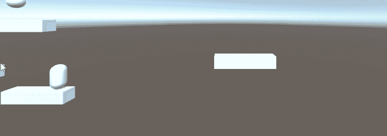

# 在 Unity 中移动平台

> 原文：<https://medium.com/nerd-for-tech/moving-platforms-in-unity-86d0c6f05d85?source=collection_archive---------4----------------------->

这怎么会这么难？对失败的回顾，直到你成功了。

仍然不完美，但这比你想象的要麻烦得多。

我从来不认为移动平台有那么特别。直到我试图编写一个程序，并发现所有这些方法都是一种痛苦。上面的图片是两天反复试验的产物，大量的咖啡因，一点点的诅咒，乞求，甚至一点点的祈祷。幸运的是，就在我进入动物献祭阶段之前…