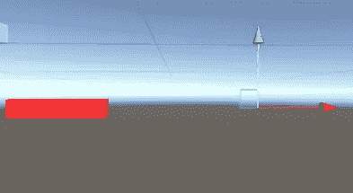
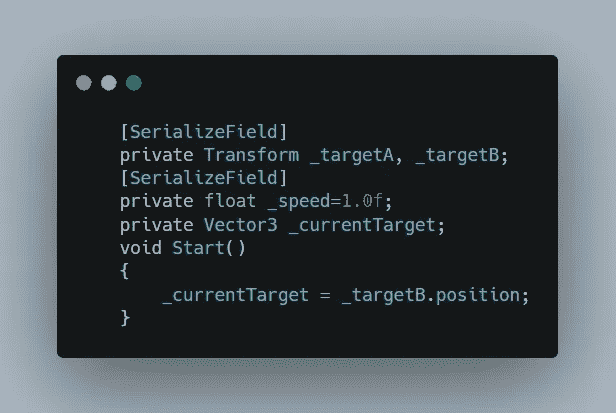
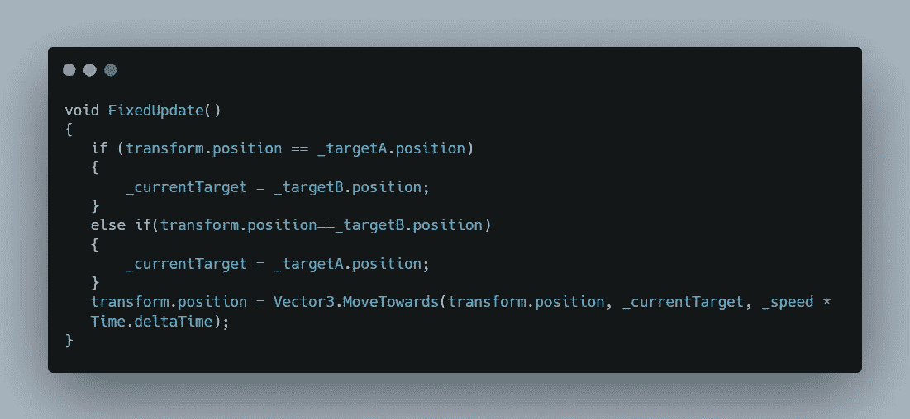
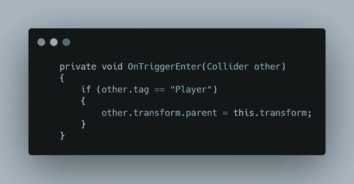
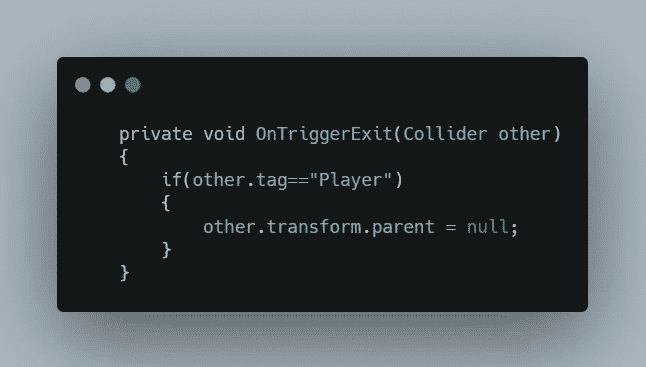
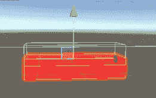

# 在 Unity 中移动平台

> 原文：<https://medium.com/nerd-for-tech/moving-platforms-in-unity-d0908ddf4b75?source=collection_archive---------18----------------------->

2.5D 游戏开发

**目标:**创造一个移动的平台

首先，让我们创建一个可以移动的平台。创建一个矩形立方体，并制作两个副本。将第一个副本重命名为 point_A，将第二个重命名为 point_B。现在将 point_B 移动到另一个位置。通过改变 x 轴的值，我把我的放在左边。

完成后，创建一个移动平台脚本，并将其拖到原来的多维数据集中(将其重命名为移动平台)。

在移动脚本中，创建两个变换变量来保存两个创建点(point_A 和 point_B)的变换值。然后定义速度，最后创建一个 vector3 变量来保存变换位置。

然后默认设置目标为 point_B。

现在创建一个 FixedUpdate 方法，这样玩家以后就可以随平台移动了。它在 Update()中不起作用，因为它与 FixedUpdate()一起“过时”，当玩家在平台顶部时，fixed Update()会覆盖玩家的移动。

现在，创建一个条件，当变换的当前位置到达 point_A 时，它将当前目标设置为 point_B，当到达 point_B 时，它再次将其设置为 point_A，从而创建一个循环，其中平台从 point_A 移动到点 _B，反之亦然。

最后使用 move against 方法改变平台的变换位置，以每秒钟的速度将游戏对象从当前位置移动到目标位置。

当平台在上面时，要移动玩家，你需要设置触发器，当玩家进入触发器时，触发器检测玩家，并设置玩家的父级，这样玩家就可以跟着移动。

我们让玩家随着平台移动，但是如果你让它保持原样，那么即使玩家离开平台，玩家也会随着平台移动，因此为了避免这种情况发生，我们创建了另一个触发器来检测玩家的退出，并将玩家的父代设置为空。

最后，添加另一个盒子碰撞器到移动平台，并在 y 轴上移动它的中心，这样它可以在玩家进入平台时检测到玩家。

这就是结果。