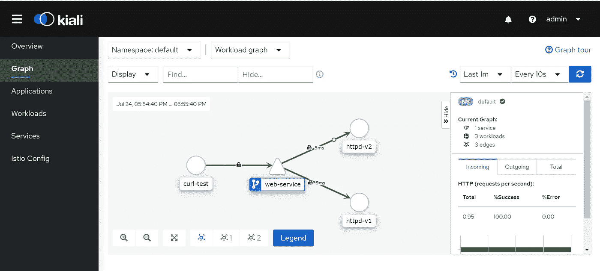

# 伊斯蒂奥的 MTLS

> 原文：<https://medium.com/nerd-for-tech/mtls-in-istio-970f0666b867?source=collection_archive---------0----------------------->

## 通过插入现有 CA 证书在 Istio 服务网格中设置相互 TLS

相互 TLS 认证是指双方同时对彼此进行认证。这意味着 mtls 确保客户端和服务器之间的双向流量是安全的。在这种情况下，服务器只接受向服务器证书颁发机构注册的客户端的连接。这是 mtls 中经常发生的情况，在 mtls 中，两端的连接都要验证证书。


**如何在 Istio 中配置 MTLS？**

在 istio 中，当 Istio 安装在您的 Kubernetes 集群中时，默认情况下启用 MTLS。MTLS 模式在 Istio 中有两种类型。

1.  **许可**:默认情况下，Istio 中的 MTLS 模式是许可的。许可模式可以接受纯文本和双向 TLS 流量。
2.  **严格**:该模式确保在工作负载之间启用 mtls 流量。当启用严格模式时，所有普通流量都将被丢弃。

在 Istio 中插入我们自己的 CA 证书。

默认情况下，Istio 会生成一个自签名的根证书和密钥，并使用它们来签署所有其他工作负载的证书。但是在一个组织中，你不会想使用它们，你会有你自己的 CA，你会想让它被你自己的 CA 签名。您可能希望使用自己的证书，而不是第三方证书。感谢 Istio 为我们提供了一个插件现有 CA 证书来签署工作负载的选项。

对于这个演示，让我们看看如何生成我们自己的 CA 并将它们插入到 Istio 中。

因此，让我们创建一个用于签署其他工作负载证书的 CA 证书。

我已经使用这些命令生成了一个示例 CA 证书。但是，这不适用于生产环境，因为我们不会在生产环境中使用自签名证书。

```
CONFIG="
  [req]
  distinguished_name=dn
  [ dn ]
  [ ext ]
  basicConstraints=CA:TRUE,pathlen:0
  "openssl req -config <(echo "$CONFIG") -new -newkey rsa:2048 -nodes \
  -subj "/C=IN/O=Pavan-Solutions/OU=Cloud-DevOps/ST=AP/CN=cluster.local/emailAddress=pavan@istio-medium.com" -x509 -extensions ext -keyout root-key.pem -out root-cert.pemcp root-cert.pem ca-cert.pem
cp root-key.pem ca-key.pem
cp ca-cert.pem cert-chain.pem
```

现在让我们创建一个秘密，istiod 将使用它来签署工作负载。这假设群集中没有安装 istio。

```
**kubectl create ns istio-system** **kubectl create secret generic cacerts -n istio-system - from-file=ca-cert.pem - from-file=ca-key.pem - from-file=root-cert.pem 
- from-file=cert-chain.pem**
```

创建完密码后，让我们在集群中安装 istio。您可以按照本指南在集群中安装 istio。

[](/@pavan1999.kumar/how-to-install-istio-using-istioctl-1557db1cd62d) [## 如何使用 istioctl 安装 Istio

### 正如我在之前的文章中所讨论的，我们将致力于一些实时场景，在这些场景中，我们将能够…

medium.com](/@pavan1999.kumar/how-to-install-istio-using-istioctl-1557db1cd62d) 

在你真正测试 mtls 之前。让我们部署一个策略，强制工作负载之间的所有流量都应该是 mtls。让我们现在部署策略。

确保在所有工作负载之间启用 mtls 的策略

让我们部署一个示例应用程序并验证证书。

让我们为这个 pod 部署一个服务。

pod 启动并运行后，让我们通过执行 httpd-v1 pod 的 envoy 容器中的命令来验证证书

> **ku bectl exec httpd-v1-c istio-proxy-n default—OpenSSL s _ client-show certs-connect web-service:80**

如果你仔细检查这些证书，你会发现这些证书实际上是被你塞住的。您也可以使用本页中指定的方法来验证您的证书。

 [## 插入现有的 CA 证书

### 此任务说明管理员如何使用现有根证书配置 Istio 证书颁发机构…

istio.io](https://istio.io/latest/docs/tasks/security/cert-management/plugin-ca-cert/) 

如果您已经安装并运行了 istio，并且想要更改证书，该怎么办？您的部署将如何获取新证书？在这种情况下，为了避免 pod/应用程序停机，您可以对部署执行滚动重启，以便 pod 获得新证书。

> **kubectl rollout 重启部署<deployment _ name>**

现在让我们用 kiali 来想象同样的情况

> **istioctl 仪表盘 kiali**



显示流量之间的 mtls 加密的图片

现在，如果您清楚地看到快照，您可以看到工作负载之间的挂锁符号，这表示工作负载之间流动的所有流量都已加密。

# 先决条件

[](/@pavan1999.kumar/introduction-to-istio-service-mesh-2bc68d2ffdac) [## Istio 服务网格简介

### 什么是 Istio 服务网格？

medium.com](/@pavan1999.kumar/introduction-to-istio-service-mesh-2bc68d2ffdac) [](/@pavan1999.kumar/how-to-install-istio-using-istioctl-1557db1cd62d) [## 如何使用 istioctl 安装 Istio

### 正如我在之前的文章中所讨论的，我们将致力于一些实时场景，在这些场景中，我们将能够…

medium.com](/@pavan1999.kumar/how-to-install-istio-using-istioctl-1557db1cd62d) 

# 被推荐的

[](/@pavan1999.kumar/weighted-routing-in-kubernetes-using-istio-5d9bdb495032) [## Kubernetes 中使用 Istio 的加权路由

### 让我们假设您的客户正在使用您的应用程序的版本:v1。应用程序的新版本:v2 是…

medium.com](/@pavan1999.kumar/weighted-routing-in-kubernetes-using-istio-5d9bdb495032) [](/@pavan1999.kumar/mirroring-of-live-traffic-in-kubernetes-using-istio-traffic-mirroring-36f8c4d32fe8) [## 使用 Istio 流量镜像对 Kubernetes 中的实时流量进行镜像

### 为什么需要流量镜像？

medium.com](/@pavan1999.kumar/mirroring-of-live-traffic-in-kubernetes-using-istio-traffic-mirroring-36f8c4d32fe8)