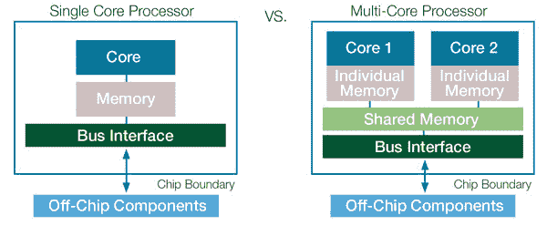

# 多核处理器

> 原文：<https://medium.com/nerd-for-tech/multi-core-processors-53ee2899f90f?source=collection_archive---------4----------------------->

## 侯赛因·莫蒂瓦拉、帕思·穆卡达姆、埃沙安·门卡尔、高拉夫·梅克和尼尔·马尔瓦卡尔

# **什么是处理器？**

处理器是一个集成的电子电路(一个小芯片),执行计算机运行的计算。处理器执行从操作系统(OS)传来的算术、逻辑、输入/输出(I/O)和其他基本指令。它们的目的是接收程序指令形式的输入，并执行万亿次计算，以提供用户将与之交互的输出。术语处理器、中央处理器(CPU)和微处理器通常作为同义词联系在一起。处理器出现在许多现代电子设备中，包括个人电脑、智能手机、平板电脑和其他手持电子设备。

*答:英特尔酷睿 i9 第九代处理器是一款 8 核处理器*

# **什么是多核处理器？**

多核处理器是一种在单个封装中的单个芯片上具有多个处理器的处理器芯片。处理器有时被称为“核心”，是执行指令或计算的电路。由于多核处理器拥有不止一个处理单元，因此它能够以比单处理器芯片更快的速度执行计算和运行程序。多核处理器在单个物理封装中实现了[多重处理](https://en.wikipedia.org/wiki/Multiprocessing)。多核处理器通常用于许多当前的计算机、智能手机和平板设备，使我们的设备比单核处理器芯片运行得更快。芯片上的更多处理器允许设备制造商将多核的更大计算能力放在单核处理器将占据的空间中，并提高电子设备的性能，无论是计算机、笔记本电脑、智能手机还是平板电脑。

*B .多核处理器*

# **简史**

当第一个基于芯片的处理器被制造出来时，制造这些芯片的公司只能在一个芯片上安装一个处理器。随着芯片制造技术的改进，芯片制造商可以制造更多电路的芯片，最终，制造技术达到了芯片制造商可以制造不止一个处理器的芯片并创造出多核芯片的地步。

[Kunle Olukotun](https://en.wikipedia.org/wiki/Kunle_Olukotun) 斯坦福[电气工程教授和他的学生在 1998 年设计了第一个多核芯片。2001 年，IBM 推出了世界上第一个多核处理器，这是一个 VLSI(超大规模集成电路)芯片，带有两个 64 位微处理器，包含超过 1.7 亿个晶体管。](http://www.standford.edu/)

这种在架构和半导体工程方面的突破性设计使这两种处理器能够以非常高的带宽与大型片内存储器、高速总线和输入/输出通道协同工作。

四个新的微处理器作为一个强大的 8 路模块一起工作，建立了一个新的行业标准，并产生了当时创纪录的 1.3 千兆赫的时钟速度。

> “IBM 的 Power4 处理器的一切都令人惊叹。惊人的技术、惊人的尺寸(6.8 亿个晶体管)、惊人的功耗要求、惊人的性能。令人惊讶的是，如此复杂的东西居然能工作。这个怪兽在封装上有 5200 个引脚，消耗 500 瓦(没错，半千瓦)的功率。”
> -Jim Turley
> “64 位 CPU:阿尔法、SPARC、MIPS 和功率”，
> PC 杂志，2002 年 2 月 21 日

# **为什么“更多”内核&这意味着什么？**

处理器内核是任何计算机 CPU 的一部分。它们的功能是接收指令和执行计算操作，其中信息被处理并暂时存储在 RAM 中。

在 20 世纪 90 年代，微处理器的性能与微处理器的频率齐头并进，但是随着芯片架构的快速发展，随着频率的增加而带来的性能提升随着时间的推移而变得平坦，当它进入单核处理器时，性能提升开始变得过时。芯片的物理尺寸减小，而每个芯片的晶体管数量增加；时钟速度的提高使得芯片的散热达到了危险的程度

*C .单核&多核处理器之间的比较*

多核处理器的引入是为了解决单核系统中普遍存在的问题，如功耗、温度耗散、频率等。多核处理器的运行频率较低，但与单核处理器相比，多核处理器被证明是更好的选择，原因很简单:“两个脑袋比一个好”

简而言之，计算机运行程序的速度可以说与存在的内核数量成正比。双核处理器称为双核，四核处理器称为四核，依此类推。但事情并非如此简单，不可避免地会有某些因素影响多核处理器加速进程的能力，例如其固有的时钟速度以及程序利用多核处理器能力的能力。如果我们看一看处理器的速度，我们就会明白，处理器是一种电子电路，可以在几分之一秒内完成数学计算。处理器完成一次计算的时间是一个周期。每秒的周期越多，处理器的计算速度就越快。如今，大多数处理器都是以千兆赫兹或每秒十亿个周期来衡量的。一个 2 千兆赫的处理器每秒运行 20 亿个周期，类似地，一个 2.3 千兆赫的处理器每秒运行 10 亿个周期。运行频率为 2 千兆赫的双核处理器总共可以运行 40 亿个周期，即每个处理器 20 亿个周期。

# **多核基础知识、实施和挑战:**

当我们并排设置多个内核时，在内核和主存储器之间存在一种通信方式是至关重要的，通常使用单条通信总线，另一种替代方案是互连网络。通常，总线方法与共享内存模型结合在一起(通信总线的可扩展性有限)，而互连网络则与分布式内存模型结合在一起。

来自不同制造商的技术在一定程度上存在差异并不罕见，多核架构也是如此，除了通信和内存配置的差异之外，另一个差异是微处理器有多少个内核。并且在一些多核架构中，不同的核具有不同的功能。这让我们想到了多核系统的另一个方面，即同构架构，其中所有内核都是同一类型，并且通常运行在单个多核操作系统上。另一方面，异构架构由运行在不同操作系统上的核心类型混合组成，通常包括 GPU。

显而易见，多核系统无疑更胜一筹，但多核处理器也有自己的挑战，功耗和温度管理是随着芯片上内核数量的增加而呈指数增长的因素。内存一致性是另一个需要关注的问题，最后需要编写能够真正利用多核系统的程序，如果不这样做，在很多情况下甚至会导致性能下降。

# **应用**

多核处理器(MCP)的巨大潜力源于其并行执行多项任务的能力。这包括整体任务，例如同时通过管道传输大量数据以实现高系统吞吐量，或者实现更复杂的控制算法。任何可以分成并行块的应用都适合多核处理器。

多核处理器广泛应用于许多应用领域，包括通用、嵌入式、网络、数字信号处理(DSP)和图形(GPU)。核心数量甚至会增加到几十个，专用芯片超过 10，000 个，而在超级计算机(即芯片集群)中，数量可能会超过 1000 万个。

一些例子包括高图形游戏，如 COD、Overwatch 和其他类似的 3D 游戏，计算机辅助设计(CAD)和 SolidWorks，多媒体应用程序，视频编辑软件，如 Adobe Photoshop、Adobe Premiere 和 iMovie，科学工具，如 MATLAB，嵌入式系统，如工业机器人，计算机实用程序，如 Excel，数据库服务器和高网络流量。

此外，嵌入式软件通常是为特定的硬件版本开发的，这使得[软件可移植性](https://en.wikipedia.org/wiki/Software_portability)、遗留代码或支持独立开发人员的问题不像 PC 或企业计算那样重要。因此，开发人员可以更轻松地采用新技术，多核处理架构和供应商也因此变得更加多样化。

*D .异构多核处理器*

# **需求和当前情景**

曾经有一场英特尔和 AMD 之间的比赛，看哪家公司能够制造出第一个 1 GHz 处理器。早在 2000 年，两家公司都拼命想超过对方。竞争如此激烈，两家公司都声称取得了胜利:AMD 凭借其 Athlon CPU 和英特尔凭借其 Pentium III 芯片。

竞争并没有止步于 1 GHz，两家公司都争先恐后地达到 2 GHz 和 3 GHz。大约在 2004 年，奇怪的事情发生了:当 CPU 上的晶体管数量继续增加时，处理器时钟速度开始变平。性能持续提高，但是是什么推动了对内核而不是时钟速度的兴趣呢？

## **多核 CPU 问世:**

英特尔和 AMD 之间的竞赛仍在继续，但游戏已经从时钟速度变成了多核芯片。在此期间，每个人都将单核英特尔奔腾 III 换成了运行速度较慢的双核 AMD 芯片。系统的整体稳定性随着性能的提高而提高，但只有少数程序能够利用多个单核。

即使在今天，在消费者层面，只有少数游戏和 Adobe Premiere 等后期制作工具能够利用当今最新的消费级四核和六核 CPU。其他人只是提取更快的速度，而没有充分发挥多核处理器的潜力。

## **B】虚拟化**

虚拟化是另一种有助于实现 MCP 承诺的技术。这种方法允许在同一硬件设备上运行多种操作环境，包括实时和通用操作系统。虚拟化通过相关处理核心、内存和支持设备的抽象来工作。自动化系统开发人员越来越多地在其基于 MCP 的控制器中使用这种额外的软件。

管理虚拟机时，内存管理至关重要，通常是第一个受到限制的资源。使用多核 CPU 增加了内存通道，允许处理和分析大量数据。允许处理器从内存而不是硬盘中访问这些数据会带来更好的性能。

## **C】高性能计算**

高性能计算(HPC)是指高速处理数据和执行复杂计算的能力。客观地说，配备 3 GHz 处理器的笔记本电脑或台式机每秒可以执行大约 30 亿次计算。虽然这比任何人都快得多，但与每秒可执行千万亿次计算的 HPC 解决方案相比，这就相形见绌了。

超级计算机是最著名的 HPC 解决方案之一。一台超级计算机包含成千上万个计算节点，它们一起工作来完成一项或多项任务。这被称为并行处理。这类似于将数千台电脑联网在一起，结合计算能力以更快地完成任务。

HPC 也可能是计算和内存密集型的。Puget Systems 制造的一些最复杂、最昂贵的服务器用于 HPC，运行 AMD 四核 Opteron 或英特尔四核 Xeon 处理器的服务器在单台服务器上支持多达 64 个 CPU 内核的情况并不少见。从生物研究到娱乐业，HPC 几乎应用于每个领域。

## **D】数据库和云**

数据库的任务是同时运行许多任务。处理器内核越多，运行的任务就越多。多核处理器还允许将多个数据库整合到一台服务器上。同样，增加的内存带宽是这种可能性的主要原因。

大多数数据库管理员会说没有太多的内存，AMD 和 Intel 的最新处理器允许单个工作站级主板上最多 1 TB 的内存。

云环境也是事务繁重的环境，多核处理器允许公司在高峰计算时间快速增加内核数量。能效对于云环境也很重要。可以根据需要关闭或打开内核，以优化工作负载和降低能耗。

总的来说，这篇博客详细阐述了人们可能需要的关于多核处理器的相关知识和理解。我们研究了在 MCP 上投入时间的必要性以及它在不同行业中的广泛应用。我们已经解释了这些年来处理器在技术方面如何发展，以创造更好的设计和应用。

CPU 性能日益快速提升。每发布一款新一代 CPU，芯片上的内核数量都会增加。现代电子技术变得越来越强大，加速了范式转换，共同创造了一个新世界。作为消费者和人类，最大限度地利用这一不断改进的技术，并正确使用它是我们的责任。