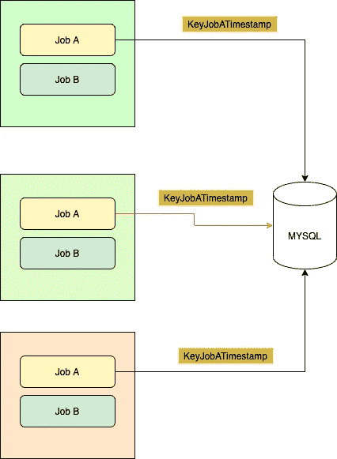

# 使用 MYSQL 的带“分布式锁”的多 Cron 作业

> 原文：<https://medium.com/nerd-for-tech/multi-cron-job-with-distributed-lock-using-mysql-9e89de4aa1b9?source=collection_archive---------5----------------------->

归功于亚历山大·埃伦霍弗([https://unsplash.com/photos/yI4pFmN9ges](https://unsplash.com/photos/yI4pFmN9ges))

几分钟前，我想知道我们是否有运行相同二进制文件的多个 cron 作业，但我们需要确保每个作业/任务进程只由一个实例运行，有没有办法实现这一点。我知道这很奇怪，为什么我们要有多个二进制文件呢？只需为 cron 作业创建一个即可！虽然这是对的，但我想知道这个问题，如果我们可以用 MYSQL 做到这一点，我会被触发，而**可以**。

# 给出问题陈述和解决方案

总而言之，挑战在这里

1.  您有多个运行 cron 的二进制文件，它可以在您指定的时间运行多个作业(每 5 点钟、每两分钟、每一小时等等)
2.  你需要确定**每个工作/任务**是否“在同一时间”只能被**一个二进制/进程**处理
3.  利用 Mysql 实现类似“分布式锁”的机制

想到的解决方案

1.  每一对作业及其运行时间都应该用一个**唯一键**标记/标注
2.  通过利用 Mysql 中**唯一键约束**来使用这些键
3.  任何由另一个具有**相同键的 cron 触发的作业/任务将被拒绝**(不处理)，只有第一个被触发的作业/任务将被处理。

**免责声明首先**，说明这并不完全是一种分布式锁机制，重点是同一时间只有一个东西可以运行同一任务。因此，只有一个人可以获得“锁”，但不需要“释放锁”。所以我们把“获取锁”的调用改为“**获取权限**”。“获得许可”的人可以运行该流程，否则不能。

# 克朗

尹英松([https://unsplash.com/photos/w2JtIQQXoRU](https://unsplash.com/photos/w2JtIQQXoRU))的功劳

例如，假设我们有一个 cron 运行这些:

1.  RemoveExpiredUserCart(每天凌晨 01:00 运行)
2.  提醒用户购买通知(每 1 小时运行一次)

出于某种原因，你可能会在多个 pod 或多个 VM 实例中运行由这些 cron 组成的二进制文件。

# 获取许可流程

那么我们要怎么做呢？该过程包含以下步骤

1.  创建一个只包含一列的表(即" **job_list** ")。以类型为 **VARCHAR (100)** 的列 **job_key** 为例。将此键设置为唯一的(为列添加约束)
2.  对于每个与其运行时间配对的任务/作业，以字符串形式创建一个唯一的组合键
3.  将这个键插入到我们的“jobs_list”表中，如果检测到它是重复的，就什么也不做

通过这两个步骤，我们确保**只有一个键被插入**，因此**只有一个逻辑/二进制将运行任务**。

例如，以下是可能适合作为唯一标识符的键(唯一键):

1.  RemoveExpiredUserCart process | key(string)= " exp _ usr _ cart:<date_pattern>" | example:"**exp _ usr _ cart:15–01–2021**</date_pattern>
2.  reminderuserbuynnotification process | key(string)= " rmnd _ usr _ buy _ notif:<timestamp_until_hour>" | example:"**rmn _ usr _ buy _ notif:15–01–2021:15**"(如果在 15.00，或者 15.20 或者 15.13，基本上所有的 3PM 都转换成 15)或者"**rmn _ usr _ buy _ notif:15–01–2021:23【T11**</timestamp_until_hour>

选择用户购物车唯一键是因为它每天运行一次，所以日期(年-月-日)应该足以确定它的唯一性(例如，如果我们有 3 个 crons，当在同一天运行时，所有的都将使用相同的日期)。

对于用户提醒通知，由于它是每小时一次，我们需要将唯一性细化到小时细节(15 →下午 3 点，或 23 →晚上 11 点)左右。由于假定 Cron A 在 15.01 运行，Cron B 在 15.02 运行→ *,这两个分钟将被视为一个在下午 3 点运行的进程==* cron，因此使用相同的关键字 exp _ usr _ cart:15–01–2021:15**。**

在获得惟一键之后，我们将使用这个查询在表(" **job_list** ")上执行插入操作。

> **在重复键上插入 job_list (job_key)值(<your _ cron _ task _ KEY>’)更新 job_key = job_key**

流程详情:

1.  我们将把密钥插入表中，以“标记”该进程正在请求运行许可，并将其记录到表中
2.  如果键是重复的(相同的作业键已经被另一个进程首先插入)，将 job_key 更新为它自己的值(在 MYSQL 中也称为不更新它的值)
3.  Mysql 将返回更新/受影响/插入的行数，如果大于零，则意味着我们是第一个成功获得权限然后运行流程的作业，否则(零行受影响)意味着我们未能获得权限，因此只返回或不运行下一个流程。

简化的流程可以画成这样:

3 Cron，每个都有两个作业(A 和 B)，使用 KeyJobATimestamp 的查询更新，只有一个得到了更新的行(受影响)> 0，这是红色的一个

只有一个作业 A 将与另一个作业 A 一起运行(cron 1 和 2)未能获得权限。它之所以有效，是因为 MYSQL 防止了键插入和更新的重复，即使有这么多实例/ pods 运行相同的二进制文件，它也是安全的(注意，选择正确的唯一键对于防止多台机器在相同的“时间范围”运行相同的作业非常重要)。还要记住，对于任何未使用的旧键，我们需要删除表中的旧键。

**希望对你有用，感谢阅读，祝你愉快:)**