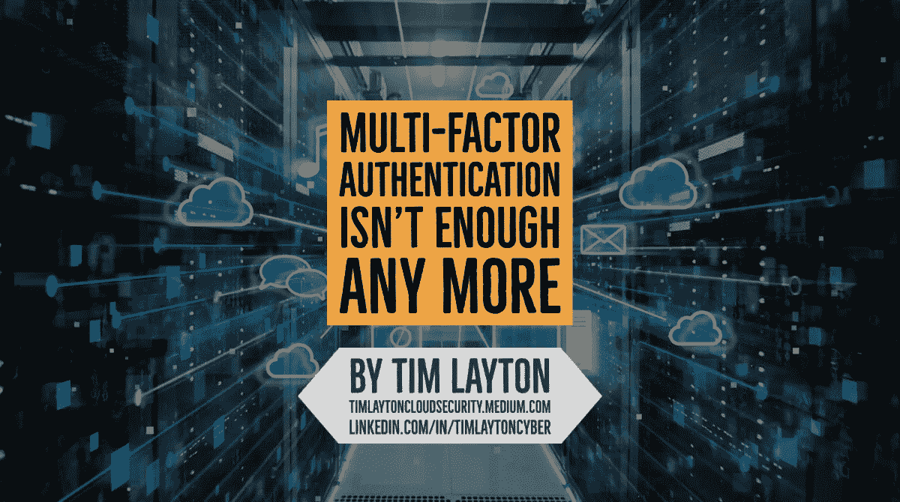

# 在云环境中，多因素身份认证(MFA)已经不够了

> 原文：<https://medium.com/nerd-for-tech/multi-factor-authentication-mfa-isnt-enough-any-more-in-cloud-environments-9fe2bd292ae2?source=collection_archive---------8----------------------->

对于像开发者和云管理员这样的高风险账户，MFA 已经不够好了。

在所有主要的公共云提供商(Azure、AWS、Google)中，采取额外的步骤向这些帐户添加有条件的策略是容易和不费力的。

在这篇文章中，我将描述微软 Azure 的条件策略。

# **多因素认证**

多因素身份认证通过**要求两个或更多元素进行完全身份认证**，为您的身份提供额外的安全性。这些元素分为三类:

*   **你知道的东西:**密码或安全问题的答案。
*   **你有的东西:**接收通知的移动应用或者令牌生成设备。
*   **你是什么:**许多移动设备上使用的某种生物特征，如指纹或面部扫描。

对于云中任何类型的特权帐户，要求多因素身份认证应该是标准操作程序(策略)，因为 MFA 通过限制凭据暴露的影响来提高这些特殊身份的安全性。攻击者还拥有具有第二因素令牌的特权用户的电话的可能性要小得多。

Azure AD 具有内置的多因素身份验证功能，并将与其他多因素身份验证提供商集成。

# **条件接收政策**

除了多因素身份认证，**确保在授权访问前满足附加要求增加了另一层非常重要的保护**。

例如，阻止来自可疑 IP 地址的登录，或者拒绝来自没有恶意软件保护的设备的访问，可以限制来自危险登录的访问。

**Azure Active Directory 提供基于组、位置或设备状态的条件访问策略。**位置功能允许您的组织区分不属于网络的 IP 地址，并且它满足要求来自所有此类位置的多因素身份验证的安全策略。

您可以创建一个条件访问策略，要求从公司网络外部的 IP 地址访问应用或云管理平台的用户接受多因素身份认证质询。

> 在所有主要的公共云提供商平台上添加条件访问策略都很简单，应该成为所有云环境的标准安全实施的一部分。

蒂姆·雷顿

Tim Layton 专门为整个企业的业务利益相关者解释与云计算安全和风险管理相关的复杂性和技术术语。Tim 是云安全领域的思想领袖，他定义了可操作和可防御的战略，以帮助企业利益相关方做出基于风险的决策，并对新数字前沿的投资进行优先排序。

> *中等:*[https://timlaytoncloudsecurity.medium.com](https://timlaytoncloudsecurity.medium.com/)
> 
> *领英:*[*https://LinkedIn.com/In/TimLaytonCyber*](https://linkedin.com/In/TimLaytonCyber)

# 常见风险术语和定义

**威胁:**任何可能通过信息系统对组织运营(包括使命、职能、形象或声誉)、组织资产、个人、其他组织或国家产生不利影响的情况或事件，包括未经授权的访问、破坏、披露或修改信息，和/或拒绝服务。(NIST 800–30)

**威胁:**意外事件的潜在原因，可能对系统或组织造成损害。(ISO 27001)

**漏洞:**信息系统、系统安全程序、内部控制或实施中可能被威胁源利用的弱点。(NIST 800–30)

**漏洞:**可被一个或多个威胁利用的资产或控制的弱点。(ISO 27001)

**可能性:**基于给定威胁能够利用给定漏洞或一组漏洞的概率的主观分析的加权因子。(NIST 800–30)

可能性:某事发生的可能性。(ISO 27001)

**风险:**对实体受到潜在情况或事件威胁程度的度量，通常是以下因素的函数:( I)如果情况或事件发生，将会产生的不利影响；和(ii)发生的可能性。(NIST 800–30)

**风险:**不确定性对目标的影响。(ISO 27001)

**安全控制:**为保护信息系统及其信息的机密性、完整性和可用性而对信息系统规定的管理、操作和技术控制(即安全措施或对策)。(NIST 800–30)

**补偿安全控制:**组织采用的一种管理、操作和/或技术控制措施(即安全措施或对策)，在低、中或高基线中替代推荐的安全控制措施，为信息系统提供同等或可比的保护。(NIST 800–30)

**影响等级:**未授权的信息披露、未授权的信息修改、未授权的信息销毁、信息丢失或信息系统可用性丧失的后果可能导致的危害程度。(NIST 800–30)

**剩余风险:**应用安全措施后剩余的风险部分。(NIST 800–30)

**安全态势:**基于信息保障资源(例如，人员、硬件、软件、策略)和能力的企业网络、信息和系统的安全状态，以管理企业的防御并对情况变化做出反应。(NIST 800–30)