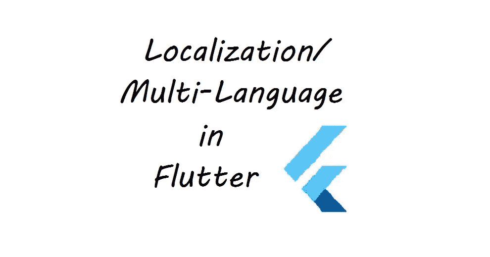

# 在不使用任何第三方库的情况下，在 Flutter 中支持多语言。

> 原文：<https://medium.com/nerd-for-tech/multi-language-support-in-flutter-without-using-any-third-party-library-bf2098df353f?source=collection_archive---------1----------------------->

在本文中，我们将学习如何以一种简单的方式制作一个支持多语言(本地化)的应用程序，而无需使用任何第三方库。

因此，我们将看到一个基本的应用程序使用三种不同语言的本地化英语(en)，印地语(hi)，法语(fr)。每种语言都有一个按钮来转换给定的文本…