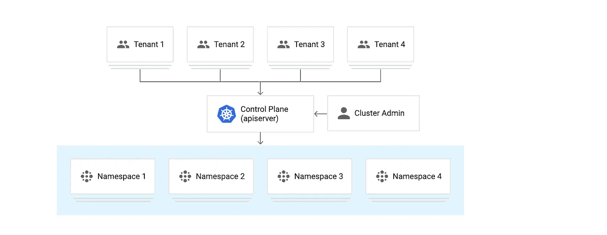
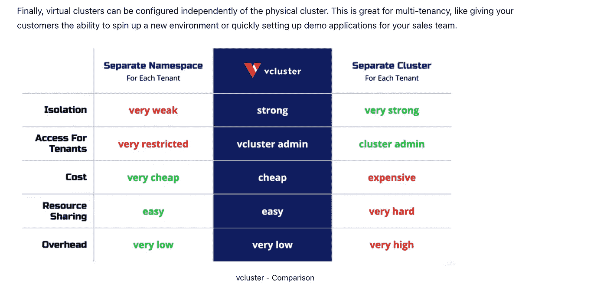
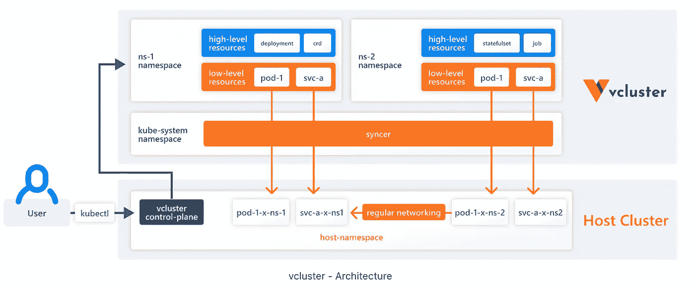
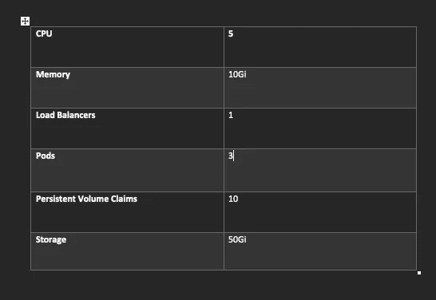
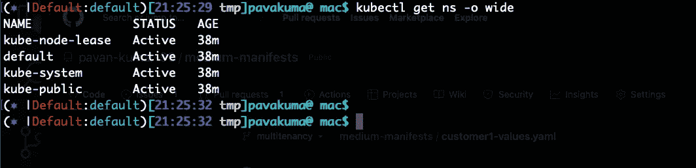
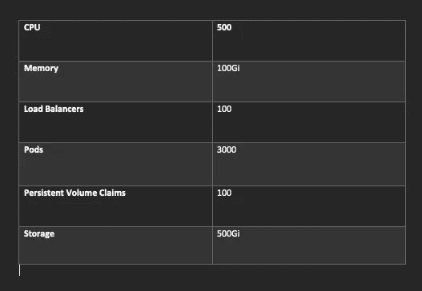
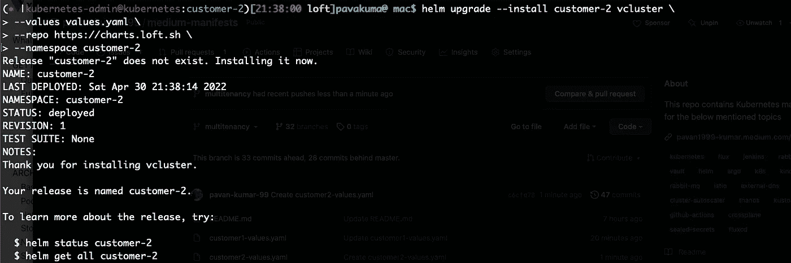
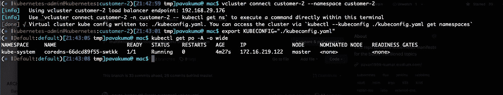

# 使用 Loft 的 Vcluster 在 Kubernetes 中实现多租户

> 原文：<https://medium.com/nerd-for-tech/multi-tenancy-in-kubernetes-using-lofts-vcluster-dee6513a7206?source=collection_archive---------0----------------------->

Kubernetes 中使用 Loft Vcluster 的多租户

Kubernetes 几乎无处不在。如果您想部署一个 web 应用程序，您需要 Kubernetes。你需要训练一个 ML 算法(Kubeflow)你需要 Kubernetes。运行数据分析你需要 Kubernetes。因此，理想情况下，Kubernetes 正以各种可能的方式得到利用。但是你用对方法了吗？你在节约成本吗？您是否利用了全部计算资源？你也用正确的方式分享了吗？啊，这才是文章的重点，多租户。多租户是指一个或多个应用程序的多个独立实例在共享环境中运行的软件操作模式。实例(租户)在逻辑上是隔离的，但在物理上是集成的。“租户”是一组用户或软件应用程序的术语，他们通过底层软件共享对硬件的访问。一台服务器上的多个租户共享内存，内存是根据需要动态分配和清理的。它们还共享对系统资源的访问，例如网络控制器。



图片来源:谷歌

# 整个故事是关于什么的？(TLDR)

1.  Kubernetes 的多租户。
2.  使用 loft.sh 的 Vcluster 解决方案。
3.  使用 loft.sh vcluster 探索多租户的各种场景。



Loft Vcluster 比较

# 先决条件

1.  一个 Kubernetes 集群(EKS、AKS、Kind 等)。
2.  helm，loft.sh 的 vcluster 二进制。

# 故事资源

1.  GitHub 链接:[https://github.com/pavan-kumar-99/medium-manifests](https://github.com/pavan-kumar-99/medium-manifests)
2.  GitHub 分支:[多租户](https://github.com/pavan-kumar-99/medium-manifests/tree/multitenancy)

## 多租户场景(问题陈述)

前面我已经解释了多租户的定义以及用于实现这一点的工具。但是首先，让我们理解这个用例的问题陈述。假设您是一家向客户提供 Kubernetes 集群来部署其工作负载的公司。让我们假设你有 100 个顾客。为每个客户配置一个群集是一场噩梦。管理这些集群并不是一件容易的事情，随着客户数量的增长，集群的数量也会增加。拥有这种架构的缺点？

1.  总成本增加。
2.  要安装的组件的冗余(例如，要安装在所有集群上的 istio、vault、consul 等引导组件)。
3.  集群的管理将是一场噩梦。
4.  许多重复的工作要做。
5.  成本大幅增加(您最终要为控制平面和工作节点付费)。
6.  没有孤立。
7.  每个客户最终会使用比分配的资源多得多的资源。我们无法控制客户可以使用的资源数量。

如果呢？如果有解决方法呢？如果您可以在 Kubernetes 集群中创建一个 Kubernetes 集群，您会作何反应？


惊讶的

是的，你没看错。现在， [loft.sh 的 vcluster](https://www.vcluster.com/docs/what-are-virtual-clusters) (虚拟集群)出现了。虚拟集群是完全工作的 Kubernetes 集群，运行在其他 Kubernetes 集群之上。与完全独立的“真实”集群相比，虚拟集群没有自己的节点池。相反，他们在底层集群中调度工作负载，同时拥有自己独立的控制平面。虚拟集群本身只由核心的 Kubernetes 组件组成:API 服务器、控制器管理器、存储后端(如 etcd、SQLite、MySQL 等。).



vcluster 架构

使用 loft.sh vcluster 的优势

1.  每个租户的细粒度隔离。
2.  总体成本的降低。
3.  组件没有冗余。
4.  轻松管理租户/集群。
5.  可以轻松控制每个租户的资源分配。

我希望您现在已经对多租户和虚拟集群有了清晰的了解。现在让我们开始演示。:)

## 使用 helm 安装 Vcluster

确保您已经安装了 [vcluster](https://www.vcluster.com/docs/getting-started/setup) 和 helm 二进制文件

我已经建立并运行了一个 Kubernetes 集群。对于这个演示，您可以使用任何 Kubernetes 发行版。现在让我们在物理集群中创建两个名称空间。这些名称空间只不过是我们的客户。让我们将客户命名为

1.  客户 1(试用客户)
2.  客户 2(付费客户)

```
$ git clone [https://github.com/pavan-kumar-99/medium-manifests.git](https://github.com/pavan-kumar-99/medium-manifests.git) \
-b multitenancy$ cd medium-manifests
```

T里亚尔客户

好了，我们现在已经为两个新客户创建了两个名称空间。因此，让我们假设 customer-1 是一个免费试用客户，应该只给他很少的计算资源。例如，CPU:5 个内核，内存:10Gi，Pods 3 等。



自由层客户

现在，让我们为自由层客户设计一个虚拟集群(Vcluster)。

```
$ kubectl create ns customer-1$ kubectl config set-context --current --namespace=customer-1$ helm upgrade --install customer-1 vcluster \--values [customer1-values.yaml](https://github.com/pavan-kumar-99/medium-manifests/blob/multitenancy/customer1-values.yaml) \--repo https://charts.loft.sh \--namespace customer-1
```

现在应该已经创建了 vcluster。您可以检查 customer-1 名称空间中的 pod。事情现在变得有趣了。打开另一个终端选项卡，并执行以下命令来连接到您的虚拟集群。

```
$ vcluster connect customer-1 --namespace customer-1$ export KUBECONFIG="./kubeconfig.yaml"
```



已连接到 Vcluster:)

让我在虚拟集群中创建一个命名空间。

```
$ kubectl create ns test
```

命名空间现在应该在 vcluster 中可见，但在实际的主机群集中不可见。现在让我们创建一个部署，并将副本扩展到 2 个(因为硬限制是 3 个，所以在虚拟集群上最多只能运行 2 个单元。系统组件已经有一个 pod)。Kubernetes 的其他组件也是如此。


啊，你看！！！！

P帮助客户

现在让我们切换到新客户(客户-2)。付费用户应该拥有大量的资源，包括 CPU、内存、服务等。



付费客户

```
$ kubectl create ns customer-2$ kubectl config set-context --current --namespace=customer-2$ helm upgrade --install customer-2 vcluster \--values [customer2-values.yaml](https://github.com/pavan-kumar-99/medium-manifests/blob/multitenancy/customer2-values.yaml) \--repo https://charts.loft.sh \--namespace customer-2
```



客户 2 虚拟集群

现在也为 customer-2 创建了一个虚拟集群。

打开一个新的终端标签。

```
$ vcluster connect customer-2 --namespace customer-2$ export KUBECONFIG="./kubeconfig.yaml"
```

您现在应该能够创建大量的计算资源，包括单元、卷等。



客户 2 的虚拟集群

这就是如何使用 loft.sh 的 Vcluster 来实现多租户。前面提到的例子是多租户的使用案例之一。在 Kubernetes 时代，可以应用多租户的场景更多。请随时分享您在 Kubernetes 中实施多租户的经验/想法/想法。此外，如果您对 Kubernetes [**有任何疑问/咨询，请点击**](https://linktr.ee/bettercallpavan) 联系我们。

**清理**

```
$ helm delete customer-1 -n customer-1$ helm delete customer-2 -n customer-2
```

以下是我的一些其他文章，你可能会感兴趣

直到下一次…..

# 被推荐的

[](/nerd-for-tech/pki-certs-injection-to-k8s-pods-with-vault-agent-injector-d97482b48f3d) [## 使用保险库代理注入器向 K8s Pods 注入 PKI 证书

### 使用保管库代理注入器将 PKI 证书动态注入到 Kubernetes Pods

medium.com](/nerd-for-tech/pki-certs-injection-to-k8s-pods-with-vault-agent-injector-d97482b48f3d) [](/nerd-for-tech/terraforming-the-gitops-way-9417cf4abf58) [## 地球化吉托普斯之路！！！

### 使用 Atlantis(拉式请求自动化)通过 GitOps 建立 Terraform。

medium.com](/nerd-for-tech/terraforming-the-gitops-way-9417cf4abf58) [](/nerd-for-tech/terraforming-the-cost-with-infracost-c28dc6c981c9) [## 用 Infracost 分析地形成本(GitOps 方法)

### 用基础成本分析土地改造成本

medium.com](/nerd-for-tech/terraforming-the-cost-with-infracost-c28dc6c981c9) [](/nerd-for-tech/using-hashicorp-vault-as-a-certificate-issuer-in-cert-manager-9e19d7239d3d) [## 在证书管理器中将 Hashicorp Vault 用作证书颁发者

### 在证书管理器中将 vault PKI 后端配置为证书提供商

medium.com](/nerd-for-tech/using-hashicorp-vault-as-a-certificate-issuer-in-cert-manager-9e19d7239d3d) 

## 更多参考

[](https://www.vcluster.com/docs/what-are-virtual-clusters) [## 什么是虚拟 Kubernetes 集群？| vcluster 文档 Kubernetes 的虚拟集群

### 虚拟集群是完全工作的 Kubernetes 集群，运行在其他 Kubernetes 集群之上。与完全相比…

www.vcluster.com](https://www.vcluster.com/docs/what-are-virtual-clusters) [](https://github.com/loft-sh/vcluster/tree/main/charts) [## v cluster/主放样中的图表-sh/vcluster

### vcluster—创建功能齐全的虚拟 Kubernetes 集群—每个 v cluster 都运行在一个命名空间内…

github.com](https://github.com/loft-sh/vcluster/tree/main/charts)