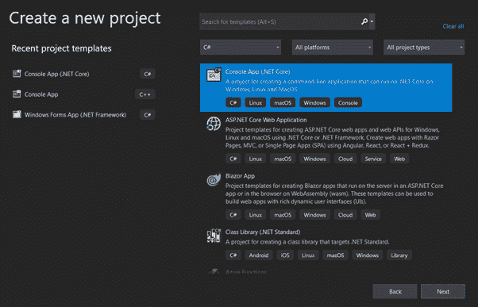
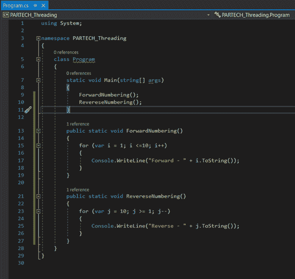
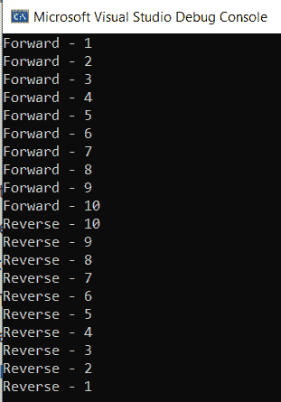
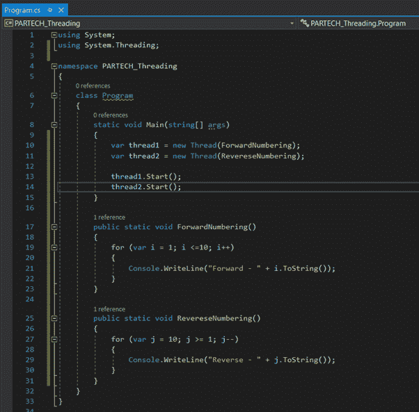
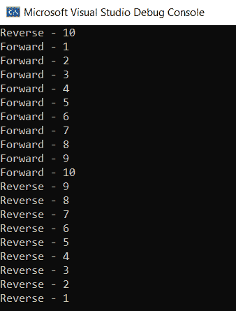
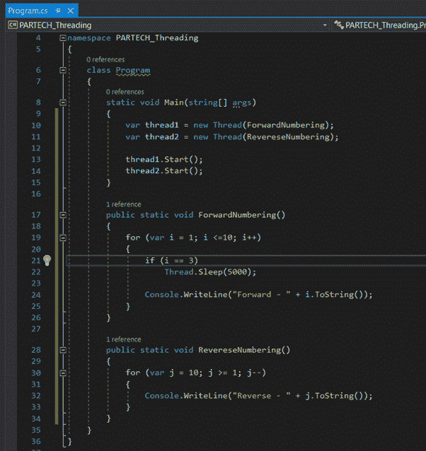
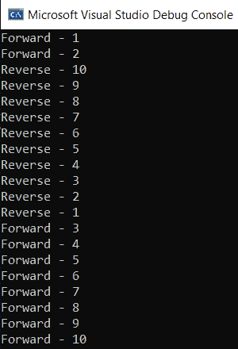

# C-Sharp 中的多线程

> 原文：<https://medium.com/nerd-for-tech/multi-threading-in-c-sharp-f7a32b1614cb?source=collection_archive---------3----------------------->

在当今世界，我们的大部分任务都是使用计算机来完成的。计算机在每个领域都有广泛的好处，无论是机械、电气、土木设计、负载测试、性能分析等等。他们通过 web 应用程序、桌面应用程序和基于云的应用程序来展示他们的效用。

众所周知，计算机对人类做出了巨大的贡献，它使一些任务比手工操作更简单、更容易。话虽如此，计算机最好的特性之一是它的多任务处理能力。我们大多数人在用 Microsoft Word 写文档的同时浏览网站。这是多重任务。

类似地，我们在 C#语言中有多线程，可以并行运行多个进程。在这篇文章中，我们将了解什么是 C#中的多线程，以及如何在一个示例项目的帮助下实现它。

**目录**

1.  什么是多线程？
2.  C#中的多线程
3.  线程的生命周期
4.  线程中经常访问的成员/属性
5.  多线程的实际应用
6.  结论

# 什么是多线程？

想想你的基于 Windows 的个人电脑。一旦你打开电脑，它就会启动并加载桌面。现在，您想将一些文件从一个文件夹复制到另一个文件夹。想象一下，当你复制文件时，你不能使用 Windows 上的任何其他应用程序。这对你有帮助吗？不，没错。听起来真的很繁琐。幸运的是，Windows 可以同时处理多个进程。这意味着用户可以同时运行多个应用程序。

类似地，使用 C#编程语言编写的应用程序(。Net)，也可以并行处理多个进程。当一个基于 C#的程序被执行时，它最初将是一个单线程。这意味着应用程序的所有代码都使用相同的线程以相同的顺序执行(就像代码是如何编写的一样)。

除此之外，C#还提供了一个选项来执行可以使用多线程概念并行运行的代码，其中进程/应用程序可以在其中调用多个线程。

# C#中的多线程

线程是轻量级的进程，它充当了一个进程执行的路径。默认情况下，每个进程/应用程序都使用单线程运行。应用程序的整个代码在一个线程中顺序执行。

多线程应用程序引入了在多个线程中同时处理独立代码的能力。多线程有助于减少执行时间，并以最佳水平利用 CPU 能力。

系统。线程命名空间包含在应用程序中启用多线程的类和接口。

# 线程的生命周期

这是一个线程的生命周期-

**未启动状态** —线程实例已创建但尚未开始运行的状态。换句话说，线程的 Start()方法没有被调用。

eg—var Thread = new Thread()；

**就绪状态** —准备运行的线程处于可运行/就绪状态。这意味着线程的一个实例被创建，并且它可以随时运行。

**运行状态** —顾名思义，正在运行的线程被称为处于运行状态。

**不可运行状态** —线程不可执行的状态。以下是几个被认为不可运行的状态，

*   线程的 Sleep()方法是活动的
*   线程的 Wait()方法是活动的
*   线程的 Suspend()方法被调用
*   等待 I/O 操作

**死锁状态** —当线程完成分配给它的任务时，它被认为处于死锁状态。

# 线程中经常访问的成员/属性

经常访问的方法

*   **public void Start()** —调用此方法来启动线程。
*   **public static void Sleep(int millisecond stimeout)**—此方法用于在定义的毫秒周期内睡眠当前线程。因为该方法是静态的，所以直接用类名(Thread)调用它。睡眠(2000))。
*   **public void Suspend()** —挂起线程。如果在线程已经挂起的情况下调用，它不会产生影响。此外，在线程启动之前或线程死亡之后调用时，它会引发异常。
*   **public void Resume()** —恢复挂起的线程。当被调用且线程尚未启动或未被挂起时，它会引发异常。
*   **public void Abort()** —终止调用线程。

经常被访问的属性。

*   **公共字符串名{ get 设置；}** —提供线程对象的名称。此外，用户可以在运行时分配线程名称。
*   **public bool is alive { get；}** —提供线程对象是否活动。它返回真或假。这是一个只读属性。
*   **公共 ThreadState ThreadState { get}** —提供线程的状态。它以 ThreadState 作为返回类型返回状态。
*   **public ThreadPriority 优先级{ get 设置；}** —用户可以使用该属性分配以及读取线程实例的优先级。可以使用 ThreadPriority(enum)类型设置优先级。

# 多线程的实际应用

在本节中，让我们创建一个简单的控制台应用程序，并在其中实现线程。

## 第一步

创建控制台应用程序，并为解决方案提供有效的名称。

## 第二步

打开解决方案附带的 program.cs 文件，并创建两个新方法；一个命名为正向编号，另一个命名为反向编号。并实现代码来进行正向和反向编号操作。

## 第三步

运行代码并观察输出。首先，将运行正向编号，然后执行反向编号。

## 第四步

现在，让我们尝试使用线程并行调用这两种方法。

## 第五步

运行这段代码并观察结果。你会注意到反向和正向是以随机的顺序执行的。

## 第六步

让我们尝试让其中一个线程处于不可运行状态(睡眠)几秒钟。如果迭代器的值达到 3，那么我们就让这个线程休眠 5 秒钟。

## 第七步

运行代码并观察结果。您会注意到，在转发(最多 2 次)之后，直到反向完成之前，没有写入其他数据用于转发。因此，向前执行操作的线程处于睡眠状态。

# 结论

随着多线程技术的出现，减少任务执行时间变得越来越容易。此外，它还增加了一次可以处理的数据/代码量。最好的部分是 C#提供了跟踪状态、销毁、在用户需要时启动线程的选项。

*原载于*[*https://www . partech . nl*](https://www.partech.nl/nl/publicaties/2021/02/multi-threading-in-c-sharp)*。*