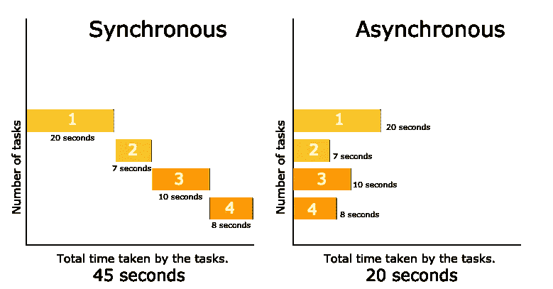
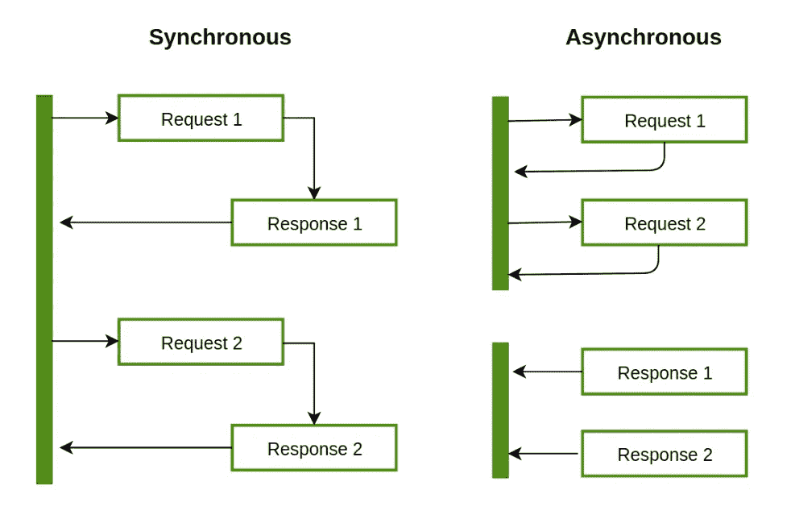
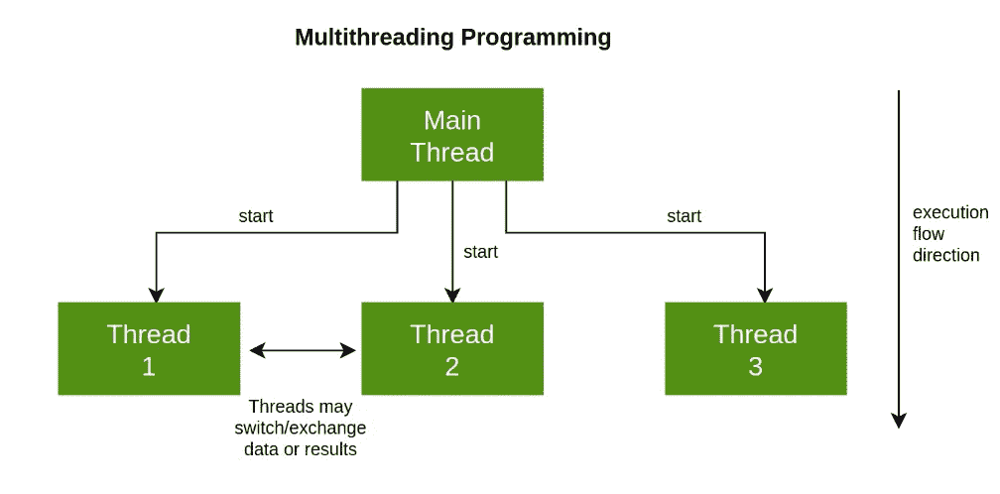

# 多线程与异步编程

> 原文：<https://medium.com/nerd-for-tech/multi-threading-versus-asynchronous-programming-bc2bd4bb187d?source=collection_archive---------2----------------------->

## 介绍

在这篇博客中，我们将了解一种简单的方法来解释多线程和异步编程。最后，我们将讨论它们之间的差异。

异步编程

异步[编程](https://www.technologiesinindustry4.com/application-programming-interface-api-in-cloud-computing/)规定了主程序流之外的事件速率。意思是处理这样的事件。这些可以是外部事件，例如信号的到达，或者由程序提示的活动。这发生在程序执行的同时，剥夺了程序阻塞以等待结果的权利。

异步模型允许多件事情同时发生。当我们的程序调用一个长时间运行的函数时，它不会阻塞实现流程。我们的程序保证运行。当函数完成时，程序识别并访问结果。

让我们看看下图:

*   解决方案是在异步系统中启动一个额外的控制线程。
*   第一个线程生成第一个文件。第二个线程生成第二个文件。
*   不需要等待第一个线程就可以获取。
*   然后线程一起等待它们的结果返回。
*   接下来，它们重新同步以信任它们的结果。
*   单线程方法的另一个例子是一个程序向操作系统请求一个文件。那需要做一个数学运算。
*   程序在异步系统中向操作系统请求文件。
*   这就把对数学运算的控制权交还给了 CPU。虽然在等文件。
*   异步编程的个别方法是构造函数。
*   它执行一个缓慢的动作，并接受另一个参数，回调函数。
*   该操作正在进行中，当它完成时，回调函数被调用并得到结果。

## 多线程编程

计算机编程中的多线程是中央处理器的能力。它使许多线程可以同时执行。这些都是操作系统支持的。这种方法不同于多重处理。在多线程应用程序中，线程共享单个或多个内核。它包含计算单元、CPU 存储和翻译后备缓冲区。

下图简单解释了多线程应用程序的并发执行:

*   多线程状态是指并行或平行执行一组以上的连续指令。
*   多线程提供了在单个处理器上并行运行的假象。
*   处理器实际上是通过使用调度算法来移动的。
*   它是由外部输入或中断混合产生的开关。
*   这也改变了主题的排名方式。
*   在许多处理器内核上，线程实际上是并行的。
*   单个微处理器协同工作以获得更强有力的结果。
*   有几个相似之处，并行的任务同时流行。
*   多线程的一个简单例子是从 web 浏览器的两个不同选项卡下载两个文件。
*   每个选项卡都使用一个新线程来下载所需的文件。
*   他们正在并行下载，因为另一个完成时没有 tab 键延迟。

## 多线程与异步环境

多线程环境

*   几个编程的单线程同时运行。
*   这取决于 CPU 的数量和操作系统的支持。
*   事实上这可能是真的。此外，它也可以是由精确的调度算法产生的印象。
*   出于这个原因，多线程环境是困难的，包括线程锁定彼此的内存以防止它们相互超越的问题。

异步环境

*   在异步环境中，单个进程线程完全运行。
*   尽管出于事件驱动的原因，它可以从一个功能切换到另一个功能。
*   然后，JavaScript 代码扫描其事件列表，并在事件发生时将下一个事件传递给事件管理器。
*   当当前运行的进程到达必须等待另一个事件的点时也是如此。
*   异步编程避免了传统多线程编程的许多缺点，例如，由于这个原因的内存争用问题，事件驱动。
*   仍然可能存在竞争条件。事件发生的顺序不是由我们决定的。它们很稀有，也更容易管理。
*   相反，在当前运行的函数遇到空闲点之前，事件处理程序不会传递事件。
*   一些函数可能会浪费掉剩余的程序。例如，当人们愚蠢地在服务器上做大量繁重的数学运算时，Node.js 就会出现这种情况。
*   这最好是推到一个小服务器，然后节点等待提供答案。
*   js 是一个过度轻微的事件总机。那么任何超过 100 毫秒的事情都应该在客户端或服务器端进行控制。
*   浏览器环境中的 DOM 事件被保存为自动事件点，但是即使它们写得很差的 Javascript 也可能会使内核饥饿。
*   这就是为什么 Firefox 和 Chrome 会有这些“这个脚本已经停止响应”的干扰训练器。

## JavaScript 中异步编程的重要性

*   同步编程意味着:
*   除了条件和函数调用，
*   代码从上到下顺序执行，
*   阻塞长时间运行的任务，例如网络请求和磁盘 I/O
*   异步编程意味着；
*   引擎在事件循环中运行。
*   当需要阻塞操作时，请求被启动。
*   代码继续运行，不会阻塞结果。
*   当响应就绪时，触发一个中断。
*   这导致事件处理程序运行，控制流继续。
*   单个程序线程可以用这种方式处理许多并发操作。
*   用户界面本质上是异步的。他们大部分时间都在等待用户输入来中断事件循环并激活事件处理程序。
*   默认情况下，节点是异步的。这意味着服务器以几乎相同的方式工作，在一个网络请求的循环中出现，并在处理第一个请求的同时接受更多的传入请求。
*   这在 JavaScript 中非常重要，因为它非常适合用户界面代码。
*   这对服务器的性能也很有帮助。

欲了解更多详情，请访问:[https://www . technologiesinindustry 4 . com/多线程与异步编程/](https://www.technologiesinindustry4.com/multi-threading-versus-asynchronous-programming/)