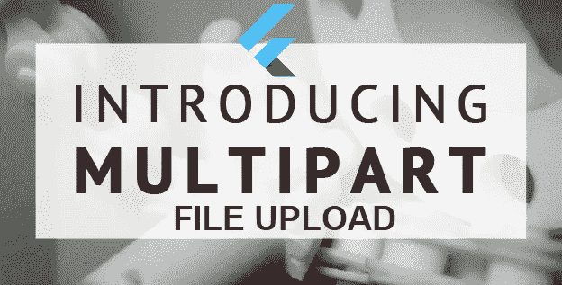
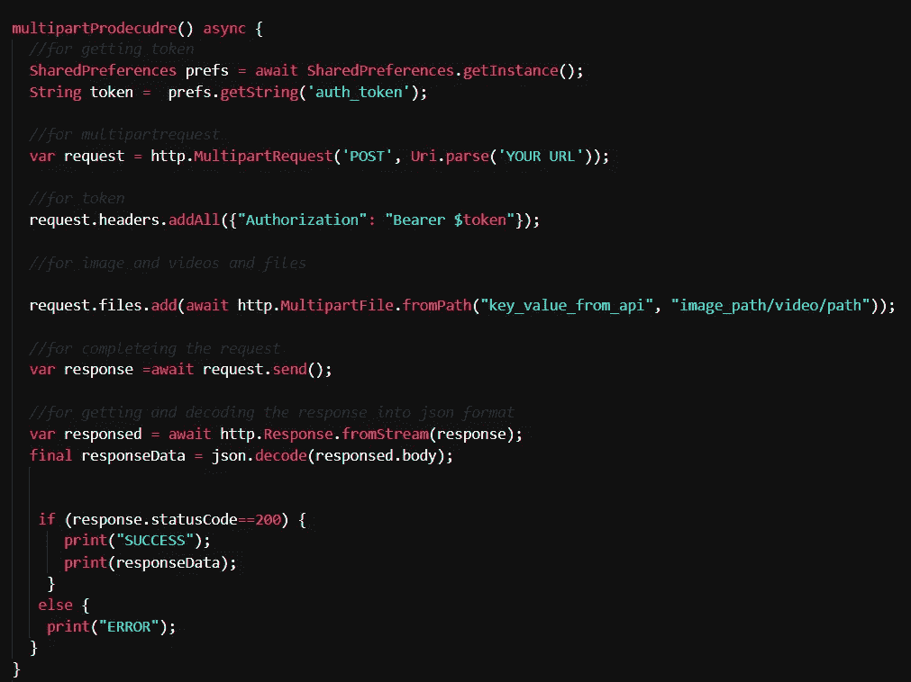

# 颤振中的多请求

> 原文：<https://medium.com/nerd-for-tech/multipartrequest-in-http-for-sending-images-videos-via-post-request-in-flutter-e689a46471ab?source=collection_archive---------1----------------------->

在 flutter 中使用 http.post()，可以只发送 string、int、list、date 和 double 数据类型。如果你想发送图像/视频/文件到服务器，你会怎么做？所以，答案是使用 **MultipartRequest 发送请求。**

# **潜入多方请求**

让我们从简单的开始。
**👉先安装**[**http _ package**](https://pub.dev/packages/http)**:**

> 将“package:http/http.dart”作为 http 导入；

**👉首先将 multipartrequest 存储在一个 var 中，如下所示:**

> var 请求= http。MultipartRequest('POST '，uri . parse(' YOUR URL '))；

**👉用于传递头或令牌:**

> request . headers . addall({ " Authorization ":" Bearer $ YOUR _ TOKEN " })；

**👉用于发送文件/图像/视频:**

> request.files.add(等待 http。multipart file . from path(" key _ value _ from _ API "，<image_path>)；</image_path>

**👉对于发送普通数据(var，string，int，double，date)，添加这些行:**

> *request . fields[' key _ VALUE _ from _ API ']= " YOUR _ VALUE "；*

**👉最后，添加这些行来完成 multipartrequest:**

> *var response = await request . send()；*

添加这些行，您将能够通过 http.post 请求/multipart 请求向服务器发送文件类型数据。

示例:

以上这些代码可以在 [github](https://github.com/lakshydeep-14/MultipartRequest) 中找到。

因此，您将学习如何在 flutter 中使用多部分请求或 http.post 请求向服务器发送文件。

你可以联系我 [LinkedIN](https://www.linkedin.com/in/lakshydeep-14/) 然后关注我。
买书**让自己成为软件开发人员:让我们投入到扑扑中&跨国公司**[买书](https://www.amazon.com/dp/B09NNXNT6X/ref=sr_1_1?keywords=make+yourself+the+software&qid=1639582180&sr=8-1)。
敬请反馈。
保持学习和编码。谢谢！！！