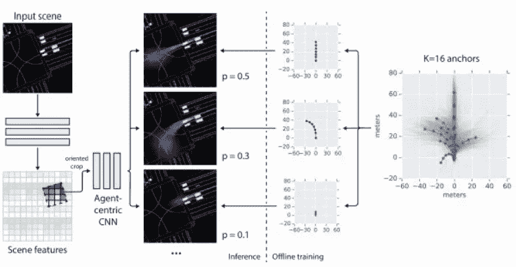

# 多路径:用于行为预测的多重概率锚轨迹假设

> 原文：<https://medium.com/nerd-for-tech/multipath-multiple-probabilistic-anchor-trajectory-hypotheses-for-behavior-prediction-3f687cf00ce0?source=collection_archive---------12----------------------->

# 多路径:

在多路径中，我们关注于预测未来智能体状态的问题，这是现实环境中机器人规划的关键任务。我们对解决自动驾驶汽车的这个问题特别感兴趣，这是一种具有潜在巨大社会影响的应用。主要是，预测该领域中其他代理的未来对于安全、舒适和有效的操作至关重要。

例如，如果车辆要在我们的机器人前面超车，或者什么时候是加入交通的最佳时间，知道是否让行是很重要的。这样的未来预测需要理解静态和动态的世界背景:道路语义(如车道连通性、停车线)、交通灯信息和其他主体的过去观察，如下图所示。未来状态预测的一个基本方面是它固有的随机性，因为主体无法知道彼此的动机。当我们开车时，我们永远无法真正确定其他司机接下来会做什么，考虑多种结果及其可能性至关重要。

我们寻求一种未来模式，能够同时提供这两者:

(I)一组加权的、简洁的离散轨迹，其覆盖可能结果的空间，以及(ii)任何轨迹的可能性的封闭形式的评估。这两个属性实现了相关规划用例中的高效推理，例如，对离散轨迹假设的类人反应(例如，让步、跟随)，以及概率查询，例如时空区域中的预期碰撞风险。这个模型以关键的洞察力解决了这些问题:它采用一组固定的轨迹锚作为我们建模的基础。这让我们可以分层次地考虑随机不确定性:首先，意图不确定性捕获了主体打算做什么的不确定性，并被编码为锚轨迹集上的分布。第二，给定一个意图，控制不确定性代表我们对他们如何实现它的不确定性。我们假设控制不确定性在每个未来时间步呈正态分布[Thrun05]，参数化使得平均值对应于锚状态的特定环境偏移，相关协方差捕捉单峰随机不确定性[Kendall17]。图 1 示出了一个典型的场景，其中在给定场景背景下有三个可能的意图，控制平均偏移改进考虑到道路几何形状，并且控制不确定性直观地随时间增长。我们的轨迹锚是通过无监督学习在状态序列空间的训练数据中找到的模式。这些锚点为代理的粗粒度未来提供模板，并且可能对应于语义概念，如“换车道”或“减速”(尽管为了清楚起见，我们在建模中不使用任何语义概念)。

我们的完整模型在每个时间步预测高斯混合模型(GMM ),混合权重(意图分布)随时间固定。给定这样一个参数分布模型，我们可以直接评估任何未来轨迹的可能性，并有一个简单的方法来获得一个紧凑的，不同的加权轨迹样本集:来自每个锚意图的地图样本。