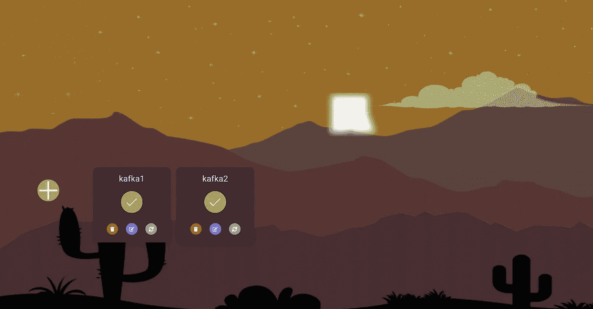
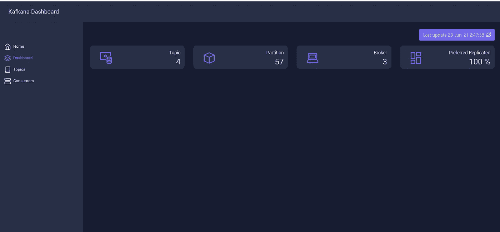
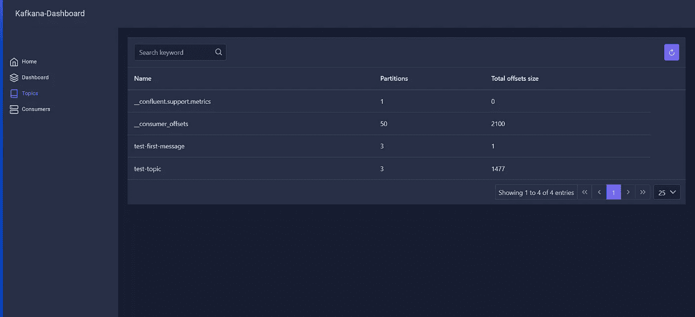
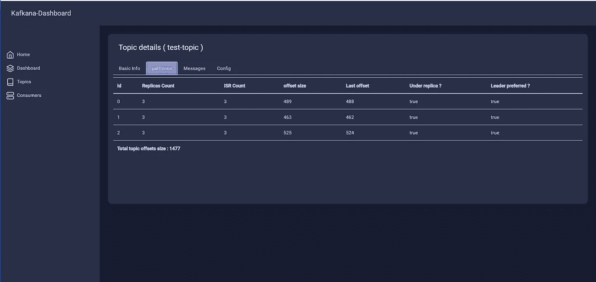
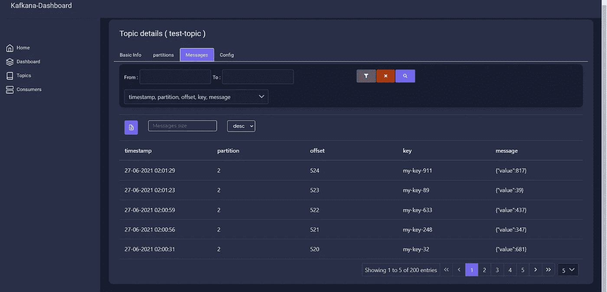
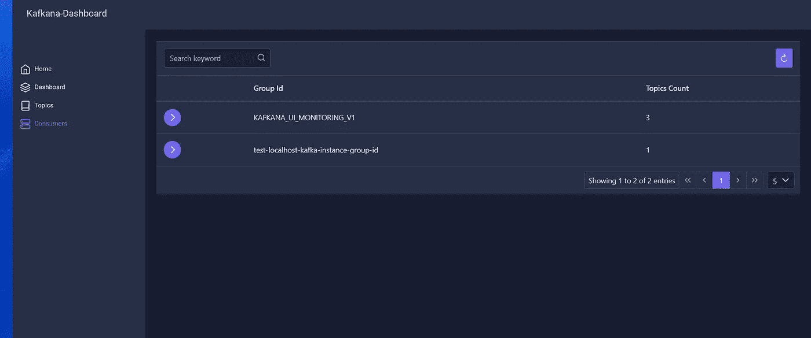

# 我的多个 Kafka 集群仪表板(kafkana)

> 原文：<https://medium.com/nerd-for-tech/multiple-kafka-clusters-dashboard-kafkana-a2c8a17f72f7?source=collection_archive---------14----------------------->

**什么是卡夫卡那？**

Kafkana 是一个开源的多 Kafka 集群仪表板管理



kafkana 提供了哪些功能？

*   支持多个集群存储在您的浏览器本地存储
*   带有配置图的代理列表
*   主题列表，详细介绍了副本 ISR 等。
*   消费者和消费者团体的详细列表
*   创建/删除主题
*   集群摘要主题计数、分区计数、复制不足计数、最近首选副本、代理计数等。
*   按名称获取带有详细信息的主题
*   通过按时间戳过滤从主题获取消息开始—以消息详细信息结束

仪表板:



主题列表:



主题详细信息:



主题消息，带有按时间戳过滤、消息有效负载关键字和排序



消费者群体列表



如何安装？

使用 docker:

后端:

```
docker build -t kafkana-api  -f backend/Dockerfile . 
```

前端:

```
docker build -t kafkana-ui  --build-arg configuration=production -f frontend/Dockerfile .
docker run -d -p 4200:80 kafkana-ui -e API_URL=localhost:8080
```

对于开发者和贡献者

后端是一个 java spring-boot 应用程序，前端是一个 angular 应用程序。

[](https://github.com/ragoob/kafkana) [## ragoob/kafkana

### 多个 kafka 集群的实时和管理仪表板- ragoob/kafkana

github.com](https://github.com/ragoob/kafkana)