# 使用 Python 进行多元线性回归和梯度下降

> 原文：<https://medium.com/nerd-for-tech/multiple-linear-regression-and-gradient-descent-using-python-b931a2d8fb24?source=collection_archive---------2----------------------->

这篇文章将解释多元线性回归及其在 Python 中的实现。

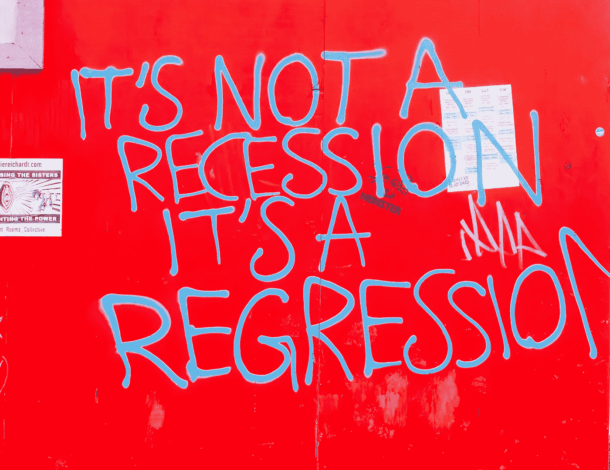

安妮·斯普拉特在 [Unsplash](https://unsplash.com/s/photos/linear-regression?utm_source=unsplash&utm_medium=referral&utm_content=creditCopyText) 上的照片

在我们深入多元线性回归之前，在这篇[的文章](/@gilsatpray/gradient-descent-in-machine-learning-linear-regression-e94570f505e6)中，我们先来看看简单的线性回归。

[](/@gilsatpray/gradient-descent-in-machine-learning-linear-regression-e94570f505e6) [## 机器学习简介—简单线性回归和梯度下降

### 线性回归是每个想学习机器学习的人的第一步。或者任何想成为…

medium.com](/@gilsatpray/gradient-descent-in-machine-learning-linear-regression-e94570f505e6) 

我们将使用那篇文章中的一些公式和代码。

## 多元线性回归

回想一下简单线性回归的方程式

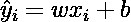

图一。简单线性回归

预测的标注(y hat)仅取决于单个要素 x。如果我们有一个包含多个独立要素的数据集呢？如果是这种情况，那么我们需要多元线性回归。等式是:

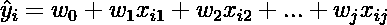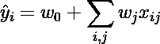

图二。多元线性回归

其中:

Yi =第 I 个样本的预测标签

Xij =第 I 个标签的第 j 个特征

W0 =回归截距或权重

Wj =第 j 个特征回归权重

请注意，当标签 y 仅依赖于一个变量 x 时，方程变成简单的线性方程 y=w1x + w0。

我们可以用矩阵符号来表示多元线性回归

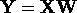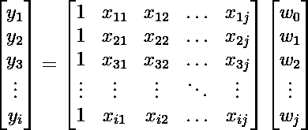

图 3。多元线性回归的矩阵表示法

**梯度下降**

多元线性回归中要最小化的成本函数是均方误差:

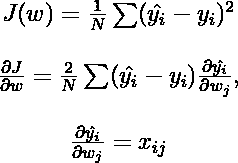

图 4 .成本函数及其偏导数

在矩阵形式中，成本函数的偏导数可以写成

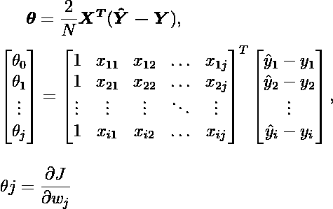

图。6 成本函数导数的矩阵符号

在 k+1 次迭代中更新的权重变成

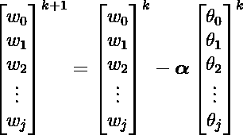

图 7。权重学习规则

其中 **alpha** 是学习率。

## 履行

回想一下我们为简单线性回归编写的模型

我们将更新代码，因此它也适用于多元线性回归情况。

更新构造函数

在构造函数中，我们只是添加了初始化权重矩阵作为模型属性。

按照以下步骤更新拟合方法:

1.  通过添加一个值等于 1 的列作为截距(w0)来修改特征矩阵
2.  将权重矩阵的值初始化为零。
3.  对于迭代 1 直到 n(类 *iters* 属性)
4.  使用图 3 计算预测标签矩阵。
5.  计算步骤 3 中已知标签矩阵和预测标签之间的误差。
6.  用图形计算成本函数的偏导数。6

7.使用图 7 中的公式更新权重矩阵。

最后对于预测方法:

让我们回顾一下我们的更新模型:

在多个变量数据集上测试模型之前，让我们测试简单线性回归案例的模型，我们将重用来自[先前帖子](/@gilsatpray/gradient-descent-in-machine-learning-linear-regression-e94570f505e6)的测试分数数据集

MSE 的输出在 3.30 左右，与之前的模型相同。

让我们测试这个多变量回归模型。我们将使用来自 [Kaggle](https://www.kaggle.com/dansbecker/underfitting-and-overfitting/data?select=train.csv) 的房价数据集。下载并保存到数据集文件夹。

我们将预测`SalePrice`，让我们稍微探索一下数据集

```
df["SalePrice"].describe()count      1460.000000
mean     180921.195890
std       79442.502883
min       34900.000000
25%      129975.000000
50%      163000.000000
75%      214000.000000
max      755000.000000
Name: SalePrice, dtype: float64
```

让我们看看`SalePrice`的分布图

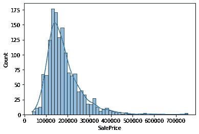

图 8。销售价格直方图

大多数价格在 10 万到 20 万之间，但在更贵的方面似乎有很多异常值。

就目前而言，我们不想在我们的数据集中得到任何缺失的值。因此，让我们检查哪些列包含丢失的值

```
PoolQC          1453
MiscFeature     1406
Alley           1369
Fence           1179
FireplaceQu      690
LotFrontage      259
GarageYrBlt       81
GarageType        81
GarageFinish      81
GarageQual        81
GarageCond        81
BsmtFinType2      38
BsmtExposure      38
BsmtFinType1      37
BsmtCond          37
BsmtQual          37
MasVnrArea         8
MasVnrType         8
Electrical         1Columns with missing values: 19
```

因此有 19 列缺少值，我们将跳过它们并使用另一列进行回归。我们将使用相关性相对较高的列，这是其中的一些:

```
 OverallQual  GrLivArea  GarageArea  SalePrice
OverallQual     1.000000   0.593007    0.562022   0.790982
GrLivArea       0.593007   1.000000    0.468997   0.708624
GarageArea      0.562022   0.468997    1.000000   0.623431
SalePrice       0.790982   0.708624    0.623431   1.000000
```

缩放数据，使其快速收敛

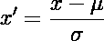

图 9。标量方程

其中是特征的平均值，σ是标准偏差

现在我们可以拟合数据集

## 结论

在本文中，我们了解到:

1.  一元线性方程向多元线性方程的推广
2.  从代数和矩阵符号上推导多元线性回归方程。
3.  在多元线性回归中实现梯度下降

请分享这个帖子，如果你喜欢就给它一个掌声。