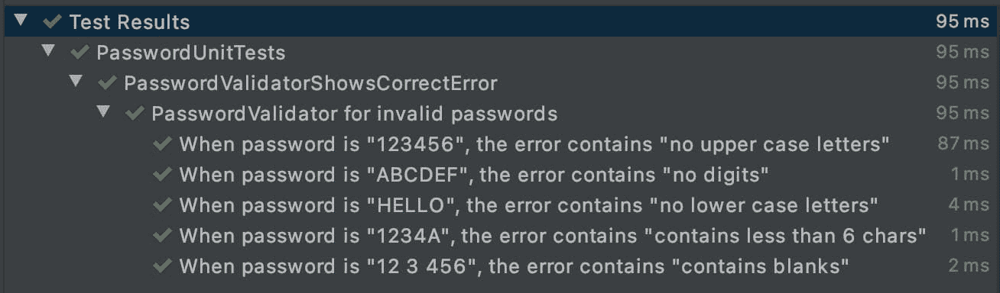
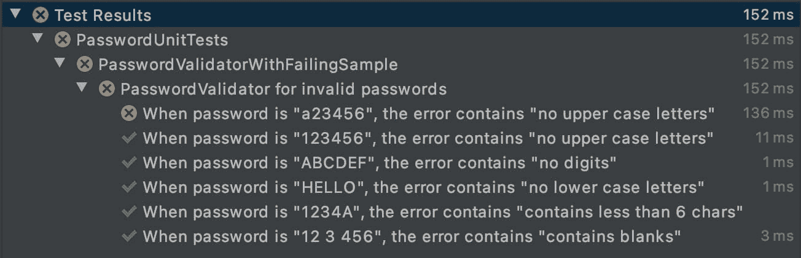
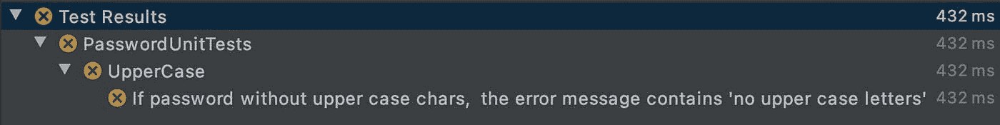
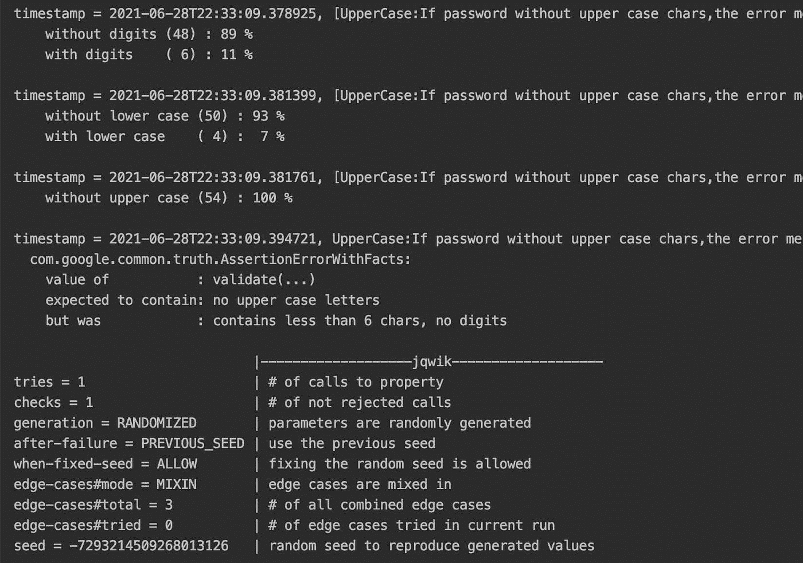

# 用基于属性的测试编写防弹代码

> 原文：<https://medium.com/nerd-for-tech/multiplying-the-quality-of-your-unit-tests-with-property-based-tests-d3c2cb2d5601?source=collection_archive---------13----------------------->

在前一篇文章中，我们看到了如何编写更集中、简洁和可伸缩的测试。然而，*参数化测试*属于所谓的*基于实例的测试*:测试只使用我们选择作为实例传递的输入和期望值**运行。这就产生了一个问题:如果我们没有选择任何其他有效的例子，那么测试就不能通过呢？**

# 回到密码验证器的例子

编写测试的原因之一是它们保护我们免受回归错误的影响。它们是一种工具，用于检测导致正常工作的功能停止工作的代码更改。如果发生这种情况，相应的测试会变红，并指出哪里出了问题。

回到我上一篇文章的 PasswordValidator，最终的*参数化测试*如下所示:

现在让我们想象一下，您需要在验证器中做一些调整。你完成它，推你的代码。但是，事实证明，另一个队友也接触了验证器，你们正在发生一些冲突。您解决了冲突并再次推送代码。最后，您的测试在您的 CI 中运行正常，因此您有足够的信心合并您的代码。

但是，在此之前，您的团队成员审查了代码，并要求您做一些代码更改。他发现`ContainsUpperCaseLetterValidator`的实现是不正确的。

所以你看一看…

是的，原来它现在验证小写(即`"[a-z]"`)而不是大写字符(即`"[A-Z]"`)。另一方面，你感到困惑。CI 上的所有测试都正常。会有什么问题呢？所以您在本地再次运行测试。

还是绿色的。我们知道它应该是红色的，因为我们已经发现了实现本身的错误。但是仔细看看`ContainsUpperCaseLetterValidator`第一个*基于实例的测试*。

我们在那里输入密码“123456”，所以`passwordValidator.validate("123456")`应该会返回一个错误消息，不仅针对`ContainsUpperCaseValidator`，也针对`ContainsLowerCaseValidator`，因为它既不包含大写字符也不包含小写字符，只有数字。

在这种情况下，我们可以通过为`ContainsUpperCaseValidator`添加一个在密码输入中包含小写字符的额外示例来“修复”测试(但不是实现)，例如“a23456”。这样做时，测试运行为红色，正如预期的那样。

> *检查* [*这个链接*](https://github.com/sergio-sastre/Multiplying_the_quality_of_unit_tests/blob/master/app/src/test/java/sergio/sastre/multiplying/quality/of/unittests/parameterizedbroken/PasswordUnitTests.kt) *查看失败样本的代码或者* [*这个其他链接*](https://github.com/sergio-sastre/Multiplying_the_quality_of_unit_tests/blob/master/app/src/test/java/sergio/sastre/multiplying/quality/of/unittests/parameterized/PasswordUnitTests.kt) *查看所有*参数化测试的全套

# 拯救基于属性的测试

根据前面的例子，我们可以得出结论**任何没有至少一个大写字符的密码，必须显示错误消息“不包含大写字符”**。这种每次都必须有效的前提条件和质量的组合被称为*属性*。

如果不是仅仅通过*参数化测试*提供具体有效的例子，我们还会**为前提条件(无大写字符)生成随机有效值**，该前提条件必须总是满足质量(在错误消息中显示“不包含大写字符”),会怎么样？这被称为*基于属性的测试(PBT)* 。

在我看来，目前最强大的 JVM 语言 PBT 引擎是 Jqwik。我发现在编写自定义值生成器时，它比 *Kotest* 或 *QuickUnit* 灵活得多。此外，它还提供了一些独特的功能，例如*为生成的输入收集统计数据*，这对于确保生成的随机值在预期值之内非常有用。所以本文所有的例子都会用 *Jqwik* 来写。

# 配置

Jqwik 非常容易配置，**可以与 Junit4 和 Junit5** 一起运行。在一个 Android 项目中，你只需要将以下内容添加到你的项目 gradle 文件中。

对于其他 java/jvm 项目，你可以查看 Jqwik 文档。

# 我们的第一个基于属性的测试

基于属性的测试需要提供一个生成器，该生成器通过编程或通过注释来创建约束值。在 *Jqwik* 中，你可以用`@Provide`创建一个生成器，它必须为我们的任意密码返回一个*Jqwik*T1。我们的生成器必须生成没有大写字符的随机字符串**，如下所示**

然而，这并不能确保生成的输入是我们期望的值。正如我之前提到的， *Jqwik* 的一个特殊特性是*为生成的输入收集统计数据*。这样做，我们可以确保生成的输入的正确性。我强烈建议总是将它们添加到您的*基于属性的测试*中。

根据我们的“强密码”规则，在测试中观察数字以及小写和大写字符是有意义的。在 Jqwik 中，相应的方法可能是这样的。

> *在这里* 查看所有统计收集器 [*的完整实现*](https://github.com/sergio-sastre/Multiplying_the_quality_of_unit_tests/blob/master/app/src/test/java/sergio/sastre/multiplying/quality/of/unittests/pbt/StatCollectors.kt)

通过在生成的输入上添加统计数据，您会对测试正确的东西更有信心。这些报告将包含这些统计数据，稍后您将会看到。

一旦我们有了生成器和统计数据，我们的测试就会像这样

> *您可以在这里* 找到完整的测试套件，包括所有验证器的 PBT 示例以及随机值生成器

*如果我们运行它，我们会得到类似下面的报告*

****

*太好了！测试不出所料地失败了，生成的值 100%都没有大写字母。如你所见， *Jqwik* 生成器默认也会考虑边缘情况(更多关于[边缘情况，请点击](https://jqwik.net/docs/current/user-guide.html#generation-of-edge-cases))。*

# *为什么古怪的测试在 PBT 中不是一个问题*

*您可能会想…测试失败了，但是每次运行时都会随机生成值…因此，如果我再次运行测试，就会生成新的值，并且可能会发生这样的情况:对于这些新的随机值，测试不会失败。不可重复的测试会降低测试套件的可靠性，需要避免。*

*但是不要担心。首先， *Jqwik* **重用同一个种子生成随机值，直到默认一个绿灯运行**。其次，如果您需要在任何时候使用相同的值**重复测试**，只需将之前报告中显示的种子添加到测试的最底部即可*

*现在，您可以使用导致测试失败的相同值连续运行测试。*

*一旦固定，不要忘记移除种子。这样，生成器将在每次运行时继续生成新的随机值。这样做，您可能会发现实现不正确的其他值。*

*恭喜你，你的测试已经变得对回归错误更加健壮了。你已经准备好去抓他们了！*

# *结论*

*让我们来看看*基于财产的测试*的利弊。*

# *赞成的意见*

1.  *测试变得更加健壮，让你对你的代码更有信心。*
2.  *测试是决定性的。可以重用导致它们失败的种子，这样错误就可以重现。*
3.  *默认情况下探索边缘案例，否则我们可能会忘记。*

# *骗局*

1.  *有些属性很难找到，尤其是在 PBT 中启动时。你可以看看 Scott Wlaschin 关于[如何找到房产](https://fsharpforfunandprofit.com/posts/property-based-testing-2/)的有趣帖子。*
2.  **基于属性的测试*运行得更慢，因为它们默认执行 1000 次。但是，如果需要，大多数引擎允许您更改该值。*
3.  *属性并不总是足以测试正确性。看看下面`String?.reversed()`的错误实现及其测试*

*测试会通过，给我们一个错误的印象，即方法功能是正确的。另一方面，这是那种*基于实例的测试*可以快速发现的错误。*

*因此，在大多数情况下，将基于*的示例*和基于*的属性的测试*结合在一起，可以获得最好的结果。*

*本文中使用的所有代码示例，以及本系列第一篇文章中的代码示例(使用参数化测试的[更好的单元测试](https://sergiosastre.hashnode.dev/better-unit-tests-with-parameterized-testing))都可以在[本报告](https://github.com/sergio-sastre/Multiplying_the_quality_of_unit_tests)中找到。*

*你喜欢这个帖子吗？你可能也想看看我写的其他文章*

1.  *[通过参数化测试实现更好的单元测试](https://sergiosastre.hashnode.dev/better-unit-tests-with-parameterized-testing)*
2.  *[2021 年安卓快照测试介绍](https://sergio-sastre.medium.com/an-introduction-to-snapshot-testing-on-android-in-2021-c9826e22deb1)*
3.  *[直接在 Android xml 中设计动态字符串](/nerd-for-tech/styling-dynamic-strings-directly-in-xml-7b93cfe380ab)*

**原载于*[*https://sergiosastre . hash node . dev*](https://sergiosastre.hashnode.dev/writing-bulletproof-code-with-property-based-testing-pbt)*。**