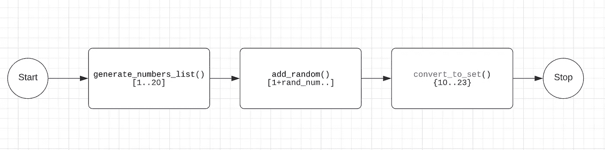
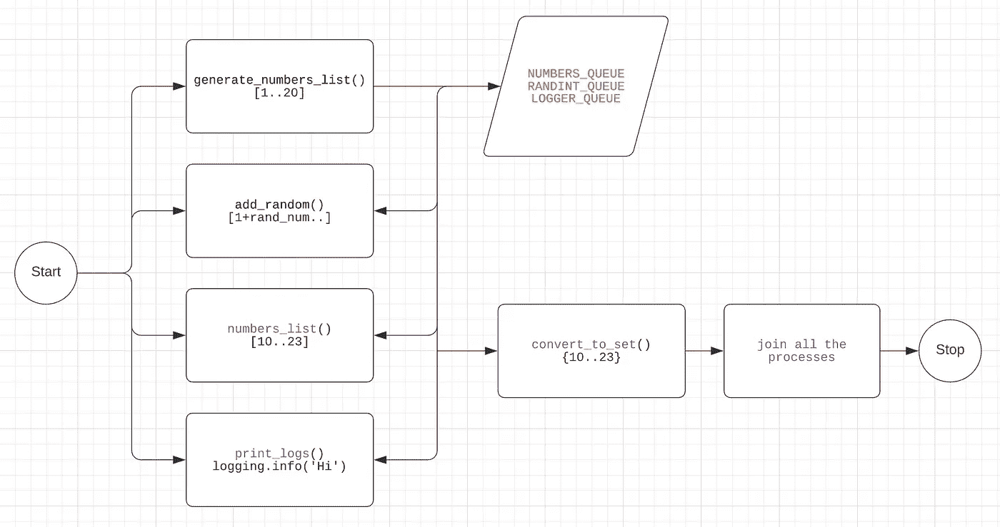

# Python 中的多重处理

> 原文：<https://medium.com/nerd-for-tech/multiprocessing-in-python-ef567a35189a?source=collection_archive---------12----------------------->

在本文中，我将分享我是如何在 Python 脚本中使用多重处理的。在早期，当我知道多处理的概念，但不知道如何确切地使用它来使 Python 脚本运行得更快时，我挣扎了很久。


线性运行 python 脚本中的方法没有任何问题，事实上，这要简单得多…编写方法来完成特定的任务，逐个调用它们并从每个方法中收集数据，就大功告成了。但在大多数情况下，这是一种耗时的方法。

> 多重处理来了…

当我开始使用多重处理编写脚本时，我不得不处理一些事情。让我们先把它们记下来。
1。将脚本拆分成可以并行运行的任务。
2。正确地执行这些方法，并将它们与主流程结合起来。
3。管理进程间的共享数据(列表、队列、返回值)。
4。管理不同进程的日志记录。


是的，一开始这让我很困惑。但是在我的导师的帮助下，很明显，是 StackOverflow😛我想到了一个解决办法。所以我们来探索一下。

# **1。将脚本拆分成可以并行运行的任务。**

这是最棘手的部分，因为一开始，我甚至找不到一对可以并行运行的方法。让我们举一个简单的例子——

假设您想要生成一个从 1 到 20 的数字列表，然后向列表中的每个数字添加一个从 10–20 的随机整数，然后将列表转换为一个集合，这样在最终输出中就不会有重复的数字。



我们将创建 3 个方法来分割这项任务，一个方法将生成一个从 1 到 20 的数字列表，然后另一个方法将向列表中的每个数字添加随机数，然后一个方法将列表转换为集合。现在的问题是，有没有办法并行运行这些方法？？😕 💭

> 如果我们的第二个方法( **add_random** )不必等待第一个方法( **generate_numbers_list** )完成，并且只要生成一个数字，第二个方法就可以开始处理该数字，即生成一个随机数并添加到其中，那会怎么样？

我们将再添加两个方法，一个在开始，即 logger 方法，另一个在 **convert_to_set** ()方法之前，该方法将收集所有数据流并创建一个最终列表，该列表将准备好转换为 set。因为将列表转换为集合需要所有数据同时进行，所以我们不能并行化该方法。

现在，流程将会是—



现在，这 4 种方法将并行运行。(生成数字列表，随机添加，数字列表，打印日志)

```
def generate_numbers_list():
    LOGGER_QUEUE.put("Number generation Started")
    for x in range(1, 21):
        NUMBERS_QUEUE.put(x)
        time.sleep(5)
```

```
def add_random():
    LOGGER_QUEUE.put("Number addition Started")
    while True:
        num = randint(10, 20)
        if not NUMBERS_QUEUE.empty():
            x = NUMBERS_QUEUE.get()
            LOGGER_QUEUE.put(f"add_random - {x}")
            RANDINT_QUEUE.put(x+num)
```

```
def numbers_list(final_list):
    LOGGER_QUEUE.put("list conversion Started")
    while True:
        if not RANDINT_QUEUE.empty():
            x = RANDINT_QUEUE.get()
            LOGGER_QUEUE.put(f"appending - {x}")
            final_list.append(x)
```

**generate_numbers_list** ()将生成从 1 到 20 的数字列表。为了使它更耗时，我们可以添加 time.sleep(5)在生成每个数字后睡眠 5 秒钟。现在，只要它生成一个数字，它就会将该数字添加到名为——NUMBERS _ Queue 的多处理队列中，该队列正被下一个方法监听，即 **add_random** ()
只要队列中有一个数字可用，add_random 就会将一个随机数添加到该队列中，并将其放入 RANDINT_QUEUE。接下来，它被下一个方法 **numbers_list** ()监听，并收集数据以创建最终列表。

# **2。正确地执行这些方法，并将它们与主流程结合起来。**

您可以为每种方法创建一个流程，然后启动它。

```
generate_numbers_process = Process(target=generate_numbers_list)
    add_random_process = Process(target=add_random)
    numbers_list_process = Process(target=numbers_list)
    generate_numbers_process.start()
    add_random_process.start()
    numbers_list_process.start()
    generate_numbers_process.join()
    add_random_process.join()
    numbers_list_process.join()
```

每个进程都需要 Join，以便它们与主方法连接，并且主方法不会在没有其进程的情况下退出。

# **3。管理进程间的共享数据(列表、队列、返回值)。**

我们将对共享数据使用多处理队列和列表。

```
from multiprocessing import Process, Queue, Manager
NUMBERS_QUEUE = Queue()
RANDINT_QUEUE = Queue()
LOGGER_QUEUE = Queue()shared_list = Manager().list()
```

# **4。管理不同进程的日志记录。**

由于所有的方法都是并行运行的，如果我们直接在每个方法中写入 logging.info()，那么日志将会开始打印，而没有任何正确的顺序。因此，为了按顺序打印日志，我们还需要一个方法( **print_logs** ())，该方法将监听我们示例中的 Queue- LOGGER_QUEUE，只要队列中有任何日志，它就会记录它。

```
def print_logs():
    while True:
        if not LOGGER_QUEUE.empty():
            x = LOGGER_QUEUE.get()
            logging.info(x)
```

现在，由于方法正在监听多重处理队列，如果没有来自源方法的数据结束的信号，它们将无限期等待。


为了处理这种情况，我们将在每个队列的末尾添加一个标志，一旦遇到该标志，侦听方法将停止从队列中提取数据。在我们的例子中，该标志将是“end”字符串，然后继续检查队列中的“end”字符串，并打破循环。

```
NUMBERS_QUEUE.put("end")
RANDINT_QUEUE.put("end")
LOGGER_QUEUE.put("end")while True:
    if not RANDINT_QUEUE.empty():
        if QUEUE.get() == "end":
            break
```

这是我创建的一个简单的例子，用来解释我在 python 中使用多处理的策略。*我的用例是从一个 API 获取数据，将其格式化，然后存储在 s3 中。*

随意查看整个脚本—[https://github . com/kuldeepkr 16/python-scripts/blob/main/multip _ techniques . py](https://github.com/kuldeepkr16/python-scripts/blob/main/multip_techniques.py)
欢迎反馈。😄