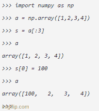

# 必须了解 Numpy 的特性

> 原文：<https://medium.com/nerd-for-tech/must-know-features-in-numpy-7a303ada604d?source=collection_archive---------27----------------------->


安装 NumPy

根据[numpy.org](https://numpy.org/)的说法，NumPy 形成了强大的机器学习库的基础，如 [scikit-learn](https://scikit-learn.org/) 和 [SciPy](https://www.scipy.org/) 。NumPy 中的一些特性并不像我们预期的那样工作。了解这些将有助于减少调试时间。



Numpy 在行动

*   在 NumPy 中切片是适当的

就地意味着当我们对切片数组进行更改时，实际数组的值也随之更改。

```
*>>> import numpy as np
>>> a = np.array([1,2,3,4])
>>> s = a[:3]
>>> a
array([1, 2, 3, 4])
>>> s[0] = 100
>>> a
array([100,   2,   3,   4])* >>>
```

*   +=就地运行，而+不运行

如果直接赋值(b = a)，当我们使用+=运算符改变“a”的值时，“b”的值会改变，但当我们使用+运算符时，“b”的值不会改变。

```
>>> import numpy as np
>>> a = np.array([1,2,3,4])
>>> b = a
>>> a+= np.array([1,1,1,1])
>>> a
array([2, 3, 4, 5])
>>> b
array([2, 3, 4, 5])
>>> c = np.array([1,2,3,4])
>>> d = c
>>> c = c + np.array([1,1,1,1])
>>> d
array([1, 2, 3, 4])
>>>
```

但是，如果我们使用“a”的副本(b = a.copy())，即使我们使用+=操作符，“b”的值也不会改变。

```
>>> import numpy as np
>>> a = np.array([1,2,3,4])
>>> b = a.copy()
>>> a+= np.array([1,1,1,1])
>>> a
array([2, 3, 4, 5])
>>> b
array([1, 2, 3, 4])
>>>
```

*   ==对于数组相当于 np.equal

```
>>> import numpy as np
>>> a = np.array([2,3,4,5])
>>> b = a
>>> np.equal(a,b)
array([ True,  True,  True,  True])
>>> a==b
array([ True,  True,  True,  True])
>>>
```

为了检查两个数组是否相等，我们使用 np.array_equal

```
>>> np.array_equal(a,b)
True
```

感谢阅读！我们上 [LinkedIn](https://www.linkedin.com/in/gowthami-wudaru-3788b7162) 连线吧