# 必须了解 Git 基础——对于绝对的初学者

> 原文：<https://medium.com/nerd-for-tech/must-know-git-basics-for-absolute-beginners-ae37ad216c77?source=collection_archive---------16----------------------->


礼貌:[https://unsplash.com](https://unsplash.com/)

作为软件开发人员，使用版本控制系统是一个很好的实践。GitHub 是一个版本控制平台，开发者可以保留一个项目的副本，并与同事或其他开发者合作。当然，GitHub 让软件开发人员的生活没有压力。

在本教程中，我将讨论 GitHub 的基础知识，包括创建 repo、分支、提交更改、推送、PR、拉取、合并。

**先决条件:在你的电脑上安装**[**Git**](https://git-scm.com/downloads)

**让我们开始你的 Git 之旅吧。**

# ****创建一个 GitHub 库****

**本地项目可以存储在一个称为 repo 的存储库中。Repo 实际上是一个存储项目中所有文件夹、文件和视频的地方。本地 repo 是特定项目存储在计算机中的位置。远程 repo 或 Git repo 是 GitHub 服务器中存储特定项目的位置。每个项目都有自己独特的 GitHub 资源库。**

**在这一步中，您将能够学习如何创建 GitHub repo，首先提交，然后将第一次提交推送到远程 repo。
要创建远程回购，您可以使用 GitHub 平台或 Git Bash。在本教程中，我将向您展示如何使用这两种方法创建远程 repo。**

1.  ****使用 GitHub****

**首先首先，单击右上角的加号(+)图标，这将引导您进入“新存储库”。然后在输入字段中填入相关的详细信息。根据项目的目的，您可以选择“私有”或“公共”。再经过一些步骤，您就可以创建回购了。**

**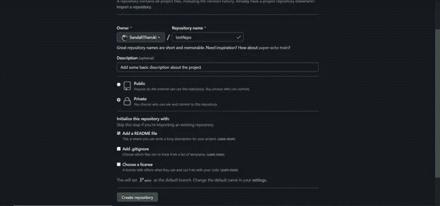**

**创建新的 Git 存储库**

**恭喜你！！！您刚刚创建了第一个 Git 存储库。现在，您可以通过简单地点击“创建新文件”或“上传现有文件”或使用 Git bash 来开始。**

****1。Git 命令****

**要从 Git bash 开始，在存储本地 repo 的目录中打开 Git bash，并遵循下面的命令。**

*   **首先，您应该初始化 Git repo。**

```
git init
```

*   **然后在目录中创建新的文本文件或自述文件。这是您要添加到回购中的第一个文件。(您可以使用" echo "# test" >> README.md "来创建 README.md 文件)**

**创建第一个文件后，您应该将其添加到本地 repo。**

```
git add filename.txt **OR** git add README.md
```

*   **这里，您对本地回购进行了第一次更改，您应该将该更改保存为提交。**

```
git commit -m “write a commit message”
```

**在必要的时候，总是试着写一些有意义的信息，这些信息可以很容易地识别出你对项目文件所做的更改。**

*   **然后，您应该创建“主”分支**

```
git branch -M main
```

*   **您即将结束此过程。现在您所要做的就是将本地回购添加到您的远程回购中。**

```
git remote add origin [https://github.com/GitHub](https://github.com/GitHub) user name/repo name.git
```

*   **最后，将对本地存储库所做的更改推送到远程存储库。**

```
git push -u origin main
```

**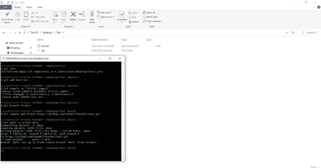**

**在本地目录中打开 Git bash 并使用上面的命令**

**2.开源代码库**

**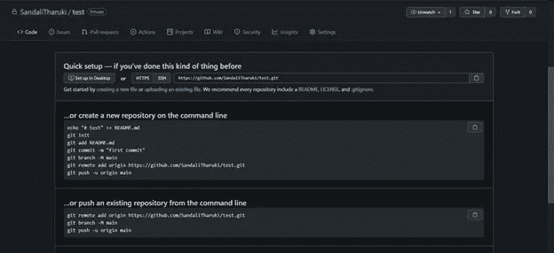**

**使用 GitHub 添加文件**

# **分支**

**分支是促使我们使用 GitHub 的一个显著的优点。这在团队游戏中非常方便。每个成员可以拥有自己的分支，他们对项目(本地回购)所做的更改(提交)可以保存(推送)到他们的分支中。只有正确的最终版本才能推入主分支。这样，你可以保持一个干净的项目回购没有任何混乱。**

**Git 命令或 GitHub 都可以用来创建新的分支。**

****1。Git 命令****

**可以使用 Git bash、IDE 终端或任何其他首选终端。在本教程中，我使用 Git bash。**

```
git branch branch_name  -->  TO CREATE A NEW BRANCHgit checkout branch_name  -->  TO SWITCH FROM CURRENT BRANCH TO NEW BRANCH
```

**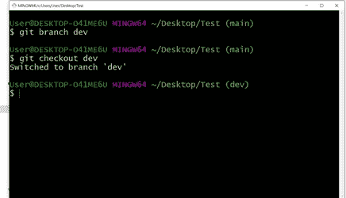**

**创建一个新的分支，并使用 Git 命令切换到该分支**

****2。GitHub****

**您可以使用 GitHub 轻松创建新的分支。你所要做的就是访问 GitHub 中的远程 repo，点击左上角带有分支图标的按钮。在输入字段中输入名称，然后点击“创建分支”。这是你的新分支。只需点击分支，您就可以切换到它。**

**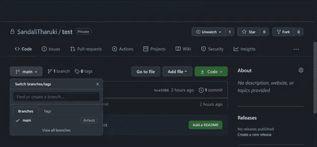**

**使用 GitHub 创建分支**

# **提交更改**

**本地更改可以保存为远程存储库中的提交。必要时，可以轻松跟踪对项目文件所做的更改。我最喜欢的是，如果你不知何故丢失了你的项目代码，你可以再次备份它们，继续这个项目，而不用担心。**

**这里 Git 命令或 GitHub 都可以用来提交。**

****1。Git 命令****

```
git commit -m “write a commit message”
```

**总是试着写一些有意义的消息，在必要的时候，这些消息可以很容易地识别出你对项目文件所做的更改。**

****2。GitHub****

**当您向 repo 添加新文件时，这种方法非常方便。你可以直接添加新文件，只需点击右上角的“添加文件”。它将引导您进入下一步，在这一步中，更改可以保存为提交。**

**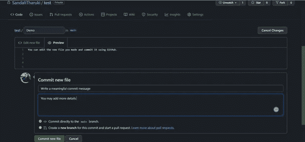**

**使用 GitHub 提交**

# **推**

**当我们需要将我们从本地回购所做的更改上传到远程回购时，我们可以使用 Git push。作为一种实践，Git push 在 Git 提交之后执行。常见的 Git 推送命令有:**

*   ****将本地回购的内容推送到远程回购的分支机构。****

```
git push origin <branch name>
```

*   ****将本地回购的内容推送给远程回购的总分行。****

```
git push origin master
```

**您还可以使用您喜欢的 IDE 来执行 Git push。**

# **取得**

**Git fetch 用于获取远程 repo 中新推送的提交，这些提交在您的 repo 中不可用。在继续 Git pull 和 merge 之前，我建议您使用 Git fetch 命令。它避免了可能在合并中调用的冲突。您可以根据自己的意愿继续执行 fetch 命令。现有案例如下。**

*   ****获取远程回购****

**借助下面的 Git 命令，可以获取整个 Git repo。**

```
git fetch <repo URL>
```

**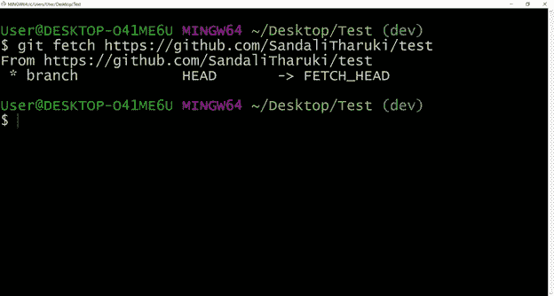**

**获取远程回购**

*   ****取一个分支****

**远程回购的特定分支可以提取。**

```
git fetch <branch URL> <branch name>
```

****

**拿一根树枝**

*   ****获取所有分支****

**在特定 repo 中创建的所有分支都可以使用下面的 Git 命令获取。**

```
git fetch — all
```

**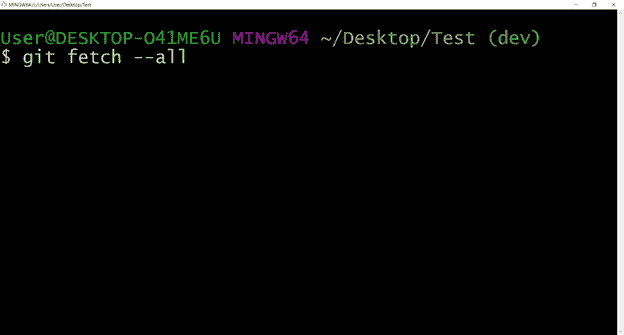**

**把所有的树枝都拿来**

*   ****同步本地回购****

**将本地存储库与远程存储库同步。**

```
git fetch origin
```

****

**同步本地回购**

**您还可以使用您喜欢的 IDE 来执行 Git fetch。**

# **拉**

**Git pull 用于用远程 repo 的更改来更新本地 repo。这里，远程回购的内容覆盖了本地回购的内容。继续 Git pull 时，可能会调用合并冲突。使用 Git pull 命令的常见情况是，**

*   ****默认命令****

```
git pull
```

*   ****从远程分支拉取****

```
git pull <branch URL> OR git pull origin <branch name>
```

*   ****从主分支拉动****

```
git pull origin master 
```

# **一对**

**PR 或 Pull Request 是另一个激励开发者使用 GitHub 的加分项，GitHub 在团队游戏中非常方便。打开 PR 您可以请求您的同事审阅您对项目文件的更改，并将它们合并到他们的分支或主分支。在这个步骤中，可以追踪代码之间的差异。虽然你可以打开一个 PR 并自己接受它，但我建议你在合并之前和你的队友讨论一下。**

**您可以使用 Git 命令、IDE 快捷键或 GitHub 来打开 PR。**

```
**git request-pull** [-p] <start> <url> [<end>]
```

****1。Git 命令****

*   **[-p] →包含合适的文本。(例如:-哪个版本)**
*   **<url>→包括要从中提取的回购 URL。</url>**
*   **<start>→包括开始提交。</start>**
*   **<end>→包括结束提交。</end>**

****2。GitHub****

**要使用 GitHub 打开采购申请，请单击顶部导航栏上的“拉式请求”,它会将您导向“新拉式请求”窗口。只需点击它。现在你必须选择正确的“基本分支”和“比较分支”。**

**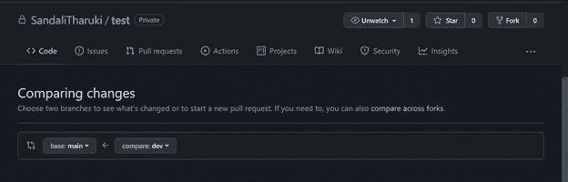**

**使用 GitHub 打开 PR**

# **合并**

**合并是 PR 的下一步。这里接受所做的更改。在接受代码之前，应该进行评审，如果你能和你的团队成员一起评审你所做的修改以避免不必要的争论，那就更好了。
和其他 Git 基础一样，合并也可以使用 Git 命令和 GitHub 来处理。**

****1。Git 命令****

**首先切换到分支，你需要合并到。**

```
git checkout branch_name
```

**然后打字，**

```
git merge branch_name
```

**branch_name 是您需要合并的分支。**

****2。GitHub****

**在比较并打开一个 PR 后，您可以简单地点击“能够合并”并继续进行合并。只有当分支没有冲突时，才允许合并。如果路径清晰，您只需点击“合并拉取请求”即可。然后，您将进入确认窗口，在这里您可以确认合并。**

**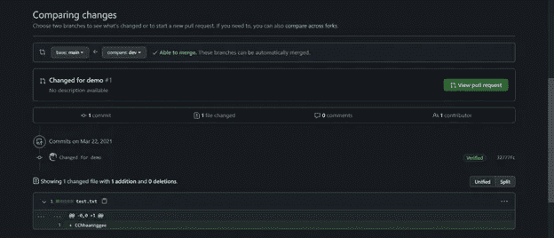**

**第一步**

**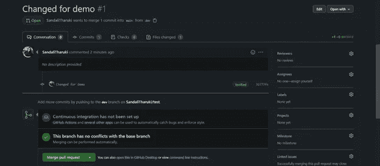**

**第二步**

**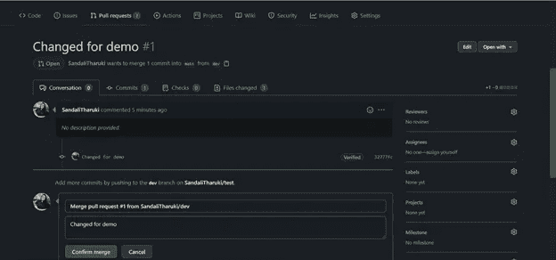**

**确认合并**

**进行 Git 合并时可能会引发冲突。我想在我的 Git 教程系列的未来文章中讨论它。**

***优秀。您刚刚学习了作为新手应该知道的所有 Git 基础知识。给自己一个鼓励。***

**关于 Git 的第一篇教程到此结束。希望这能对你有所帮助。**

***谢谢！！！***