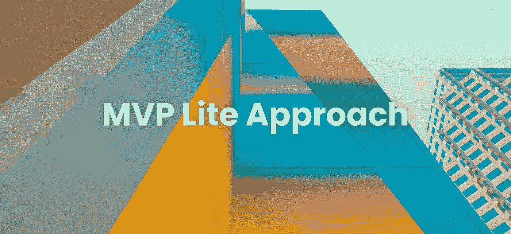
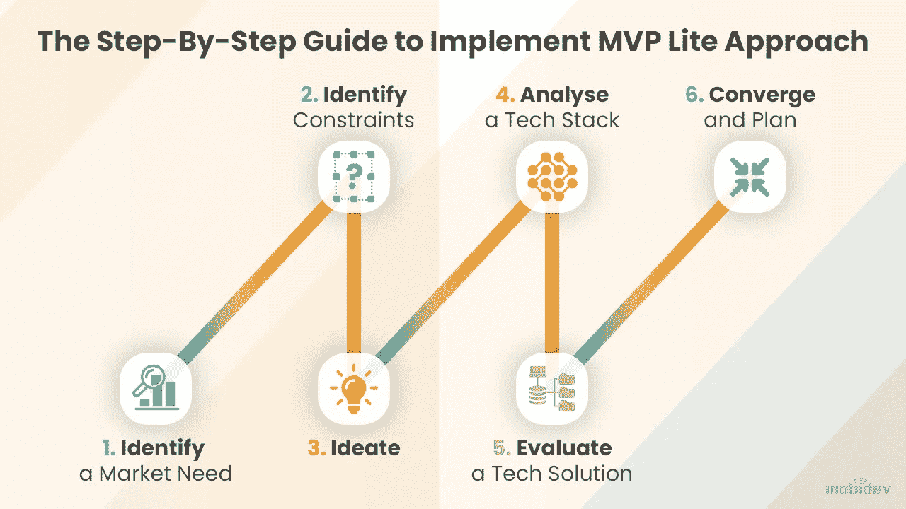

# MVP Lite:软件开发方法的再工程

> 原文：<https://medium.com/nerd-for-tech/mvp-lite-re-engineering-of-software-development-approaches-4a12a376193c?source=collection_archive---------19----------------------->

Clark Van Der Beken 在 [Unsplash](https://unsplash.com/@snaps_by_clark?utm_source=unsplash&utm_medium=referral&utm_content=creditCopyText) 上拍摄的照片

是什么帮助人们克服障碍？克服障碍是一项艰苦的工作。这需要大量的计划、时间管理、内心的激情以及对自己目标的透彻理解。

心中没有目标，就很难深入挖掘并向前推进。当你有一个明确的目标，并确切知道如何实现它时，愿景就变得非常重要。纪律，结合管理方法，可以帮助你在不确定时期克服障碍。

乔和林是两个儿时的伙伴，他们在纽约拥有一家中型企业。虽然他们不专门研究 IT，但他们在这个领域非常精通。

当世界已经被封锁的时候我们联系上了。和他们开玩笑很有趣，比如说:“祝你生活在有趣的时代。”

这句话让我很好奇。

林后来告诉我，这句话的意思是，“宁做太平狗，不做乱世人。”这句话很有说服力，它充分描述了我们为什么会想到使用 MVP Lite 来创建软件产品。

MVP Lite 是一种类似敏捷的方法，我们在这些“有趣的时代”开始在 MobiDev 使用。这种方法结合了 MVP、POC、原型和其他几种技术和管理解决方案，以降低预算成本和缩短上市时间。

约翰和林找到了发布软件产品的方法。但这并不意味着这是一个完美的过程。早期，确定了两个关键问题。

他们不想把所有的鸡蛋放在一个篮子里，简单地说，这意味着他们想降低风险。它移动得很快，对于初创公司来说，任何事情都可能在任何时候发生变化。

我们决定专注于确定用户需求、技术的可能性和用例，以及我们的业务目标。林和约翰已经非常了解他们的市场，因此很容易确定他们的关键价值主张。在有限的预算和时间内，我们专注于创建一个有意义的功能列表，并调整了技术堆栈。

这个项目是独一无二的，因为产品所有者和工程团队同时影响着业务目标、用户场景和技术选择。基于由此产生的技术选择，一些业务目标被简化以关注核心任务。

我们的结果如下:

**预 Covid 定制方法**

***时间线*** : 5 个月

预算:55 000 美元

***技术方案:*** 定制设计，移动开发，后端从头开始

**MVP 精简版方法**

***时间线*** : 2.5 个月

预算:23 000 美元

***技术方案:*** 素材设计组件，面向跨平台开发的 Flutter，面向后端的 CMS

基于我们的业务需求，我们为一家服装零售公司创建了一个跨平台的移动应用程序。我们决定使用模板设计和现成的解决方案来加速开发，将我们的预计时间缩短了一半，成本降低了 58%。

# 实现 MVP Lite 方法的分步指南

遵循这些步骤将有助于您识别功能并确定其优先级。它将向您展示如何使用 MVP Lite 方法自信地向市场发布软件产品。

# 第一步:确定市场需求

这一切都始于简单的市场调查。确定市场上是否需要你的软件。需求可以是组织性的，也可以是基于解决当前差距的客户反馈。

确定需求的一种方法是分析竞争对手在做什么，并确定如何让你的产品与众不同。您可以通过以下方式做到这一点:

*   研究市场并提出产品建议
*   识别关键值
*   创建高级功能集和用例

文章[“业务分析可交付成果列表软件开发”](https://mobidev.biz/blog/business-analysis-deliverables-list-software-development)更详细地探讨了需求分析方法。

# 步骤 2:确定约束条件

约束听起来像一个否定词，但在这种情况下，它不是。其实是好事。

现在你在想:约束怎么可能是好的？

在产品开发中，如果实施了充分的规划，约束有助于创造者超越竞争对手。请记住，每个约束都带来了创新的机会，这将导致更智能的开发和更具功能性的产品。

这些都是产品开发的双赢。您可以通过以下方式做到这一点:

*   确定关键指标
*   选择是忽略还是包含指标
*   区分项目限制

# 第三步:胸怀大志

收集了关于市场需求和限制的基本信息后，下一步是什么？是时候考虑大事了。我们建议遵循以下步骤:

*   将想法形式化为高级功能集和用例
*   定义你的范围
*   定义功能性和非功能性需求和特性
*   线框和原型你的想法

文章[“UI/UX 设计阶段交付成果清单”](https://mobidev.biz/blog/business-analysis-deliverables-list-software-development?utm_source=pdf&utm_medium=pdf-mvp-lite&utm_campaign=ui-ux-deliverables)探讨了产品负责人应该重点完成的 UX/UI 设计交付成果。

# 第四步:分析技术组合

技术栈是一组工具和技术，您可以使用它们来构建和部署您的软件产品。技术栈是第三方解决方案、库、软件工程工具、框架和编程语言的组合。

使用堆栈的主要好处是能够使用现成的组件，实现起来比定制的软件解决方案更快。定制解决方案很棒，但是使用它们会导致开发时间和预算的增加。

MVP Lite 更侧重于现成的组件，以确保以更低的预算更快地推出产品。这种方法可以帮助您:

*   为每个功能定义备选设计解决方案
*   定义“包装”的替代设计方案
*   收集每个软件解决方案的所有技术优势和风险

# 第五步:评估技术解决方案

下一步是评估你的解决方案。您应该将技术解决方案的商业价值与其开发工作和技术限制进行比较。

通过评估您的技术解决方案，您可以按范围限制功能或调整它们以适应您的参数。请记住，您的开发团队也会影响解决方案的范围，因为您的团队为您的项目提供了大量的技术知识和经验。你应该向他们咨询，因为他们是主题专家，他们可以帮助你有效地评估你的技术解决方案。

让您的开发团队提供改进产品的建议。如果他们提出的建议超出了你的产品需求，那也没关系。通过调整项目的范围，你将创造出更好的产品。

在你的项目中工作的每个员工都可以提供有价值的见解，否则你可能会忽略这些见解。确保成功的最佳方式是:

*   选择合适的解决方案
*   评估每个解决方案对其他服务的依赖性
*   识别技术风险
*   强调相关现成或模板解决方案的局限性

# 第六步:融合和计划

到目前为止，一切都很顺利。还能做什么？是时候收敛和规划了。

确保您的产品范围和技术解决方案符合最初的项目限制和关键指标。即使在规划过程或整体过程中仍然存在一些不确定性，仍然有可能根据您的预算限制和交付时间表制定一个全面的路线图。

你可以这样做:

*   制定路线图
*   创建风险登记册
*   最终确定产品的范围和功能列表

当您需要发布或创建一个可以在有限的时间范围和预算内向投资者展示的软件产品时，这种方法是有价值的。它可以帮助吸引初始产品用户，显示指标(活跃、不活跃和吸引力)，标出市场利基，并从投资者那里获得有价值的反馈。

**MVP Lite 方法是由** [**MobiDev 团队**](https://mobidev.biz/our-team) 开发的。

由 MobiDev 项目经理团队负责人 Anna Karnaukh 撰写。

*全文最初发表于*[*https://mobidev . biz*](https://mobidev.biz/blog/mvp-lite-approach-software-development)*，基于 mobi dev 技术研究和提供软件开发服务的经验。*