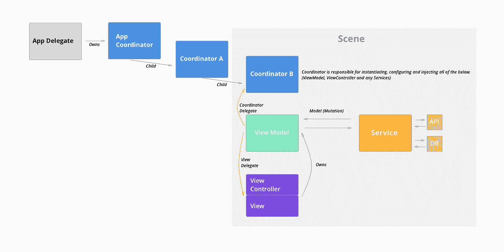
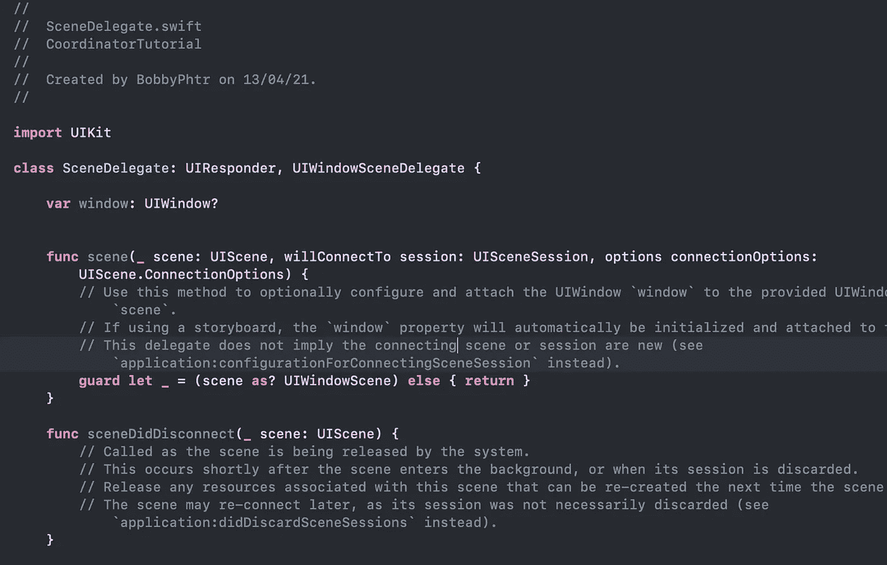
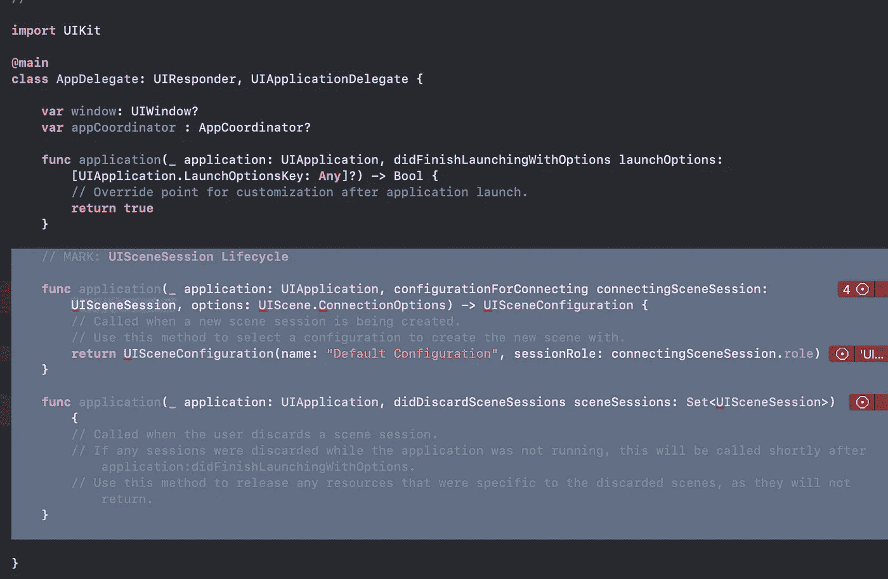
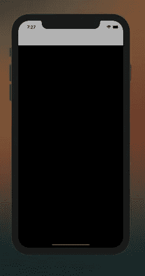
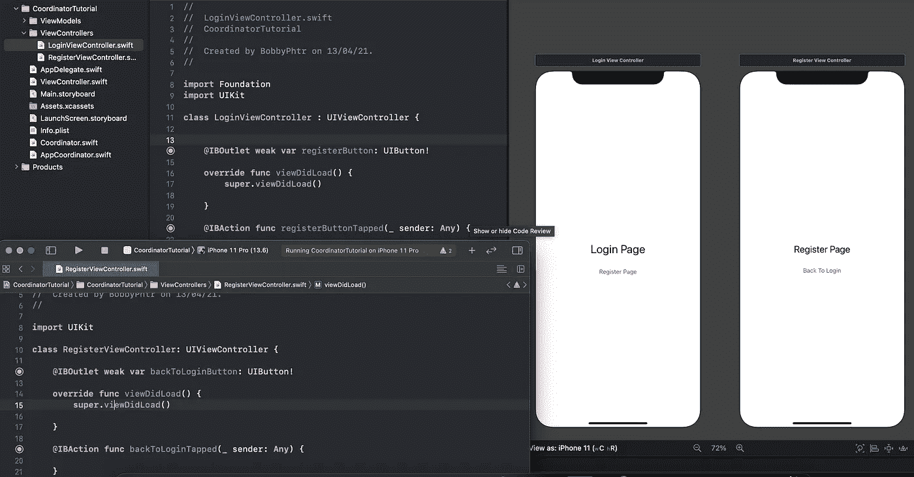
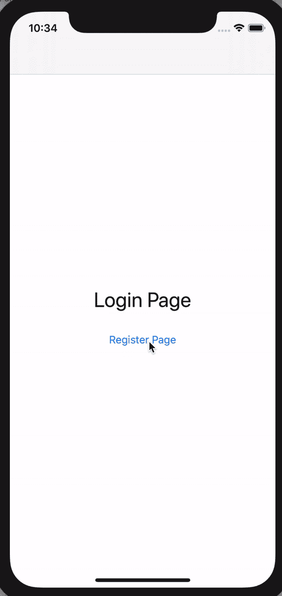

# MVVM+协调员 IOS 架构教程

> 原文：<https://medium.com/nerd-for-tech/mvvm-coordinators-ios-architecture-tutorial-fb27eaa36470?source=collection_archive---------0----------------------->

## 为初学者创建一个简单的 MVVM-C iOS 架构

# 介绍

在这篇文章中，我想分享我在项目和工作中使用的架构。这篇文章也将作为我自己的文档，这样我就知道我对这个架构了解了多少。

我将首先解释什么是 MVVM 和协调器，以及如何实现它的一些片段。

很抱歉我糟糕的英语语法，因为这是我的第一篇文章😅😅。如果有我可以改进的地方，或者有任何更正，请随时纠正我！作为一名开发人员是一个漫长的学习过程，对吗？😁


波格丹一世·卡伦科在 [Unsplash](https://unsplash.com?utm_source=medium&utm_medium=referral) 上的照片

# MVVM

模型-视图-视图模型或 MVVM 架构在 IOS 开发中非常流行。它已经在工业中使用了一段时间。随着 Swift UI (Declarative UI)的出现，这种架构将成为该行业 IOS 开发者的必备。

MVVM 在划分业务和 UI 逻辑方面做得很好。它解决了巨大的视图控制器问题。如果你有使用 MVC 的经验。但是，您可以通过将**导航**代码分离到其他文件来进一步缩小视图控制器。我所指的导航代码是:

```
navigationController?.pushViewController(vc, animated: true)
navigationController?.presentViewController(vc, animated: true)
```

但是为什么呢？它只包含 1-2 行代码，当然没关系，对吗？

它可能不会有助于划分视图控制器。但是这违背了**固原则**尤其是**单责任。如果你想了解固体，这里有一篇带插图的好文章。如果你知道这些原则，这真的是一个优势，它会在你编码的时候拯救你的许多战友😆😆。**

[](/backticks-tildes/the-s-o-l-i-d-principles-in-pictures-b34ce2f1e898) [## 照片中的神盾局原则

### 如果你熟悉面向对象编程，那么你可能听说过坚实的原则。

medium.com](/backticks-tildes/the-s-o-l-i-d-principles-in-pictures-b34ce2f1e898) 

那么，我们把导航相关的代码放在哪里呢？是的，**协调人**。


照片由[布伦丹·丘奇](https://unsplash.com/@bdchu614?utm_source=medium&utm_medium=referral)在 [Unsplash](https://unsplash.com?utm_source=medium&utm_medium=referral) 上拍摄

# 协调者

就我使用协调员而言，我会将协调员视为旅行向导。他们知道去哪里，知道 T2 需要什么。如果你想洗澡，他们知道你必须去一个叫**浴室**的地方，他们会为你提供**毛巾、肥皂或洗发水**。

在我的情况下，协调员的工作是创建所有需要的依赖关系。例如，它创建了**视图控制器**和**视图模型**。协调器**将视图模型传递**到视图控制器。协调者还负责实例化一个 API 服务，或任何其他服务，并根据需要将它注入视图模型或视图控制器。

**短插画**:你(ViewController)要去上学，你妈妈(Coordinator)叫醒你(init ViewController)，准备你的午餐(dependencies/services)把你的作业(dependencies/services)放在你的背包里(viewModel)。她把背包(viewModel)放在你的背上。送你去上学。

在 Swift 中，像这样:

```
**func** goToLogin() {
    **let** vc = LoginViewController.instantiate(from: authStoryboard)
    **let** vm = LoginViewModel()
    vm.apiClient = authApi
    vm.authCoordinator = **self** vc.viewModel = vm
    navigationController.setViewControllers([vc], animated: **true**)
}
```

我已经解释了使用协调器的概念。但是如何创建一个并实现到项目中呢？



MVVM + C 架构，作者:[丹尼尔·洛萨诺·巴尔德斯](/@danlozanov?source=post_page-----815204248518--------------------------------)。看看他的博客。他对这个架构有很深很全面的教程，我按照他的指导学过一次！很有帮助！

[](/sudo-by-icalia-labs/ios-architecture-mvvm-c-introduction-1-6-815204248518) [## iOS 架构:MVVM-C，简介(1/6)

### 介绍

(1/6)Introductionmedium.com](/sudo-by-icalia-labs/ios-architecture-mvvm-c-introduction-1-6-815204248518) 

# 履行

## 步骤 1:建立协调者基础

创建一个 ios 应用 xcode 项目后，让我们创建一个**应用协调器**。这将是以后你的应用程序的重要组成部分。

```
**protocol** Coordinator { **var** parentCoordinator: Coordinator? { **get** **set** }
    **var** children: [Coordinator] { **get** **set** }
    **var** navigationController : UINavigationController { **get** **set** }

    **func** start()
}
```

您可以随意使用**类**或**协议**。它将作为应用程序中每个协调者的基础模板。

然后让我们创建 **AppCoordinator** 。

```
**class** AppCoordinator: Coordinator {
    **var** parentCoordinator: Coordinator?
    **var** children: [Coordinator] = []
    **var** navigationController: UINavigationController **init**(navCon : UINavigationController) {
        **self**.navigationController = navCon
    } **func** start() {
        print("App Coordinator Start")
    }}
```

**开始**()？开始将包含应用程序中的第一个操作或流程。我们稍后将回到它。

## 步骤 2:删除 SceneDelegate 并设置 AppDelegate。

转到 **AppDelegate** 并创建自己的**窗口。**为什么？ **AppCoordinator** 需要作为您的应用程序的全局协调器父级，因此我们需要与 AppCoordinator **一起启动应用程序**。为此，我们必须通过持有自己的窗口来“定制”应用程序本身的初始化。至于 IOS 13，有**场景代表**有我们的窗口变量。



SceneDelegate.swift，是苹果从 IOS 13 开始添加的，支持 Swift UI。

让**删除 SceneDelegate** 并**创建我们自己的窗口变量。**也别忘了去掉`info.plist`中的`ApplicationSceneManifest`。我还将我的 IOS 开发目标**设定为 12.0，这样它就可以支持更早的 iOS。**



AppDelegate.swift，如果你的目标是早于 iOS 13 的开发，我建议你删除所有与场景相关的功能，因为这将导致早期设备的问题。(如果可以的话，你可以使用。)

然后在`didFinishLaunchingWithOptions`里面让我们创建我们的窗口和 AppCoordinator！

```
**class** AppDelegate: UIResponder, UIApplicationDelegate {
    **var** window: UIWindow?
    **var** appCoordinator : AppCoordinator? **func** application(**_** application: UIApplication, didFinishLaunchingWithOptions launchOptions: [UIApplication.LaunchOptionsKey: **Any**]?) -> Bool {
        // Override point for customization after application launch.
         window = UIWindow(frame: UIScreen.main.bounds) **let** navigationCon = UINavigationController.init()
         appCoordinator = AppCoordinator(navigationController: navigationCon)
         appCoordinator!.start() window!.rootViewController = navigationCon
         window!.makeKeyAndVisible()
         **return** **true** }
}
```

当你运行它的时候，它会产生这个。



一个空的`UINavigationController`，你应该会看到`Start The App!`印在控制台上。这意味着，您的应用程序现在开始与 AppCoordinator！

## 步骤 3:协调员的工具

如你所见。空的。您仍然拥有设置了 initialViewControllers 的`Main.storyboard`。但是为什么不管用呢？因为我们给了**窗口一个值**。在这里阅读[你想知道 AppDelegate 是如何工作的。](https://stackoverflow.com/questions/16445709/in-an-appdelegate-how-is-the-main-uiwindow-instantiated)

## 关于故事板

如果您使用协调器和故事板，那么就不再使用片段和初始视图控制器，因为协调器是负责在 VC 之间导航和传输数据的人。在我看来，当我使用协调者时，我将**故事板视为许多风投**的容器。它只对**分组视图控制器**和自动布局有帮助。**该架构中未使用连接或分段，因为该角色属于协调者**。

我真的建议在大型项目中使用许多故事板。它帮助你的团队查看控制器，并使我们的项目结构更整洁！如果你想让我分享这一点，请随意评论！😁😁

现在，只要你在你的`Main.storyboards`上设置了`Main Interface`(通用- >部署信息)，它仍然可以正常工作。

让我们给我们的`AppCoordinator`增加一些功能。

```
**class** AppCoordinator : Coordinator { **var** parentCoordinator: Coordinator?
    **var** children: [Coordinator] = []
    **var** navigationController: UINavigationController **init**(navigationController : UINavigationController) {
        **self**.navigationController = navigationController
    } **func** start() {
         // The first time this coordinator started, is to launch login page.
    goToLoginPage()
    }

    **let** storyboard = UIStoryboard.init(name: "Main", bundle: .main) **func** goToLoginPage(){ // Instantiate LoginViewController
         **let** loginViewController = storyboard.instantiateViewController(withIdentifier: "LoginViewController") **as**! LoginViewController // Instantiate LoginViewModel
         **let** loginViewModel = LoginViewModel.init() // Set the Coordinator to the ViewModel
         loginViewModel.appCoordinator = **self** // Set the ViewModel to ViewController        
         loginViewController.viewModel = loginViewModel // Push it.
        navigationController.pushViewController(loginViewController, animated: **true**) } **func** goToRegisterPage(){
        **let** registerViewController = storyboard.instantiateViewController(withIdentifier: "RegisterViewController") **as**! RegisterViewController
        **let** registerViewModel = RegisterViewModel.init()
        registerViewModel.appCoordinator = **self** registerViewController.viewModel = registerViewModel
         navigationController.pushViewController(registerViewController, animated: **true**)
    }}
```

如您所见，这些函数的目的仅在于使用 UINavigationController 进行注入和导航。它包括 ApiServices，甚至是作用于 2 个以上 ViewControllers 的 ViewModels。要传递数据，你只需**将参数**添加到函数中，并将其注入下一个 VC 或 VM。

## 步骤 4:用视图模型显示 UIViewControllers

我已经创建了 2 个非常简单的 ViewControllers，并将其作为 IBOutlet 连接到我们的故事板。



LoginViewController 和 RegisterViewController

让我们为每个视图控制器创建视图模型。这里的 LoginViewModel 只包含一个要求协调者转到注册页面的函数。它与 RegisterViewModel 相同。

```
**import** Foundation
**class** LoginViewModel {
    **weak** **var** coordinator : AppCoordinator!

    **func** goToRegister(){
        coordinator.goToRegisterPage()
    }
}**class** RegisterViewModel {
    **weak** **var** appCoordinator : AppCoordinator!
    **func** goToLogin(){
        appCoordinator.goToLoginPage()
    }
}
```

这是两个视图控制器。

```
**class** LoginViewController : UIViewController {
    **var** viewModel : LoginViewModel!
    **@IBOutlet** **weak** **var** registerButton: UIButton! **override** **func** viewDidLoad() {
        **super**.viewDidLoad()
    } **@IBAction** **func** registerButtonTapped(**_** sender: **Any**) {
        viewModel.goToRegister()
     }
}**class** RegisterViewController: UIViewController {
    **var** viewModel : RegisterViewModel!
    **@IBOutlet** **weak** **var** backToLoginButton: UIButton!

    **override** **func** viewDidLoad() {
        **super**.viewDidLoad()
    } **@IBAction** **func** backToLoginTapped(**_** sender: **Any**) {
        viewModel.goToLogin()
    }
}
```

如您所见，现在 viewControllers 可以专注于视图相关的操作。因为导航过程被转移到协调器。

# 结果呢



简单的协调员应用程序

现在，一款可扩展的应用就在您的掌握之中！

# 其他主题

所以…如果所有的导航代码都转移到 AppCoordinator，AppCoordinator 会变成 HugeAppCoordinator 吗？这取决于你如何使用它。但是没有。

协调员可以有许多**子协调员。**

儿童协调员帮助分组导航代码。例如，如果您想要捆绑与身份验证相关的页面，您可以创建 AuthCoordinator 来处理登录、注册、PIN 或 OTP 以及更改 PIN。对于 HomeCoordinator 可能包含一个主页、个人资料页或历史记录页。这取决于你的项目要求和你的管理风格。

我将在另一个主题中谈论儿童协调员。但是如果你等不及了，你可以看看我下面列出的参考资料！

后退按钮和内存管理也是有趣的话题。但这是一个在另一个时间谈论的故事。

# 推荐参考

*   **立体原理附插图:**[https://medium . com/backticks-tildes/the-s-o-l-I-d-Principles-in-pictures-b 34 ce 2 f1 e 898](/backticks-tildes/the-s-o-l-i-d-principles-in-pictures-b34ce2f1e898)
*   **MVVM + C 教程:**[https://medium . com/sudo-by-ICA lia-labs/IOs-architecture-mvvm-C-introduction-1-6-815204248518](/sudo-by-icalia-labs/ios-architecture-mvvm-c-introduction-1-6-815204248518)

我希望这篇文章对你有所帮助，抱歉我的英语语法不好。如果有任何更正或不足之处，我会很高兴地调查它！

祝大家身体健康，吃好！🍫🍲

# 改进和更新

嘿，好久不见了…我有点忙，度过了艰难的几个月。但不管怎样，我还是设法把项目放到了 Github 上！下面是查看的链接！。已经有一些变化了，但是概念还是一样的！

[](https://github.com/Bobbyphtr/CoordinatorTutorial) [## Bobbyphtr/CoordinatorTutorial

### 在 GitHub 上创建一个帐户，为 Bobbyphtr/CoordinatorTutorial 开发做贡献。

github.com](https://github.com/Bobbyphtr/CoordinatorTutorial) 

所以我读了 Russ Warwick 的一个非常有用的回应，他把所有的哑函数放在一个协议(接口)中，并把它实现给协调器，而不是在视图模型中传递协调器实例。

所以我添加了`LoginNavigation`协议。这样，ViewModel 对协调器一无所知。这是一种更简洁的编码方式，因此可以很容易地修改协调器。

请随时纠正我的代码，每一个输入都可以为未来带来更好的代码！