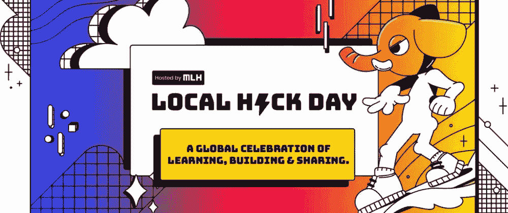
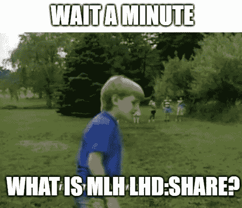

# 我在黑客社区的第一次经历| MLH 本地黑客日:分享

> 原文：<https://medium.com/nerd-for-tech/my-1st-experience-in-the-hacker-community-mlh-local-hack-day-share-e9706799498f?source=collection_archive---------16----------------------->

美国黑客大联盟(Major League Hacking)，官方缩写为 **MLH** ，是一家运营学生黑客马拉松联盟的公司。由前开发者福音传道者 Mike Swift(前 SendGrid)和 Jonathan Gottfried(前 twilio)于 2013 年创立，主要联盟黑客最初为学生运营的大学黑客马拉松提供支持。

**本地黑客日:分享**是一个为期一周的庆祝活动，分享你作为一名黑客所学到的一切。你将花一周时间完成技术、设计和社交挑战来赢取分数。从初学者友好型到黑客马拉松专家，每个技能水平都有挑战。除了挑战，他们还有“现场会议”供您观看。在这些会议中，你将加入一个 MLHer，他们会在你进行中与你一起完成一项挑战。他们将指导您注册、完成挑战并正确提交。你征服的挑战越多，你赢得的积分就越多。每天收听，查看排行榜，分享您的成就。

# 我是谁以及我的经历？

**大家好！！**

这是阿曼·乔普拉。一个程序员，一个开发者，一个导师。我是一名 Web 开发人员(React)，Java 爱好者，云(AWS)和 DevOps 工程师。
目前正在攻读“计算机科学与技术”专业的工程学位。

这是我第一次在 MLH 体验 LHD : Share。为期一周的挑战，我参加了许多有趣的学习活动，无论是来自技术，设计，社会挑战或参加现场会议和建设项目。

在整个旅程中，我从导师、队友和其他参与者那里学到了很多。

我们一起完成了很多项目，也做了一些有趣的提交作品，比如:

1.  制作我自己形象的头像/卡通
2.  与朋友分享咖啡，点击图片
3.  设计
4.  向他人传授新技能
5.  了解区块链等

参加这个黑客社区 MLH LHD : SHARE 是我做过的最好的决定之一。在这一周的旅程中，我学到了很多新东西，并与一些非常棒的人建立了新的联系，我相信这是有史以来最好的事情。

因此，如果有人正在阅读这篇文章，如果你也参加了这个最令人兴奋的为期一周的学习挑战，请在评论区与我分享你的经验，或者如果你对这个 MLH 完全陌生，我的朋友，现在就去吧，然后回来分享你的精彩经历。

请务必与我联系👇👇

1.商务化人际关系网

[https://www.linkedin.com/in/aman-chopra-375a81171](https://www.linkedin.com/in/aman-chopra-375a81171)

2.推特

[https://twitter.com/iam_chopra_aman?s=09](https://twitter.com/iam_chopra_aman?s=09)