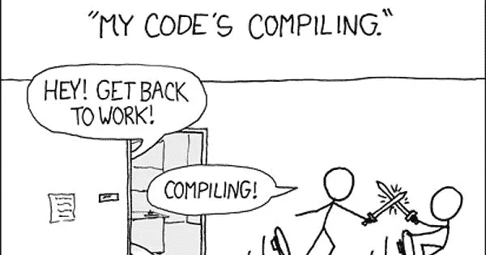

# 我的 CS 笔记本

> 原文：<https://medium.com/nerd-for-tech/my-cs-notebook-5e72e4caadba?source=collection_archive---------15----------------------->

xkcd

编码、软件工程、争论数据——无论 CS 涵盖了什么——都可能是同义词库的游戏。

我从四个方面学到了我的技能:

(1)靠我自己

(2)在学术界

(2)通过教学

(3)通过工作

我对这个数字世界有相当多的了解，但我并不总是最擅长说出定义所附带的术语。

我发现我的很多知识都是隐性的，更多的是由经验和好奇心驱动，而不是参考术语。但有一段时间，我需要知道行话。这一次，简单多了。

不管怎样，我整理了几篇文章。每一个点都指向这一页(你可以把这想象成一本书的索引)。

**请注意:**

(a)使用了大量资源，例如，一些 JavaScript 代码取自 CSS Tricks(他们恰好有最好的闭包示例)；图像来自不同的地方，没有必要重新创建堆叠图的轮子

(b)想法是涵盖“热门话题”,并在坚持严格定义的同时，将想法整合成一些小东西

(c)这是不完整的，或者详细到足以成为“快速学习 cs”；这是为从事这方面工作的人准备的。

(d)最后，如果您看到了错误或遗漏的内容，请发表评论！

**榜单:**

1.  [OOP](https://bowenbrinegar.medium.com/oop-cs-documentation-series-65b6260fe295)
2.  [数据结构](https://bowenbrinegar.medium.com/data-structures-cs-documentation-series-69b92c2eadb)
3.  [算法](https://bowenbrinegar.medium.com/algos-big-o-cs-document-series-a9615393bb83)
4.  [MySQL](https://bowenbrinegar.medium.com/mysql-cs-documentation-series-2070ed7d97fb)
5.  [JavaScript](https://bowenbrinegar.medium.com/javascript-cs-documentation-series-1781c438f7fa)
6.  [Python](https://bowenbrinegar.medium.com/python-cs-documentation-series-b714c0d8d0e1)
7.  [更多](https://bowenbrinegar.medium.com/other-cs-documentation-series-69f01aea911c)

**备注:**

(a)你可以强有力地证明任何数字都是由 1、2、3、4 和 7 构成的

(b) 4 因为 MySQL 是 O.G .数据库之一，并引入了创建动态 I/O 机制来存储大型复杂数据结构的思想

(c) 5、6 之所以上榜，是因为它们展示了从低级语言衍生出来的两种非常流行的语言

*更改日志*

*   03/24/2021 —更新为*其他*；在 Hadoop 部分添加了额外的内容。

*享受阅读？*

*留下掌声或评论*

*与朋友分享或在你最喜欢的社交平台上分享*