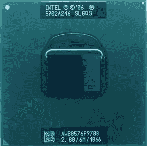
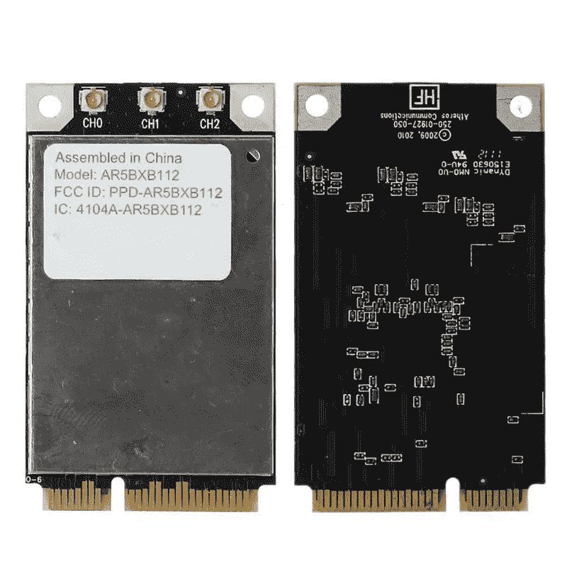
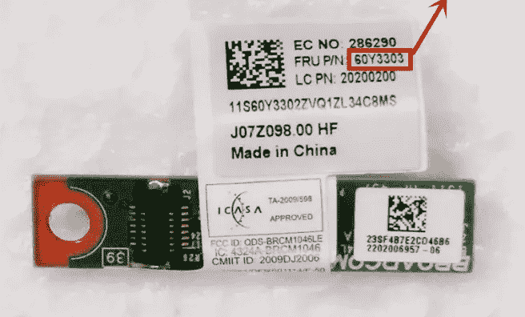
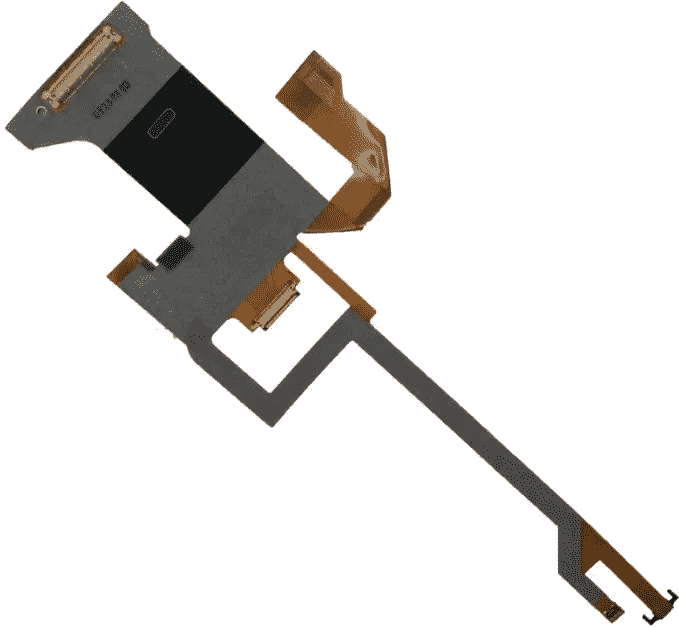
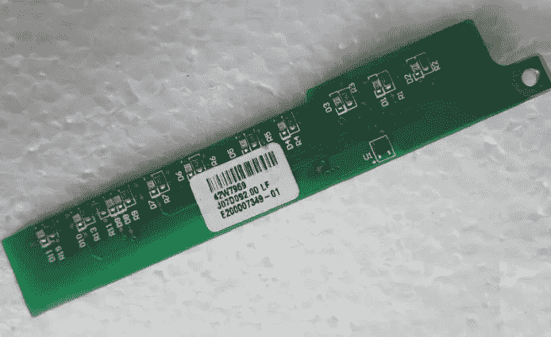
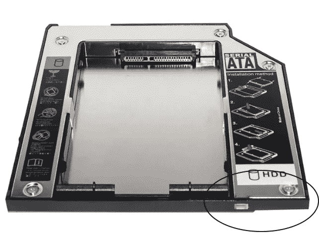
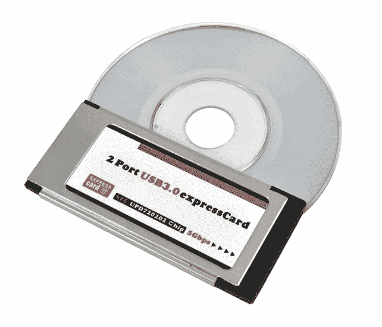
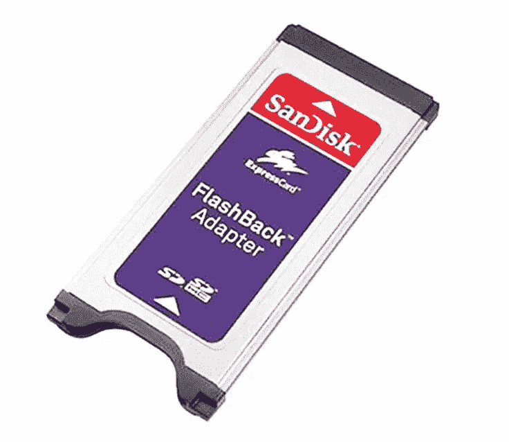
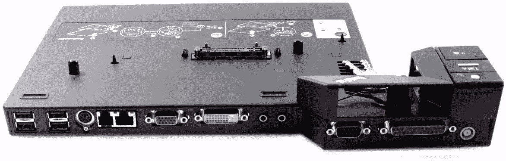
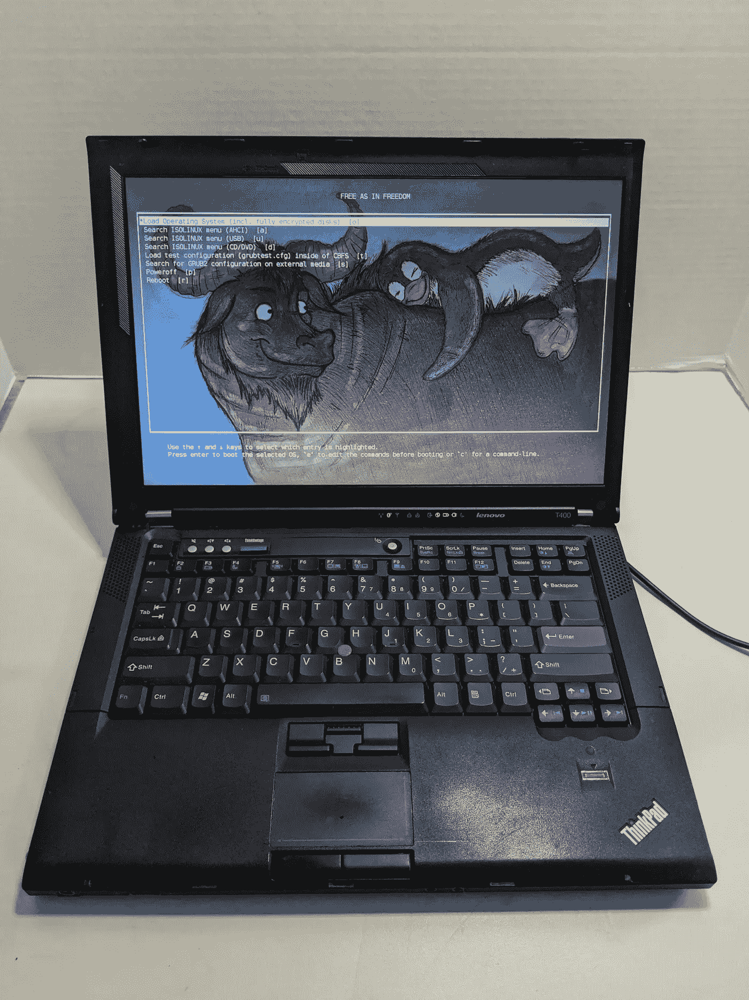

# 我的日常用机 Thinkpad T400

> 原文：<https://medium.com/nerd-for-tech/my-daily-machine-thinkpad-t400-ce95237fbb90?source=collection_archive---------0----------------------->

2005 年，联想收购了 IBM 的个人电脑部门。

直到 T60 型号，联想保留了 IBM 的标志，但机器已经在中国制造。

下一个型号 T61 是第一个去掉 IBM logo 的型号，取而代之的是开始使用 Thinkpad 的 logo，但在我看来，他们是害羞地这么做了。

2008 年 8 月，联想发布了 T400 型号，这是传说中的 T4XX 系列的第一款。在这种模式下，联想采取完全控制，在盖子上使用他们的标志。

我首先要提到的是这个网站，因为我在我的机器上做的所有主要改变都是基于这篇文章。**感谢**麦克唐纳科技公司:

 [## ThinkPad T400

### 功能包括镁合金防滚架、带 TrackPoint 的 7 排键盘和联想 UltraBay。14.1 英寸的……

mcdojf.wixsite.com](https://mcdojf.wixsite.com/t400) 

所有规格:

 [## 类别:T400

### 本页概述了 ThinkPad T400。

www.thinkwiki.org](https://www.thinkwiki.org/wiki/Category:T400) 

当我购买 T400 时，我立即用固态硬盘替换了旧的硬盘，放入了 2 个内存 4GB DDR 3–12800(双通道),并将 P8400 CPU (2.26GHz，3MB 高速缓存，25W TDP)换成了 P9700(2.8GHz，6MB 高速缓存，28W TDP)

英特尔酷睿 2 双核处理器 P9700

之前，你需要安装最新版本的 BIOS (3.24 或 3.25)和修改版本的白名单。这将允许您更换 WiFi 卡和蓝牙子卡。

我用 Atheros AR5BXB112 AR9380 (a/g/n)替换了英特尔 WiFi Link 5100 (a/g/n ),获得了令人难以置信的网速差异(约 40mbps 对约 300mbps，在同一地点用 [speedtest](http://speedtest.net) 测量)。Atheros 卡可以与免费的驱动程序和固件完美配合。[https://www . Reddit . com/r/libre boot/comments/BDR lwe/best _ wifi _ card _ for _ a _ t400/](https://www.reddit.com/r/libreboot/comments/bdrlwe/best_wifi_card_for_a_t400/)

Atheros AR5BXB112 AR9380(不适用)

对于蓝牙子卡，我按照麦道指南从蓝牙 2.2 升级到蓝牙 4.0 (60Y3303)。

蓝牙子卡

我做过的最昂贵的修改，是用 1440x900 的 LED 屏幕(LTN141BT04)替换了 1280x800 的 CCFL 屏幕。[https://www . panel ook . com/ltn 141 bt04-002 _ Samsung _ 14.1 _ LCM _ overview _ 24142 . html](https://www.panelook.com/LTN141BT04-002_Samsung_14.1_LCM_overview_24142.html)

你必须知道，除了购买新屏幕，你还需要一条新的 LED 屏幕电缆和一个新的逆变器(LED 指示灯)。只需在 LCD 电缆中搜索 LED (PN: 93P4592)和 LED 逆变器(42W7949)。

液晶显示器电缆(部件号:93P4592)

LED 逆变器(42W7949)

我为第二个 SSD 添加了一个盒子来代替我的 Multi DVD 读卡器，但你必须专门寻找一个适合 Optibay 的型号。

小盒子

这个型号只有 USB 2.0，没有 SD 卡插槽。

没问题，我订购了两张快递卡来解决这个问题。一个用于 USB 3.0，另一个用于读取 SD 卡。

2 端口 USB 3.0

SD 读卡器

我使用联想 ThinkPad 高级迷你坞站端口复制器(250410U)来连接我的 2 个屏幕和我的 PS/2 键盘。

迷你坞站(250410U)

对于 GNU/Linux 用户，你可以做 libre boot([https://libreboot.org/](https://libreboot.org/))。其实 T400 和 T400s 是最后接受这个 BIOS mod 的 Thinkpad 机型。

自由是指自由

我不做 Libreboot，因为我有双靴子。在我的主 SSD Debian 11(用于工作)，以及在我的另一个 SSD Windows 10(用于玩游戏)。当你使用 Libreboot 时，你不能在 Libre 系统上运行 Windows。

在下一期出版物中，我将向您展示我是如何使用 eGPU(外置 GPU)在这台机器上成功玩游戏的。

希望有用！