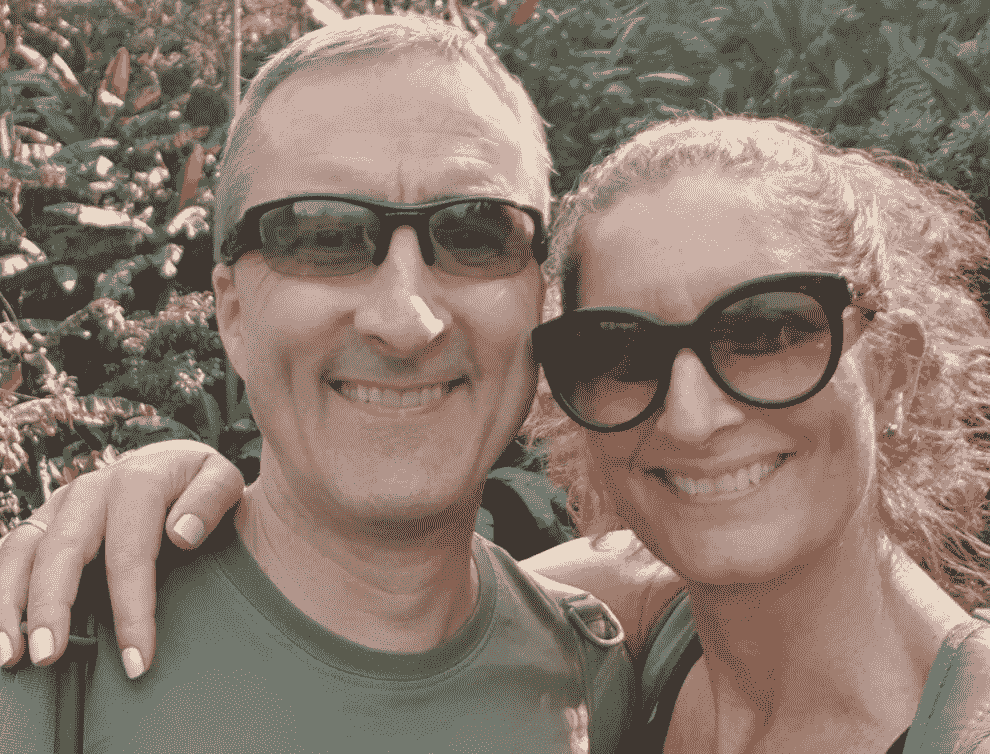

# 我的开发者成功故事

> 原文：<https://medium.com/nerd-for-tech/my-developer-success-story-400bdd49d222?source=collection_archive---------7----------------------->

## 在几个朋友和同事的鼓励下，我写了一些关于我作为一个“年轻”开发人员的非常积极的旅程。

永远选择最好的❤团队

2017 年末我决定转行。我想实现我的另一个梦想:成为一名软件开发员。

**巴塞罗纳——Ruby on Rails**

因此，2018 年 1 月，在我 53 岁的时候，我从瑞典出发前往西班牙巴塞罗那，与来自世界各地的 13 名男女一起参加 Ruby on Rails 全栈教育(字面意思！我们来自 13 个国家，从哥伦比亚到澳大利亚，以及介于两者之间的所有国家。

培训节奏很快，主要是动手操作，人员也很优秀。

**QuickPay — Angular**

6 个月后，一家占地面积很大的小公司联系了我。

位于丹麦奥尔胡斯的 Fin-tech 公司 QuickPay 为欧洲的电子商务行业提供所有可想到的在线支付解决方案。

我是开发面向客户的前端的团队的一员，必须快速学习 Angular、Typescript 和其他对我来说新的东西。仅仅一年后，我成为了主要的 Angular 开发人员，并且必须学习更多的新东西，主要是关于 CI/CD/DevOps。

在这种快节奏的个人发展中，我感觉很棒，除了工作之外，我还参加会议，参加课程，疯狂阅读，以跟上所有新技术，因为我对个人有很高的期望。

在过去的 1 年里，我已经自动化了 CI/CD 流程的大部分，同时试图“现代化”我们的 Angular 6 到 11 代码，并执行更严格的代码审查，以避免新的技术债务并根除一些旧债务。我想说，我们已经走过了漫长的道路，今天有一个杰出的产品。

**东南亚—数字游牧民族**

我在越南的“办公室”

因为我是远程工作，我和妻子选择了三个月的海上工作，我们大部分时间都在泰国的清迈和兰大岛度过。我们从一个合作空间跳到另一个可能的合作空间，遇到了许多有趣的人。在此期间，我们参观了泰国，新加坡，越南和其他地方。我们一周锻炼 6 次，在工作日努力工作，在周末进行伟大的冒险(和会议),并且一直吃健康美味的食物。我强烈建议成为一名数字流浪者，至少在较短的时间内，因为你可以真正地低着头完成一些工作——这很有趣，也很令人兴奋:)

今年早些时候，QuickPay 被卖给了一家德国公司 Unzer，这对 Angular 团队来说意味着我们必须快速、高效地冲刺，以适应新老板的需求。仅在几周内，我们就为 DACH 地区部署了一个全新的配置文件，其中包含几个新特性。远远超出了业主的预期。

这是一个伟大的团队，这些快速、高效的冲刺之所以成为可能，是因为非常高水平的动力和个人责任感。我一定会怀念这支队伍的。

**共识——新挑战**

新的职位、新的挑战和新的机遇值得我们举杯庆祝

今年 3 月，哥本哈根一家名为 Consensus 的科技公司找到了我，我将加入他们的 Angular 团队，成为他们成为独角兽之旅的一部分。我期待着在几周内加入我的新团队，迎接新的挑战。

**第四章？**

我作为 Angular 开发人员的新生活的第三章即将开始，我将继续推动自己前进，以确保也会有第四章——可能在共识范围内:)

**我的 2 值**

1.  如果你有梦想，那就去实现它吧！
2.  让你的家人加入进来——这是一个合资企业！
3.  有需要就求助！
4.  永远选择最适合你的团队！
5.  永远做到最好，带动团队前进！

记住:努力训练，轻松战斗！