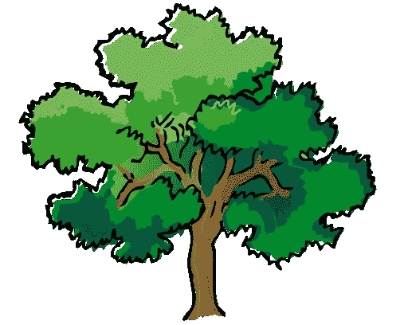

# 我用 ActiveRecord 宏进行自我参照关联的经验(家谱)

> 原文：<https://medium.com/nerd-for-tech/my-experience-with-activerecord-macros-for-self-referential-associations-family-tree-a0fc70faf506?source=collection_archive---------1----------------------->



使用 Ruby 和 ActiveRecord，我试图创建一个家谱的域模型。在这个过程中，我学到了一些新东西，*包括但不限于*:

*   “孝顺”是一个俏皮的小词，用来形容父母和孩子之间的关系。
*   这里**没有**俏皮的“lil”一词来表示中性版本的阿姨和叔叔！(像爸爸妈妈→父母；但是阿姨和叔叔→？？？)最后我用了“auntcles”这个词。
*   侄女和侄子也存在同样的问题，因此 zak 创造了另一个新词:“niephcews”。Gesundheit。是啊，我也不喜欢看到这个词，但要怪英语，而不是我。
*   如何拼写“Gesundheit”

好了，关于英语和德语已经说得够多了，回到另一种语言:Ruby。对此建模的一个挑战是 ***自我参照*** 的想法，这是我以前没有遇到过的。如果你不熟悉这个术语，这是一个时髦的面向对象编程(面向对象编程)词汇，指的是对象与同类对象之间的关系。所以，如果你对一辆卡车和它的许多轮子感到好奇，那种关系是*而不是*自我参照——卡车和轮子是*不同的东西。*但是一个人和另一个人(兄弟姐妹、同学/同学、老板/雇员、同事/同事、学生/老师等)之间的任何关系都是*自指*，因为这两个对象都属于*人*类型。

你可以通过创建一个老板类和一个雇员类来避免这种自我引用的想法，而不是使用 Person 和 Person。这在许多情况下可能会很有效…直到你有一个老板，他也为别人工作，你的员工现在是经理，现在老板有老板，员工有员工，员工是老板…你开始看到问题了。你的老师和学生班级工作得非常好，直到你的老师决定回去攻读第二个学位，现在是一名学生，同时还是一名教师。所以，当我们需要表现这些更健壮的情况，以及多个同时发生的关系时，我们需要让人们成为人，而不是仅仅由他们的一个关系来定义。

所以在我的家谱中，有各种各样的关系(父母/孩子、兄弟姐妹、婚姻等)，一个人的父母也是另一个人的孩子，你的兄弟姐妹也是某人的丈夫，等等。但是这些关系中的每一个都是两个 ***人*** 物*物*之间的*:于是**自指物**。*

好了，我们现在明白了自我指涉的概念。但是为什么自我参照的场景比非自我参照的场景更难编程呢？我遇到的困难是在 ActiveRecord 中设置宏来恰当地模拟关系。如果我们有教师和学生两个班级，我们可以这样做:

```
class Teacher < ActiveRecord::Base
   has_many :grades
   has_many :students, through: :grades
endclass Student < ActiveRecord::Base
   has_many :grades
   has_many :teachers, through: :grades
end
```

但是，正如我们已经讨论过的，我们不能对我的家谱做同样的事情。

```
class Person < ActiveRecord::Base
   has_many :people ??
   has_many :people, through: :people   ???
   belongs_to :some_more_people
   #what is going on 
   #i have no idea
end
```

是的……这看起来一团糟。好的，有一点并不完全错误，那就是在家谱中，人们确实有很多人。每当 A 有很多 B，B 有很多 A 时，我们就需要某种 joiner 模型。在这种情况下，关系本身将充当参与者。对于我的树，我决定只建模“横向关系”(婚姻)和“纵向关系”(“子女”关系——父母/子女)。使用实例方法，所有其他类型的关系都可以从这两种关系中推导出来。(例如，如果您想要所有兄弟姐妹的列表，请查询所有人的列表，以找到与您共享父母的人；爷爷奶奶只是你父母的父母；等等)。

酷毙了。这就是我们目前正在烹饪的东西:

```
class Marriage < ApplicationRecord
endclass Filial < ApplicationRecord
endclass Person <ApplicationRecord
end
```

现在是这篇文章的高潮:宏。嗯，不严格地说，我想要一些属于家庭和婚姻的东西。这是因为没有结婚的两个人，婚姻就无法存在；没有父母和孩子，父母和孩子的关系也无法存在。所以这些依赖于他们所属的人的存在。所以，以孝顺为例，我可以说:

```
class Filial < ApplicationRecord
   belongs_to :parent
   belongs_to :child
end
```

但是我们没有亲子类这种东西。所以，那是不行的。好吧，我们可以试试这个:

```
class Filial < ApplicationRecord
   belongs_to :person
   belongs_to :person
end
```

好吧，我是说，这更合理了。毕竟，我们有一个人类，一个子关系实际上属于两个不同的人对象。那么问题呢？哪个是哪个？你如何区分作为父母的人和作为孩子的人？我们需要某种方法把以前的想法和这个想法融合在一起。

这就是:

```
class Filial < ApplicationRecord
   belongs_to :child, class_name: "Person", foreign_key: "child_id"
   belongs_to :parent, class_name: "Person", foreign_key: "parent_id"
end
```

在这里，我们拥有两个世界的精华。现在，我们能够跟踪哪个对象是父对象，哪个是子对象，*和*都是人对象。此外，因为它们都是 Person 对象，所以一个特定的人可能在一个子关系中被标识为父，而在其他子关系中被标识为子，这没有任何问题。完美。

现在我们已经解决了所有的关系(至少在这个模型中，没有人提到 IRL)，最后一部分是在 Person 类中解决问题。并不是每个人都有婚姻、孩子，甚至是父母关系。所以既然一个人的存在并不依赖于这些关系中的某一个的存在，那么一个归属就不合适了。一个人可以有几个孩子和至少两个父母(如果我们包括继父母和养父母，则不止两个)，因此合适的关联宏应该是:

```
class Person <ApplicationRecord
   has_many :parents
   has_many :children
end
```

但是，再说一次，那是行不通的。AR 不太清楚这些是什么意思，因为没有父对象和子对象。我们可以做的是:

```
class Person <ApplicationRecord
   has_many :filials
end
```

虽然 AR 现在会认识到这一点，但尝试 my_guy.filials 将总是没有结果，因为当翻阅子对象时，它将通过 parent_id 和 child_id 进行查找，这不会按照我们想要的方式与一个人的 person_id 进行比较。因此，我们需要这样做:

```
class Filial < ApplicationRecord
   belongs_to :child, class_name: "Person", foreign_key: "child_id"
   belongs_to :parent, class_name: "Person", foreign_key: "parent_id"
endclass Person <ApplicationRecord
   has_many :parent_relationships, class_name: "Filial", foreign_key: :child_id, dependent: :destroy
   has_many :parents, through: :parent_relationships, source: :parent
   has_many :child_relationships, class_name: "Filial", foreign_key: :parent_id, dependent: :destroy
   has_many :children, through: :child_relationships, source: :child
end
```

通过这种方式，我们明确地告诉 AR，当它查找我父母的子文件时，将我的 person_id 与那些 child_id 进行比较，以查看我是孩子的关系，从而找到我的 parent_relationships 列表，并通过它找到我父母的列表。

棘手的事情！但最终，掌握这一概念将帮助你驾驭 ActiveRecord 通过其神奇的关联宏给予我们的众多礼物。