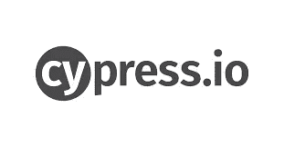
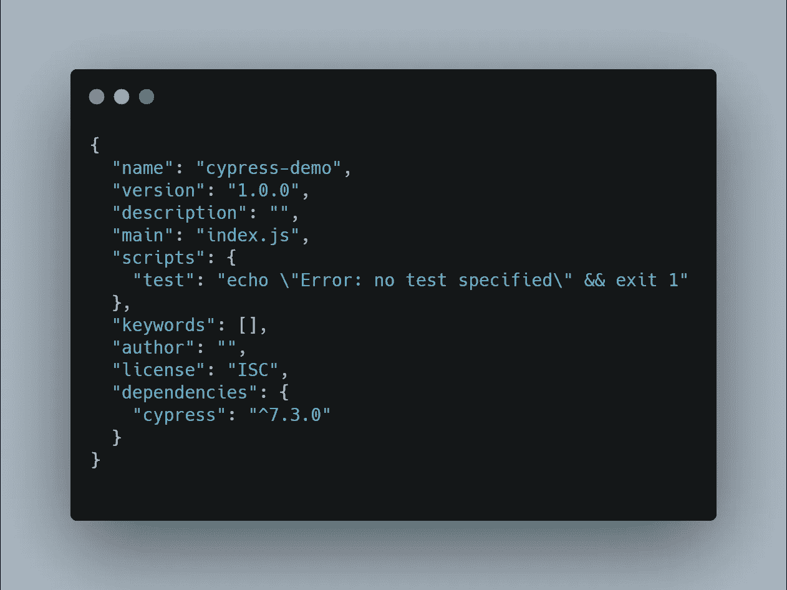
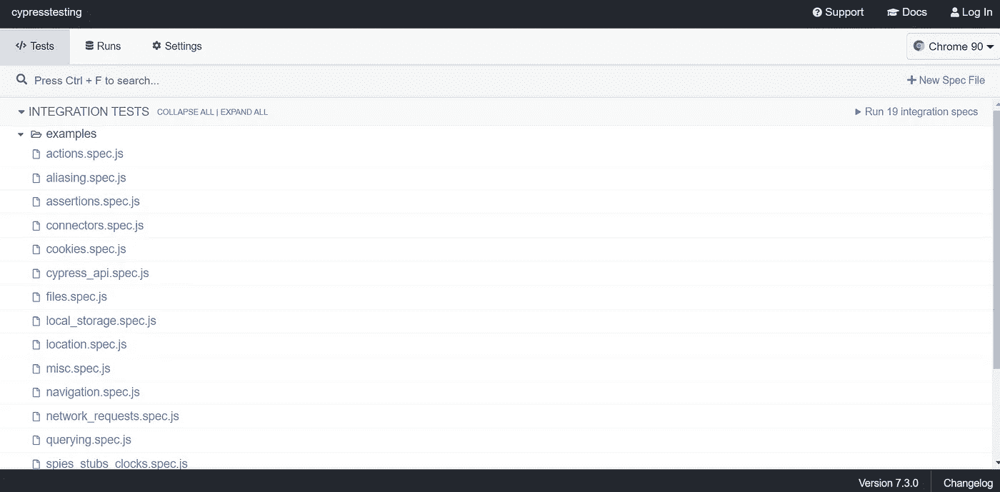
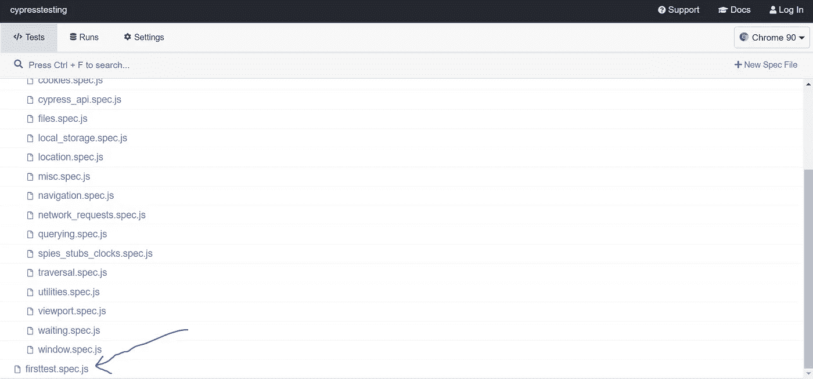
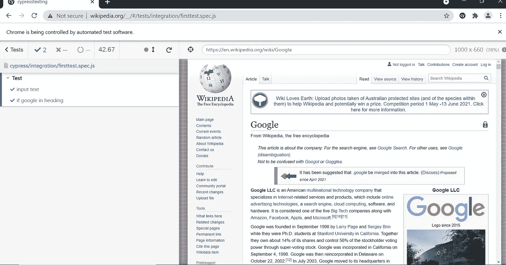

# 我的第一份赛普拉斯申请

> 原文：<https://medium.com/nerd-for-tech/my-first-cypress-application-71fe20083176?source=collection_archive---------39----------------------->



Cypress 是测试前端现代 web 应用程序的未来工具。它旨在克服工程师和开发人员在测试基于 React 和 AngularJS 的 web 应用程序时面临的障碍。这是一个快速、轻松和可靠的工具，用于测试任何在浏览器上运行的应用程序。

所以让我们看看如何在我们的机器上安装和使用 cypress。

1.  首先创建一个文件夹。这个文件夹将是我们所有 cypress 文件的存放位置。

```
mkdir cypress-demo
```

2.在该文件夹中，通过以下命令创建 package.json 文件。

```
npm init -y
```

该命令将使用所有默认值创建程序包文件。

3.现在使用以下命令安装 cypress

```
npm install cypress
```

该命令将在 package.json 文件中添加 cypress 的依赖项



4.之后，使用以下命令打开 cypress 应用程序

```
./node_modules/.bin/cypress open
```

5.你会注意到不同的文件已经存在于样本测试用例中。



6.现在我们将创建我们自己的测试用例。在文件夹 cypress/integration 中创建一个名为 firsttest.spec.js 的文件。


7.现在测试用例模式是这样的-

a.我们将开放维基网站

b.我们将输入谷歌，并点击提交按钮

c.如果新打开的页面的标题为“ **Google** ”，那么测试用例将通过，否则将失败。

在该文件中编写以下代码

```
describe('My first test case', () => {
   before(() => {
      cy.visit('https://www.wikipedia.org/');
   }) it('input text',() => {
      cy.get('#searchInput').type('google');
      cy.get('button[type=submit]').click();
   })

   it('if google in heading', () => {
      cy.get('#firstHeading').contains('Google')
   })
}) 
```

这里的**描述**和 **it** 都取自于 mocha 框架。Describe 用于集体绑定所有测试用例，而它用于编写单个测试用例。

首先我们将访问网站"**https://www.wikipedia.org/**"

然后，我们将在 **searchInput** id 选择器中输入 google，并单击提交按钮。

现在我们将检查**首标题** id 选择器是否有 **Google** 单词。如果是，那么它将被通过。

8.现在在 cypress 应用程序窗口中单击 filenamefirsttest.spec.js。



9.它将执行代码并通过测试用例。



如果你想让测试用例失败，那么做一些改变，看看效果。希望这个过程能让各位明白！！！

您可以查看我的 github repo:

[https://github.com/rajktech/cypress-demo](https://github.com/rajktech/cypress-demo)