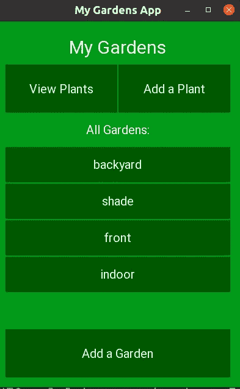
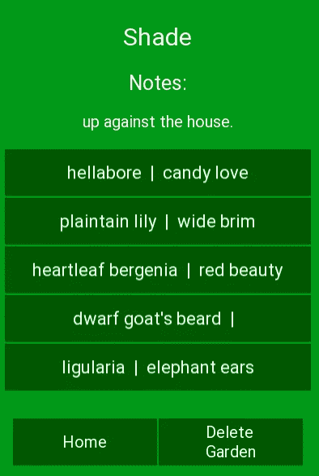
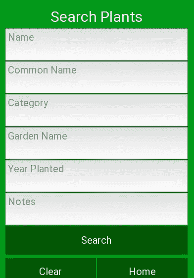
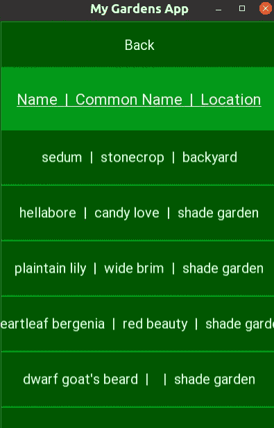

# 我的花园应用程序:第一阶段完成

> 原文：<https://medium.com/nerd-for-tech/my-gardens-app-stage-1-complete-fd1dd87cfcbe?source=collection_archive---------8----------------------->

我已经完成了我的应用程序的第一部分！这个应用程序的目的是记录我花园里的植物。我用 Python 和 Kivy 与 SQLAlchemy 核心创建的应用程序，目前所有的数据都保存在一个 SQLite3 数据库。请看下面的截图。

主页

以下是我的目标:

第一阶段:(完成！)

*   主页:所有花园的列表(可点击),导航按钮添加植物和花园，并搜索植物。
*   添加，编辑和删除花园和植物。
*   用单个或多个搜索词搜索所有植物。
*   查看每个花园的植物列表。

第二阶段:

*   用户应该能够上传照片。
*   实际使用我手机上的应用程序(我在笔记本电脑上写所有代码)。

第三阶段:

*   我还想学习 SQLAlchemy ORM，并可能从 SQLAlchemy 核心中切换我的查询。
*   我将继续调整格式:颜色，形状，字体等。

绿荫花园

我可以通过单个或多个术语进行搜索

搜索词:2021