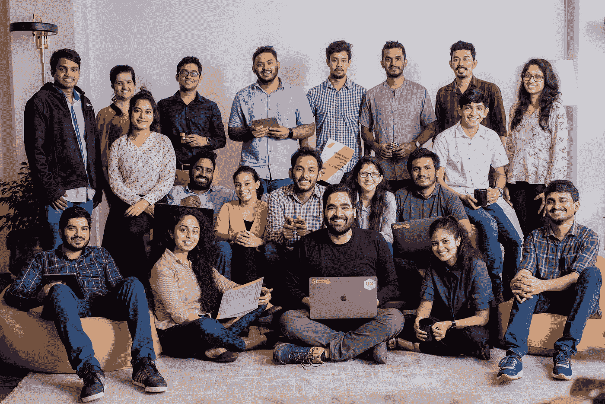
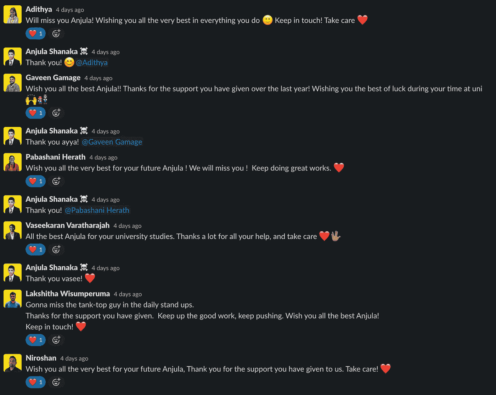
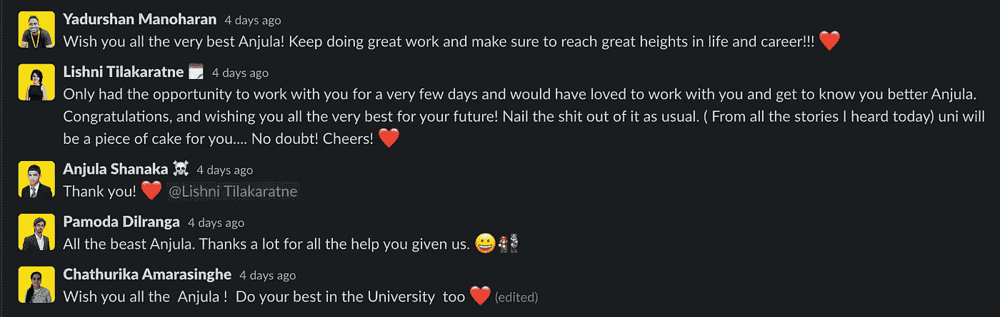
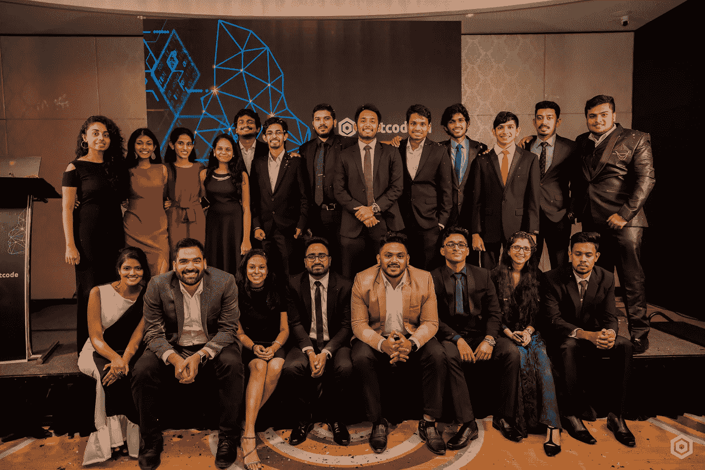
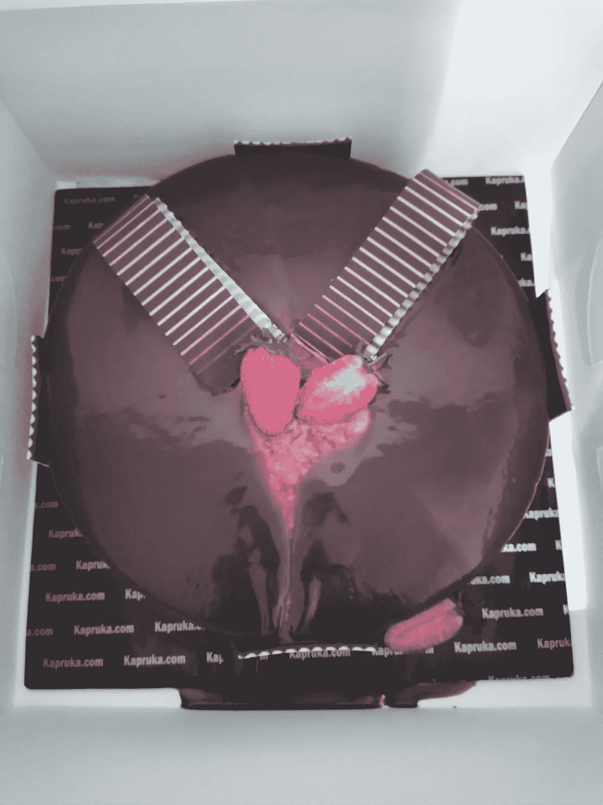
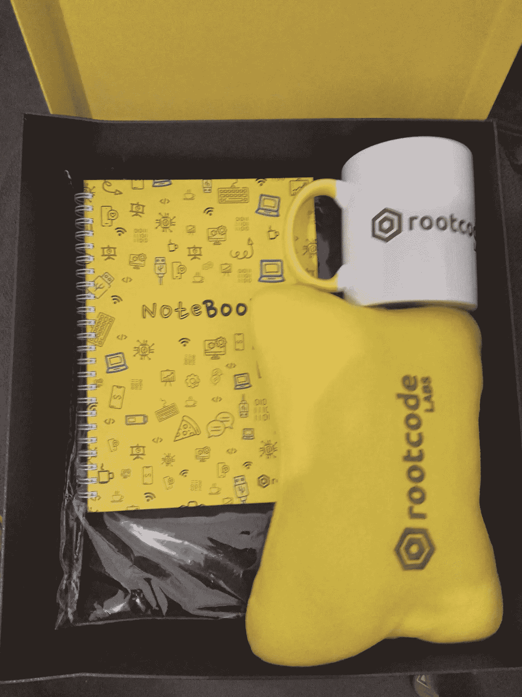

# 我作为 Rootcoder 的实习经历

> 原文：<https://medium.com/nerd-for-tech/my-internship-experience-as-a-rootcoder-80bdaec0aa35?source=collection_archive---------5----------------------->

十月份的时候

正如标题所说，这篇文章是关于我在 [Rootcode Labs](https://rootcodelabs.com/) 的实习经历。所以让我们从头开始。在 2019 年完成 GCE A/L 后，我一直在寻找机会启动我成为软件工程师的旅程。但是有一个问题。我只是一个离校生，仅此而已。

几个月后，我开始在学习 JavaScript 的同时为 SEF 做贡献。一旦我熟悉了 JavaScript，我就开始学习 React，为 SEF AcadeMix 项目做贡献。那时我开始申请实习，但没人给我机会。我在 Entrga 得到了一个面试机会，这是我参与的 React 项目之一，但进展并不顺利。

因为我在为 SEF 做贡献，所以我有机会加入开发团队。就在那时，我得到了一个在 Rootcode 面试的机会。面试前，我进行了一次电话筛选，几天后我得到了面试机会。面试进行得很顺利，第二天我有一个实践评估，我有 4 个小时来完成。我大概完成了 80%。第二天，也就是 2020 年 7 月 22 日，我和 Rootcode 实验室的首席执行官 Alagan Mahalingam 先生通了电话。最后，他说他们会给我一个机会。就这样，我得到了实习机会，我兴奋地开始工作。

2020 年 7 月 28 日，我开始了实习的第一天。因为疫情，我在家工作。我被介绍到这个团队，我们开始互相了解。我一加入就被要求学习 NextJs 和 tailwind CSS，这是一个很棒的组合。

在整个实习期间，我在不同的团队中参与了几个项目，学习了各种技术。让我列出我做过的项目，

专家共和国
-致力于为 epub web
【next js，ReactJs，Typescript，Tailwind CSS】创建专家/客户仪表板

共和企业专家
-致力于创建官方企业网站
[NextJs，ReactJs，Typescript，Tailwind CSS]

GIC 项目
-致力于实现一个更好的 UI
[JavaScript，jQuery，HTML，CSS，Bootstrap，Django]

Aphelia
-创建了 Aphelia web 来展示 aphelia AI(简历解析器)
【React Js，JavaScript，React-bootstrap】

除了我参与的项目，让我总结一下我从这次实习中学到的东西，

## 协力

我学会了如何与团队合作，如何团队解决问题。在我逗留期间，每个团队都互相支持，互相帮助。

## 通讯技能

当你作为一个团队工作时，互相沟通是非常重要的，你也应该能够与其他团队很好地沟通。我也很幸运能和客户交流。

## 责任

这次实习经历让我对分配给我的工作更加负责。

## 行业曝光

我在真正的工业项目中工作过，在那里它正在运行或者还没有在生产中运行

和 Rootcode 团队一起工作很有趣，我们一起玩了像使命召唤这样的游戏，还庆祝了生日。不幸的是，我们所有人都不得不在家工作，但我很确定如果我们都在办公室工作会有趣得多。

在 2020 年 3 月申请大学后，10 月底，我有幸被 Sri Jayawardenepura 大学的物理科学 ICT 学位项目选中。因为疫情，他们不能开始上大学，所以我直到六月才回来。2021 年 6 月 7 日，我收到大学发来的邮件，说他们 9 号开始上大学。所以我不得不就这样离开根代码。

2021 年 6 月 8 日是我在工作了近 11 个月之后，作为一名实习软件工程师的最后一天。那是悲伤的一天，尤其是因为我不得不突然离开。团队还为我制作了一个小视频。以下是我的 rootcoders 伙伴们的一些评论。

我非常感谢 Rootcode Labs 给我这个在专业环境中获得工作经验的绝佳机会。感谢所有 rootcoders 让我的逗留成为一个难忘和愉快的。

Rootcode AI 启动

我的生日蛋糕

赃物