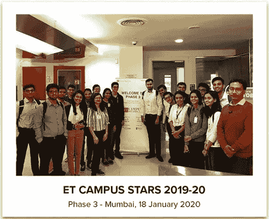

# 我成为 ET 校园明星的旅程

> 原文：<https://medium.com/nerd-for-tech/my-journey-of-becoming-an-et-campus-star-1eff8c2ac174?source=collection_archive---------0----------------------->

我入选了经济时报校园之星 3.02019-20 届**班。在来自印度不同工程学院的 49，000 名申请该计划的学生中，有 104 名学生在最后一期被选中。**

对于我的后辈们，这是一个为你们的帽子增添一根羽毛的机会，对于我的同伴们，这是我的旅程，所以请与任何能帮助到我的人分享吧！

在我工程专业的最后一年，听到的都是实习。周围的人都在忙着准备面试或者规划升学，准备入学考试。我也是。

大约在 9 月中旬，当我正在努力准备能力测试时，我的一个叔叔不断鼓励我参加不同的比赛，给我发来了《经济时报》校园之星倡议的链接。当我继续阅读他们的[网站](https://economictimes.indiatimes.com/etcampusstars)时，我了解到有 4 个阶段，前两个阶段是在线测试，可以在家进行，接下来的两个阶段涉及与评审团成员和其他参与者的面对面互动。

由于每个阶段都有入围名单，我甚至不确定自己是否能成功，但看了一眼[的评审团成员，](https://economictimes.indiatimes.com/etcampusstars/jurypanel)我意识到，如果**我有机会亲自见到这些人，我肯定不会错过。它由 CXO 的公司组成，如劳斯莱斯、戴尔技术印度公司、宏基印度公司、小米印度公司、甲骨文公司、兰博基尼公司等等。我之前从未听说过这一倡议，这是说服我参与的原因。**

我继续读下去，下面是他们的网站说的:

“ET 校园之星”是印度最大的寻找最聪明的工程学生的活动。每一期《ETCS》都会发现并鼓励推动印度发展的优秀工程师。该计划结构包括一个严格的 4 阶段流程，通过 25 个评估参数对每个候选人进行评估，包括以下内容。

*   *功能知识及应用*
*   *人际交往技巧*
*   *战略和创新思维*
*   *认知行为*
*   *性格*

*在线和地面评估工具的结合，加上与杰出评审团的面对面互动，将决定有资格进入 2019 年 ET 校园之星名单的聪明人才名单。”*

我认为参与也能帮助我认识到我的立场。 它会帮助我认识到自己的优势和劣势，毫无疑问它做到了 ***。有趣的是，没有一个阶段是以编码或技术面试为中心的。作为一名工科学生，我在大学里遇到的每一场比赛或活动都与编码有关，这是理所当然的。我热爱编码，然而，我相信还有其他必要的技能，在某些地方没有得到应有的重视。***

我所看到的这些技能被 ETCS 所涵盖，这些理由足以让我参与其中。

## 第一阶段评估:

第一阶段是一个 1.5 小时的在线测试，包括 MCQ 对数学、批判性思维、学习灵活性、人际交往技能和编码敏锐度的测试。

我在 10 月初进行了测试，它类似于我一直在准备的标准能力倾向测试，用于面试，所以知识帮助了我，我不必单独准备它。入围候选人的结果在 12 月初出来，我们有大约 15 天的时间进行第二阶段的在线测试。

## 第二阶段批判性思维测试:

第二阶段是一个 1.5 小时的在线批判性思维测试，对入围的候选人进行系统思考、分析和得出结论的能力的在线评估。

这个测试有 MCQ 氏症，在给定的情况下，我们必须理解，识别假设，创造假设，评估论点。结果在 1 月 1 日一周出来了，我很高兴入围第三阶段。我感觉更接近 2019-20 ETCS 的最后一届，并期待着第三阶段，在那里我终于可以见到其他学生了！

## 第三阶段小组练习和领导能力指数测试:

第三阶段计划在印度的不同地点分批进行，每批大约 20 名学生。我的第三阶段评估被安排在 1 月 18 日，地点是孟买 Lower Parel 的时代互联网办公室。

我花了 1.5 个小时到达那里，却发现很少有学生从另一个城市花 3 个小时到达那里！办公室很壮观，而且那天是周六，所以这个地方是空的，都是我们的。我们的会议准时开始。当我们每个人都拿到身份证的时候，我与其他参与者进行了互动，并结交了新朋友。作为一个喜欢结交新朋友的人，这是我最喜欢的部分。

领导能力测试是我们在笔记本电脑上进行的在线测试。随后我们进行了小组讨论。给我们的题目是“印度制造”。我参加过的唯一一次小组讨论是在大学或学校，我们每个人都有公平的发言机会。这是第一次有 20 个人参加的真正的小组讨论，每个人都博览群书，一个比一个强。老实说，这有点吓人。

在那半个小时里，每个人都在争着发言，我设法在最后 10 分钟里得到了一个机会，讲了一两分钟。讨论之后，所有根本没有机会发言的学生都一个接一个地发言了。我们还玩了一场集体游戏，然后就结束了一天的活动。这是一次激动人心的经历。新朋友，新思想，新经历，还有很多东西要学。

## 第 4 阶段会见评审团成员:

第三阶段的结果于二月公布。第 4 阶段入围的候选人与评审团成员进行了一对一的互动，评审团成员审查了候选人在该计划每个阶段的分数并进行面试。很快我们就收到了陪审员的名字和面试地点。

我的面试被安排在孟买的 Kotak Infinity，陪审员是 Vinayak Jayaram 先生，Kotak Mahindra 财产保险公司的人力资源主管。他有着惊人的个性。他告诉我们他的旅程，并根据我们在课程中学到的东西问了我们几个概念性的问题，我们意识到我们需要更深入地研究我们的主题。他非常擅长数字，我们担心他会在采访中问类似的问题。然而，采访进行得很顺利，他和我们每个人都互动得很好。

每次面试从半小时到将近一小时不等，有 10 到 15 名学生，所以我从早上 9 点到下午 6 点都在那里。当一个采访正在进行时，我们其余的人都在社交，我也在那里交了朋友！又一个充满灵感和快乐的神奇的一天。

我很感激我参与了这项倡议，并设法做到了这一点。我对自己变得更加自信，同时也意识到还有很多东西需要学习。这是我在工程领域最难忘的成就之一，我感谢《经济时报》、我的叔叔、母亲和朋友们鼓励我去追求它。

结果等信息的链接:[结果](https://economictimes.indiatimes.com/etcampusstars)