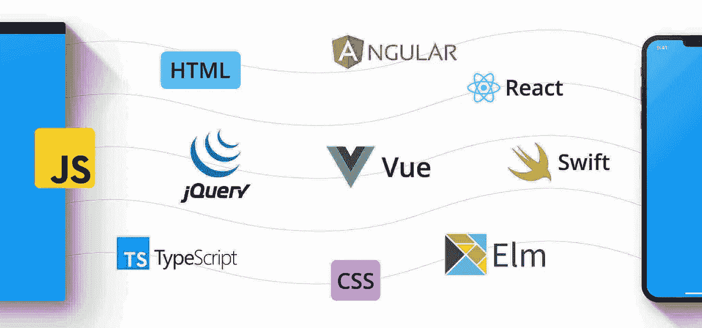
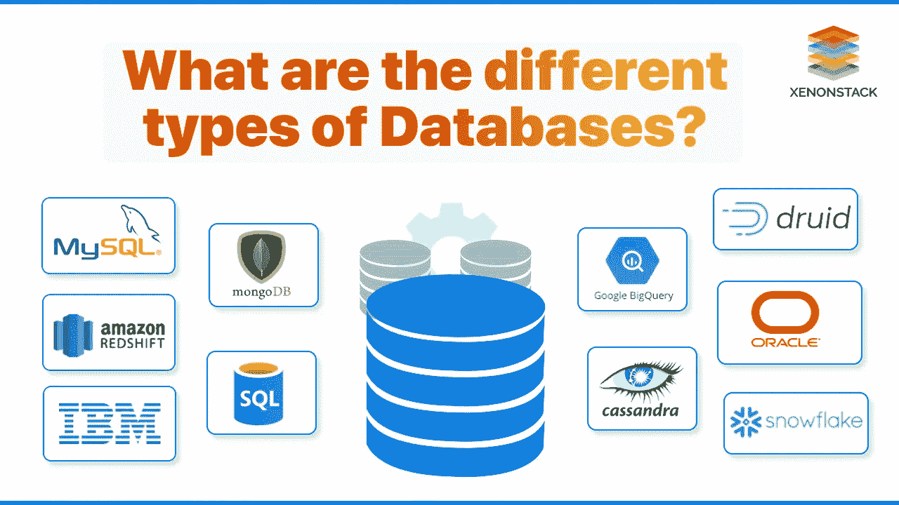

# 我成为全栈 Web 开发人员的旅程

> 原文：<https://medium.com/nerd-for-tech/my-journey-to-becoming-a-full-stack-web-developer-2f62a9d2df15?source=collection_archive---------1----------------------->

来源—[https://devcourseweb.com/author/cw/](https://devcourseweb.com/author/cw/)

对于少数人来说，成为全栈开发人员可能是“在黑暗中搜索”。由于需要掌握不同领域的技术，从哪里开始以及如何进行是新手经常听到的问题。在本文中，我将分享我成为全栈开发人员的历程。

**入门前**

作为介绍，我了解了全栈开发人员的工作，以及它与所谓的普通开发人员有何不同。注意，这个领域需要你掌握和接触各种技术。坚持使用单一的语言/框架并不能获得完整的堆栈——所以要做好学习的准备。

**我从最底层做起**

来源—[https://blog.back4app.com/front-end-programming-languages/](https://blog.back4app.com/front-end-programming-languages/)

由于全栈开发人员处理完整的应用程序，所以我从一些简单的、不太技术性的东西开始，比如 UI。我学习了 HTML、CSS 和 JavaScript，并得到了实践。我主要致力于开发具有完整响应能力的成熟静态网站。UI 学习起来会相当快，因为这里没有太多令人讨厌的东西。

**我获得全部筹码的下一阶段**

来源-[https://www . gam strain . com/2021/07/top-5-futuristic-back end-languages-to . html](https://www.gamstrain.com/2021/07/top-5-futuristic-backend-languages-to.html)

我的下一阶段是学习服务器端编码。这是事情变得更加技术性的地方。了解计算机服务器、网络和协议等基础知识。作为一名新手，考虑到它的简单性，我选择了 PHP。有许多基于 JS 的框架也适合新手——比如 NodeJS。一旦服务器端编码完成，我就把我的 UI 连接到服务器上，制作一个全栈应用。为了适应这些概念，我制作了一个简单的应用程序，它在没有太多 UI 的情况下从服务器发送和返回数据。我甚至尝试弄清楚各种操作——获取数据(GET 方法)、发送数据(POST 方法)等。

**再加一点**

来源—[https://www.xenonstack.com/blog/databases](https://www.xenonstack.com/blog/databases)

学习数据库——我从 SQL 开始。作为开始，我会推荐 SQL。由于它的简单语法，SQL 将相当容易学习。创建一个数据库，并将服务器连接到数据库以获取数据。我做了一个简单的应用程序用户识别应用程序，它与数据库交互并执行读/写操作。

**大停顿**

一旦我看到了所有这些概念，我停下来开发了一个完全成熟的应用程序，有合适的用户界面和服务器。做项目给我带来了更多的知识和逐行的学习。由于这是一个广阔的领域，考虑到有很多东西需要记住和理解，从事更大的项目将是有益的。

**让行业做好准备**

来源—[https://www . hindustantimes . com/education/skill-based-education-for-industry-ready-engineers/story-3 gnvym 5 mrbwcaxvepwehbi . html](https://www.hindustantimes.com/education/skill-based-education-for-industry-ready-engineers/story-3gnVyM5mrBwcAXvEPWEHBI.html)

这让我更快地适应了这个行业——了解和学习这个行业正在发生的事情。我从事了以下主题的各种研究和项目工作:

*   云计算(主要部署服务器、管道、数据库等。)
*   DevOps / Scrum(非常重要)
*   软件工程和概念(SDLC，SRS，测试实践等。)
*   代码管理和源代码控制(GitHub)

感谢您的阅读！

## 有用的链接:

*   在 LinkedIn 上找我:【https://www.linkedin.com/in/vishnuu0399 
*   更了解我:[https://bit.ly/vishnu-u](https://bit.ly/vishnu-u)
*   了解全栈开发:[https://www.w3schools.com](https://www.w3schools.com)