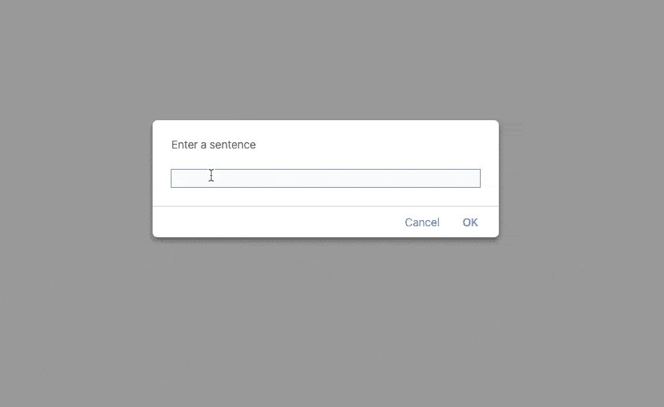
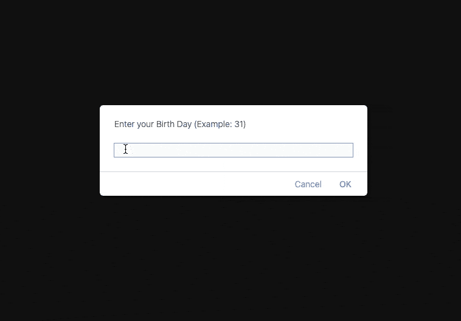

# 我的 Javascript 学习之旅

> 原文：<https://medium.com/nerd-for-tech/my-journey-to-learning-javascript-f9a4e50ad136?source=collection_archive---------15----------------------->

大家好，在这篇博文中，我将分享我的 Javascript 学习经历。当我开始贡献 ScholarX 应用程序时，我开始使用 Javascript。

**Javascript 是什么？**

JavaScript 是一种动态的计算机编程语言。它是轻量级的，最常用来作为网页、网络应用程序、游戏开发等的一部分…

之前，我在开发我们学校的网站(sack.edu.lk)时使用 javascript 将页脚和导航栏分别链接到网页，并在页脚更新年份。但是一旦我开始为 scholarX 做贡献，我意识到如果我从一开始就学习 Javascript，那么做贡献会更容易。我实习的公司(Smashy ERP)启动了一个 JavaScript 培训项目，他们提供了 5 个问题，涵盖了 Javascript 的不同领域，我们必须为他们编写解决方案，并日复一日地展示出来。
这些环境使得学习 Javascript 变得更加容易。一边学习，一边用它们来解决问题，这样就简单多了。所以我是这样做的。我一如既往地用[w3schools.com](https://www.w3schools.com/js/DEFAULT.asp)作为我学习 Javascript 的主要参考。

学习一门新语言时，我总是带着一本书。然后我拿一个具体的部分，比如说“运营商”。首先，在 IDE 中测试这些示例时，我浏览了“操作符”部分。然后，我记下我的发现中的要点(将它们与我所学的其他语言进行比较)，以及相关部分的小示例代码和输出。但是大多数时候我在解决这些问题的同时学到了新的东西，在这种情况下，我会按照上面提到的步骤来做。以后你可以用那本书做参考。这本书的另一个好处是，当你把你学到的语言教给别人时，解释那些功能和方法会容易得多。

这是我在学习“切片”和“日期”函数时尝试的两个例子。

这个程序简单地颠倒了句子中单词的顺序。

一旦提供了出生日期，这个程序就会计算你生活的天数。

使用以下链接找到源代码(Github)
[逆序句](https://github.com/kumuditha-udayanga/Javascript-Questions/blob/master/07-06-2021/question-02.js)
[存活天数](https://github.com/kumuditha-udayanga/Javascript-Questions/blob/master/05-06-2021/question-03.js)

感谢您的阅读，希望在未来分享更多的经验。敬请关注🤠。