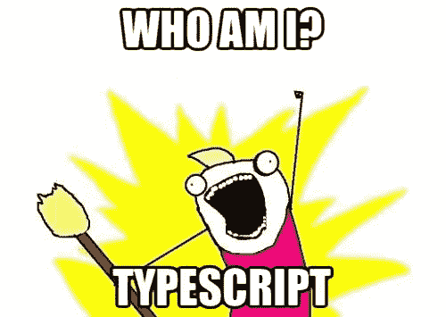
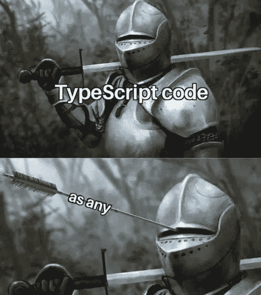

# 我叫 TypeScript，我是地球上最严格的工具。

> 原文：<https://medium.com/nerd-for-tech/my-name-is-typescript-and-im-the-strictest-tool-on-earth-fce8fe41b353?source=collection_archive---------7----------------------->

每月大约有 200 万次 NPM 下载。超过 50%的开发者每天都在使用它。几乎 80%的新项目都是开箱即用的。去年，它的受欢迎程度激增，使得 Python 在堆栈溢出趋势上排名第三。目前，在 TIOBE 指数排名前 50 的技术中。

但另一方面，有一种相反的观点，认为打字稿使事情变得更糟，更复杂，在一个宁静的天堂里没有它会更好。

让我们深入问题的核心，了解冲突的双方。

TypeScript 是一个工具，它用**一个杰出的类型系统和额外的特性**扩展了 JavaScript 的基本语法。它编译源代码，在早期阶段捕捉错误，使事情变得更有效率。

正如我提到的，TypeScript 的主要特性是一个类型系统，它包括基元类型、创建自定义类型、映射类型、条件类型、模板文字类型、实用程序类型、接口、泛型等等。它与大多数类型化语言不相上下，因此对于以前已经有过严格语言经验的工程师来说，学习它更容易。例如，Angular 和 C#的组合现在被广泛使用。

除此之外，迁移到 TypeScript 是可以实现的，因为它**也可以兼容 ECMAScript(向后兼容)**的旧版本。

**文档质量足够高**，它包含了从手册开始的所有内容，以针对特定类型用户的教程结束。但这不是唯一的好处，TypeScript 与 IDE 完美集成，有一个后台进程支持增量编译，允许导航，有效地找到问题。

**但还是……**

这很理想，但并不适合所有人，原因如下:

**第一个声明是供应商锁**。尽管 TypeScript 是开源的，但供应商(微软)仍然可以为所欲为。当然，这是有可能的，但是有一个强大的国际社会可以影响他们的决定。

学习曲线是残酷的。对于绝对初学者来说，类型系统可能非常复杂。这部分是对的，但同时，这也是软件工程师应该经历的挑战。用类型来思考，有时会节省大量时间，甚至让你在纯粹的 JS 上进行更广泛的思考。

这里唯一的问题是 TypeScript 不是万能的。它给了**一种虚假的安全感**(又名沃尔沃司机综合症)，但仍然不是所有的事情都能被它捕获(例如，**逻辑或运行时错误**，所以无论如何你必须使用其他工具来维护代码质量。

当然，仅仅为了使用 TS 而使用 TS 是很糟糕的，我看到很多项目都充满了懒惰和“@ts-ignore”或“any”。

**可能会死**。每个人都想起 CoffeeScript 以及它是如何在多年前消亡的。恐怕我不能同意这个意见。IMHO，CoffeeScript 绝对是一种有着不同目的的不同语言，它没有经受住时间的考验，被 JavaScript 淘汰了。但是 **TypeScript 是 JavaScript 的超集，它是 JavaScript 的运行时，带有编译时类型检查器**。所以，绝对替代不等同于继承。

**有时候看起来很丑。**的确，有些事情在 JS 上用几行代码就可以完成，但在 TS 上就变得过于复杂了。

当然，TS 增加了代码的复杂性，但同时，丑陋的代码可能是用任何语言、任何框架、任何工具编写的。如果代码是按照最佳实践和原则(GRASP、SOLID 等)编写的，就不会有这样的问题。

类型定义是我们的痛苦。使用 TS 时，你可能会对第三方库的类型定义感到恼火。你必须为每个特定的包下载它们，如果它们没有类型文件，那么你要么自己写，要么忘记编译器的帮助。

# 结论

总而言之，TypeScript 对于可伸缩的代码库和未来的重构来说是一个很好的工具。它有很好的文档记录，与 IDE 集成，并且很实用。

但是像任何技术一样，它带来了额外的复杂性，你必须忍受。这就是为什么在使用它之前要三思而后行，并回答“你真的需要它吗？”。

最近，我为客户准备了 PoC，并使用了我自己的样本，里面有打字稿。截止日期很紧(几天)，所以摆弄类型有点痛苦，因为我使用了一些预制的代码片段等等。因此，为了节省时间，我从设置中删除了 TypeScript 并使用了纯 JS。

同时，我希望我们在最后一个项目中使用 TypeScript，但是经过 5 年的持续开发，迁移到它有点复杂。对于现阶段来说，这种迁移成本太高。但同时，我们的一些团队使用类型定义文件进行类型检查。

[https://www.typescriptlang.org/docs/](https://www.typescriptlang.org/docs/)