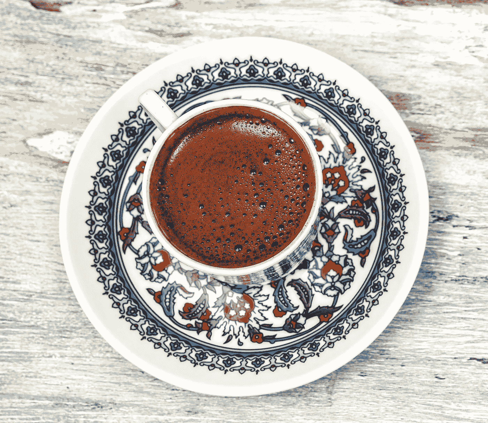
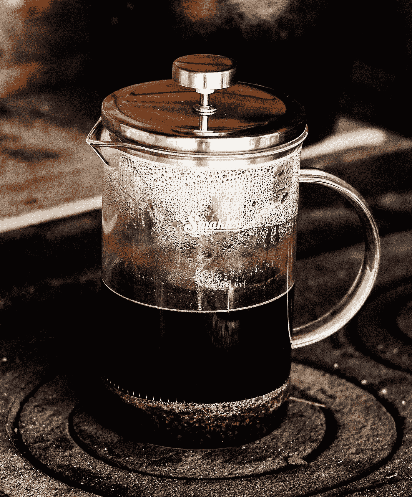
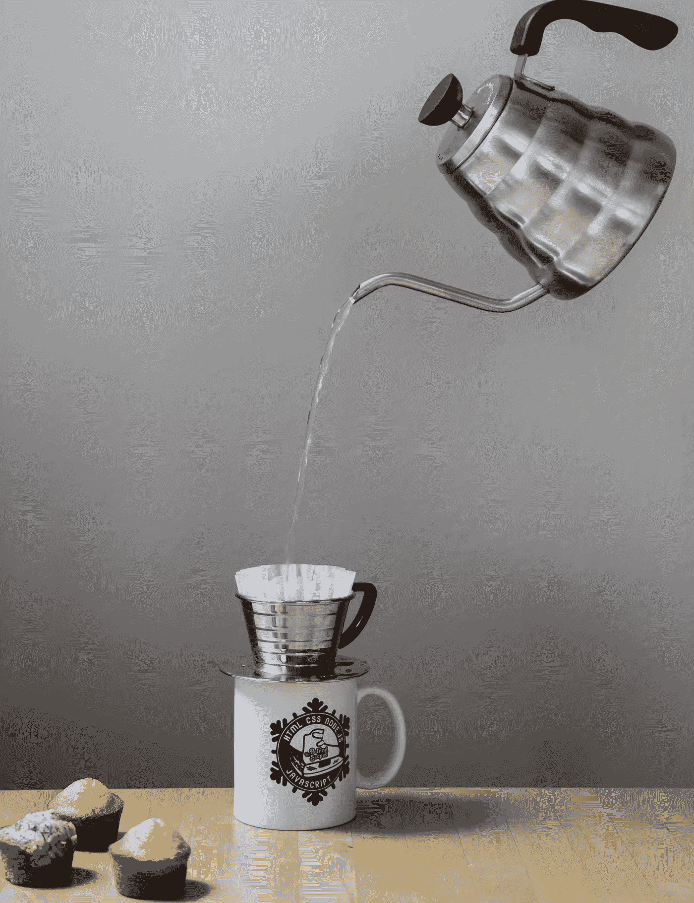

# 我的程序员朋友们，你们是怎么喝咖啡的？

> 原文：<https://medium.com/nerd-for-tech/my-programmer-friends-how-are-you-drinking-your-coffee-42fce66c6052?source=collection_archive---------0----------------------->

咖啡和软件工程师是天造地设的一对吧？嗯，这可能有点言过其实，但我们不得不承认，没有什么比一杯好咖啡更能开启你的一天。

我们都读过、看过、谈论过我们的办公室设置，它有很酷的键盘、鼠标和昂贵的耳机，除了咖啡。我觉得咖啡也值得一篇文章，因为它是我们开发空间不可或缺的一部分，至少对我们大多数人来说是这样。

我住在西雅图的咖啡之都，这里一年中大部分时间都被雨水吞噬。是咖啡帮你度过了这个季节的灰暗期。

由于来自印度，我过去总是喝加牛奶和糖的咖啡。黑咖啡在国内并不常见。当我开始在美国工作时，我不知何故喜欢上了黑咖啡，从那时起我们就幸福地生活在一起。

我的黑咖啡之旅是从基本的滴滤咖啡开始的，你知道那种已经煮好的最好趁热喝的咖啡。虽然我必须承认我总是倾向于在滴滤咖啡里放奶油和糖，主要是因为我在滴滤咖啡附近看到奶油、糖和肉桂，一旦你看到糖就很难抗拒它:P

从滴滤咖啡，我转向了 K 杯咖啡，就是那种你把咖啡豆碾碎放入 K 杯机的咖啡。机器在杯子上戳一个洞，把热水倒进去，“瞧，你的热咖啡就做好了。

我记得 4-5 年前的一天，周五下班后，我冲到塔吉特百货公司买了一台 k-cup 酿造机，带着不舒服的啤酒走了 2 英里多📦。我想要的是，第二天早上在家喝咖啡，而不是去附近的咖啡馆。

每样东西都有一段旅程，我的 K 杯咖啡冲泡机也是如此，不是因为它坏了，而是咖啡过了一点就变成了热棕色的水。现在，我渴望有一个更好的选择，一些新鲜的东西，比如我可以在家研磨的咖啡豆。

我决定转向一种老式的方式，在那里我可以得到粉末状的咖啡，并在上面倒上热水，以得到一杯完美的热咖啡。

问题是:我没有咖啡过滤器、倾倒杯、水壶等。我不想花更多的钱，尤其是当我处于试验阶段，更重要的是当 K-cup 酿造机看到我忽视她。

但是我有一个量杯，可以用来在微波炉里烧水，一个过滤器，可以用来过滤咖啡渣。所以我从那开始，除了买一杯粉状过滤咖啡，零投资。我的技术很简单，用微波炉将水煮沸 2 分半钟，静置 10 秒钟，将咖啡渣放在滤网上，将热水倒在咖啡渣上，通过滤网，你就可以将热咖啡倒入马克杯。

使用裸机过滤器不是一个好主意。首先，它不能过滤掉所有的咖啡，一些咖啡渣可能会漏过。除非你喝的是“土耳其咖啡”，否则你不会想尝咖啡渣的味道。其次，除非你用纸质过滤器，否则味道不会很好。

**⚠️使用金属过滤器的另一个问题。**

与纸质过滤器不同，金属过滤器不能吸收咖啡渣中的所有物质。咖啡含有咖啡醇，它是由一种化学化合物“二萜”组成的。二萜基本上是一种油性化合物，维基百科说“二萜是视黄醇中的基本化合物”。难怪所有的护肤霜都含有视黄醇，声称可以消除皮肤干燥。

基于更多的网上研究，我发现咖啡中的咖啡醇会增加你的低密度脂蛋白水平。我患有高低密度脂蛋白，并被告知要远离油腻的食物。好吧，我不知道油会渗透到咖啡里。如果我每天喝 2-3 杯咖啡，我想确定我没有喝不需要的东西。

**仅仅是金属过滤器的问题吗？**

是的，无论我们在哪里使用它。不仅仅是倒出来，所有其他的咖啡过滤方式，像最流行的法国压榨，使用金属过滤器，含有最多的咖啡醇。让事情变得更糟的是，让你的咖啡坐在法式压罐里的过程进一步增加了咖啡醇。

如果你每天喝 5 杯法式压榨咖啡，你的低密度脂蛋白水平会从 6%增加到 8%。

我终于改用纸质过滤器和倾倒杯了。纸过滤器吸收二萜，油性化合物只是因为纸的性质。纸吸收油，金属不吸收，有道理。

嗯，这只是我的观察。在这一点上，我会问一个终极问题，你怎么喝咖啡？

所有的图像都取自 Pexels 和 Unsplash。

小贴士:在你的咖啡里放一小撮盐。盐减少了咖啡的苦味，增加了味道。

我每天都发布关于编程的文章。你能找到我👇

[**Youtube**](https://www.youtube.com/channel/UC7Ze67ISJCgtHZBXCYcBLIg?sub_confirmation=1)|[**Twitter**](https://twitter.com/S_AWDESH)|[|**insta gram**](https://www.instagram.com/awdeshcodes/)

让我们一起学习吧💪💪

快乐编码💻