# 我的媒体 150 万浏览量之路

> 原文：<https://medium.com/nerd-for-tech/my-road-to-1-5-million-views-on-medium-b9c87d77534b?source=collection_archive---------2----------------------->

## 数据分析

## 分析我的阅读，观点，掌声，文章长度，等等。

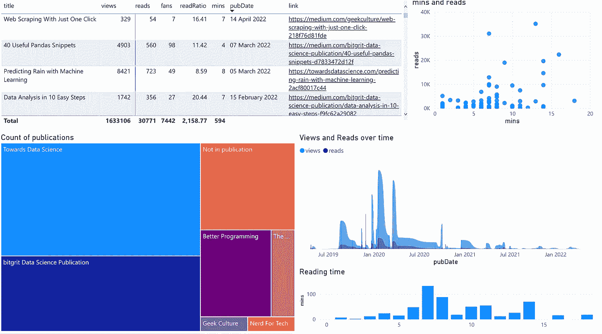

我的媒体统计的 PowerBI 仪表板

自 2019 年以来，我一直在[Medium.com](/)上写作，作为一名数据科学家，我决定分析我的媒体文章的统计数据，原因有两个。

首先，我想看看我能获得什么有趣的见解。

第二，因为数据分析好玩。

当然，任何数据分析工作的起点都是数据本身。

为了获取数据，我决定利用一个强大的无代码网络抓取器，名为 [**Octoparse**](https://www.octoparse.com/?utm_source=nerfortech&utm_medium=benedict&utm_campaign=medium) ，我之前用它来[抓取埃隆·马斯克的推文、数据科学职位发布、YouTube 评论以及更多](/nerd-for-tech/the-only-web-scraping-tool-you-need-for-data-science-f388e2afa187)。

它是免费使用的，但是如果你想获得高级功能，你很幸运！Octoparse 将在 6 月 15 日举行*夏季特卖*，这意味着在[定价计划](https://www.octoparse.com/pricing/?utm_source=nerfortech&utm_medium=benedict&utm_campaign=medium)上的巨大折扣，所以你只会受到你的想象力的限制(至少对于抓取网页来说)。

## 用八分语法擦除介质

要事第一，告诉 [Octoparse](https://www.octoparse.com/?utm_source=nerfortech&utm_medium=benedict&utm_campaign=medium) 你想刮什么网站。

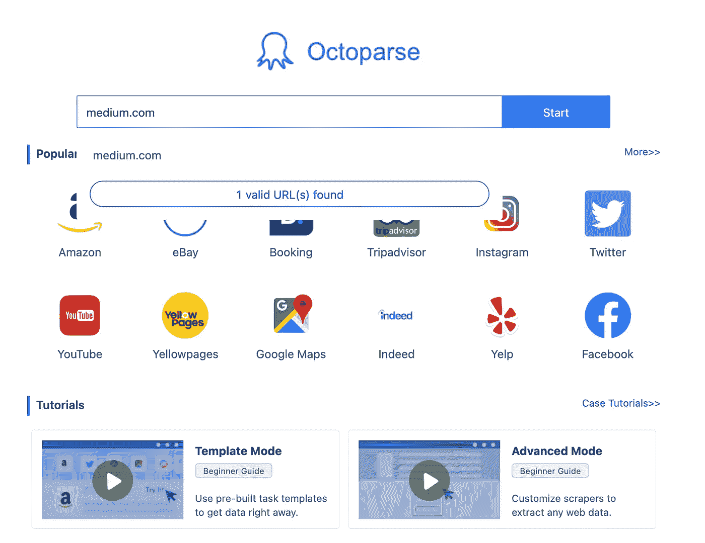

然后，单击浏览模式，以便您可以登录。

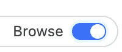

由于认证问题，谷歌登录不工作，所以我们必须有创意。

点击“用电子邮件登录”。

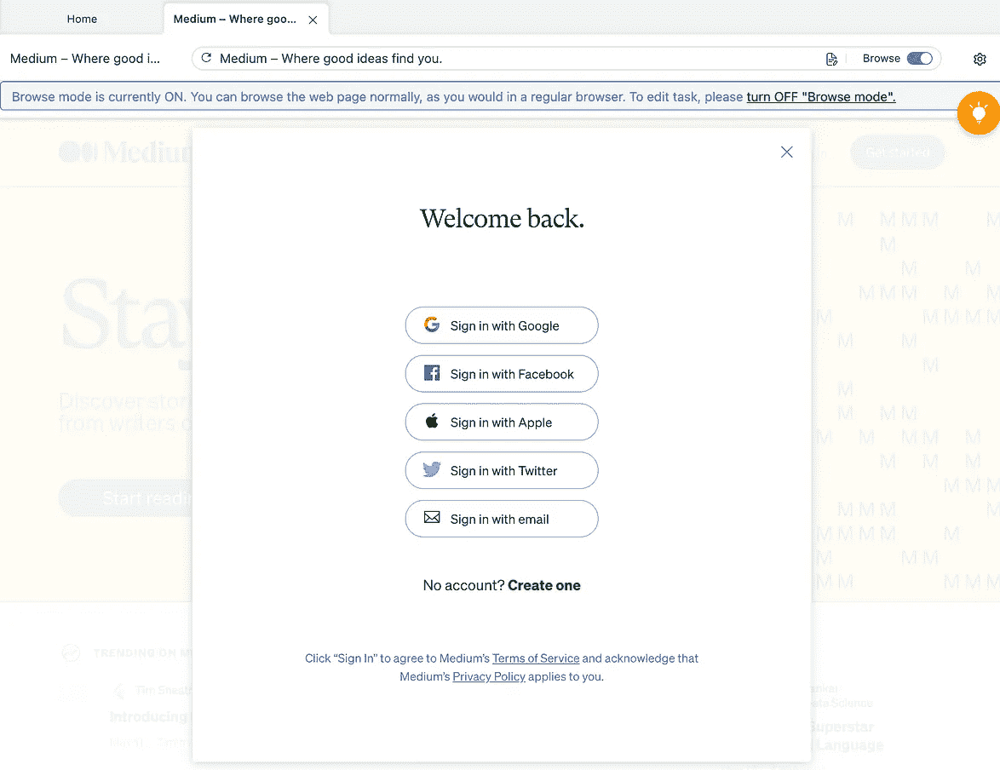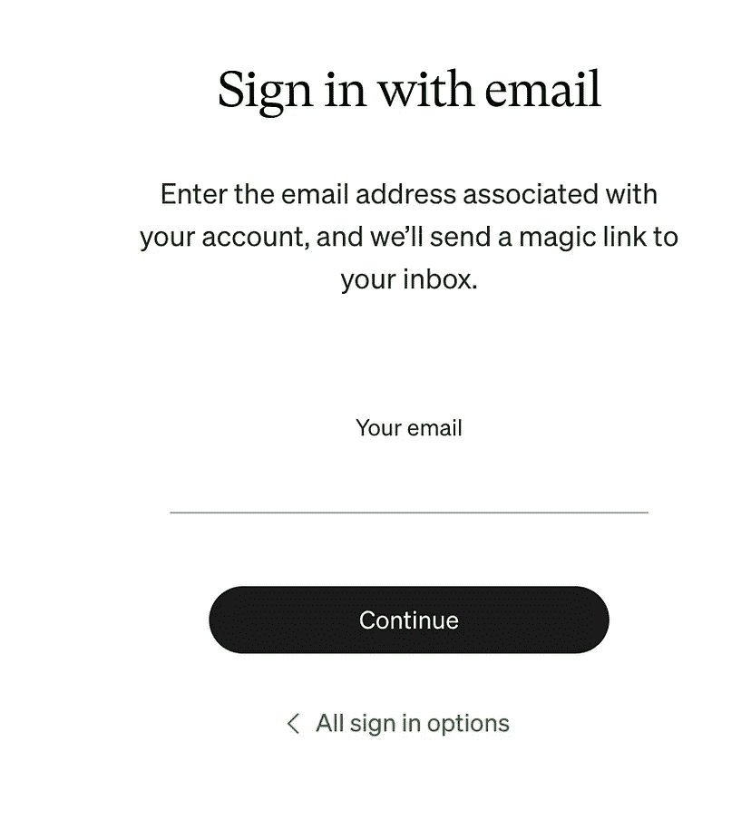

然后输入你的介质帐户的电子邮件。

几秒钟后，您应该会看到一个一次性登录链接

复制这个链接，粘贴到 Octoparse，然后进入统计页面。

进入该页面后，点击橙色弹出框中的`auto-detect`。

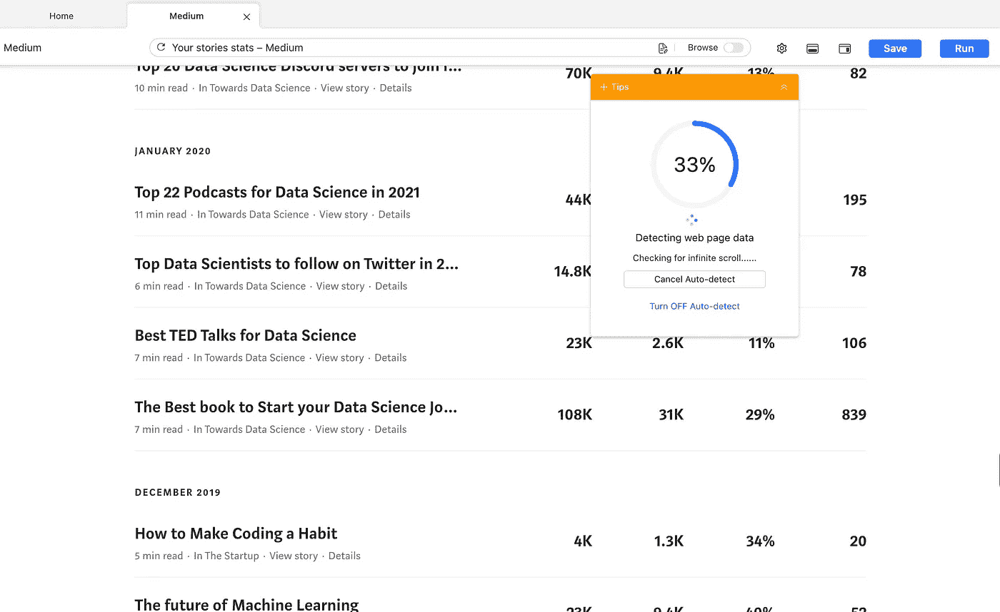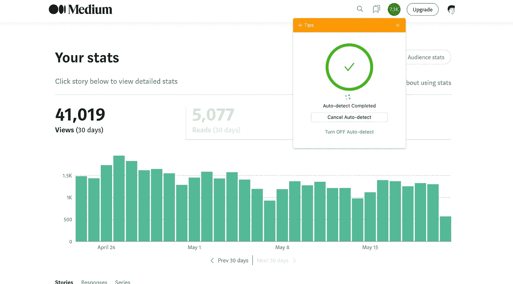

完成后，我们就有了数据！

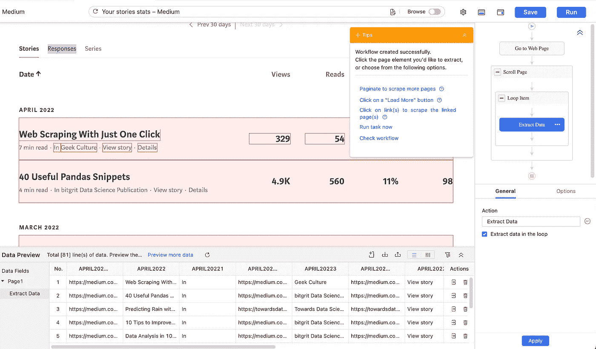

点击按钮下载。

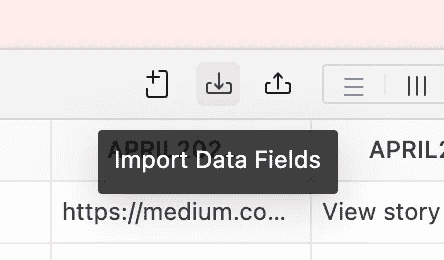

当然，真正的工作是清理数据，因为网页抓取会变得相当混乱。

清洗+手动添加文章阅读长度之后，就该进行一些分析了！

# 使用 PowerBI 进行数据分析

PowerBI 是一个很棒的工具，可以用来构建很酷的仪表盘，这将是我完成这项任务的首选武器。

这是我从现有数据中得出的可视化结果。

欣赏一些很酷的图表和数据背后的故事。

## 出版物阅读时间

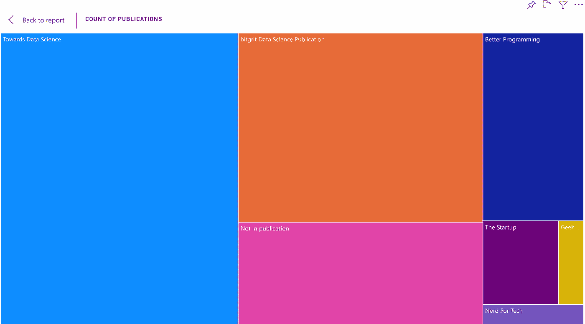

我开始写作时没有任何出版物。

然后我在 2019 年开始把它们提交给[创业公司](https://medium.com/swlh)和[更好的编程](https://betterprogramming.pub/)。

但是随着我将注意力转移到数据科学上，我的大部分文章都是关于[走向数据科学](https://towardsdatascience.com/)和 [bitgrit 数据科学出版物](https://medium.com/bitgrit-data-science-publication)。

## 一段时间内的浏览量和阅读量

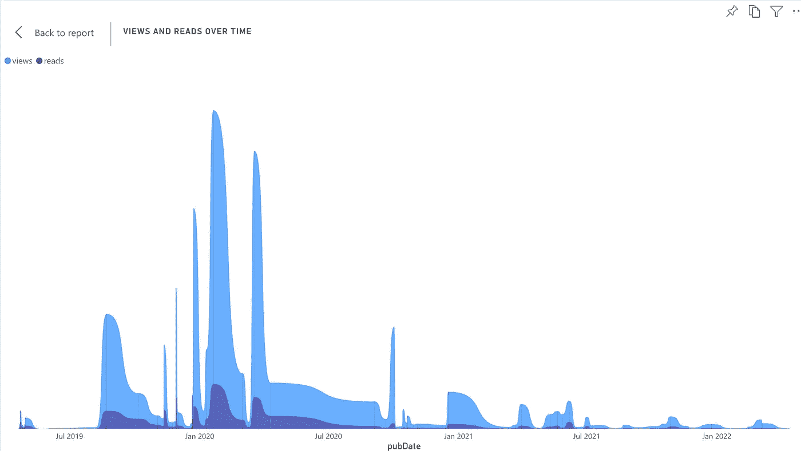

我写了一系列关于人工智能和数据科学资源的[文章](https://benedictxneo.medium.com/all-my-articles-and-series-b4b454a1435d?source=user_profile---------0----------------------------)，获得了很多关注。

我浏览/阅读最多的文章是[互联网上 20 大免费数据科学、ML 和 AI mooc](https://towardsdatascience.com/top-20-free-data-science-ml-and-ai-moocs-on-the-internet-4036bd0aac12)，这是你在 2020 年 1 月看到的峰值。

2020 年 COVID 来袭，我失去了写作的动力。然后，在 2021 年，我开始为数据科学家的人工智能竞赛和招聘平台 [bitgrit](https://bitgrit.net/) 写作，并为他们的数据科学出版物奠定了基础。

## 文章阅读时间

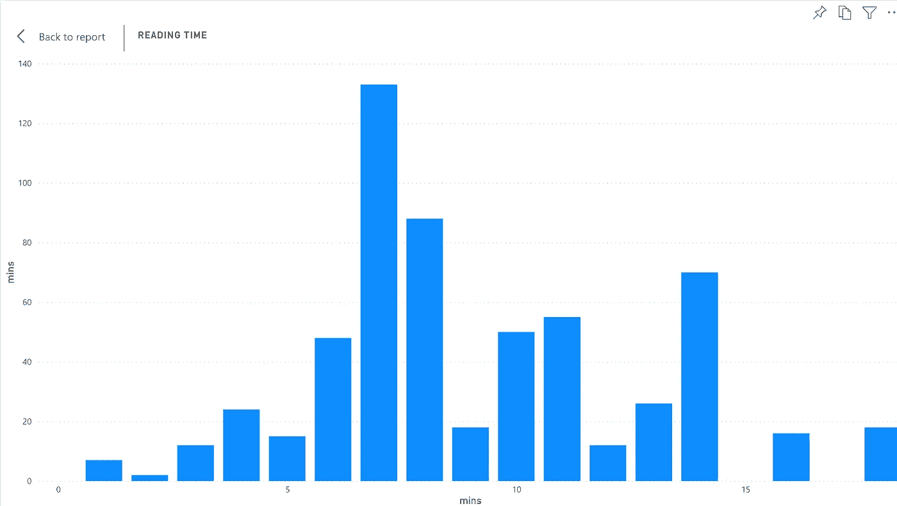

[媒体数据科学主管 Mike Sall](https://www.linkedin.com/in/michaelsall/)[在 2013 年写了一篇文章](/data-lab/the-optimal-post-is-7-minutes-74b9f41509b#.p8jwm4wpf)指出让人们参与进来的最佳帖子长度是 7 分钟，所以我尽我所能让我的文章保持在这个长度左右。

看起来我做得很好。

## 分钟与读取

既然最优的帖子长度是 7 分钟，那么分钟和阅读时间是否有明显的相关性？

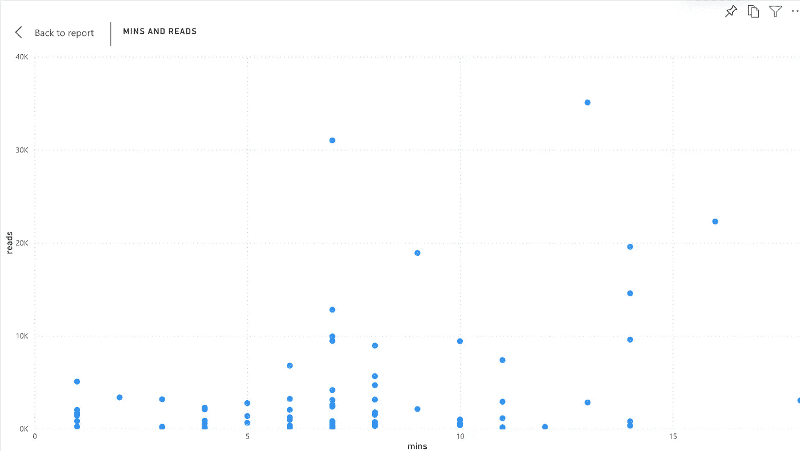

我的情况似乎不是这样。

让我们深入研究一下。

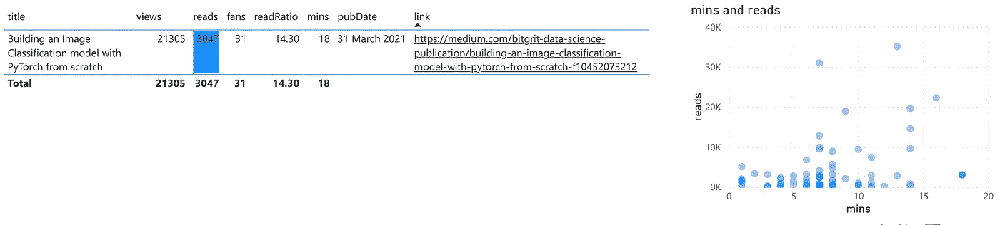

对于一篇长帖(18 分钟)，我们的阅读量很少。这是否意味着越长的帖子阅读时间越短？

还有其他因素在起作用。

首先，我将这篇文章发表在 bitgrit 数据科学出版物上，当时该出版物只有不到 100 名追随者。所以没多少人会看到那篇文章。

其次，这篇文章技术性很强，所以不适合普通读者。

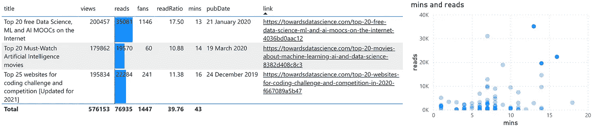

另一方面，这三个数据点有相当长的读取时间，但仍然累积了许多读取。

首先，它被发布在“走向数据科学”上，现在已经有超过 60 万的追随者。第二，这些是参考资料，所以不需要任何技术知识。

## 统计表

我还制作了一个表格，可以显示我需要看到的关于我的文章的所有信息。

在下表中，我按照读取次数降序排列了数据。

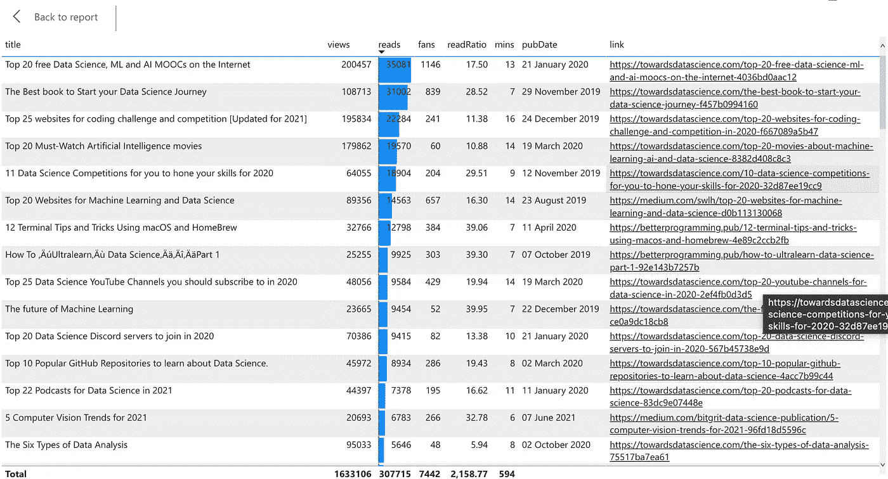

## 中等统计仪表板

我的图表的最终产品是下面的仪表板！

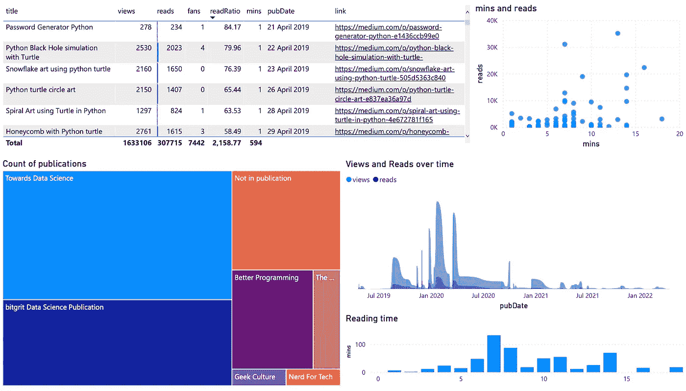

你可以自己玩[这里](https://app.powerbi.com/view?r=eyJrIjoiNTgyM2VjMGMtZGQ0Yy00OTQ2LWE3NzMtNmVkODJmYjBiNWIyIiwidCI6IjAzNDdkODlhLTAxNzQtNGRkMy1hZGViLTMzMzljODljMzVmNSIsImMiOjN9&pageName=ReportSection)。

如果你对分析你的媒体文章有其他酷的想法或者任何想法，请在下面的评论中告诉我！

# 感谢阅读！

## 喜欢这篇文章吗？这里有三篇文章你可能会喜欢:

*   [10 个简单步骤的数据分析](/bitgrit-data-science-publication/data-analysis-in-10-easy-steps-f9fc62a29082)
*   [利用数据科学预测病毒性推特](https://towardsdatascience.com/using-data-science-to-predict-viral-tweets-615b0acc2e1e)
*   40 个有用的熊猫片段。在数据分析工作中派上用场的熊猫片段

喜欢我的写作吗？ [*今日加入中*](https://benedictxneo.medium.com/membership) ！你会直接支持我🤗

 [## 获取无限的故事

### 作为一个媒体会员，你的会员费的一部分会给你阅读的作家，你可以完全接触到每一个故事…

benedictxneo.medium.com](https://benedictxneo.medium.com/membership)