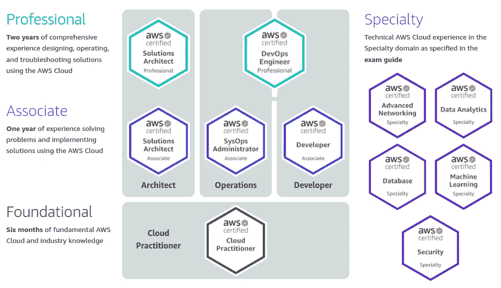
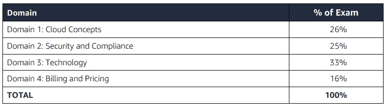

# 我的 AWS 云从业者考试学习指南

> 原文：<https://medium.com/nerd-for-tech/my-study-guide-for-aws-cloud-practitioner-exam-ca6ecf69af44?source=collection_archive---------0----------------------->

## 我会告诉你我的旅程是怎样的，直到我拿到我的第一个认证

资料来源:联合国人类住区规划署

大多数大公司，如 Airbnb、网飞、Nubank 等等，都从云计算中获益。

当我们看云世界的市场份额时， **AWS 是领导者**。因此，由于这是一个新的工作领域，你可以想象有多少工作和机会。

考虑到这一点， **AWS 云从业者可能是进入这个世界的一个良好开端**。

就这样，我最近做了这个考试，以 846/1000 的成绩通过了。所以，为了帮助其他想参加这个认证的人，我写了这篇文章。

在这里，我会给出一些考试前的**小技巧和你必须知道的关于考试**的信息。除此之外，我将分享**我在准备**中使用的内容。

为了做到这一点，我将这篇文章分成以下几个部分:

1.  **我为什么选择 AWS 认证云从业者？**
2.  **考试怎么样？**
3.  我的准备如何？
4.  **结论**

# 1.我为什么选择 AWS 认证云从业者？

正如我之前已经说过的，AWS 是在云计算领域拥有最大市场份额的公司。而且，可能在那里你会发现更多的机会。

好吧！现在我们知道 AWS 是一个很好的选择。看看现有的认证，我们有 11 种选择。要深入了解它，请点击[此处](https://aws.amazon.com/certification/?nc1=h_ls)。

来源:AWS 认证

但是，如你所见，**云实践者是起点**，是基础级别的一部分。

下一节我们就来说说特点和做考前的一些小技巧。

# **2。考试怎么样？**

测试有 65 道题和 **90 分钟**完成。你必须**达到 70%** 才能通过。它的价格是 100 美元。参加**考试中心** **的认证或在线监考**有两种选择。

我选择的是网上监考，没有问题。一个人无时无刻不在监控你。看来我对 AWS 认证很有信心和可信度。

从这个意义上来说，我强烈建议你在开始时间前 30 分钟左右**做好准备，因为评审员要求做很多检查。**

最近，该考试提供以下语言版本:英语、法语(法国)、德语、印度尼西亚语、意大利语、日语、韩语、葡萄牙语(巴西)、简体中文和西班牙语(拉丁美洲)。虽然有很多语言，但我强烈建议你用英语写，因为你在网上发现的大部分内容和疑问都是英语的。

## 考前的一些小技巧:

*   如果你的第二语言是英语，你可以**多花 30 分钟**来做这个测试。要了解更多信息，请点击[这里](https://aws.amazon.com/certification/policies/before-testing/)。
*   如果这不是你第一次参加 AWS 考试，你可以享受五折优惠。
*   AWS 指示的 **Linux 操作系统是一个不受支持的操作系统**。所以，如果你有这个操作系统，你必须使用另一台电脑。

在这个介绍和提示之后，下面，我们来看看测试内容。它分为四个**域**，如下表所示:

来源:AWS 培训和认证

# **3。我的准备怎么样？**

在这里，我整理了所有对你准备有用的材料。**我建议你按照这个顺序从上到下看资料**。

> AWS 提供的云从业者课程(免费)

**课程涵盖所有考试内容，但不深入任何知识**。尽管如此，我认为这是你人生道路上的一个快速起步。

链接:[https://AWS . Amazon . com/training/learn-about/cloud-practicer/](https://aws.amazon.com/training/learn-about/cloud-practitioner/)

> AWS 提供的云从业者书籍(付费)

另一方面，这本**书深入到了所有领域**。所以，如果你第一次没有得到所有的东西，不要沮丧。我推荐这本书的阅读和练习。

链接:[https://www . Amazon . com . br/Certified-Cloud-practitor-Study-Guide/DP/1119490707/ref = ASC _ df _ 1119490707/？tag = Google shopp 00-20&link code = df0&hva did = 379708192938&HV pos =&HV netw = g&hvrand = 8434358227603263999&HV pone =&hvp two =&hvqmt =&hvdev = c&hvdvcmdl =&](https://www.amazon.com.br/Certified-Cloud-Practitioner-Study-Guide/dp/1119490707/ref=asc_df_1119490707/?tag=googleshopp00-20&linkCode=df0&hvadid=379708192938&hvpos=&hvnetw=g&hvrand=8434358227603263999&hvpone=&hvptwo=&hvqmt=&hvdev=c&hvdvcmdl=&hvlocint=&hvlocphy=1001655&hvtargid=pla-774475927562&psc=1)

> AWS 认证云从业者官方实践问题集(免费)

这是**官方实践考试考试(只有 20 题)**，讲的内容、难度、题型都很接近官方考试。我强调建议你做这件事。

链接:【https://explore.skillbuilder.aws/learn/signin 

> 终极 AWS 认证云从业者— 2022 夏羽·马瑞克(付费)

**准备考试你应该知道的一切都在这门课**里。我建议你观看所有的课程，创建一个小抄，并在最后提供模拟考试。

我相信这个考试比官方难。但是，这是一个很好的方法来测试你的知识，直到这个时候。

链接:[https://www . udemy . com/course/AWS-certified-cloud-从业者-new/](https://www.udemy.com/course/aws-certified-cloud-practitioner-new/)

> 6 次实践考试| AWS 认证云从业者 CLF-C01(付费)

这门课是夏羽·马瑞克的另一门课，但只有考试要做。我们总共有六次模拟考试。所有问题都有详细论证的答案，带来了 AWS 的官方文档。

**奖金。以上内容之外的提示:**

> 在 AWS 控制台上练习(自由层)

我已经在工作中使用 AWS 六个月了。最后，这对我帮助很大。但是，如果你没有这个机会尝试，你可以免费创建一个帐户并使用免费服务。

> Viktoria Semaan 的 AWS 提示— LinkedIn(免费)

Viktoria 在 AWS 担任高级合作伙伴解决方案架构师，在 LinkedIn 上拥有超过 6.9 万名粉丝。她在互联网上非常活跃，分享你能想到的关于 AWS 的一切，作为学习的提示和路线图。

链接:[https://www.linkedin.com/in/semaan/](https://www.linkedin.com/in/semaan/)

**其他资源我还没有尝试，但是我收到了很好的反馈**

> 天才实验室

该平台侧重于信息技术认证课程。有课程和实践测试。

链接:[https://www.whizlabs.com/](https://www.whizlabs.com/)

> 云宗师

第一眼看上去，和 Whizlabs 差不多。

链接:[https://acloudguru.com/](https://acloudguru.com/)

# **4。结论**

在这一节中，我将讲述我对旅程的最后考虑。

首先，不仅仅是一个新的徽章和 LinkedIn 上的帖子，你还会在学习期间学到很多东西，尤其是这个路线图。

这条学习路线将大大提高你的 AWS 技能。这次考试的重点是**主要是 EC2、S3、VPC** 。你会看到更多的产品，但没有他们那么深入。

最后，有了这些知识，你可以申请新的**工作和机会**。如果你已经在 AWS 工作，你可以**带来创新和新的解决方案。**

如果你喜欢这篇文章，请在 LinkedIn 上关注我，获取新闻内容:[https://www.linkedin.com/in/matheus-lins-vasconcellos/](https://www.linkedin.com/in/matheus-lins-vasconcellos/)

## **参考文献:**

 [## AWS 认证-验证 AWS 云技能-获得 AWS 认证

### 认证考试指南和详细信息探索我们基于角色的认证和我们在特定领域的专业认证…

aws.amazon.com](https://aws.amazon.com/certification/?nc1=h_ls)  [## 免费云计算服务- AWS 免费层

### 免费体验 AWS 平台、产品和服务探索 100 多种产品并开始…

aws.amazon.com](https://aws.amazon.com/free/?all-free-tier.sort-by=item.additionalFields.SortRank&all-free-tier.sort-order=asc&awsf.Free%20Tier%20Types=*all&awsf.Free%20Tier%20Categories=*all)  [## 测试前| AWS 认证信息和政策| AWS

### 无需完成特定的先决条件，即可获得所有 AWS 认证。但是，AWS 提供了一些建议…

aws.amazon.com](https://aws.amazon.com/certification/policies/before-testing/)  [## Viktoria Semaan -高级合作伙伴解决方案架构师-全球战略合作伙伴-亚马逊网站…

### ➡️ 𝐅𝐨𝐥𝐥𝐨𝐰 𝐦𝐞 𝐚𝐧𝐝 𝐲𝐨𝐮 𝐰𝐢𝐥𝐥 𝐥𝐞𝐚𝐫𝐧 𝐚𝐛𝐨𝐮𝐭 𝐜𝐥𝐨𝐮𝐝 𝐜𝐨𝐦𝐩𝐮𝐭𝐢𝐧𝐠, 𝐡𝐨𝐰 𝐭𝐨 𝐠𝐞𝐭…

www.linkedin.com](https://www.linkedin.com/in/semaan/)  [## 专业人员在线认证培训课程

### 确保您在 AWS、Azure、Java、PMP、敏捷、大数据、Linux 认证考试中取得成功。通过或 100%退款…

www.whizlabs.com](https://www.whizlabs.com/)