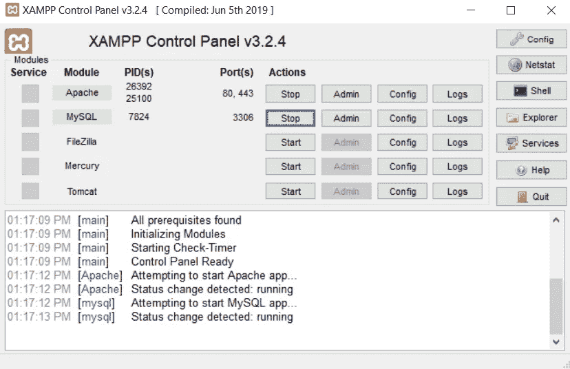
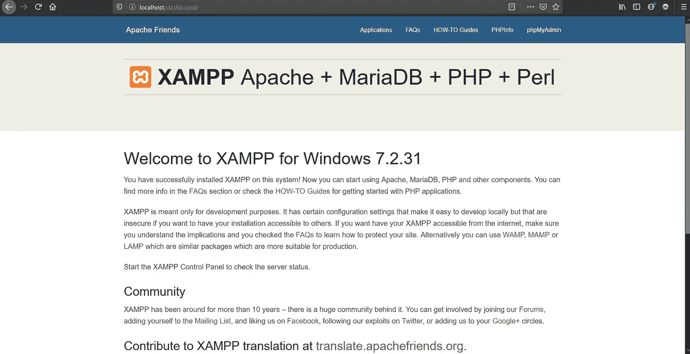
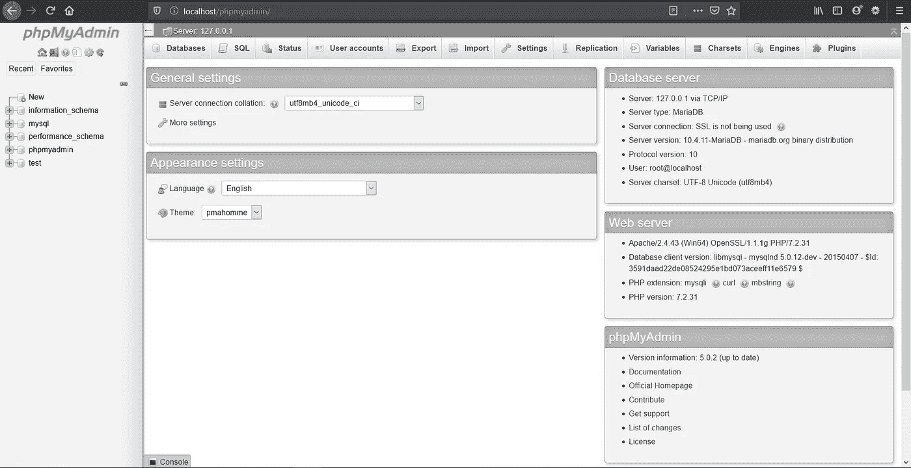
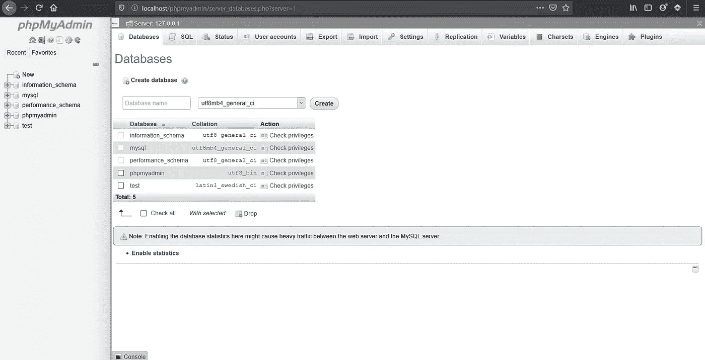
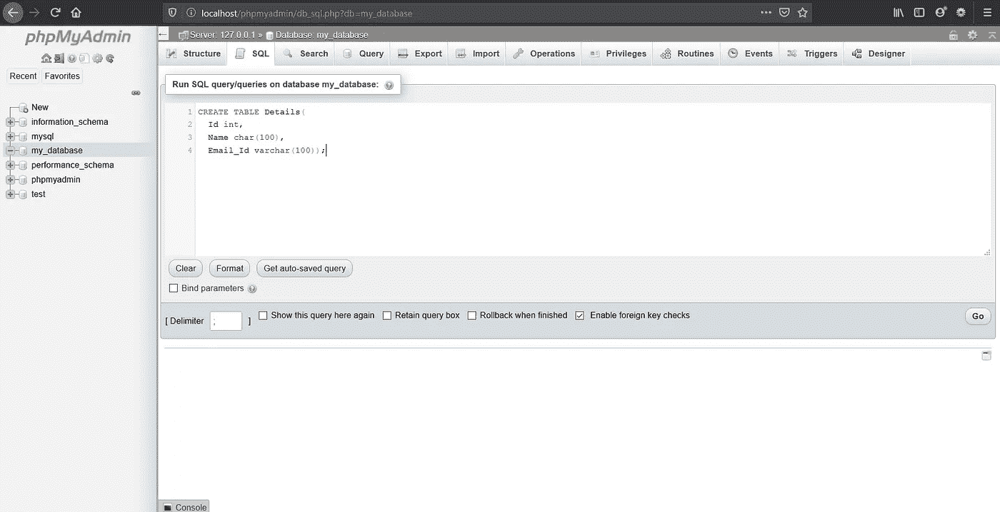
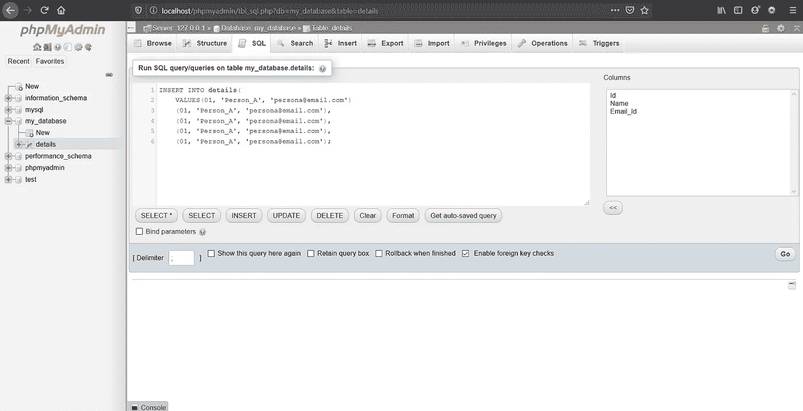
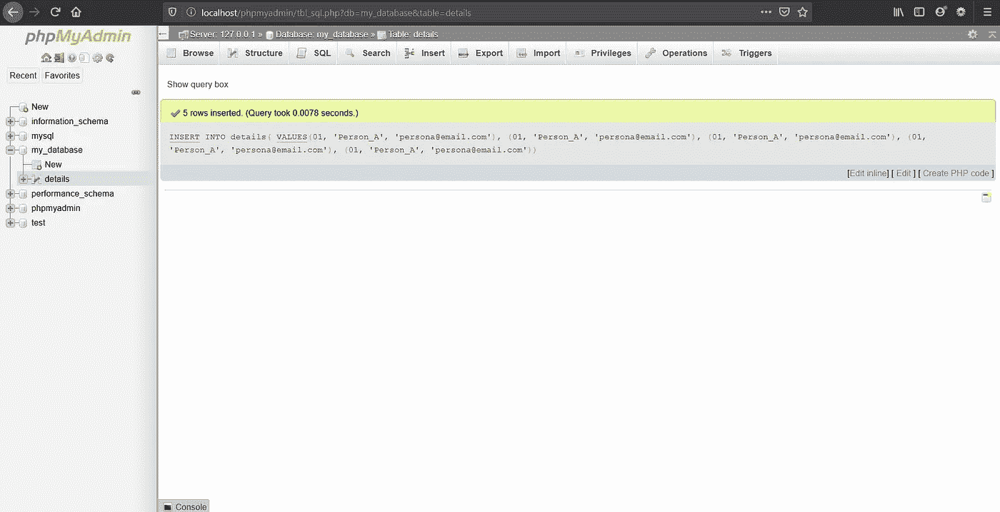
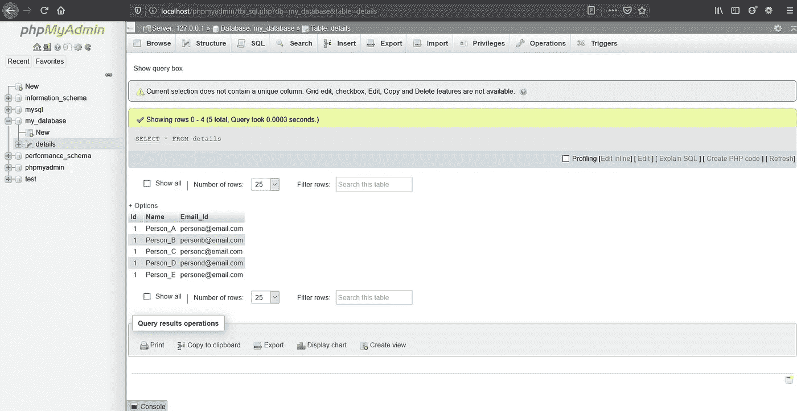
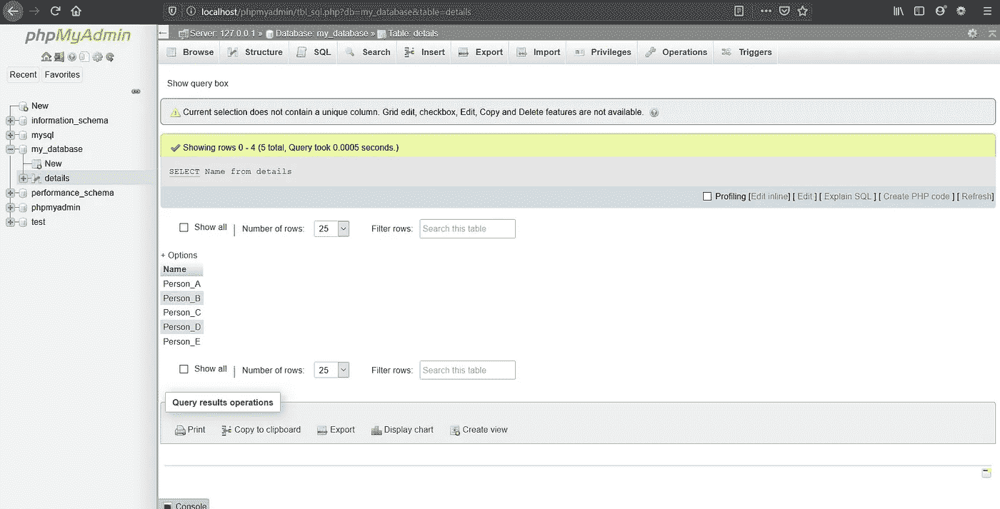

# phpMyAdmin 中的 MySQL 数据库

> 原文：<https://medium.com/nerd-for-tech/mysql-database-in-phpmyadmin-282ce4b60587?source=collection_archive---------0----------------------->

卡斯帕·卡米尔·鲁宾在 [Unsplash](https://unsplash.com?utm_source=medium&utm_medium=referral) 上的照片

每当我们想到后端，“数据库”是我们脑海中的第一个词。它在几乎所有领域都是一个关键的组成部分。拥有数据库的主要方面是存储和检索数据。因此，这里我们将创建一个 MySQL 数据库，然后在 phpMyAdmin 中使用 SQL 查询检索必要的数据。

因此，要开始创建数据库，从 XAMPP 控制面板打开 Apache 和 MySQL 模块。如果你对 XAMPP 服务器不熟悉，不要担心，使用 XAMPP 和 ngrok 通过“[临时虚拟主机”。](/@chiragrathi24/temporary-web-hosting-using-xampp-and-ngrok-86a28d0a1073)

启动 Apache 和 MySQL 模块

现在，我们的 XAMPP 服务器已经成功启动，请按照下面给出的步骤继续操作。

# **在 phpMyAdmin 中创建新的 MySQL 数据库:**

**步骤 1:** 在浏览器上打开“本地主机”。

本地主机仪表板

**步骤 2:** 从 localhost 仪表板的导航栏打开“phpMyAdmin”。

> phpMyAdmin 是一个免费的开源 MySQL 管理工具。它提供了使用用户界面执行操作以及执行 SQL 查询的功能。

phpMyAdmin

**步骤 3:** 点击页面左侧的“新建”按钮。

创建新数据库

在此输入数据库的名称，然后单击“创建”。

成功创建数据库后，数据库的名称将显示在左侧窗格中，您将看到该数据库为空。将显示警告“数据库中没有找到表”。

在下一节中，我们将使用 SQL 语句在数据库中创建一个新表。

# **在 MySQL 数据库中创建新表:**

**步骤 1:** 点击导航栏中的“SQL”按钮。

运行 SQL 查询的页面

在这个页面上，我们可以运行所有的 SQL 查询。

**步骤 2:** 创建一个您想要的任何名称的表，比如我创建了一个名为“Details”的表，它包含三列:Id、name 和 Email_id。

Create table 语句语法

在数据库中创建一个表

现在，单击“GO”继续。

**步骤 3:** 一旦成功创建了表格，我们现在将在表格中输入数据。

向表中输入值的语法

将数据输入表格

**第 4 步:**点击“开始”。当数据成功输入后，您将得到消息“已插入 5 行”。行数将根据您输入的行数而变化，如上面示例中的“5”。

数据输入成功

随着表的创建和数据的成功输入，在下一部分中，我们将运行 SQL 查询来从表中检索所需的数据。

# **在 MySQL 中运行查询:**

**1。**使用‘SELECT’语句显示整个表格。

' SELECT '语句来显示该表

显示表格

**2。**选择“名称”列，仅显示表格中的名称。

用于显示“名称”列的“选择”语句

显示“名称”列

类似地，您可以使用 XAMPP 服务器在 phpMyAdmin 中对 MySQL 数据库执行所有需要的操作。

#Learntocode 快乐学习！😊