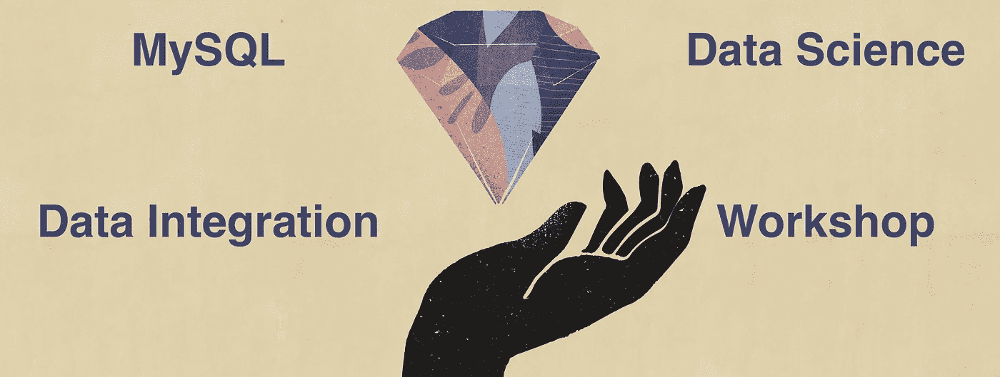
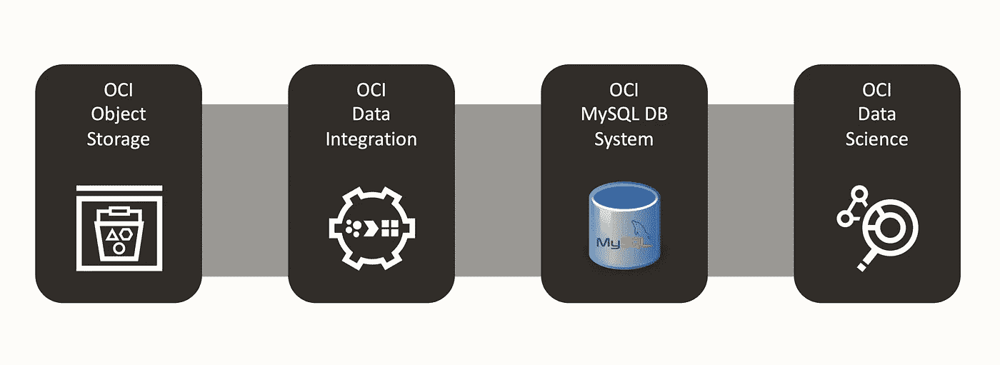
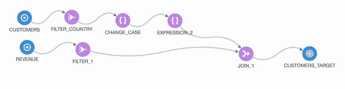
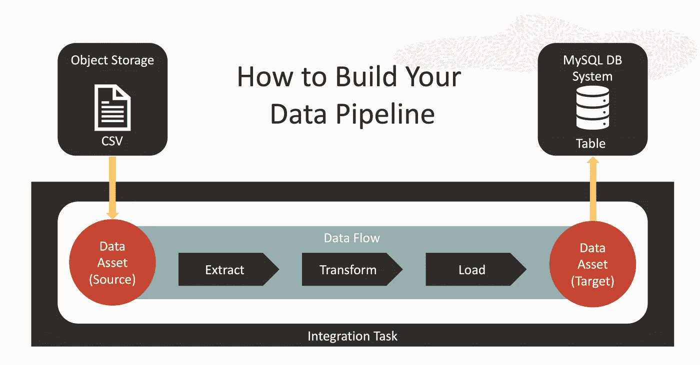
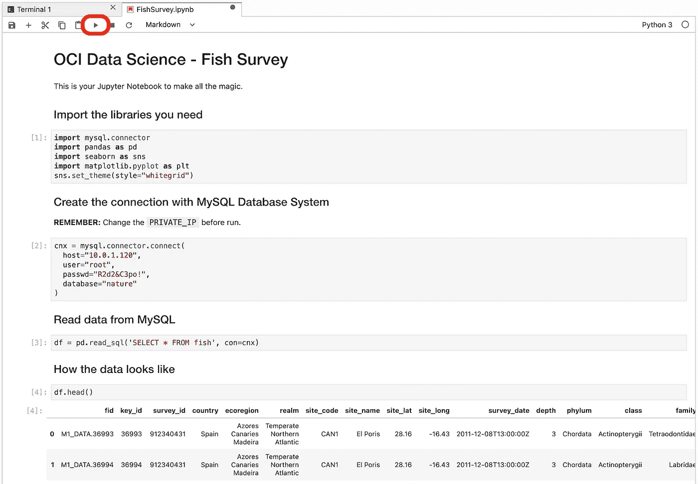

# MySQL、ETL 和 Jupyter 笔记本变得简单

> 原文：<https://medium.com/nerd-for-tech/mysql-etl-and-jupyter-notebooks-made-simple-90d133eb6b0?source=collection_archive---------7----------------------->

MySQL，数据科学和数据集成研讨会

作为一名专业的数据科学家，你的 Jupyter 笔记本只是整个画面的一部分。实现您的 ML 模型是一个过程，就像您用来训练和改进算法的数据一样好。再加上一些脑力、经验和直觉。

在现实世界中，数据存在于许多地方。幸运的是，有许多工具可以帮助你提取、转换和加载这些数据。

数据集成可能看起来不是一个令人兴奋的概念，主要是因为您可能倾向于考虑带有各种存储库和数据库的乏味的遗留连接器。本文想要介绍数据集成是多么令人兴奋:对象存储 CSV 文件、MySQL 数据库(本地和云中)将您的数据放入 Jupyter 笔记本中。让我们开始吧。

我们描述的这组技术是 Oracle 云免费层的一部分。它们包括 Oracle 云基础设施(OCI)中的服务，如:

*   OCI 对象存储
*   OCI 数据集成
*   OCI MySQL 数据库服务
*   OCI 数据科学

OCI 服务携手构建您的数据科学管道。

**您有甲骨文云账户吗？**如果没有，您可以在这里创建一个:

> *请记住，Oracle Cloud 不会向您收取任何费用，除非您明确要求按需付费升级。没问题。*
> 
> [*甲骨文云免费报名*](http://bit.ly/34TzwGf)

# OCI 数据集成

数据集成设计者

特点:

*   云原生
*   无服务器(无需管理)
*   图形界面
*   与 MySQL 的本机集成
*   交互式数据准备
*   由 **Spark-ETL** 提供支持(或 E-LT SQL 下推)

您想要从对象存储(包含数据集之一的 CSV 文件)中移动数据。从技术上讲，它可以是本地和云中的数据库连接。你可以从不同的来源收集信息。

您将把数据源和目标表示为**数据资产**，在这里您可以参数化连接细节。

下一步是创建一个**数据流**，它是 ETL 过程的图形化定义。

最后，您将把这个过程包装在一个可以发布和运行的**集成任务**中。您还可以通过聚合集成任务来构建复杂的管道。

大概是这样的:

# OCI 数据科学

数据科学的例子。

*   全面管理的服务。
*   常见的 Python ML 库: **Jupyter 笔记本**。
*   训练和管理机器学习模型。
*   采用 NVIDIA GPU 和 CUDA 的预配置环境。
*   与其他 OCI 服务的集成。

# MySQL 数据库服务

MySQL 服务

MySQL 数据库服务是唯一 100%由 MySQL 团队开发、管理和支持的数据库服务。MySQL 数据库服务使组织能够使用世界上最流行的开源数据库轻松部署云原生应用程序。与内部数据库管理和来自第三方云平台的“超负荷”版本相比，它节省了大量成本。

# 开始研讨会以了解更多信息

如果您想学习对象存储中的鱼类调查数据集并从中获得乐趣，请将带有数据集成的数据集集成到 MySQL DB 系统中，并使用该数据创建一个 Jupyter 笔记本:您可以按照我的 GitHub 项目中的详细分步指南进行操作:

> [MySQL，数据集成和数据科学研讨会](https://github.com/vmleon/mysql-dataintegrator-datascience-workshop)

# 想了解更多？

专家和 Oracle 云倡导者会定期提供大约 1 小时的免费培训。这些是教师指导的培训。您可以跟随我们的团队现场解决您的问题。

> *加入我关于* [*甲骨文云基础设施不和谐频道*](https://bit.ly/3upz9Rh) *的任何问题。*

敬请关注更多关于 Oracle 云的精彩文章。

> *我是维克多·马丁，一名软件开发人员。我部署在 Oracle 云基础架构上。*
> 
> *随时在*[*LinkedIn*](https://bit.ly/3bRk83W)*上与我联系。*
> 
> 我也对潜水和太空工程感兴趣。乐意帮忙，一切都比火箭科学容易！