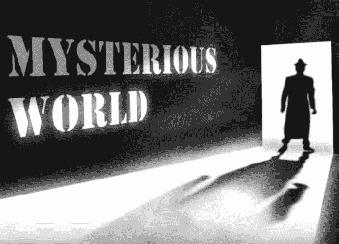
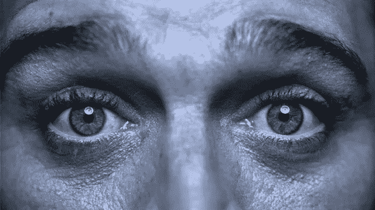
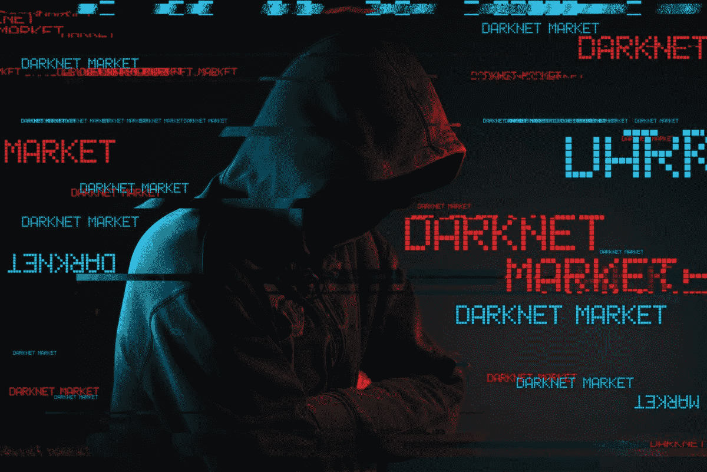
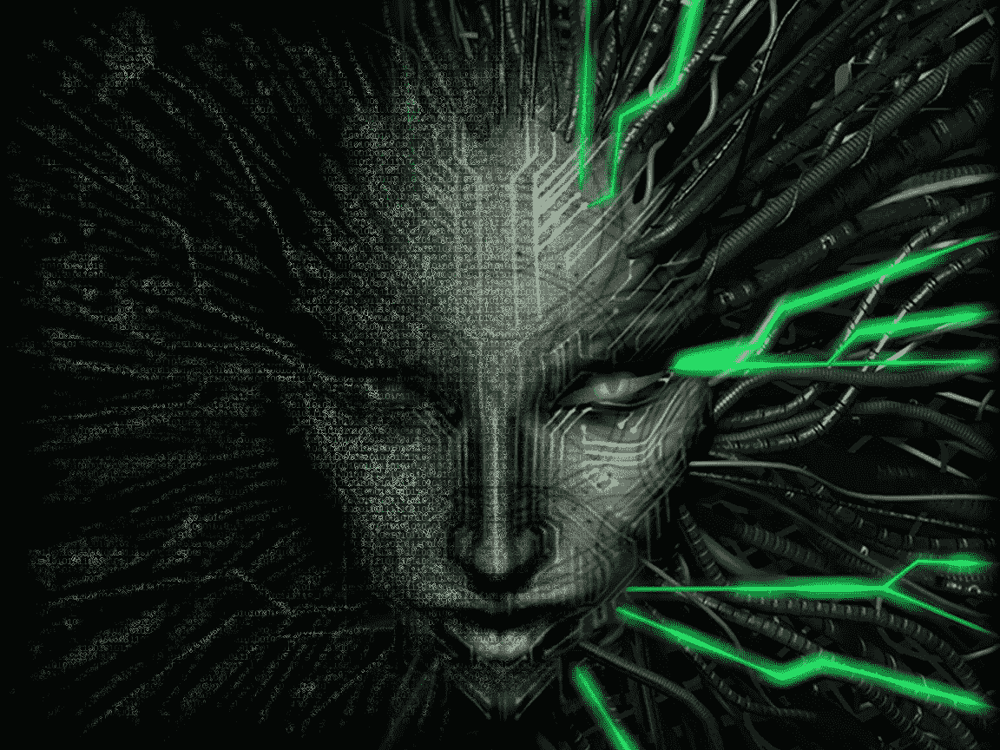
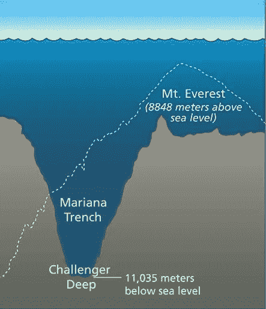
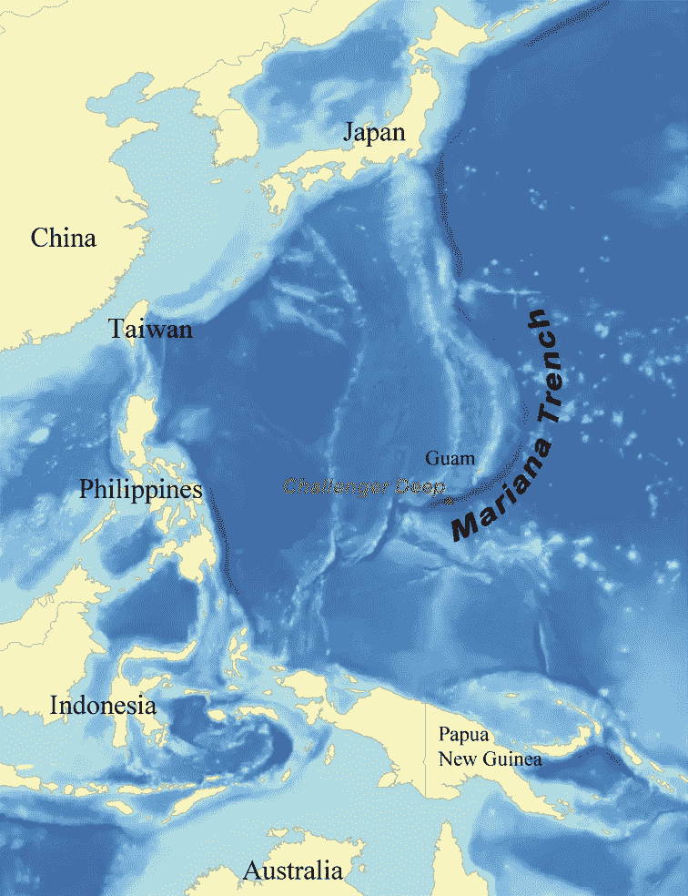
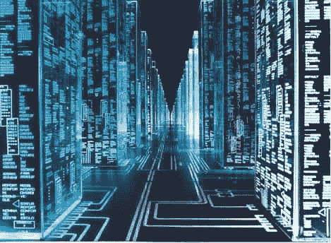
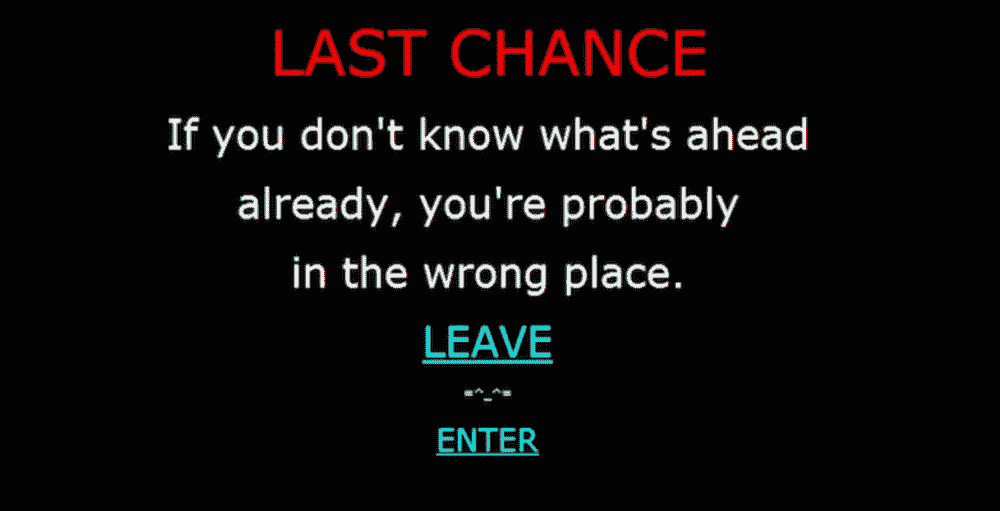

# 互联网神秘的一面

> 原文：<https://medium.com/nerd-for-tech/mysterious-side-of-the-internet-5d2a02e103b7?source=collection_archive---------0----------------------->

## 深——更深——最深！

*   这篇文章是基于我的搜索和网络故事。我没有添加任何虚假点或所有的东西都像幻想和人类自己创造的。没有证据可以证明这些谣言。
*   我们将发现高效搜索互联网的秘密，并精确定位…在本文中，我们探索互联网的 8 个阶段。

1.  **一级——表面网**
2.  **第二级——伯奇网**
3.  **第三级——深层网络**
4.  **第 4 级—特许网页**
5.  **第 5 级—马里亚纳群岛网络**
6.  这一层是马里亚纳群岛网络和第 7 层之间的中介
7.  **第 7 级—雾/病毒汤**
8.  **第 8 级—主要系统**

*   规则对所有人都一样；你想进入的级别越高，你就需要越多的高级工具来配合你越来越高的技能。
*   为了理解等级，你需要知道一些关于深层/黑暗网络的知识，TOR，以及它在哪里被发现。你可以在这里参考我之前关于 Deep/Dark-web [的文章。](/nerd-for-tech/the-hidden-internet-4c239cb3bbd6)

## 那么，让我们开始互联网神秘一面的旅程吧…！！

> **一级—表面网**

*   第一层是表面网，也称为可见网、索引网或光网，可通过正常方式访问；它包含了 YouTube、脸书、Instagram、Twitter、Reddit 等热门网站。
*   它可以通过标准的搜索引擎进行搜索。搜索引擎的几个例子包括 Firefox、BING、GOOGLE 等。每个人都可以进入这个阶段，而且提供的网站也是免费的。虽然也有一些付费网站提供优质内容，比如 YouTube、网飞等的优质版本。

**第二级——Bergie Web**

*   这一层是最后一层:之后的所有层你都必须通过*代理服务器*、Tor- *洋葱路由器、*或者通过修改你的硬件来访问。
*   在这个层面上，你可以找到一些“地下”但仍被索引的网站，如 4chan，这是一个用户匿名发布帖子的 imageboard 网站。
*   有几个像 Kickass Torrents 这样的网站在印度被禁止，但仍然可以通过 VPN(虚拟专用网)访问
*   例如，美国可以访问许多在印度无法访问的网站，所以你可以把你的 VPN 设置到美国，即使在印度被禁止也可以访问这些内容

> **第 3 级—深层网络**

*   该级别的第一部分只能通过使用代理来访问。包含 CP，核心，黑客网站。深度网络从这里开始。Deep web 是常规搜索引擎找不到的整个互联网，96%的 web。
*   这一层的第二部分只能通过 Tor-洋葱路由器访问，这是一种浏览器，使用它可以连接到一个网站，连接方式是通过 Tor 网络中的中继反弹(像弹力球一样)。
*   因此，网站无法知道你是谁，你的隐私是安全的。所以基本上要访问它，你需要很多编码和解码技巧。链接在源代码中被分开，然后你应该把它翻译成二进制语言，你就进入了 Deep Web。

> **第 4 级—特许网页**

*   这个层次也分两部分。第一个可以通过 Tor 访问，是 deep web 访问最多的部分。毒品和人口贩卖，世界各地的禁片，书籍和黑市都存在。
*   它还包含隐藏的维基链接，这是你试图进入深层网络的第一个网站。这就像深层网站进一步提供了到其他深层网页或网站的无限链接。你开始做得越深入，网站就变得越严格，越私密。他们开始询问注册 id、密码；有时信用卡/借记卡的详细信息，供您支付进入网站的费用。
*   在第二部分，Tor 浏览器无法到达这里。所以，有一种特殊的方法可以达到这种程度，叫做“**闭壳系统**”。".
*   在这里，事情变得严重了。宪章网站的这一部分包含了铁杆儿童色情、实验硬件信息、(“钆镓石榴石量子电子处理器”…)，但也包含了更黑暗的信息，如“13 法则”、二战中所做的实验，甚至亚特兰蒂斯的未知位置&超级计算机和人工智能。
*   在这个级别，你可以买到毒品，枪支，以及你在你周围的当地市场上找不到的东西。虽然这并不容易，但要到达那里却是一件大事！

> **第五级——马里亚纳群岛**

*   马里亚纳海沟或马里亚纳海沟位于马里亚纳群岛以东约 200 公里的西太平洋。它包含了地球上已知的最深的点，冒出液态硫和二氧化碳的喷口，活泥火山和适应海平面 1000 倍压力的海洋生物。
*   这是一个互联网，是目前已知的最危险的关卡之一。这个第 5 层的名字取自世界上最深的洞，**马里亚纳海沟。**

*   根据调查，这个地方可能存在，也可能不存在。然而，根据最普遍的共识，这是最安全的数据所在的地方。最常见的“马里亚纳网络”是存放最安全数据的军事网络。
*   要访问马里亚纳网站，你必须面对某种算法&计算机无法完成的计算。为此，你必须致力于量子计算、秘密算法和计算。
*   其中一个传言是，我们可以在需要量子计算机的“**聚合镰状细胞衍生物**”的帮助下访问“**马里亚纳群岛网络**”。量子计算是不公开的，因为它需要一些极端的功能才能工作，所以正常人不能上网。
*   所以我的问题是，
*   如果暗网有类似合同杀手、毒贩、比玛丽安娜网包含的更糟糕的内容，那它甚至比暗网更深？？没有人知道这是否存在，但听起来很酷耶！有没有类似玛丽安娜的网和它下面的东西？或者这一切就像一个笑话，一个传说，或者像**蝉 3301 或光照派一样保持如此秘密？**
*   玛丽安娜的网是奇怪的令人费解的网络秘密。没有确凿的证据证明它的存在，所以这取决于你相信哪个谣言。根据调查，到目前为止，还没有人访问过这个网站。

> **Level- 6 这一层是马里亚纳蹼&和 Level 7** 之间的调停者

*   这一层是马里亚纳群岛网络和第 7 层之间的媒介，也称为雾/病毒汤。
*   这是一个存在的唯一目的的层次。在这一点上，一个人开始得到他们不想要的关注，也就是说，人们来杀你。这听起来可能很戏剧化，但这是事实。这个世界上有些事情只能存在于人们之间，比如毒枭和人贩子，一旦他们知道你知道他们的工作，你的生命就有危险了。这听起来可能不真实，但它正在发生。
*   你需要量子计算来越过第六层，这是事情变得艰难的地方。第七层是大玩家所在的地方。他们都在试图阻止对方。有数亿(或数十亿)美元的业务在争夺控制权。

> **7 级——迷雾/病毒汤**

*   这一层就像一个战区。其他人都在努力达到下一个水平。这基本上就像人们为了拥有世界上唯一的互联网权力而试图推翻对方的斗争。无论是谁达到了这个水平，都是在努力做两件事情中的一件，要么达到第 8 级，要么阻止别人达到第 8 级。他们试图以任何必要的方式阻止其他人达到 8 级。
*   第七层被称为“雾”或“病毒汤”，因为整个事情充满了这么多的无限代码，试图摧毁其他人在那里探头探脑。代码，代码，代码，代码是你在这个层次会发现的。
*   简而言之，每个人都因为下面的系统的价值而努力不让其他人进来。

> **第 8 级—主要系统**

这是网络的最后一层。这简直太疯狂了。

*   8 级是不可能被量子计算机直接访问甚至访问的。
*   初级系统是当时控制互联网的东西。没有政府能控制它。没人知道这是什么。这是 21 世纪初超级深度网络扫描发现的深度网络中心的异常现象。
*   该系统被认为是无反应的，但它随机向整个网络发出不可更改的命令。

如果你像我一样对探索互联网的神秘世界更感兴趣，那么你应该看看这些纪录片/电影。

 [## 丝绸之路(2021)](https://www.imdb.com/title/tt7937254/)  [## 黑暗网络中的“地平线”(电视 2014 集)](https://www.imdb.com/title/tt4009820/)  [## 深入黑暗的网络(电视电影 2016)](https://www.imdb.com/title/tt5596398/) 

*   [https://topdocumentaryfilms.com/inside-dark-web/](https://topdocumentaryfilms.com/inside-dark-web/)

对许多人来说，这些秘密网页的整个想法和他们的每一个秘密只是在秘密网上…你怎么看？别忘了点赞&评论！

***感谢阅读……*😊😊**