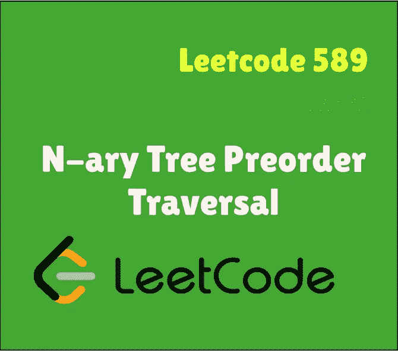
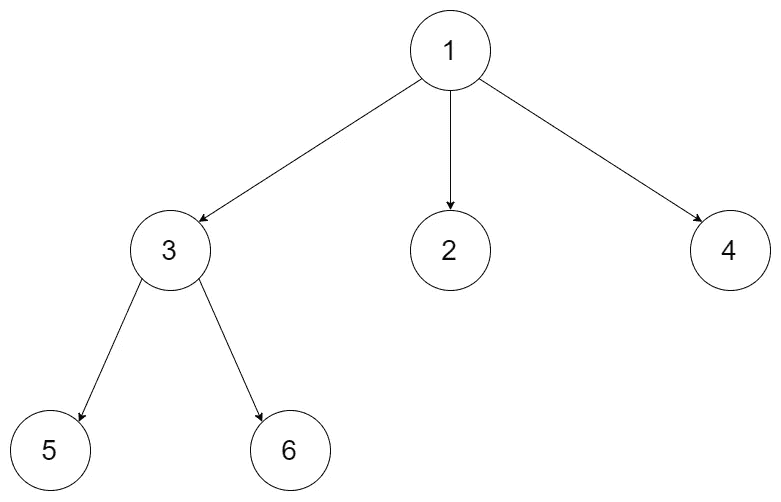
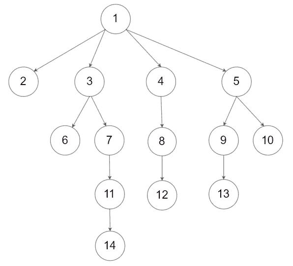

# Swift Leetcode 系列:N 元树前序遍历

> 原文：<https://medium.com/nerd-for-tech/n-ary-tree-preorder-traversal-afcabc3ec313?source=collection_archive---------13----------------------->

## 迭代+递归= Leetcode 589

[](https://theswiftnerd.com/n-ary-tree-preorder-traversal-leetcode-589/) [## n 元树前序遍历(Leetcode 589)

### 难度:链接:April Leetcoding 挑战:第 20 天给定一个 n 元树的根，返回…

theswiftnerd.com](https://theswiftnerd.com/n-ary-tree-preorder-traversal-leetcode-589/) 

你也可以通过上面的链接在 Swift Nerd 博客上阅读完整的故事。

# 问题陈述

给定 n 元树的`root`，返回*其节点值*的前序遍历。

四叉树输入序列化以它们的层次顺序遍历来表示。每组子代由空值分隔(参见示例)

**例 1:**



```
**Input:** root = [1,null,3,2,4,null,5,6]
**Output:** [1,3,5,6,2,4]
```

**例 2:**



```
**Input:** root = [1,null,2,3,4,5,null,null,6,7,null,8,null,9,10,null,null,11,null,12,null,13,null,null,14]
**Output:** [1,2,3,6,7,11,14,4,8,12,5,9,13,10]
```

# 限制

*   树中的节点数量在范围`[0, 104]`内。
*   `0 <= Node.val <= 104`
*   n 叉树的高度小于等于`1000`。

**跟进:**递归求解很简单，你能迭代吗？

# 解决办法

# 递归的

使用递归，这个问题相当简单。在二叉树的前序遍历中，我们首先递归地遍历左子树，然后是右子树。这里，子节点以层级顺序的形式出现在一个数组中。因此，我们可以在 for 循环中遍历节点，并在当前元素上递归调用遍历函数。我们创建一个输出数组来存储结果，首先添加根，最后在遍历整个树之后，简单地返回输出数组。

# 跟进:迭代

如果我们仔细观察，所有遍历(前序、中序、后序)都是对树的深度优先搜索，而树是一种特殊的祖先图。所以我们可以在树上使用深度优先遍历，使用堆栈并处理节点。方法是:-

1.  创建一个空堆栈来存储叶节点
2.  将根节点推送到堆栈上。
3.  创建一个输出数组来存储已处理的元素
4.  当堆栈不为空时，从堆栈中弹出()元素，添加到输出结果中，以相反的顺序添加子节点。
5.  最后返回输出数组

为什么我们需要以相反的顺序添加子节点？因为问题中给出子节点是按层次顺序序列化的，而且由于*栈是一个****LIFO****结构*，*我们需要先将右节点加入栈，最后将左节点加入栈，这样左节点最先弹出*。在 Swift 中，我们可以直接调用数组上的 **reversed()** ，而在 C++中，我们必须反向遍历迭代器，在 python 中，我们可以使用**切片操作符**(**[::-1】**)。

## 密码

# 复杂性分析

每个元素都被遍历一次。由于递归，堆栈空间将是 O(h)，其中 h 是树的最大高度。我们也可以说 ***O(logn)*** 因为`h`以`logn`为界。同样在迭代方法中，因为我们使用了与递归调用相同的堆栈，所以空间会受到 **LogN** 的限制。

时间= **O(N)**

Space = **O(LogN)**

感谢您的阅读。如果你喜欢这篇文章，并发现它很有用，请分享并像野火一样传播它！

你可以在[the swift nerd](https://theswiftnerd.com/)|[LinkedIn](https://www.linkedin.com/in/varunrathi28/)|[Github](https://github.com/varunrathi28)上找到我