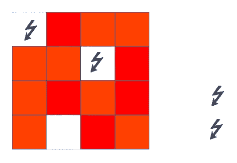
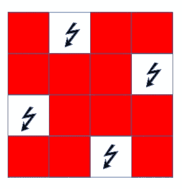
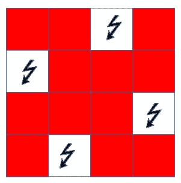
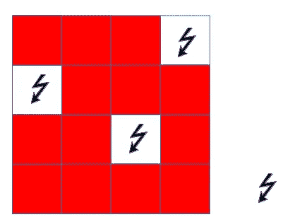

# 回溯的 n 皇后问题

> 原文：<https://medium.com/nerd-for-tech/n-queen-problem-with-backtracking-1f2eb0b331d9?source=collection_archive---------5----------------------->

N-Queen 问题像大多数 bitchin 问题一样伤脑，但是一旦解决了…

是的，你仍然会感到痛苦，因为生活毫无意义，你所做的一切都无关紧要。

不管怎样，让我们继续解决这个问题吧。

N 皇后要求我们在 N 边的棋盘上排列 N 个皇后，我用一个 4x4 来理解，但是写出 n= 8 的代码。你可以扩展代码到你想要的程度，但是因为我们要使用回溯，你不希望边太多。

因此，要在 4x4 棋盘上排列 4 个皇后，首先我们可以将第一个皇后放在左上角。所以下一个女王会在第三列第二排。但是现在我们不能把皇后放在第三排。所以这个不行。



接下来，我们将第一个皇后放在第一行的第二列。接下来，我们可以将第 2 行皇后放在第 4 列，第 3 行放在第 1 列，第 4 行放在第 3 列。



耶，我们有了第一个解决方案。(是的，我们不能用的正方形做一个纳粹党所用的十字记号的形状，这很讽刺，因为……你知道，因为..你懂的)。我们可以将它保存为[2，4，1，3]

最酷的是，这种安排的镜像也给了我们一个解决方案，所以…



也是一个解决方案(再次与该死的纳粹党徽..抱歉伙计们)。我们可以将这个解保存为[3，1，4，2]

如果将皇后放在第二行的第二列，将皇后放在第四列不会给出解决方案(因为这是我们尝试的第一种情况的镜像)，但是让我们看看如果将皇后放在第二行第一列会发生什么。



没有。也就是说它的镜像也不起作用。真扫兴。

因此，对于这个 4x4 皇后问题，我们有两种解决方案— [3，1，4，2]和[2，4，1，3]。显然，解决方案不会这样保存。只是在执行前巩固知识。我们不是在这里写研究论文。

好吧，这一切都很好，但计算机有太多重要的事情要考虑，而不是做这种缓慢的工作，所以让我们用 Java 编写代码。

首先，我们启动我们的棋盘

```
int[][] board = new int [N][N];
for ( int i = 0; i < N; i++)
 {
    for ( int j = 0; j < N; j++)
    {
       board[i][j] = 0;
    }
 }
```

接下来，我们创建一个实用程序来解决 n 皇后问题。

```
private boolean solveUtil(int[][] board, int column)
 {
 // if all queens placed then true
    if (column >= N)
    {
       return true;
    }

 // iterate through the rows
    for ( int row = 0; row < N; row++ )
    {
       if (safe(board, row, column))
       { // if queen is safe to be placed in a column, place it there
          board[row][column] = 1;

 // recur to place the rest of the queens
          if (solveUtil(board, column + 1))
          {
             return true;
          } // if no queen can be placed at the next column, backtrack
          board[row][column] = 0;
       }
    }

 // if queen can’t be placed anywhere
    return false;
 }
```

现在，我们需要检查哪些方块实际上没有受到女王的影响

```
private boolean safe(int[][] board, int row, int column)
 {
    int i, j;

 // if there’s a queen already placed on the row
    for (i = 0; i < column; i++)
    {
       if (board[row][i] == 1)
       {
          return false;
       }
    }

 // if there’s a queen already placed on the column
    for (i = 0; i < row; i++)
    {
       if (board[i][column] == 1)
       {
          return false;
       }
    }

 // if there’s a queen on the upper left diagonal
    for (i = row, j = column; i >= 0 && j >= 0; i — , j — )
    {
       if (board[i][j] == 1)
       {
          return false;
       }
    }

 // if there’s a queen on the upper right diagonal
    for (i = row, j = column; i >= 0 && j < N; i — , j++)
    {
       if (board[i][j] == 1)
       {
          return false;
       }
    }

 // if there’s a queen on the lower left diagonal
    for (i = row, j = column; i < N && j >= 0; i++, j — )
    {
       if (board[i][j] == 1) 
       {
          return false;
       }
    }

 // if there’s a queen on the lower right diagonal
    for (i = row, j = column; i < N && j < N; i++, j++)
    {
       if (board[i][j] == 1)
       {
          return false;
       }
    } // for all the other squares
    return true;
 }
```

最后，我们把所有东西放在一起:

```
public class NQueen
{
    public static void main(String[] args)
    {
        Queen q1 = new Queen();
        q1.solve();
    }

    public static class Queen
    {
        private final int N = 16;

        public boolean solve()
        {
            // initiate board
            int[][] board = new int [N][N];
            for ( int i = 0; i < N; i++)
            {
                for ( int j = 0; j < N; j++)
                {
                    board[i][j] = 0;
                }
            }

            if (!solveUtil(board, 0))
            {
                System.*out*.println("Solution doesn't exist");
                return false;
            }
            else
            {
                printBoard(board);
                return true;
            }
        }

        private void printBoard(int[][] boardToPrint)
        {
            for (int i = 0; i < N; i++)
            {
                for (int j = 0; j < N; j++)
                {
                    System.*out*.printf(" " + boardToPrint[i][j] + " ");
                }
                System.*out*.println();
            }
        }

        private boolean solveUtil(int[][] board, int column)
        {
            // if all queens placed then true
            if (column >= N)
            {
                return true;
            }

            // iterate through the rows
            for ( int row = 0; row < N; row++ )
            {
                if (safe(board, row, column))
                {
                    // if queen is safe to be placed in a column, place it there
                    board[row][column] = 1;

                    // recur to place the rest of the queens
                    if (solveUtil(board, column + 1))
                    {
                        return true;
                    }
                    // if no queen can be placed at the next column, backtrack
                    board[row][column] = 0;
                }
            }

            // if queen can't be placed anywhere
            return false;
        }

        private boolean safe(int[][] board, int row, int column)
        {
            int i, j;

            // if there's a queen already placed on the row
            for (i = 0; i < column; i++)
            {
                if (board[row][i] == 1)
                {
                    return false;
                }
            }

            // if there's a queen already placed on the column
            for (i = 0; i < row; i++)
            {
                if (board[i][column] == 1)
                {
                    return false;
                }
            }

            // if there's a queen on the upper left diagonal
            for (i = row, j = column; i >= 0 && j >= 0; i--, j--)
            {
                if (board[i][j] == 1)
                {
                    return false;
                }
            }

            // if there's a queen on the upper right diagonal
            for (i = row, j = column; i >= 0 && j < N; i--, j++)
            {
                if (board[i][j] == 1)
                {
                    return false;
                }
            }

            // if there's a queen on the lower left diagonal
            for (i = row, j = column; i < N && j >= 0; i++, j--)
            {
                if (board[i][j] == 1) {
                    return false;
                }
            }

            // if there's a queen on the lower right diagonal
            for (i = row, j = column; i < N && j < N; i++, j++)
            {
                if (board[i][j] == 1)
                {
                    return false;
                }
            }

            return true;
        }
    }
}
```

这些问题可能看起来是多余的，它们很可能是多余的，但是解决起来很有趣，所以谁在乎呢🤷。直到下次🤘🙏