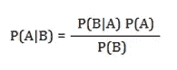
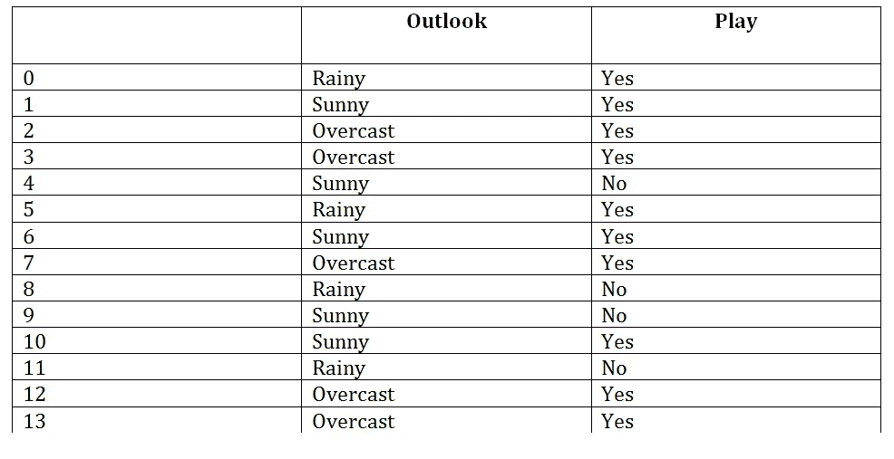
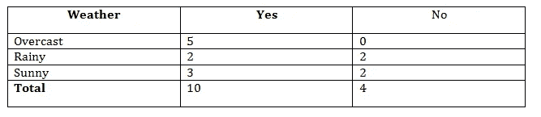
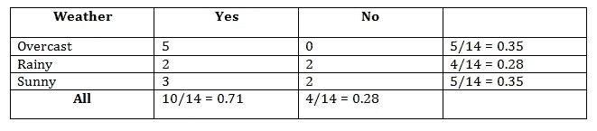
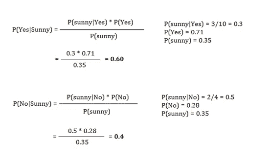
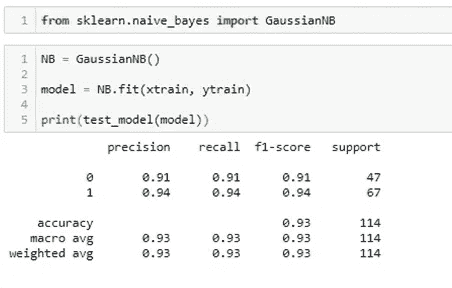

# 监督线性分类中的朴素贝叶斯方法；

> 原文：<https://medium.com/nerd-for-tech/na%C3%AFve-bayes-method-in-supervised-linear-classification-6391713f0e65?source=collection_archive---------10----------------------->

朴素贝叶斯是一种最有效和最有用的机器学习算法，可以做出相当准确的分类预测。它是一个概率分类器，专门根据类的概率进行工作。

该算法基于**贝叶斯** **定理**，该定理指出一个特征的出现独立于另一个特征的出现。很少有标志识别任何类别。如果一个符号不依赖于任何其他符号，我们仍然认识到这个类别。一个我们经常看到的苹果的著名例子。如果果实是心形结构，颜色和味道都是红色的，我们很容易就能像苹果一样识别出来。这里所有的特性都是相互独立的。每个特征都代表了它自己的分类标准。

这个概念用贝叶斯法则来描述，或者我们可以说是贝叶斯定律。因此我们将这种算法命名为“朴素贝叶斯机器学习算法”。贝叶斯定理的公式由下式给出:

其中:

P(A|B) =后验概率:A(假设)在偶数 B 上的概率。

P(B|A) =似然概率:证据概率证明 P(A)为真。

P(A) =先验概率:观察证据之前假设的概率[P(A)]。

P(B) =边际概率:证据的概率。

**让我们用一个真实的例子来看看朴素贝叶斯分类器的工作:**

根据天气变化，我们必须预测玩家是否会玩游戏。如果玩，那么玩家在任何天气下玩游戏的概率是多少？让我们观察对应于天气和玩家游戏的一组游戏的训练数据。

**数据集:**

原始数据集

**上述数据集的频率表:**

**上述频率表的似然表:**

**应用贝叶斯定理:**

从上面的计算，我们估计 **P(是|晴)> P(否|晴)**。这最终宣告，**在一个晴朗的日子，玩家将玩游戏**。

我会给你一个简单的结构，我们的主要目的是计算一个类进入事件的概率。概率越大，该类出现的机会就越接近该类。

**朴素贝叶斯算法的优点:**

*朴素贝叶斯是最快、最简单的机器学习算法之一。

*它可用于二进制和多类分类。

*它在多类分类中的表现优于其他算法。

*基本上是用来处理文本分类问题的。

**劣势:**

这种算法对于特征与因变量的关系没有任何意义，因为所有特征都假装是独立的，它不能学习特征的关系。

朴素贝叶斯算法的 Python 代码:

用于测试预测的 Python 代码

在这里，我们得到了 93%的测试数据模型的准确性。这似乎非常有利于预测。