# 朴素贝叶斯

> 原文：<https://medium.com/nerd-for-tech/naive-bayes-10e321dd7b69?source=collection_archive---------1----------------------->

# 朴素贝叶斯分类算法

*   朴素贝叶斯算法是一种监督学习算法，基于贝叶斯定理，用于解决分类问题。
*   它主要用于包含高维训练数据集的*文本分类*。
*   朴素贝叶斯分类器是一种简单且最有效的分类算法，有助于建立快速机器学习模型，从而做出快速预测。
*   它是一个概率分类器，这意味着它根据对象的概率进行预测。
*   朴素贝叶斯算法的一些流行例子是垃圾邮件过滤、情感分析和文章分类。

# **#贝叶斯数学**

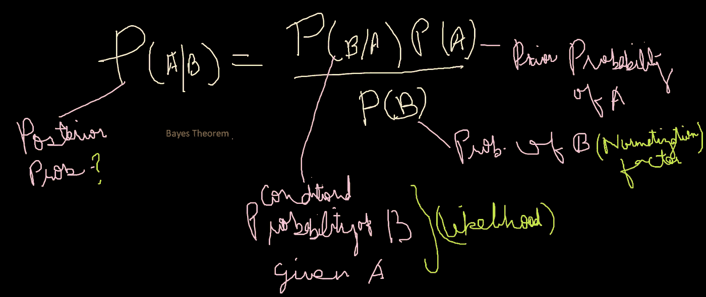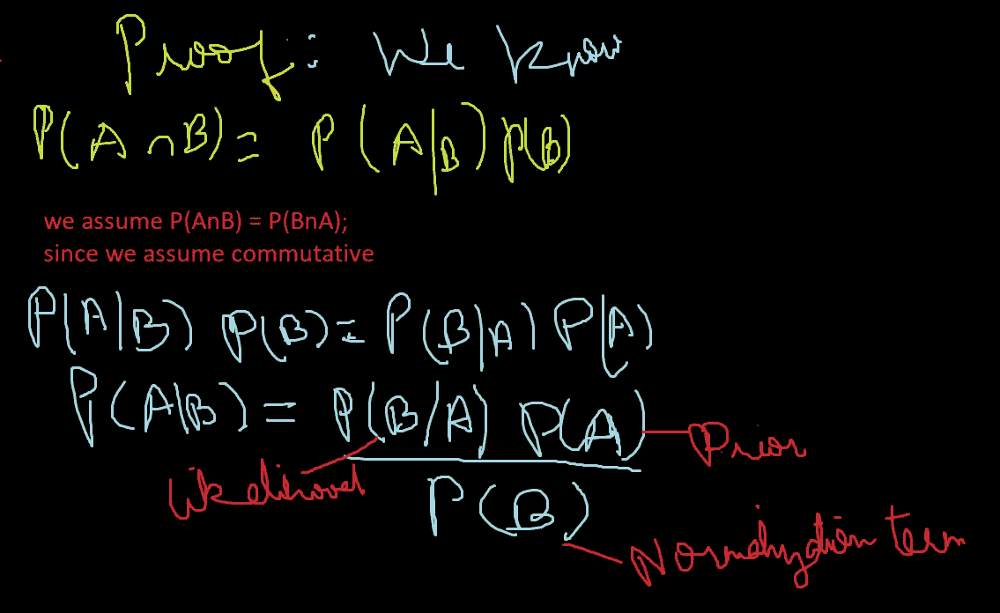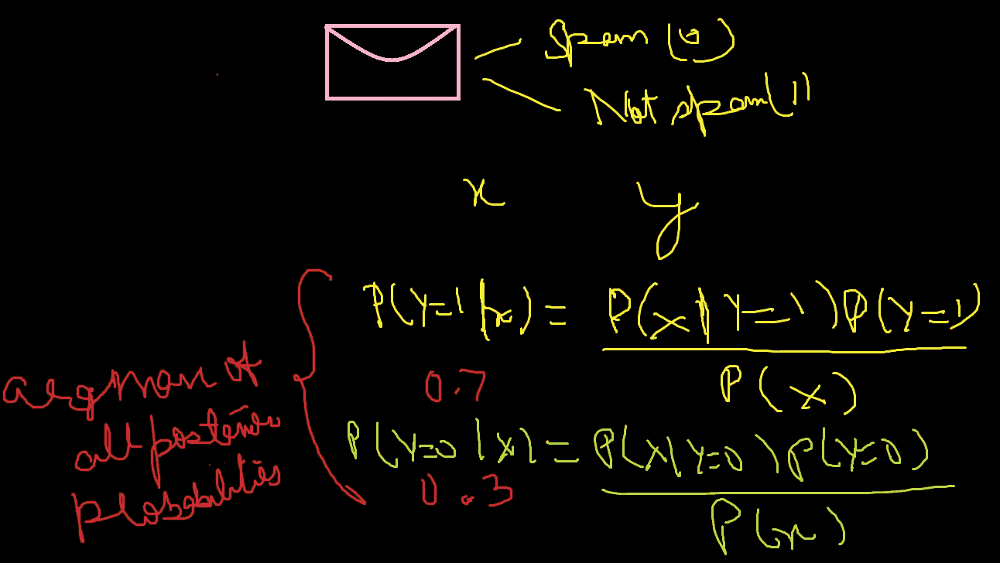

#编码

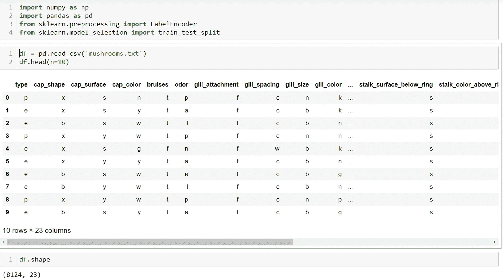

# **#将数据转换成数值数据**

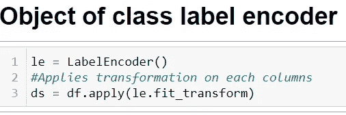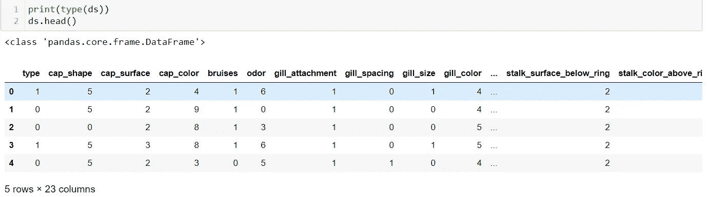

# **#转换成 numpy 数组**

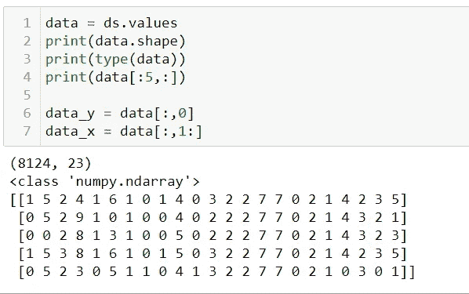

# **#培训和测试**

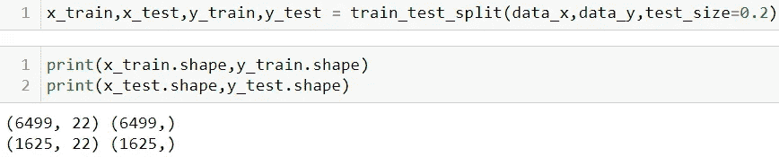

# **#蘑菇的种类**

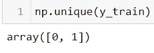

**#数据框中的 p 型和 e 型**

# **# #构建我们的朴素贝叶斯分类器**

我们需要一个函数来计算数据集中每个类的先验概率

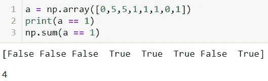

**#提示**

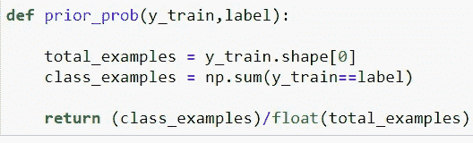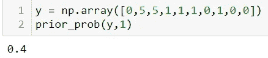

**#提示**

# #条件概率

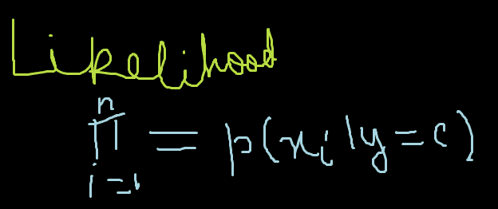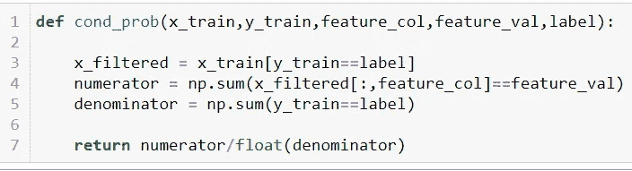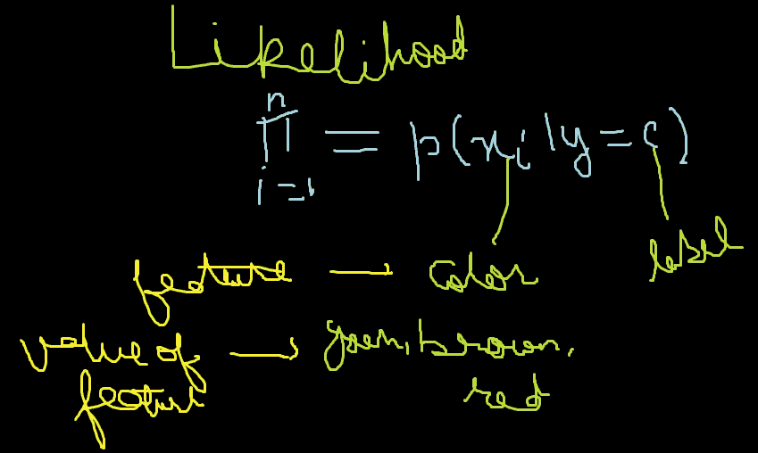

**#提示**

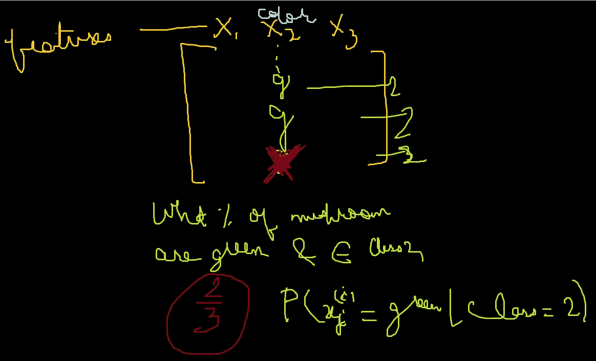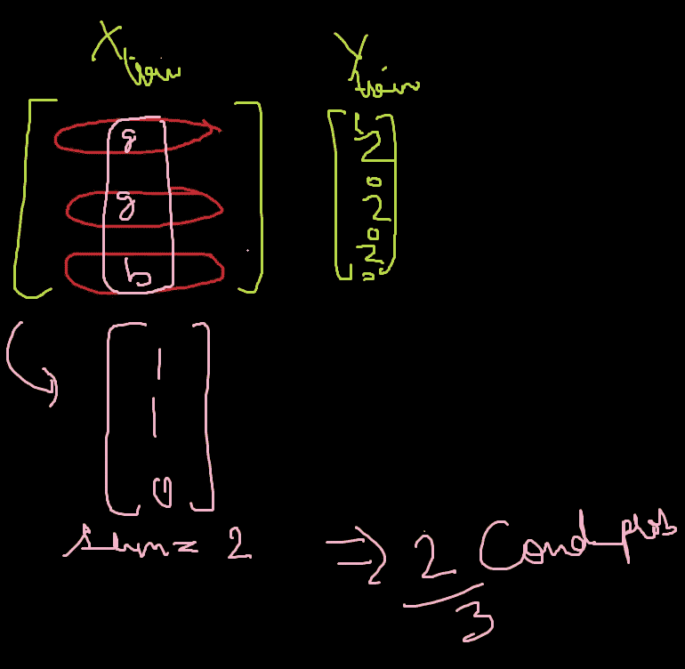

# **#计算每个测试实例的后验概率，并进行预测**

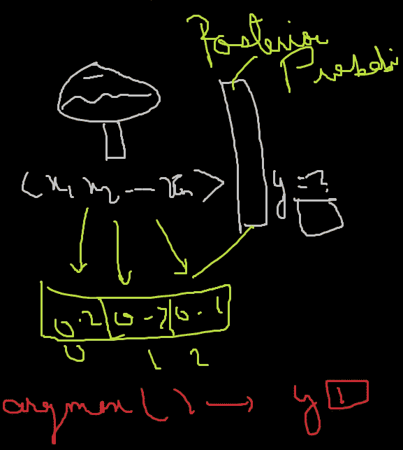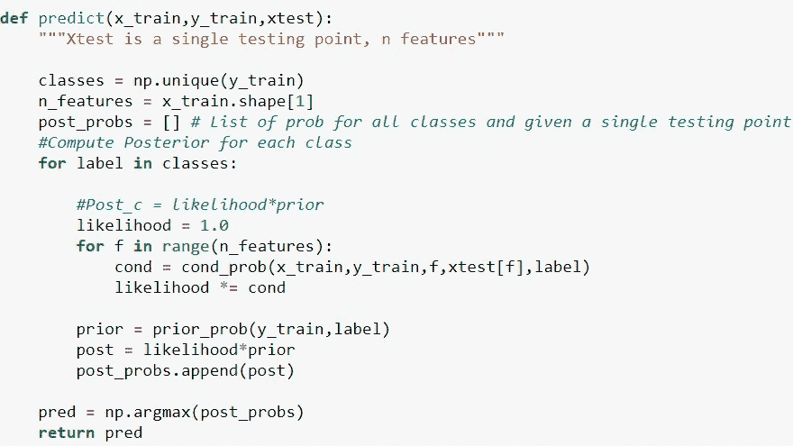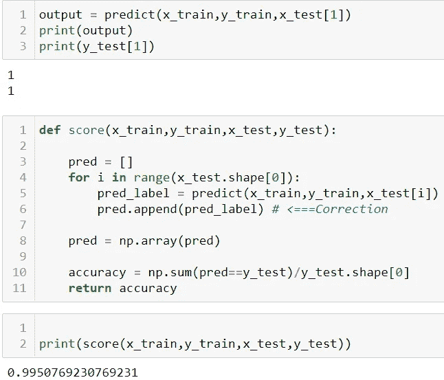