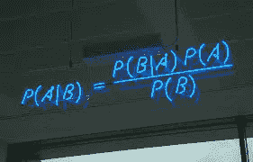
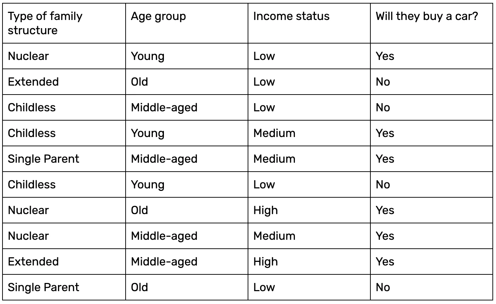

# 机器学习中的朴素贝叶斯算法

> 原文：<https://medium.com/nerd-for-tech/naive-bayes-algorithm-in-machine-learning-ca4c896d95b7?source=collection_archive---------19----------------------->

**为 ML 爱好者和爱好者设计的改变游戏规则的算法**

N aive Bayes 是一种概率算法，通常用于分类问题。朴素贝叶斯简单、直观，但在许多情况下表现惊人地好。朴素贝叶斯算法之所以称为“朴素”，是因为它假设某个特征的出现独立于其他特征的出现。

# 朴素贝叶斯算法背后的数学

简单写成**p(a | b)=【p(b | a)⋅p(a)】/p(b)**

朴素贝叶斯标准公式

所以这里的“A”代表类，例如球或任何东西。“B”代表单独计算的特性。贝叶斯定理简化了后验概率的计算，它提供了一种方法，即从 P ( A)，P ( B)和 P ( B| A)计算 P ( A| B)。

*   P ( A | B)是 A 类给定预测值(特征)的后验概率。
*   P ( A)是类的概率。
*   P ( B | A)是似然性，它是给定类别的预测值的概率。
*   P ( B)是预测值的早期概率。

朴素贝叶斯分类器采用的假设实际上是一个强大的假设，即预测值(B)对给定类(A)的影响独立于其他预测值。因为假设，也叫类条件独立。

# **朴素贝叶斯的例子**

一个清晰的例子可以让你深入了解上面的等式是如何付诸实践的。让我们考虑一个由 10 个数据样本组成的简单数据集:

数据由 10 个数据样本记录组成

给定三个输入——例如，单亲、年轻和低——我们想计算这些人买车的概率。让我们用朴素贝叶斯。

首先，让我们计算给定数据的输出标签的概率(P(Y))。

**P(否)= 4/10**

**P(是)= 6/10**

现在让我们来计算证据可能性的概率。给定输入无子女、年轻和低，我们将计算两个分类标注的概率，如下所示:

P(单亲|是)= 1/6
P(单亲|否)= 1/4
P(年轻|是)= 2/6
P(年轻|否)= 1/4
P(低|是)= 1/6
P(低|否)= 4/4

因为 P(X1) * P(X2) * … * P(Xn)在计算“是”和“否”输出标签的概率时保持不变，所以我们可以消除该值。

因此，后验概率计算如下(注意 *X* 是测试数据):

P(是|X) = P(单亲|是)* P(年轻|是)* P(低|是)= 1/6 * 2/6 * 1/6 = 0.0063

P(No|X) = P(单亲|No) * P(年轻|No) * P(低|No) = 1/4 * 1/4 * 4/4 = 0.0625

最终概率是:

P(是| X)= 0.0063/(0.0063+0.0625)= 0.09
P(否| X)= 0.0625/(0.0063+0.0625)= 0.91

因此，结果清楚地表明，汽车可能不会被购买。

我们之前提到过，该算法的“幼稚”之处在于它假设每个特征都是相互独立的。我们根据这一假设计算了输出标签的概率，因此每个特征都具有相同的贡献，并且独立于所有其他特征。这确实是一个天真的假设。

# 朴素贝叶斯算法的 python 实现

用 Python 实现和构建朴素贝叶斯算法。第一步是导入所有必需的库。

*   *导入* NumPy 作为 np
*   *进口*熊猫当 pd
*   *from*sk learn . naive _ Bayes*import*GaussianNB
*   *从* sklearn .预处理*导入* LabelEncoder
*   *从*sk learn . model _ selection*导入* train_test_split
*   *从* sklearn.metrics *导入* accuracy_score

> **实施朴素贝叶斯算法的步骤**

朴素贝叶斯算法的主要目的是计算具有属于特定类别的特征向量 f1，f2，…，fn 的对象的条件概率。下面是一些要实现的步骤。

***1。数据加载*** *:*

从任何文件加载数据

将其格式化为“xls”或“CSV”文件格式

将其分为训练数据集和测试数据集。

**2。准备数据** *:*

总结训练数据集的属性，以计算进行预测的概率。

***3。生成预测*** :

使用步骤 2 中的训练数据集，清理并组织它。

对测试数据集生成单个预测。

***4。绩效评估*** :

评估模型

重复步骤 2、3 和 4 以提高预测的准确性。

找出误差最小的地方

***5。清理和定稿*** *:*

清理、组织和润色预测模型代码

使用包含所有元素的预测模型来呈现完整的质量代码

实现并保存算法的代码。

# 朴素贝叶斯各种应用

朴素贝叶斯算法在大量的现实生活场景中使用，例如

1.  **文本分类**:用作文本分类的概率学习方法。当涉及到文本文档的分类，即文本文档是否属于一个或多个类别(类)时，朴素贝叶斯分类器是最成功的已知算法之一。
2.  多类预测:如前所述，当输出变量有两个以上的类时，朴素贝叶斯工作得很好。
3.  **推荐系统**:朴素贝叶斯算法结合协同过滤用于构建混合推荐系统，帮助预测用户是否喜欢给定的资源。
4.  **文本分类**:文本分类还包括垃圾邮件过滤和情感分析等子应用。由于朴素贝叶斯最适合处理离散变量，因此它在这些应用程序中也能很好地工作。

# 朴素贝叶斯算法的利与弊

每个硬币都有两面。朴素贝叶斯算法也是如此。它有优点也有缺点，列举如下:

> **优点如下:**

*   朴素贝叶斯易于掌握，并且可以快速预测类别标签。在多类预测上也表现不错。
*   它可以有效地处理大型数据集。
*   它可以用于多类预测问题。
*   当输入值是分类值而不是数字值时，它的性能很好。在数字的情况下，假设正态分布来计算概率(钟形曲线，这是一个强假设)。
*   当独立性假设成立时，朴素贝叶斯分类器与其他模型(如逻辑回归)相比表现更好。

> **缺点如下:**

*   如果分类变量在测试数据集中有一个类别，而该类别在训练数据中未被模型观察到，则它将分配 0(零)概率，并且无法进行预测。这就是通常所说的“**零频**”。为了解决这个问题，我们可以使用平滑技术。最简单的平滑技术之一叫做**拉普拉斯估计**。
*   独立特征的假设。实际上，该模型几乎不可能得到一组完全独立的预测值。
*   从这个算法来看，概率估计不是最值得信赖的。

# 摘要

虽然朴素贝叶斯有一些限制，但它仍然是分类数据的首选算法，主要是因为它简单。它在文档分类和垃圾邮件过滤方面表现尤为出色。为了更实际地理解 Naive Bayes，我建议您尝试使用我们在各种其他数据集上实现的内容，以更深入地了解 Naive Bayes 如何对数据进行分析和分类。