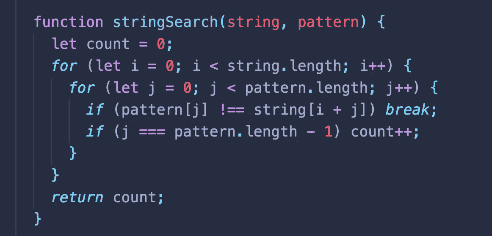

# 朴素字符串搜索算法

> 原文：<https://medium.com/nerd-for-tech/naive-string-searching-algorithm-2d5fa07fdbcd?source=collection_archive---------7----------------------->

## (Javascript 实现)



stringSearch 实现

## 时间复杂度:

最坏情况: **O(m*n)**

## 工作原理:

我们将创建一个函数，其中一个参数用于给定的*，另一个参数用于我们正在寻找的**模式**。*

*首先让我们创建一个计数器来计算我们找到了多少个匹配。*

*接下来，为了比较这两个字符串，我们需要创建一个循环来处理*给定字符串*的所有索引，还需要创建一个内部循环来比较这些索引。*

*当我们处于外循环的索引 0 时，内循环将检查包含在*给定串*和*模式*的索引 0 上的元素是否相等。如果匹配，内部循环将向前移动一个索引，并将比较*模式*下一个元素与*给定串*的索引+1。*

*它将这样做，直到在模式上找到匹配，然后将计数器加+1。*

*只要内循环没有找到匹配，它就会中断，因此外循环可以向前移动一个索引，允许我们在整个*给定字符串中导航。**

*考虑到这是一种使用嵌套循环的强力方法。这非常耗时。*

*让我们看一些图片来更好地理解正在发生的事情。*

**

*这是我们想要匹配以下模式的原始字符串:“hello”。*

**

*内部循环将运行，将第一个元素与外部循环的第一个索引进行比较。它找到了一个匹配，所以它继续。*

**

*第一个字母匹配，但接下来的一个不匹配，所以内部循环中断。*

**

*外部循环前进一个索引，我们开始将其与内部循环进行比较。因为“I”不是 wat，所以我们希望再次匹配内部循环中断，外部循环将向前移动一个索引。*

**

*我们重复操作，比较内部循环和外部循环。因为我们得到了一个匹配，我们比较内部循环的第二个索引和外部循环的下一个索引。*

**

*我们继续操作，因为“e”是匹配的。*

**

*我们又找到一个匹配的。*

**

*是的，看起来我们很快就能了解整个模式了！*

**

*找到了。找到了！现在我们给计数器加+1，因为我们找到了 1 个匹配。*

**

*我们对外部循环的所有索引重复该操作。*

**

*不匹配…*

**

*仍然不匹配…*

**

*也不匹配…*

**

*哦！可能的模式匹配又开始了！*

**

*坏消息…下一个指数不匹配…因此，我们再次打破内部循环，并在外部循环上提升一个索引。*

**

*最后一个索引不匹配。我们完成了这个迭代，因为我们用完了要比较的索引。我们在整个字符串中找到了一个匹配！*

## *伪代码*

```
**// Define a function that takes 2 strings. The large one and the
   pattern we're looking for.**// Loop over the longer string.**// Loop over the shorter string.**// If the characters don't match, break out of the inner loop.**// If the characters do match, keep going.**// If you complete the inner loop and find a match,* *increment the count of matches.**// Return the count**
```

## ***代号***