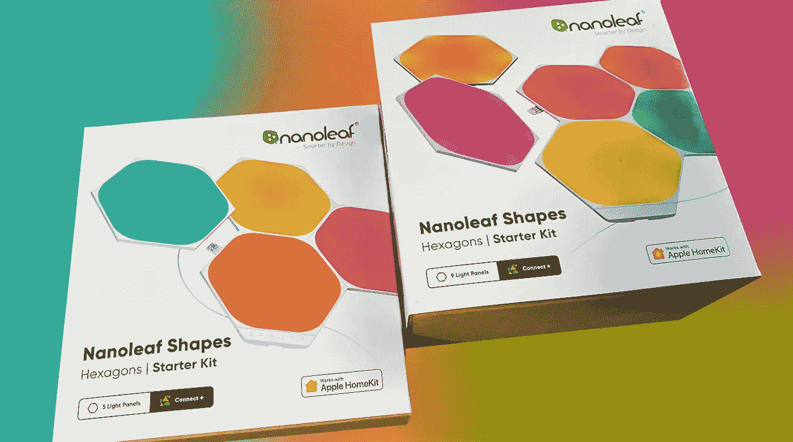

# 纳米叶形状——它们真的像宣传的那样吗？

> 原文：<https://medium.com/nerd-for-tech/nanoleaf-shapes-do-they-live-up-to-the-hype-f1d21a8632f4?source=collection_archive---------2----------------------->

## 因为他们的营销确实令人印象深刻！

虽然没有什么新东西，但它们仍然不是无处不在，这也没什么不好。让科技成为家中更核心的一部分，而不仅仅是普通的灯泡、电话和冰箱，这是每个人都应该自己做的决定。无论如何，在接下来的几十年里。除此之外…