# 自然语言处理|特征提取技术。

> 原文：<https://medium.com/nerd-for-tech/natural-language-processing-feature-extraction-techniques-745f690041e6?source=collection_archive---------2----------------------->

大多数经典的机器学习和深度学习算法都不能接受原始文本。相反，我们需要从原始文本中执行特征提取，以便将数字特征传递给机器学习算法。

## 词汇袋模型— TF

对于非结构化文本，这可能是最简单的向量空间表示模型。向量空间模型是一个简单的数学模型，将非结构化文本(或任何其他数据)表示为数字向量，这样向量的每个维度都是一个特定的特征属性。单词袋模型将每个文本文档表示为数字向量，其中每个维度是来自语料库的特定单词，并且该值可以是它在文档中的频率、出现次数(用 1 或 0 表示)或者甚至是加权值。这个模型之所以叫这个名字，是因为每个文档都被字面上表示为它自己的单词的“包”,而不考虑单词顺序、序列和语法。

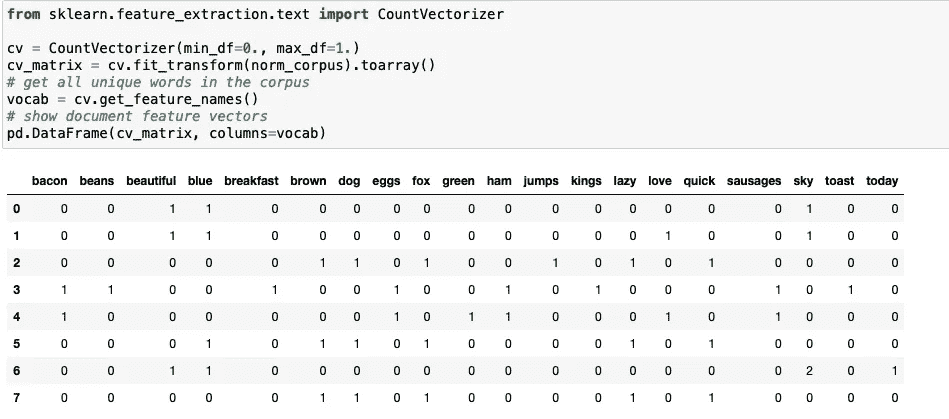

计数矢量器

这应该会让事情更清楚吧！您可以清楚地看到，特征向量中的每一列或每一个维度代表语料库中的一个单词，每一行代表我们的一个文档。任何单元格中的值表示该单词(由列表示)在特定文档(由行表示)中出现的次数。因此，如果一个文档集由跨越所有文档的 N 个唯一的单词组成，那么对于每个文档，我们将有一个 N 维向量。

## N 克模型袋

一个单词只是一个标记，通常被称为一元语法或一元语法。我们已经知道单词袋模型不考虑单词的顺序。但是如果我们也想考虑出现在序列中的短语或单词集合呢？N-grams 帮助我们实现了这一点。N 元语法基本上是来自文本文档的单词标记的集合，使得这些标记是连续的并且按顺序出现。二元语法表示 2 阶的 n 元语法(两个单词)，三元语法表示 3 阶的 n 元语法(三个单词)，依此类推。因此，N-gram 模型只是单词模型的扩展，所以我们也可以利用基于 N-gram 的特征。下面的例子描述了每个文档特征向量中基于二元模型的特征。

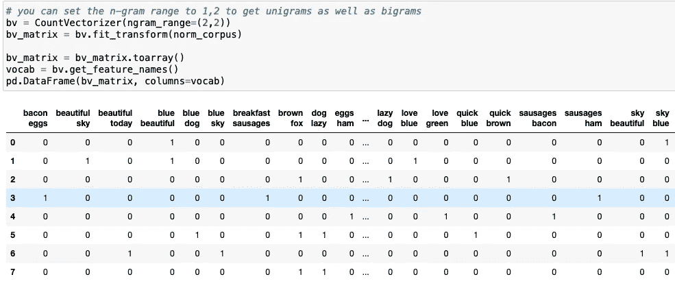

这为我们的文档提供了特征向量，其中每个特征由表示两个单词序列的二元语法组成，值表示该二元语法在我们的文档中出现的次数。

## 使用弓形模型的缺点:

*   如果新句子包含新单词，那么我们的词汇量将会增加，因此向量的长度也会增加。
*   此外，向量也将包含许多 0，从而导致稀疏矩阵(这是我们想要避免的)。
*   我们不保留句子的语法信息，也不保留课文中单词的顺序信息。

## TF-IDF

TF-IDF 模型试图通过在其计算中使用一个缩放或归一化因子来解决这个问题。TF-IDF 代表术语频率-逆文档频率，它在计算中使用两个度量的组合，即:术语频率(TF)和逆文档频率(IDF)。

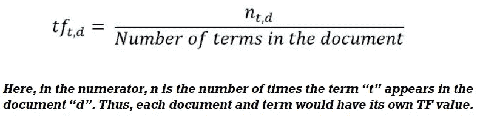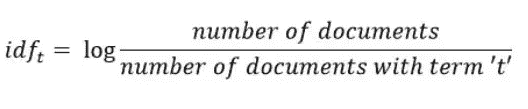

数学上，我们可以将 TF-IDF 定义为 tfidf = tf x idf。

这里，tfidf (w，D)是文档 D 中单词 w 的 TF-IDF 得分
→术语 tf (w，D)代表单词 w 在文档 D 中的术语频率，可以从单词袋模型中得到。
→术语 idf (w，D)是术语 w 的逆文档频率，可以计算为语料库 C 中文档总数除以单词 w 的文档频率的对数变换，基本上就是单词 w 在语料库中出现的文档频率。

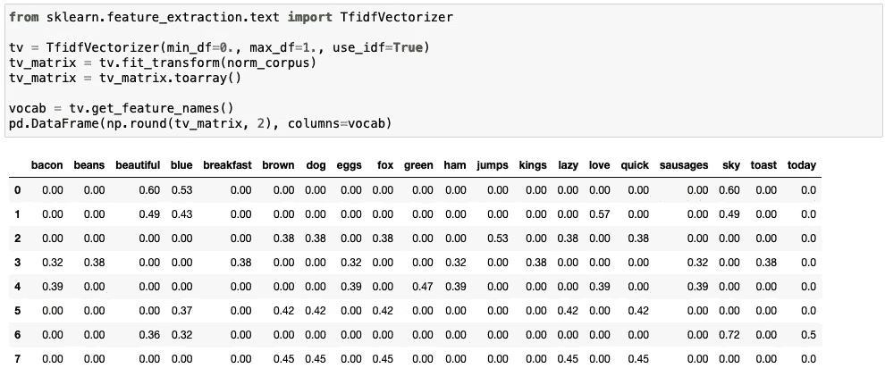

我们的每个文本文档的基于 TF-IDF 的特征向量显示了与原始单词包模型值相比的缩放和归一化值。

→单词包只是创建一组向量，包含文档(评论)中的单词出现次数，而 TF-IDF 模型包含关于最重要单词和不太重要单词的信息。

→单词向量袋易于理解。然而，TF-IDF 通常在机器学习模型中表现更好。

→尽管单词袋和 TF-IDF 在各自方面都很受欢迎，但在理解单词的上下文方面仍然存在空白。检测单词“幽灵”和“恐怖”之间的相似性，或者将我们给定的文档翻译成另一种语言，需要关于文档的更多信息。

→这就是 Word2Vec、连续单词包(CBOW)、Skipgram 等单词嵌入技术的地方。进来吧。

## Word2Vec 模型

该模型由谷歌在 2013 年创建，是一种基于预测性深度学习的模型，用于计算和生成高质量、分布式和连续的单词密集矢量表示，这些表示捕捉上下文和语义的相似性。本质上，这些是无监督的模型，可以接受大量文本语料库，创建可能单词的词汇表，并为表示该词汇表的向量空间中的每个单词生成密集单词嵌入。

通常你可以指定单词嵌入向量的大小，向量的总数实质上就是词汇量的大小。这使得这个密集向量空间的维数比使用传统单词袋模型构建的高维稀疏向量空间低得多。

Word2Vec 可以利用两种不同的模型架构来创建这些单词嵌入表示。这些包括:

*   连续词汇袋模式
    ——跳格模式

## 连续单词袋(CBOW)模型:

CBOW 模型架构试图基于源上下文单词(周围单词)来预测当前目标单词(中心单词)。

考虑一个简单的句子，“快速的棕色狐狸跳过懒惰的狗”，这可以是(context_window，target_word)对，其中如果我们考虑大小为 2 的上下文窗口，我们有像([quick，fox]，brown)，([the，brown]，quick)，([the，dog)，lazy)等例子。

因此，该模型试图基于“上下文窗口”单词来预测目标单词。

## 跳格模型

跳格模型体系结构通常试图实现 CBOW 模型的反向操作。它试图在给定目标单词(中心单词)的情况下预测源上下文单词(周围的单词)。

考虑到我们之前的简单句子，“敏捷的棕色狐狸跳过懒惰的狗”。如果我们使用 CBOW 模型，我们得到(context_window，target_word)对，其中如果我们考虑大小为 2 的上下文窗口，我们有这样的例子([quick，fox]，brown)，([the，brown]，quick)，([the，dog]，lazy)等等。

现在考虑到 skip-gram 模型的目的是从目标单词预测上下文，该模型通常反转上下文和目标，并试图从其目标单词预测每个上下文单词。因此，任务变成了预测给定目标词“brown”或给定目标词“quick”的上下文。

因此，该模型试图基于目标单词来预测上下文窗口单词。

**采用 Gensim 的鲁棒 Word2Vec 模型**

由雷迪姆·řehůřek 创建的 *gensim* 框架由 Word2Vec 模型的健壮、高效和可扩展的实现组成。我们将在我们的样本玩具语料库中利用同样的方法。在我们的工作流程中，我们将标记化我们的规范化语料库，然后关注 Word2Vec 模型中的以下四个参数来构建它。

→ size:单词嵌入维度
→ window:上下文窗口大小
→ min_count:最小字数
→ sample:常用单词的下采样设置
→sg:训练模型，skip-gram 为 1，否则为 CBOW

我们将在语料库上构建一个简单的 Word2Vec 模型，并可视化嵌入。

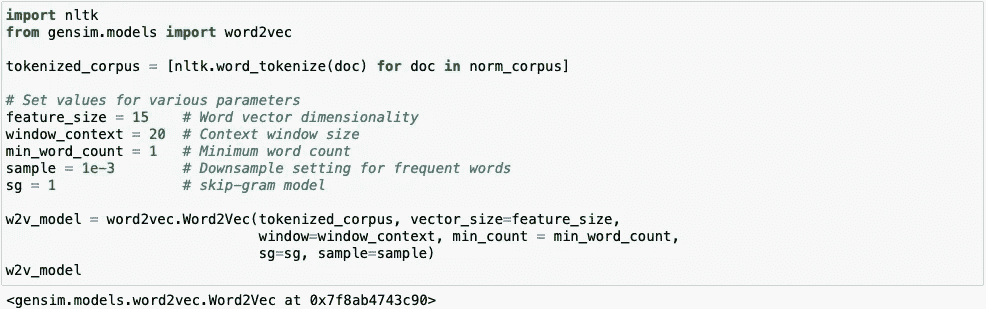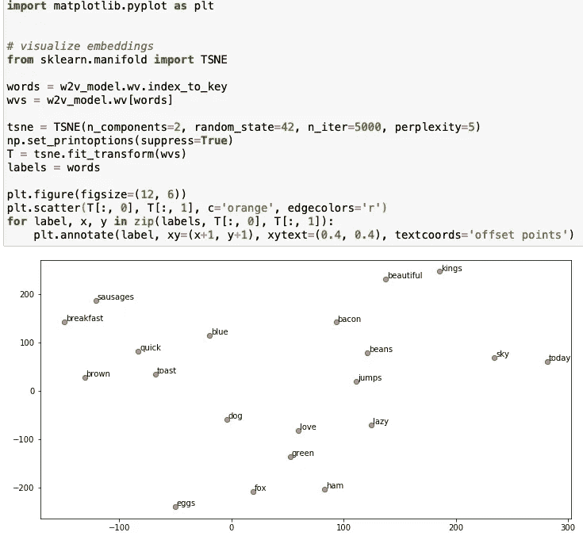

## 余弦相似度:

余弦相似度用于衡量单词向量之间的相似程度。余弦相似性本质上是检查两个向量之间的距离。

我们也可以用单词 vectors 执行向量运算。

→**new _ vector = king—man+woman**

这就产生了一个新的向量，然后我们可以尝试找到最相似的向量。

→最接近女王矢量的新矢量

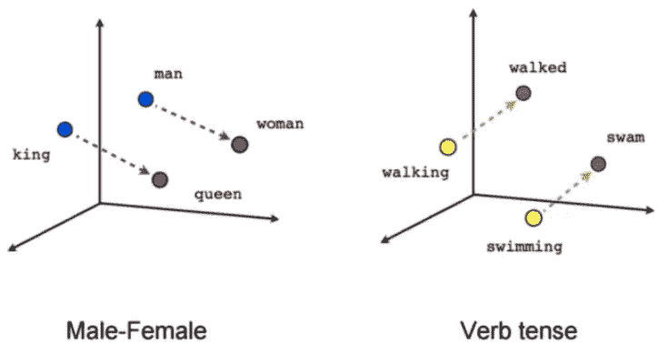

余弦相似度是两个向量之间角度的余弦值。余弦距离可以通过 1-余弦相似度来找到。两个向量之间的角度越高，余弦相似性越低，这给出了高余弦距离值，而两个向量之间的角度越低，余弦相似性越高，这给出了低余弦距离值。

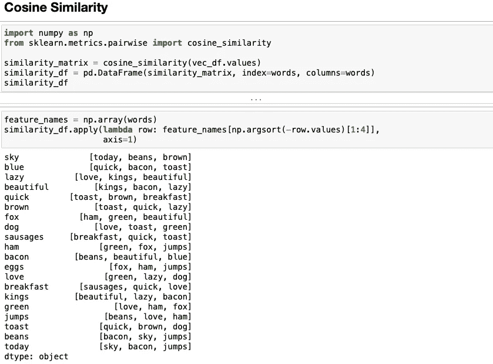

上图给出了每个词的前 3 个相似词。

## 手套型号:

GloVe 模型代表全局向量，这是一种无监督的学习模型，可用于获得类似于 Word2Vec 的密集单词向量。然而，该技术是不同的，并且在聚集的全局单词-单词共现矩阵上执行训练，给我们一个具有有意义的子结构的向量空间。这种方法是由 Pennington 等人在斯坦福发明的，我推荐你阅读关于 GloVe 的原始论文，[' GloVe:Global Vectors for Word Representation]作者 Pennington 等人的论文[论文](https://nlp.stanford.edu/pubs/glove.pdf)，这是一篇很好的阅读材料，可以让你对这个模型如何工作有所了解。

手套模型的基本方法是首先创建由(单词，上下文)对组成的巨大的单词-上下文共现矩阵，使得该矩阵中的每个元素表示单词在上下文(可以是单词序列)中出现的频率。这个想法是应用矩阵分解。

考虑到单词-上下文(WC)矩阵、单词-特征(WF)矩阵和特征-上下文(FC)矩阵，我们尝试分解 **WC = WF x FC**

这样我们的目标是通过将 **WF** 和 **FC** 相乘来重构 **WC** 。为此，我们通常用一些随机权重初始化 **WF** 和 **FC** ，并尝试将它们相乘以获得**WC**(WC 的近似值)并测量它与 **WC** 的接近程度。我们多次使用随机梯度下降(SGD)来最小化误差。最后，单词特征矩阵( **WF** )给出了每个单词的单词嵌入，其中 F 可以预设为特定的维数。

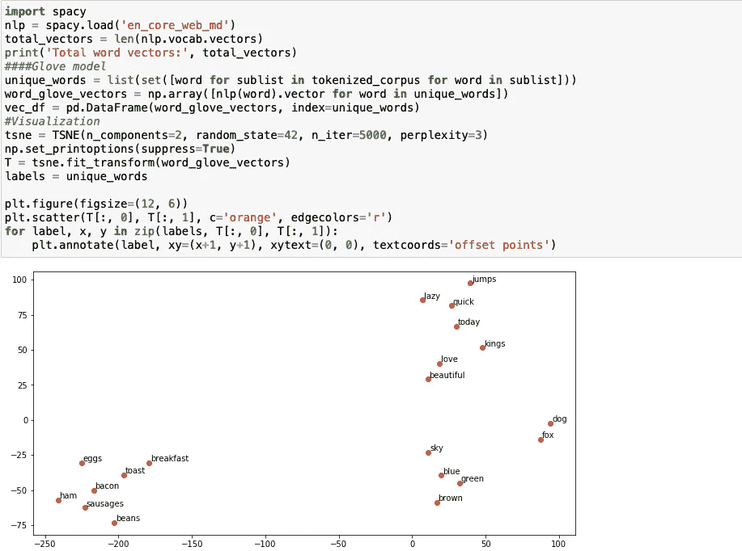

手套模型的实现。

## 快速文本模型:

FastText 模型由脸书在 2016 年首次推出，作为普通 Word2Vec 模型的扩展和改进。基于 Mikolov 等人的题为['用子词信息丰富词向量'][https://arxiv.org/pdf/1607.04606.pdf](https://arxiv.org/pdf/1607.04606.pdf)_)的原始论文，这是一篇深入了解该模型如何工作的优秀读物。总的来说，FastText 是一个用于学习单词表示以及执行健壮、快速和准确的文本分类的框架。该框架是由 https://github.com/facebookresearch/fastText 的脸书开源的，并声称有如下内容。

→最近最先进的英语单词矢量。
→在维基百科和 Crawl 上训练的 157 种语言的词向量。
→语言识别和各种监督任务的模型。

Word2Vec 模型通常忽略每个单词的形态结构，并将单词视为单个实体。FastText 模型将每个单词视为一包字符 n 元语法。这在本文中也被称为子字模型。

我们在单词的开头和结尾添加特殊的边界符号< and >。这使我们能够将前缀和后缀与其他字符序列区分开来。我们还将单词 w 本身包含在它的 n-grams 集合中，以学习每个单词的表示(除了它的字符 n-grams)。

以单词 where and n=3 (tri-grams)为例，它将由字符 n-grams: <wh whe="" her="" ere="" re="">和代表整个单词的特殊序列< where >来表示。注意，对应于单词< her >的序列不同于单词 where 中的三元组 her。</wh>

在实践中，本文推荐在 n ≥ 3 和 n ≤ 6 时提取所有 n 元文法。这是一种非常简单的方法，可以考虑不同组的 n 元语法，例如取所有的前缀和后缀。我们通常将一个单词的向量表示(嵌入)与每个 n 元语法相关联。

因此，我们可以用一个单词的 n 元文法的向量表示的和或者这些 n 元文法的嵌入的平均值来表示这个单词。因此，由于这种基于单词的字符利用单个单词的 n 元语法的效果，稀有单词有更高的机会获得良好的表示，因为它们的基于字符的 n 元语法应该出现在语料库的其他单词中。

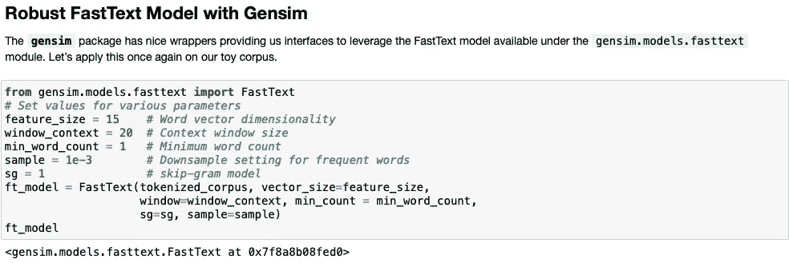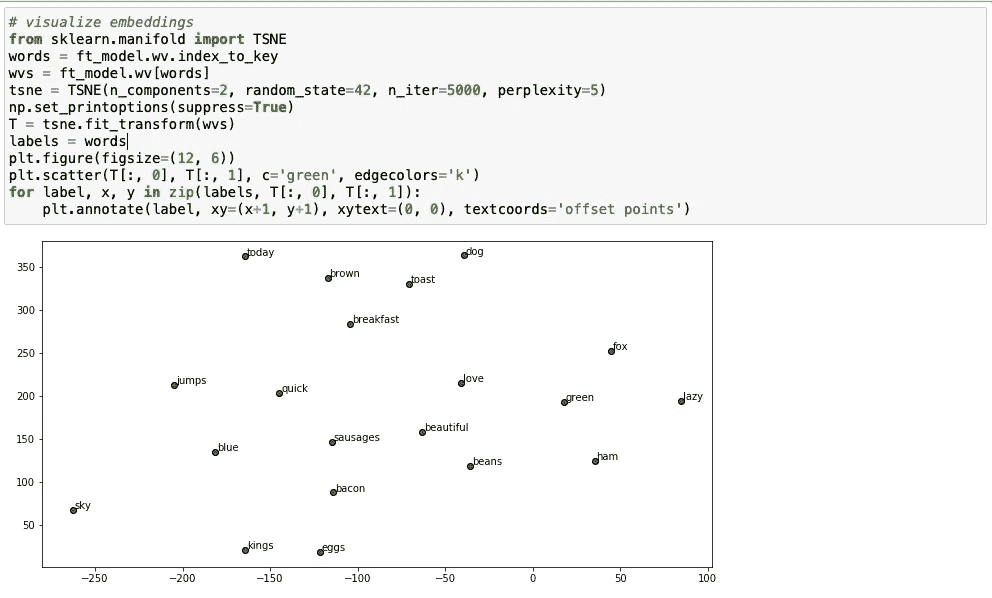

这些是 NLP 中用于特征提取的嵌入技术。

谢谢你一直读到最后。有关实际实施，请参考本笔记本。[链接](https://github.com/Rishikumar04/Natural-Language-Processing/blob/main/04_Feature%20Extraction%20Techniques.ipynb)