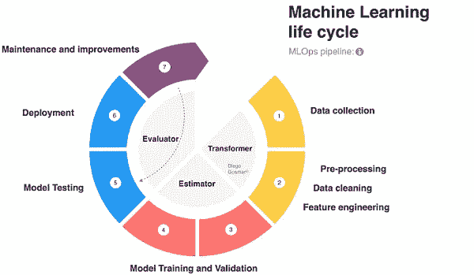
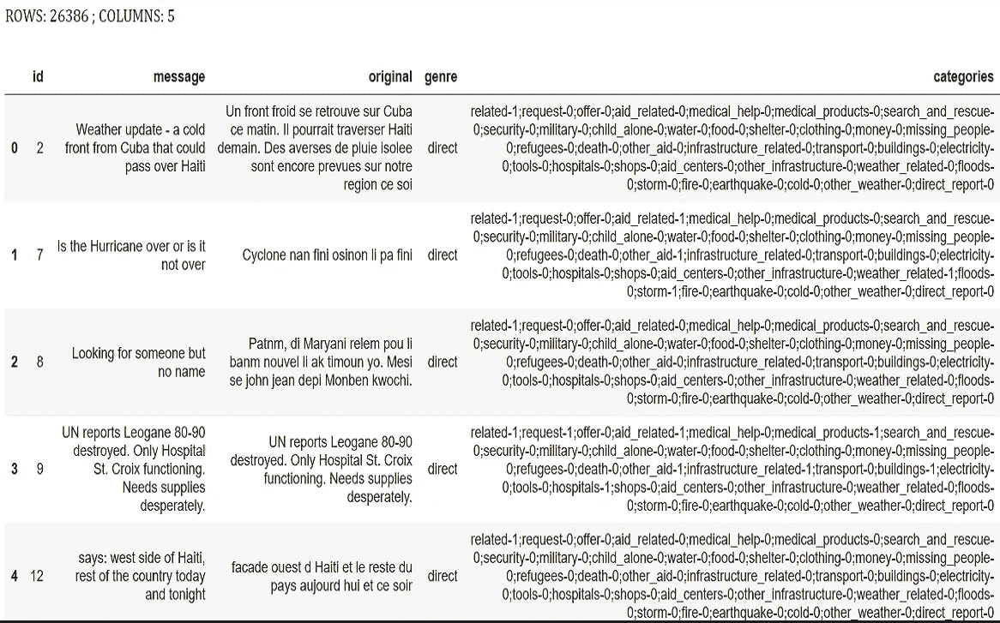
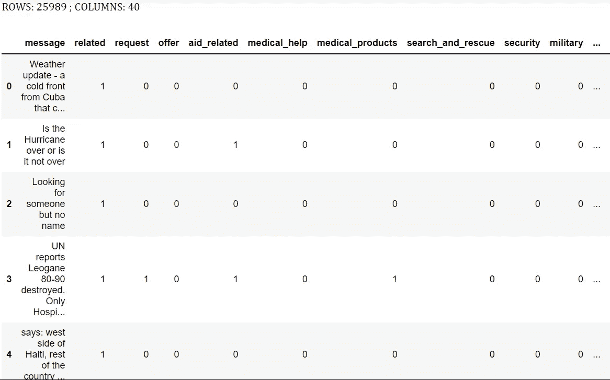
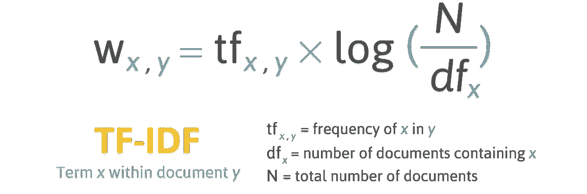
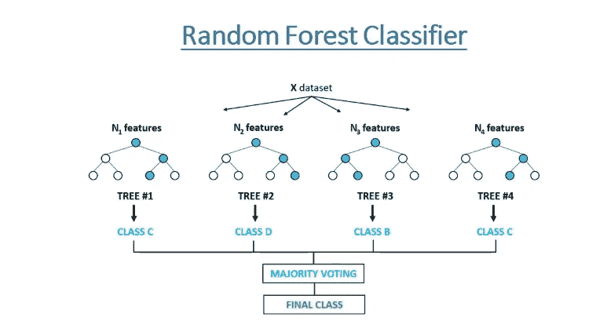
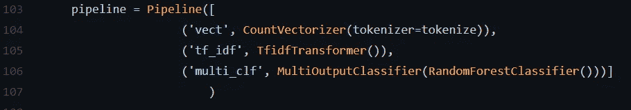
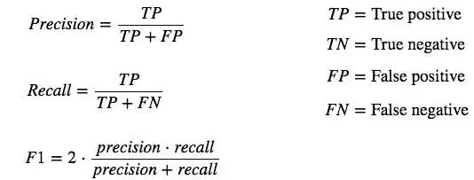
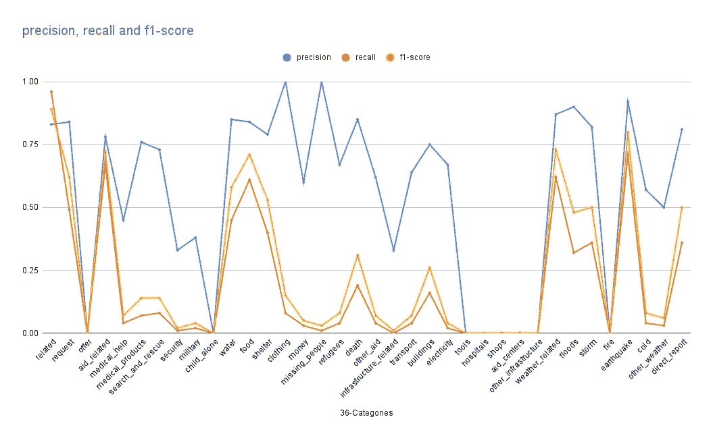
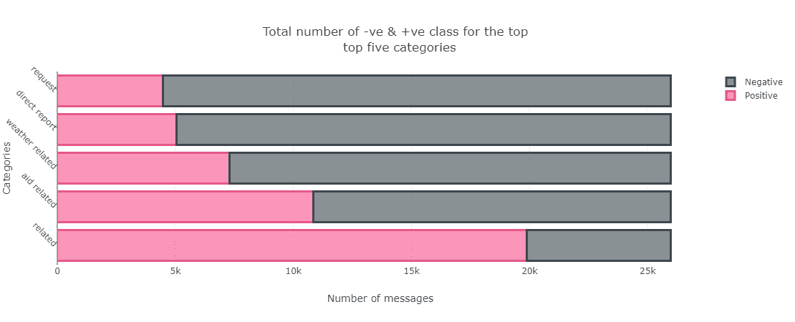
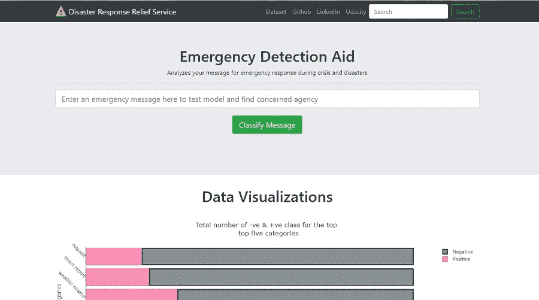

# 用于在紧急情况下检测受害者的自然语言处理

> 原文：<https://medium.com/nerd-for-tech/natural-language-processing-for-detecting-victims-in-emergency-situations-1f8776926c7?source=collection_archive---------4----------------------->

如何在紧急情况下使用社交媒体帖子和文本来提高急救人员和援助机构的覆盖范围和响应时间。


图片:sunnewsonline.com

火灾、洪水、山体滑坡、长期饥饿、流行病、武装冲突或入侵、交通事故、地震甚至狂风、危机和灾难都是我们日常生活的一部分。它们倾向于定义我们之间以及与自然环境的互动方式。

另一件正在不断重新定义我们在现代如何与自己互动的事情是社交媒体。通过它的力量，接触和覆盖面是人类历史上前所未有的。利用社交媒体的无处不在和机器学习的力量，我们可以在多大程度上改善我们的生活，并为尼日利亚的危机提供及时的援助。

这种动机——使用社交媒体帖子和文本来发现紧急情况下需要救济的人——定义了我试图应对的挑战的范围。请跟着我一起看我的作品。

# 资料组

对于这项工作，所需的数据集是危机后社交媒体帖子和短信的集合，并带有用于确定所需援助方式的注释。

获取所需数据集的一种方法是从 Twitter 和脸书等社交平台上繁琐地抓取、过滤、清理和标记数万条信息。根据人力情况，这种方法需要一个月又一个月的艰苦的人工工作，但是它提供了对数据分发的最佳控制，并且可以很容易地针对特定的位置或地区进行定制。

幸运的是， [FigureEight 公司，现在的阿彭](http://www.appen.com/)，已经做了所有收集这些数据的艰苦工作。[图 8 灾难响应数据集](https://github.com/joshasgard/Disaster-Response-App/tree/master/data)由 26249 条灾后信息组成，这些信息是在几次灾难后从几个平台上提取的。然后，每条消息都用二进制标签(0 或 1)标注了 36 个预定义的 aid 类别。

为清楚起见，如果消息在特定 aid 类别下具有标签“1 ”,则意味着消息编写器需要该 aid，而标签“0”则意味着相反。总之，这个数据集非常适合建立一个模型，通过他们的社交媒体帖子来检测需要帮助的人。

# 方法学



机器学习管道(来源 GOSMAR。欧盟)

由于目标是建立一个可以在危机期间接收数千条原始文本消息并检测需要紧急援助的人的帖子的模型，因此需要开发一个数据清理(或处理)管道和一个用于训练模型的机器学习管道。

## ETL 管道

ETL 是[提取-转换-加载](https://www.snowflake.com/guides/etl-pipeline#:~:text=An%20ETL%20pipeline%20is%20the,and%20move%20it%20to%20another.)的简称。ETL 管道代表了一组从源中提取数据的过程或步骤。csv 文件)，转换数据并将其加载到数据库中。



数据集概述

从上面的概览图可以清楚地看到,[“类别”列中的数据集](https://github.com/joshasgard/Disaster-Response-App/tree/master/data)是字符串(字母)和数字(整数)的混合。使用[定制的 ETL 管道(用 Python 构建)](https://github.com/joshasgard/Disaster-Response-App/blob/4e1119d792ad214b3d5ee833e0921212d3362952/data/process_data.py)，上面格式的原始文本数据可以被转换，如下所示。

***提取数据***

```
*#   Import data files* 
**messages = pd.read_csv(messages_filepath)    
categories = pd.read_csv(categories_filepath) **    
*#   Merge datasets* 
**df = pd.merge(messages, categories)**
```

***变换数据***

```
*#   Split the categories column into separate columns.    * **categories_table = df.categories.str.split(';',expand = True)    categories_table.columns = categories_table.iloc[0].apply(lambda x: x[0:-2])**

*#   Clean class values for each category and cast as numeric.* 
**for column in categories_table:        
categories_table[column]=categories_table[column].str[-1].astype('int')** *#   Remove duplicates from data.  *  
**df = df.drop_duplicates(subset='message')** *#   Filter out 'related' category with non-binary class  *  
**df = df[df['related']!=2]**
```

***加载数据到 SQLite 数据库***

```
*#   Create SQL engine with database name* 
**engine = create_engine('sqlite:///'+database_filename)** *#   Load cleaned data into SQL engine, replacing data in database if #   defined name already exists.  *  
**df.to_sql(table_name, engine, index=False,if_exists='replace')**
```

如果你有兴趣给代码一个旋转，请访问这里的[项目回购。](https://github.com/joshasgard/Disaster-Response-App/blob/4e1119d792ad214b3d5ee833e0921212d3362952/data/process_data.py)ETL 管道的最终产品是一个数据集，可以输入到模型中进行训练。



ETL 产品—“ML 就绪”数据集

## ML 管道

虽然完整的机器学习管道可以说是由数据预处理步骤(ETL)、建模和部署组成，但我将管道分成模块化 python 脚本的逻辑块，以使调试更容易。

这里使用的的 [ML 流水线由四个主要步骤组成: ***文本矢量化(和标记化)、词频-逆文档频率(Tf-Idf)归一化、分类器模型训练和超参数调优*** *。*](https://github.com/joshasgard/Disaster-Response-App/blob/master/models/train_classifier.py#:~:text=pipeline%20%3D%20Pipeline(%5B,multi_clf%27%2C%20MultiOutputClassifier(RandomForestClassifier()))%5D)

当[文本矢量化步骤接收我们的原始文本消息](https://scikit-learn.org/stable/modules/generated/sklearn.feature_extraction.text.CountVectorizer.html)并将其转换为令牌(单个单词)计数矩阵时， [Tf-Idf 转换器接收令牌计数矩阵并将其转换为标准化的 Tf-Idf 表示](https://scikit-learn.org/stable/modules/generated/sklearn.feature_extraction.text.TfidfTransformer.html#:~:text=Transform%20a%20count%20matrix%20to%20a%20normalized%20tf%20or%20tf%2Didf%20representation)。



来源:filotechnologia.blogspot.com

对于像这样的分类问题，有相当多的[算法](https://www.analyticsvidhya.com/blog/2020/11/popular-classification-models-for-machine-learning/)我们可以训练和验证，以确定性能最好的一个。例如，一个[朴素贝叶斯分类器](https://scikit-learn.org/stable/modules/naive_bayes.html)、一个 [AdaBoost 分类器](https://scikit-learn.org/stable/modules/generated/sklearn.ensemble.AdaBoostClassifier.html?highlight=adaboost#:~:text=An%20AdaBoost%20%5B1%5D%20classifier%20is%20a%20meta%2Destimator%20that%20begins%20by%20fitting)和一个 [**随机森林分类器**](https://scikit-learn.org/stable/modules/generated/sklearn.ensemble.RandomForestClassifier.html?highlight=random%20forest#:~:text=A%20random%20forest%20is%20a%20meta%20estimator%20that%20fits%20a%20number%20of) 都适合我们转换后的消息数据，但是随机森林分类器在性能上略胜一筹。



资料来源:freecodecamp.org

Scikit-learn 提供了一个易于使用的 [ML 管道类](https://scikit-learn.org/stable/modules/generated/sklearn.pipeline.Pipeline.html?highlight=pipeline#:~:text=Pipeline%20of%20transforms%20with%20a%20final%20estimator)，我在这一步利用了它。



sci kit-学习管道

**超参数调整**

在 ML 管道中对模型进行训练后，我们可以通过选择模型的[最佳超参数](https://www.analyticsvidhya.com/blog/2021/04/evaluating-machine-learning-models-hyperparameter-tuning/)来进一步改善模型性能。

```
*#   Pipeline Hyperparameter Range to tune.* **parameters** = {'vect__ngram_range': ((1,1), (1,2)),        'vect__max_features': (None, 5000, 10000),        
'tf_idf__use_idf': (True, False),        'multi_clf__estimator__min_samples_leaf':[1,2],        'multi_clf__estimator__n_estimators': [10,20,100],        'multi_clf__estimator__max_depth': [None,5,10],        'multi_clf__estimator__min_samples_split': [2,3,5]}
```

通过[在指定的超参数网格上彻底搜索](https://github.com/joshasgard/Disaster-Response-App/blob/master/models/train_classifier.py#:~:text=parameters%20%3D%20%7B,pipeline%2C%20param_grid%3Dparameters))，用最佳参数重新训练模型并进行评估。为此，我使用了 Scikit-Learn 网格搜索 CV。

## 模型评估

使用精确度、召回率和 F1 分数来评估我们的分类模型的性能。它们通过数学方法计算如下:



评估指标

其中正数和负数分别代表上述 36 个援助类别中的 1 和 0。下面是一个表和一个图，显示了每个类别的训练模型性能。[点击此处查看更具互动性的指标图](https://docs.google.com/spreadsheets/d/e/2PACX-1vQcla05za0aPbnYVGSmO4oikXKa2l2PpkGJKp-xKHCytD4JP6NCthH3tksoXDpYWsITyKJfKHUJNW8u/pubchart?oid=819176499&format=interactive)。

```
 **  36 Categories  precision    recall  f1-score** **related       0.83      0.96      0.89
               request       0.84      0.49      0.62
                 offer       0.00      0.00      0.00
           aid_related       0.78      0.67      0.72
          medical_help       0.45      0.04      0.07
      medical_products       0.76      0.07      0.14
     search_and_rescue       0.73      0.08      0.14
              security       0.33      0.01      0.02
              military       0.38      0.02      0.04
           child_alone       0.00      0.00      0.00
                 water       0.85      0.45      0.58
                  food       0.84      0.61      0.71
               shelter       0.79      0.40      0.53
              clothing       1.00      0.08      0.15
                 money       0.60      0.03      0.05
        missing_people       1.00      0.01      0.03
              refugees       0.67      0.04      0.08
                 death       0.85      0.19      0.31
             other_aid       0.62      0.04      0.07
infrastructure_related       0.33      0.00      0.01
             transport       0.64      0.04      0.07
             buildings       0.75      0.16      0.26
           electricity       0.67      0.02      0.04
                 tools       0.00      0.00      0.00
             hospitals       0.00      0.00      0.00
                 shops       0.00      0.00      0.00
           aid_centers       0.00      0.00      0.00
  other_infrastructure       0.00      0.00      0.00
       weather_related       0.87      0.62      0.73
                floods       0.90      0.32      0.48
                 storm       0.82      0.36      0.50
                  fire       0.00      0.00      0.00
            earthquake       0.92      0.71      0.80
                  cold       0.57      0.04      0.08
         other_weather       0.50      0.03      0.06
         direct_report       0.81      0.36      0.50** **micro avg       0.82      0.51      0.63**
```



模型度量

最终，为每个援助类别选择要强调(或优先考虑)的评估指标取决于浪费资源来检测一些错误信息(精确度)还是未能检测到一些在紧急情况下需要帮助的人的信息(回忆)，或者甚至两者都有(f1 得分)。



数据不平衡

*   上面的条形图代表原始数据集中前五个最平衡类别的标签(0 和 1)。大多数其他类别显示了积极(1)和消极(0)标签之间的严重不平衡。比如像`'fire', 'missing people', 'offer', 'hospital', 'electricity', and 'transport'`这样的重要类别，消息很少。
*   即使在网格搜索交叉验证中嵌入了分层抽样来帮助保持类别权重，该模型对于这些类别仍然失败得很惨。**因此，如上所示，我们对这些类别进行了非常高或非常低的精度和(或)召回。**

剩下的就是保存训练好的模型以备将来使用，这听起来很简单。只需导入 python Pickle 模块并转储模型。

```
import pickle
pickle.dump(model, open(model_filepath, ‘wb’))
```

> **注**:除非特别说明，本作品所有代码均用 [Python 3 编写。](https://www.python.org/)在项目过程中还使用了其他几个依赖项、库和包。如果你想更深入一点，请访问 [GitHub](https://github.com/joshasgard/Disaster-Response-App.git) 上的资源库，获取你需要的所有脚本和代码(请在那里留下一颗星，⭐️.)

如果你一直跟着我到这一步，干得好！👍

# 部署

为了给这个项目注入一点活力，并切实展示训练模型的检测能力，我决定在这个模型上构建并部署一个 web 应用程序。我用 **Flask** 框架搭建后端，Bootstrap 和 JQuery 用来设计界面。如果你想去兜一圈，点击[这里](https://detect-aid-messages.herokuapp.com/)参观，风险自负😅。



Web 应用程序界面

# 结论

我对该解决方案在尼日利亚不同地区的应用范围感到兴奋。在危机和紧急情况下，数百万人在尼日利亚的社交媒体平台上发布实时更新和呼救。f1 平均得分为 63%,这个项目为开发更好的解决方案用于我们的社区开辟了一个可能性的世界。

我在这里应用的方法可以改进。例如，最近一位更有经验的评论家告诉我，使用贝叶斯优化调优的 [XGBoost 可以获得更好的性能](https://aiinpractice.com/xgboost-hyperparameter-tuning-with-bayesian-optimization/)。

> 非常感谢您花时间通读！如果你也看到了这种解决方案的潜力，请鼓掌👏，留下评论，最重要的是，分享，分享，分享👊！！！！

如果你想复制这项工作，改进这种方法，或者只是没有足够的技术细节，请访问 [GitHub](https://github.com/joshasgard/Disaster-Response-App.git) 获取代码以及如何重用它们。特别感谢 [Udacity](http://Udacity.com) 团队在本次工作中给予的指导和反馈。

如果你想在其他有趣的项目上合作，或者想分享一些新的见解，请通过 [LinkedIn](https://www.linkedin.com/in/idowu-odesanmi) 、 [Twitter](https://twitter.com/id_joshua) 联系我，或者通过邮件联系 idowuodesanmi@gmail.com。