# 自然语言处理—简介！

> 原文：<https://medium.com/nerd-for-tech/natural-language-processing-intro-c33784829c88?source=collection_archive---------1----------------------->

NLP 是人工智能的一个子领域，它使计算机能够理解和处理人类生成的文本数据。在这个博客中，我们将学习自然语言处理的基本任务以及自然语言处理的一些应用。

# 文本数据预处理

一旦我们有了文本，首先执行的任务是预处理数据。

## 句子分割

把这篇文章分成单独的句子。

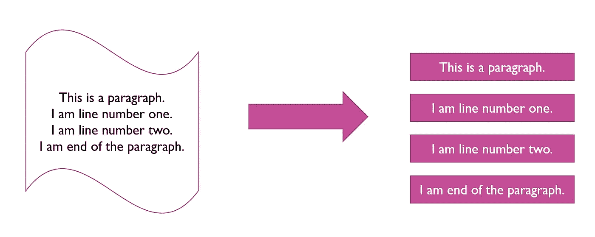

## 标记化

从句子中创造单词/词汇/标记。

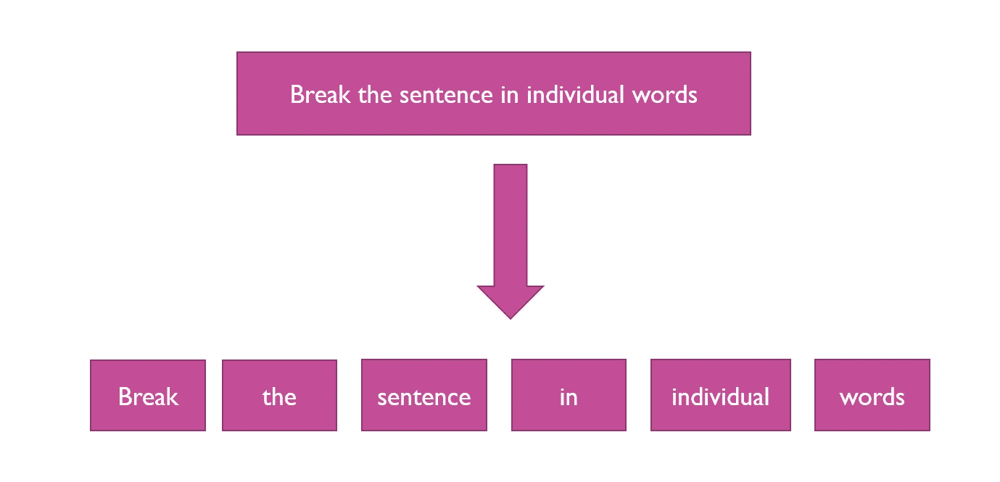

## 停用词移除

删除最常见和不太重要的单词，如 the、a、an、of、in

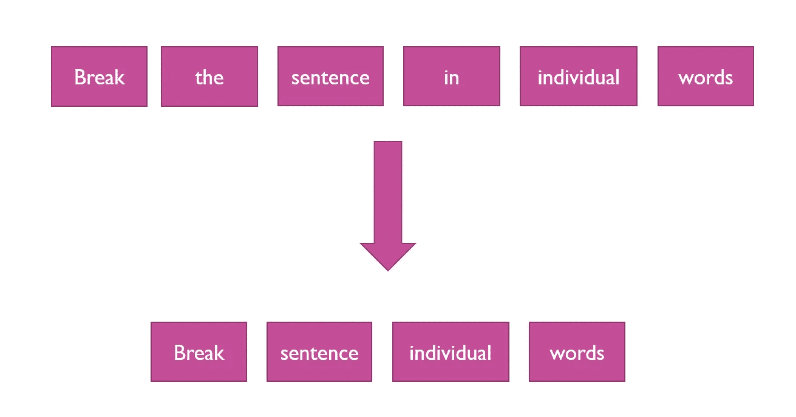

## 词干化/词汇化

**词干化**——去除词缀，保留词干

**词汇化** —寻找单词的词根形式。

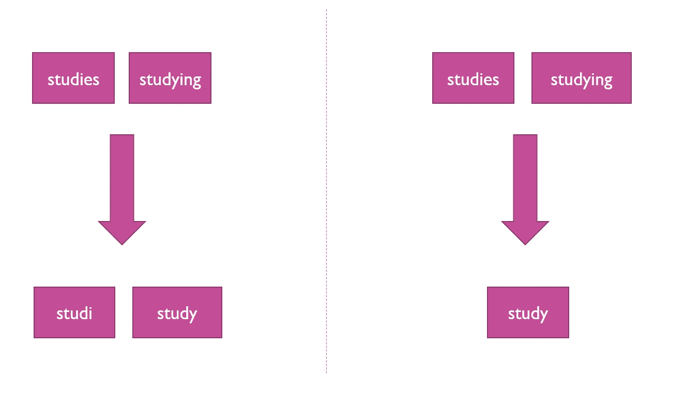

## 文本的标准化

特定于域的清理。取决于文本语料库的领域。

## 噪声消除

删除标点符号，删除数字

# 数据探索和可视化

自然语言处理结果在视觉上并不直观，为了使其更有趣，我们依赖某些可视化方法来呈现结果。以下是其中的一些技术。

> ***字云***
> 
> ***关键词***
> 
> ***文字网***
> 
> ***词性标注***

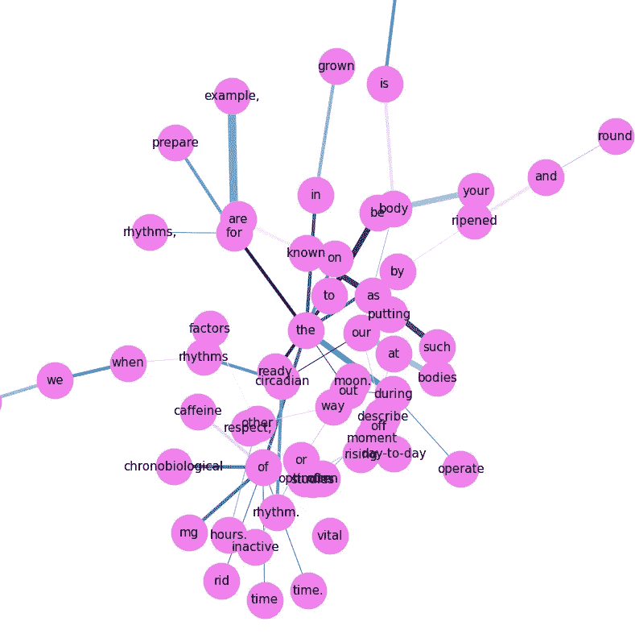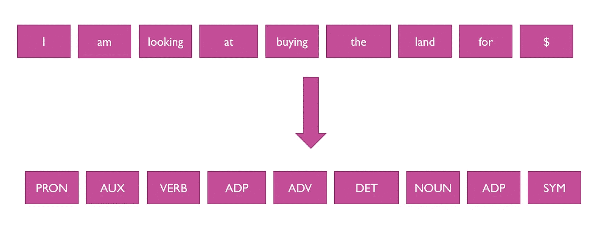

# 特征生成

在机器能够处理文本之前，我们需要将文本转换成数字向量。以下是一些这样做的模型。

## 一袋单词

在这种方法中，我们用一个向量来表示一个句子，该向量表示该单词是否存在于语料库或 bag 中。

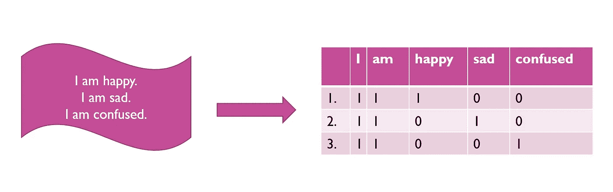

## TF-IdF

它改进了单词袋方法。它惩罚那些更常见的没有太多信息的单词。比如，如果一个词出现在所有文档中，那就没那么重要了。这是通过取逆文档频率来完成的，其定义为:

log(文档数/包含该单词的文档数)

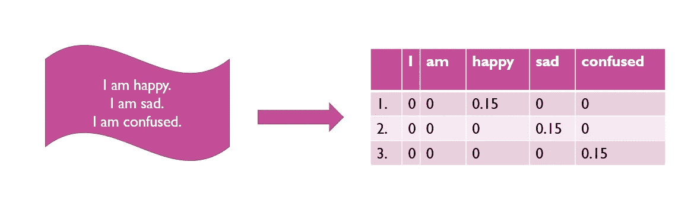

## 单词嵌入

表达意义、语义关系和上下文的词的表示。

## 语言模型

ELMO 伯特 Word2Vec

# NLP 任务和应用

让我们了解 NLP 的几个突出的应用。正文来自[本页](https://takeielts.britishcouncil.org/take-ielts/prepare/free-ielts-practice-tests/reading-academic/section-1)。

## 关键短语提取

理解文章中关键短语的相对重要性。对文章内容给出一个高层次的概念。

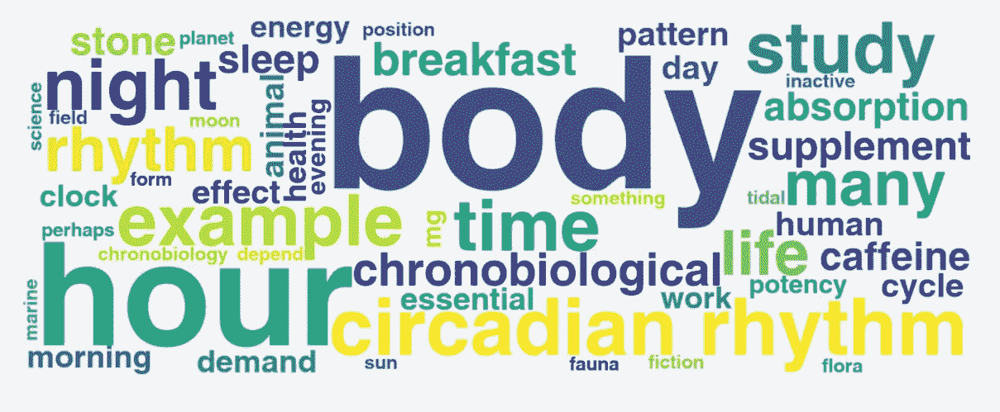

## 情感分析

从文本中理解对给定主题的情绪(例如，积极、消极、中立、愤怒、热情)。

## 主题建模

发现文档中隐藏的语义结构或抽象概念

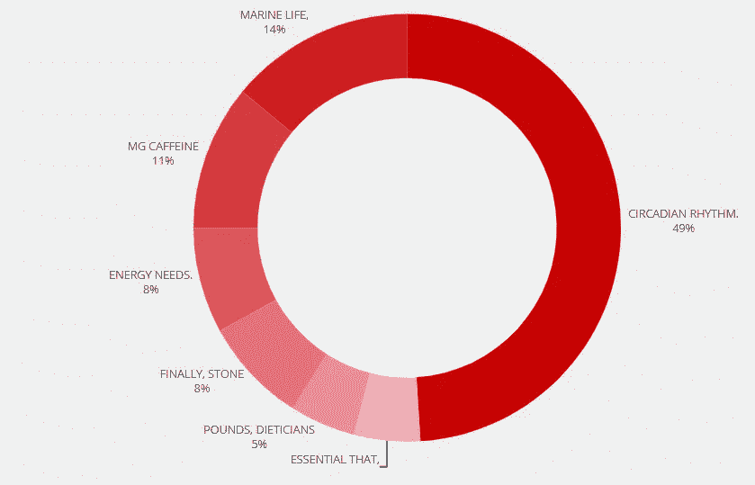

## 上下文搜索

检索在上下文和语义上与用户查询相似的文档。

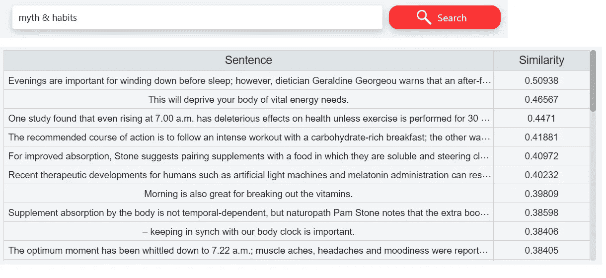

## 文本摘要

**抽象概括** —生成新句子，用更少的句子表达原文的意思。

**提取摘要** —从原文中识别并提取重要句子。

## 实体识别

定位文本中的命名实体并将其分类到预定义的类别中。

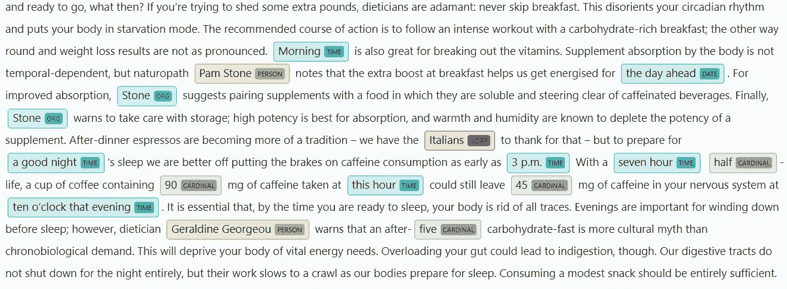

快乐理解！！