# 自然语言处理:神经网络和矩阵演算

> 原文：<https://medium.com/nerd-for-tech/natural-language-processing-neural-networks-and-matrix-calculus-eafaa6154c33?source=collection_archive---------1----------------------->

图片来自[https://earth-chronicles . com/science/a-neural-network-simulating-the-structure of-the-brain-is-created . html](https://earth-chronicles.com/science/a-neural-network-simulating-the-structure-of-the-brain-is-created.html)

在我的[上一篇](https://chozintun.medium.com/natural-language-processing-myanmar-study-group-word-vectors-evaluations-5b62d33b5e7c)中，我已经讨论了关于各种生成词向量的方法的进化的概念，这是现代自然语言处理(NLP)的基础。在此基础上，结合神经网络等深度学习算法，发展了许多先进的 NLP 模型。

在本文中，我们将首先介绍神经网络及其如何用于分类，然后介绍如何使用反向传播算法对其进行训练。我们将看到如何使用链规则和雅可比矩阵等不同的矩阵演算来更新参数和优化模型。最后，我们将讨论训练神经网络的一些有用的提示和技巧，从手动梯度检查到参数初始化、正则化、非线性和学习速率。

在进入神经网络之前，让我们后退一步，讨论一下简单的分类器。

# **传统的机器学习方法**

分类是监督机器学习算法的一个类别，是预测给定数据点的类别的过程。在传统的机器学习方法中，通过使用 softmax/logistic 回归来训练两类分类器，以找到最佳分离类的决策边界(超平面)。

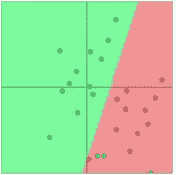

Karpathy 的 ConvNetJS 可视化

机器学习模型的第一步是识别目标函数:它可以是最大化概率或最小化损失。

## Softmax 回归

预测函数可以是如下逻辑回归的简单 softmax 函数，并且其目标是最大化每个训练示例(x，y)的正确类别 y 的概率。

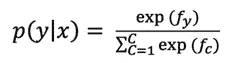

如果我们考虑最小化损失函数，目标函数可以被改写成负对数概率的形式。

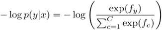

这是推导目标函数的一种方法。接下来，我们将了解如何使用 softmax 回归和交叉熵损失函数作为目标函数来训练模型。

**交叉熵**

交叉熵的概念来源于信息论。交叉熵是给定随机变量或事件集的两个概率分布之间差异的度量，公式如下，其中 p 是真实的概率分布，q 是我们计算的模型概率(可以是 softmax 回归函数)

由于 P 是一个独一无二的向量，对于右类为 1，其他地方为 0，剩下的唯一项是真实类的负对数概率(来自 softmax 的公式)。全数据集{xi，yi}Ni=1 上的交叉熵损失函数可以写成:

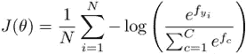

然而，逻辑回归不是很强大，因为它只给出线性决策边界。我们将无法解决更复杂的非线性问题，如下所示。

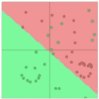

Karpathy 的 ConvNetJS 可视化

这就是神经网络分类器发挥作用的时候。

# 神经元

人工神经元有输入信号(输入)，它们被传递到细胞体，在那里它们被加权和求和。之后，它们通过激活函数转换成输出信号。信号的传播由神经元之间的连接和它们相关的权重决定。下面是人工神经元到生物神经元的映射。

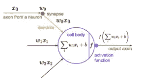

神经元

f =激活函数，w =权重，b =偏差，h =隐藏层，x =输入

**多层神经网络**

如果我们通过一组逻辑回归函数输入一个输入向量，那么我们会得到一个输出向量，然后我们可以将其输入另一个逻辑回归函数，逐渐地，我们将拥有一个多重神经网络。

在多层神经网络中，第一层通过权衡输入做出四个非常简单的决定。第二层中的每个神经元通过权衡来自第一层决策的结果来做出决策，从而在比第一层中的神经元更复杂和更抽象的水平上做出决策。甚至更复杂的决定可以在第三层的神经元中做出，等等。以这种方式，多层神经网络可以参与复杂的决策制定。

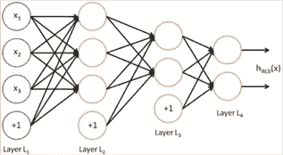

多层神经网络

> 然而，在本例中，我们仅堆叠线性回归函数，额外的层可以仅编译成单个线性变换。没有非线性，深度神经网络只能做线性变换。
> 
> 因此，激活函数起着重要的作用，我们将非线性嵌入其中来处理复杂的问题。它将指导中间隐藏变量应该是什么，以便很好地预测下一层的目标。非线性激活函数的一些例子是“Tanh”和“ReLu”。

我们可以尝试 tensorflow 在[游乐场](https://playground.tensorflow.org/)的现场演示，这将有助于我们了解训练神经网络的技巧和诀窍。我们可以改变不同的选项，如学习速率、激活、隐藏层数和每层神经元的数量，以观察它们对模型的影响。

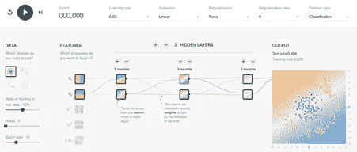

截图来自 https://playground.tensorflow.org/

## 正向传播

我们可以将神经网络方程表示为图形:源节点是输入，内部节点是操作，边传递操作的结果。

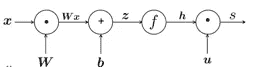

计算正向传播的公式如下:

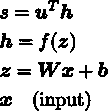

## 反向传播

反向传播算法是一种训练前向神经网络权重的方法。其原理是通过修改输入信号的内部权重来模拟给定的目标函数，以产生期望的输出信号。

雅可比矩阵和链式法则在反向传播算法中起着至关重要的作用。

***雅可比***

雅可比矩阵是一个向量值函数的一阶偏导数的矩阵，它只是梯度在有向量输出的情况下的推广。

给定一个具有 m 个输出和 n 个输入的函数，

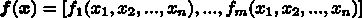

它的雅可比矩阵是一个 m×n 的偏导数矩阵。

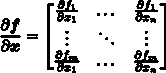

***链式法则和反向传播***

当我们观察每个节点时，它具有“局部梯度”,即其输出相对于其输入的梯度。它接收“上游梯度”，它的任务是传递正确的“下游梯度”。这是通过将“上游梯度”乘以“局部梯度”实现的。这基本上是链式法则。

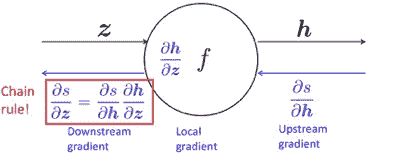

借助雅可比矩阵和链式法则，通过反向传播计算梯度并调整权重。一种直观的方法是分别求出 W 和 b 的梯度。但是，有些计算可以重复使用。

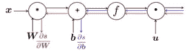

因此，我们同时计算所有的梯度。

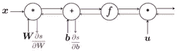

***计算***

我们可以通过沿着边缘向后计算 W 和 b 的(雅可比)梯度。下面是 b 的例子。

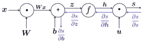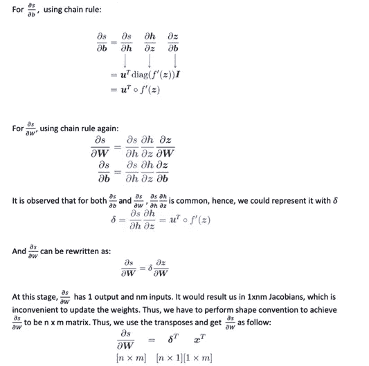

# 神经网络:技巧和提示

讨论了神经网络的数学基础后，下面是一些使用神经网络进行 NLP 的有用提示。

**正则化—** 当我们拥有大量特征时，神经网络容易过拟合，正则化是用于解决该问题的技术之一。正则化方法之一是通过简单地在损失函数上附加一个额外的项来引入 L2 正则化罚函数。

**神经元单元—** 神经网络包含 s 形神经元以引入非线性。我们根据需要用不同的非线性激活函数构造更好的网络。(乙状结肠、双曲结肠、硬双曲结肠、ReLU、渗漏 ReLU)

**参数初始化** —在构建神经网络时，以合理的方式初始化参数是实现卓越性能的重要步骤。

如果权重为 0，则将隐藏层偏差初始化为 0，并将偏差输出为最佳值(最佳值可通过*平均目标*或*平均目标*的反 sigmoid 计算)

对于权重，初始化为小的随机值，以避免妨碍学习的对称性。

**学习策略—** 可以使用学习速率来控制训练期间模型参数更新的速率/幅度。

我们可以将学习速率设置为恒定速率(通常是 10 的幂),或者通过在训练模型时允许学习速率降低来调整学习速率。

**优化器** —随机梯度下降(SGD)被广泛用作神经网络中的优化器。有自适应优化方法，如 AdaGrad 和 Adam，它们允许学习率因每个参数而异。在许多情况下，Adam 方法是一个相当好且安全的起点。

我会定期发布[我们学习小组](https://myanmarnlp.github.io/reading-group/)的旅程和讨论的话题。

**免责声明**:照片和方程式引用自 [**斯坦福 CS 224N**](http://web.stanford.edu/class/cs224n/) 讲义。

# 参考资料和进一步阅读

 [## 斯坦福 CS 224N |深度学习的自然语言处理

### 自然语言处理(NLP)是人工智能(AI)的重要组成部分，模拟人们如何分享…

web.stanford.edu](http://web.stanford.edu/class/cs224n/)  [## 张量流-神经网络游乐场

### 这是一种构建从数据中学习的计算机程序的技术。它非常松散地基于我们如何思考…

playground.tensorflow.org](https://playground.tensorflow.org/)  [## 雅可比矩阵、链式法则和反向传播

### 模型预备雅可比矩阵和反向传播

suzayah . github . io](https://suzyahyah.github.io/calculus/machine%20learning/2018/04/04/Jacobian-and-Backpropagation.html)  [## 用于视觉识别的 CS231n 卷积神经网络

### 目录:动机。在本节中，我们将通过对以下方面的直观理解来培养专业技能

cs231n.github.io](https://cs231n.github.io/optimization-2/)