# 自然语言处理|文本预处理| Spacy vs NLTK

> 原文：<https://medium.com/nerd-for-tech/natural-language-processing-text-preprocessing-spacy-vs-nltk-b70b734f5560?source=collection_archive---------4----------------------->

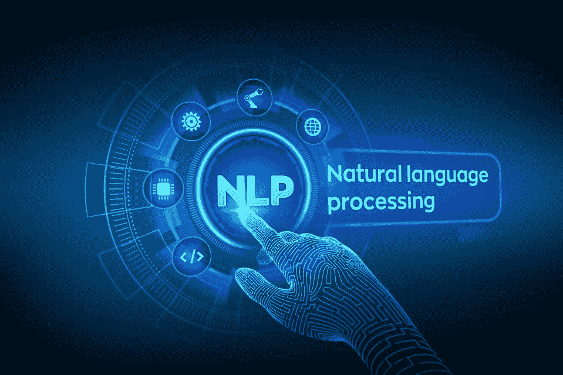

自然语言处理是计算机科学和人工智能的一个领域，涉及计算机和人类(自然)语言之间的交互，特别是如何编写计算机程序来处理和分析大量自然语言数据。文本数据有一些基本的预处理步骤。

1.  标记化
2.  堵塞物
3.  词汇化
4.  停止言语

Spacy 是什么？

2015 年推出的开源自然语言处理库。旨在通过最有效地实现常用算法来有效地处理 NLP 任务。对于许多 NLP 任务，Spacy 只有一个实现的方法，选择当前可用的最有效的算法。这意味着你经常没有选择其他算法的选项。

什么是 NLTK？

NLTK——自然语言工具包是 2001 年推出的一个非常流行的开源库。它也提供了许多功能，但包括效率较低的实现。

空间 VS NLTK

对于非常常见的 NLP 任务，Spacy 比 NLTK 更快更有效，代价是用户不能选择算法实现。然而，Spacy 并不包括一些应用程序的预创建模型，比如情感分析，这通常更容易使用 NLTK 来执行。

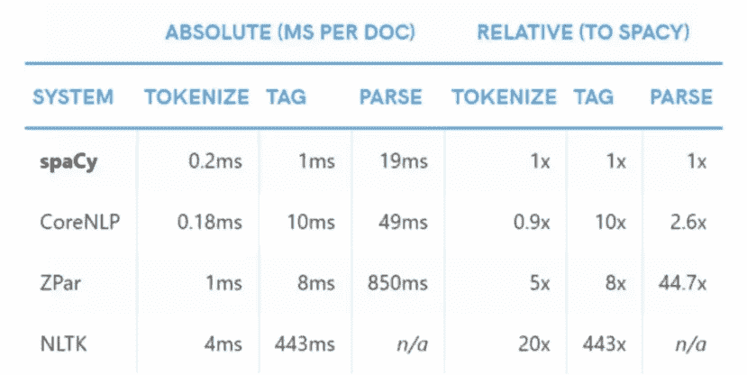

NLTK 与 Spacy 处理步骤

对于各种操作，如标记化、标记、解析，Spacy 比 NLTK 消耗更少的时间。

导入空间并创建一个如下所述的 nlp 对象。

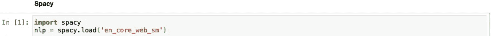

当我们运行 nlp 时，我们的文本进入一个处理管道，该管道首先分解文本，然后执行一系列操作来标记、解析和描述数据。

**标记化**:

标记化是自然语言处理中的一项常见任务。标记是自然语言的组成部分。标记化是一种将一段文本分成称为标记的更小单元的方法。

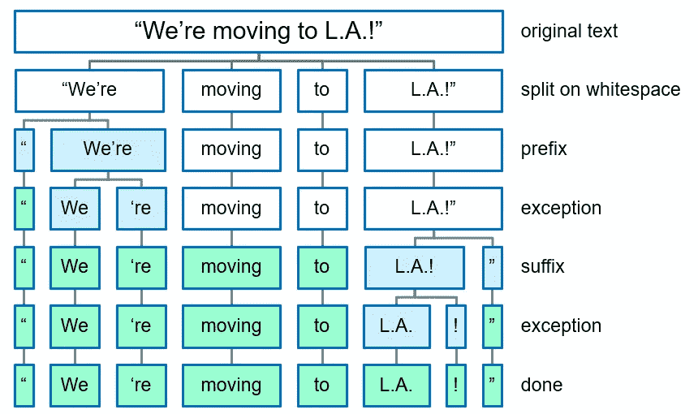

空间标记化步骤。

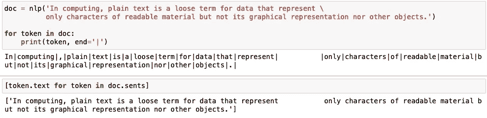

空间标记化

Spacy 足够智能，当我们在 nlp 对象内部传递文本时，文本在管道中被处理，如上所述。第一个 for 循环表示文本标记化，列表理解解释句子标记化。

NLTK 有各种各样的标记化算法。

Sent tokenizer 返回句子标记。看看令牌的长度，它是一个表明只有一个句子令牌。

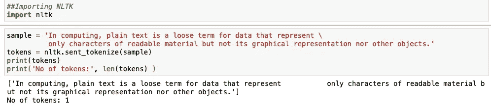

发送标记符

单词标记器返回单词标记。记号的数量是 27，这表明句子中有 27 个单词记号。

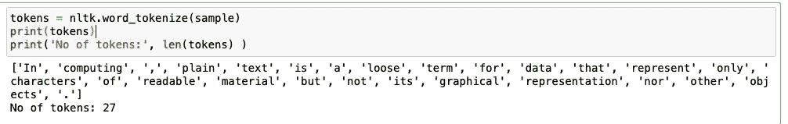

单词分词器

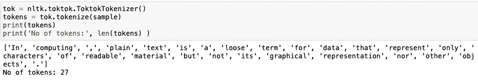

Tok Tok 记号赋予器

## **词干:**

词干法是对相关单词进行编目的一种有些粗糙的方法；它基本上是从字母的末端开始，直到到达词干。这在大多数情况下工作得相当好，但不幸的是，英语有许多需要更复杂过程的例外。事实上，spaCy 没有包含词干分析器，而是选择完全依赖于词汇化。所以词干方法只在 NLTK 库中可用

搬运工斯特梅尔:

最常见和最有效的词干工具之一是马丁·波特在 1980 年开发的波特算法。该算法采用了五个阶段的单词缩减，每个阶段都有自己的一组映射规则。

在第一阶段，定义简单的后缀匹配规则，例如:

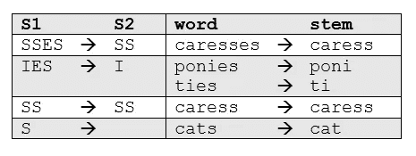

从一组给定的词干规则中，基于最长后缀 S1，只应用一个规则。因此，“爱抚”就变成了“爱抚”，而不是“关心”。

更复杂的阶段在应用规则之前考虑单词的长度/复杂性。例如:

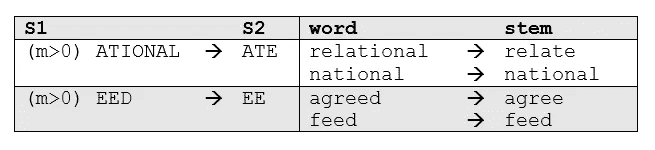

这里 m>0 描述了词干的“度量”，因此该规则适用于除了最基本的词干之外的所有词干。

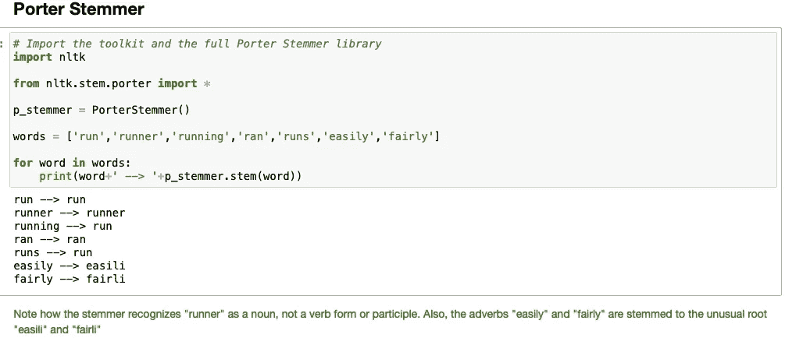

波特·斯特梅尔

**雪球斯特梅尔:**

这有点用词不当，因为 Snowball 是由 Martin Porter 开发的词干语言的名字。这里使用的算法更准确地称为“英国斯特梅尔”或“斯特梅尔”。它在逻辑和速度上都比最初的 Porter stemmer 稍有改进。由于 nltk 使用名称 SnowballStemmer，我们将在这里使用它。

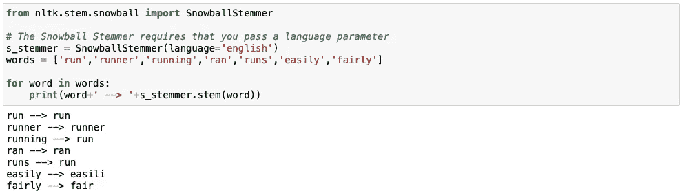

雪球斯特梅尔

**兰卡斯特斯特梅尔:** 兰卡斯特词干算法是你可以使用的另一种算法。这是最积极的词干算法。但是，如果您在 NLTK 中使用词干分析器，您可以非常容易地将您自己的定制规则添加到这个算法中

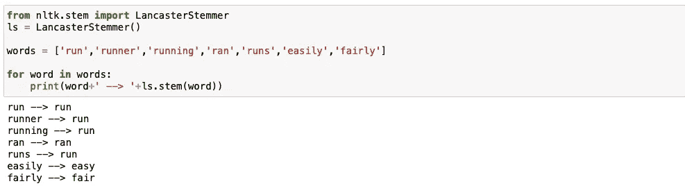

兰卡斯特斯特梅尔

## 词汇化:

与词干化相反，词汇化看起来不仅仅是减少单词，而是考虑一种语言的全部词汇来对单词进行词法分析。“was”的引理是“be”，“mice”的引理是“mouse”。此外,“meeting”的引理可能是“meet”或“meeting ”,这取决于它在句子中的用法。

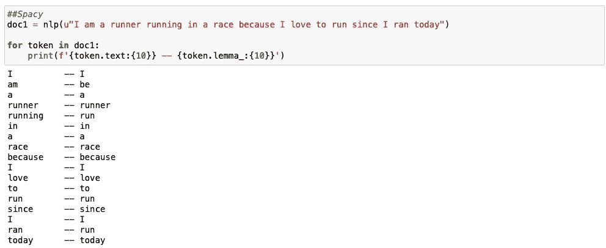

空间引理化

NLTK 的 lemmatizer 需要一个位置参数，如果不给出位置标签，它会把这个单词当作名词，不执行 lemmatizer。您可以在下面的代码片段中看到，在给出正确的位置标记后，词汇化的性能会更好。

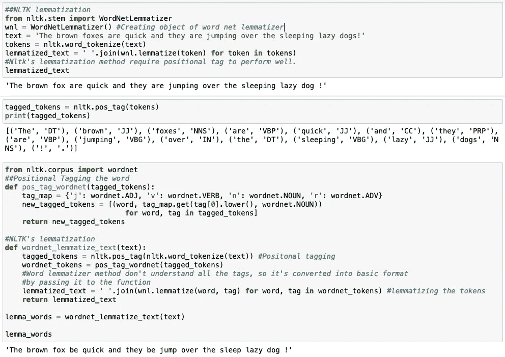

NLTK 引理器

**停字:**

像“a”和“the”这样的词出现得如此频繁，以至于它们不像名词、动词和修饰语那样需要彻底标记。我们称这些为停用词，它们可以从要处理的文本中筛选出来。spaCy 拥有一个大约 326 个英语停用词的内置列表。

在空间中装入和添加停用词

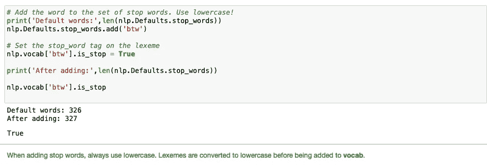

在空格中添加停用词

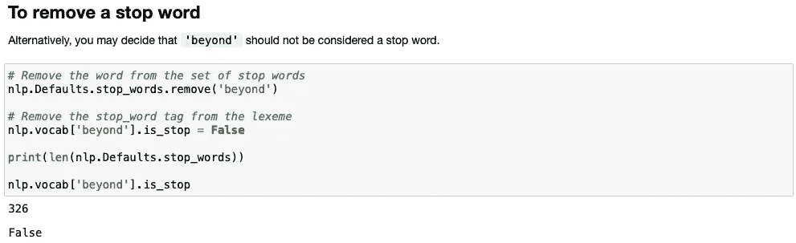

删除空格中的停用词

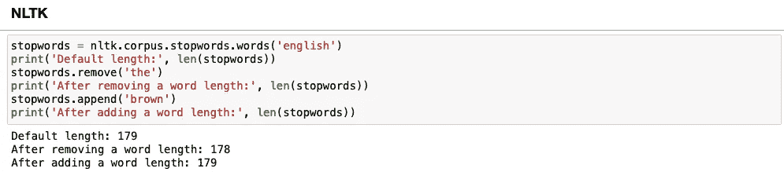

NLTK 停止字

这些是借助 spaCy 和 NLTK 库完成的基本文本处理的不同方式。Spacy 以一种有效的方式执行大型任务。希望您对 NLP 任务的基本文本预处理步骤有所了解。

点击这个 github [链接](https://github.com/Rishikumar04/Natural-Language-Processing/blob/main/03-Preprocessing%20Steps%20-%20spacy%20vs%20nltk.ipynb)引用笔记本文件。